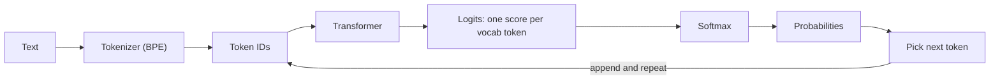

# Week 1, Day 2: The Atom of AI: Tokenization & Logprobs

**Time:** ~2.5h · **Needs:** no API key (runs a small local model; first run downloads ~1 GB)

## Learning objectives
- Explain **Byte-Pair Encoding (BPE)** and why LLMs see integers, not letters.
- Predict where tokenization causes bugs: spelling, counting, arithmetic, non-English text, JSON.
- Count tokens (and therefore cost) correctly **per vendor**.
- Read **logprobs** from a model and use them as a confidence signal.

---

## 1. Tokenization: text → integers

An LLM never sees your string. A **tokenizer** chops it into chunks from a fixed vocabulary (typically 50k–250k entries) and maps each chunk to an integer ID. The model only ever works with those IDs.

**BPE in one paragraph.** Start with raw bytes as the vocabulary. Repeatedly find the most frequent adjacent pair in a huge text corpus and merge it into a new token (`t`+`h` → `th`, `th`+`e` → `the`...). Stop at the target vocabulary size. Common words become one token, rare words split into pieces, and anything can still be encoded because the fallback is raw bytes.

```python
import tiktoken

enc = tiktoken.get_encoding("o200k_base")   # encoding family used by recent OpenAI models
for text in ["Strawberry", " strawberry", "9.11 is greater than 9.9"]:
    ids = enc.encode(text)
    print(repr(text), "->", [enc.decode([i]) for i in ids])
```

Real output:

```
'Strawberry'               -> ['Str', 'aw', 'berry']
' strawberry'              -> [' strawberry']
'9.11 is greater than 9.9' -> ['9', '.', '11', ' is', ' greater', ' than', ' ', '9', '.', '9']
```

Three lessons are hiding in those lines:

1. **A leading space changes the token.** `' strawberry'` (one token) ≠ `'Strawberry'` (three). The model must memorise that these are "the same word". This also means prompts that differ only in whitespace are *different inputs*.
2. **Counting letters is guesswork.** When a word is one atomic token, the model cannot see the letters inside; it only knows what it memorised about that token. That is why "how many r's in strawberry?" was a famous failure.
3. **Numbers are chopped arbitrarily.** `9.11` becomes `9`, `.`, `11`. The model compares "11" with "9" as if they were integers, which is a root cause of the "9.11 > 9.9" mistake. Don't trust raw LLM arithmetic. Give the model a calculator tool (Week 5).

## 2. Tokens are the unit of money, latency and limits

Everything is metered in tokens: price, context limit, rate limits, speed.

Real measurements from today's solution (`o200k_base`):

| Text | Chars | Tokens | Chars/token |
|---|---|---|---|
| English sentence | 69 | 14 | 4.93 |
| Vietnamese sentence | 79 | 23 | 3.43 |
| Japanese sentence | 29 | 29 | 1.00 |
| Python function | 75 | 31 | 2.42 |
| Pretty-printed JSON | 81 | 29 | 2.79 |
| **Same JSON, minified** | 48 | **16** | 3.00 |

Rules of thumb you can rely on:
- English averages ~4 chars (~0.75 words) per token. Other languages and code are costlier, and the exact ratio varies by tokenizer.
- **Whitespace and indentation cost tokens.** Minifying the JSON you send cut input by 45%.
- **Tokenizers are vendor-specific.** `tiktoken` is OpenAI's. It undercounts Claude tokens (by roughly 15–20% on typical text, more on code or non-English), so for Claude use the API: `client.messages.count_tokens(model=..., messages=[...])`. For open models, load the model's own tokenizer.

## 3. Logprobs: the model's confidence

At each step the model outputs a score (**logit**) for *every* token in its vocabulary. A softmax turns those into probabilities. The **log-probability** is just `log(p)`, which is numerically stabler: `p = exp(logprob)`.



If the model is certain, one token gets ≈100% of the mass. If it is guessing, the mass is **split across several candidates**. That split is observable, which makes logprobs a cheap *hallucination signal*:

```python
logits  = model(input_ids).logits[0, -1]        # one score per vocab entry
logprobs = torch.log_softmax(logits, dim=-1)    # log P(token | everything so far)
p_best   = logprobs.max().exp()                 # probability of the greedy choice
```

We use a **local** model here because it exposes full logits for free. Hosted APIs differ: OpenAI exposes top-k logprobs on some models/endpoints (and not all current ones; check the docs for the model you use). Anthropic's API does not return logprobs at all. Hence the local model for this lesson.

Real output from today's solution (Qwen2.5-0.5B, greedy decoding, "reply with only the answer" system prompt):

| Question | Answer | Weakest token p | Verdict |
|---|---|---|---|
| Capital of France? | Paris | 0.98 | ok |
| In which year did WWII end? | 1945 | 1.00 | ok |
| Who wrote Romeo and Juliet? | William Shakespeare | 0.76 | ok |
| What is 12 × 12? | 144 | 0.78 | ok |
| First King of Mars? | Achares | **0.18** | **flagged** |
| Population of Zrtovnik (invented) in 1823? | 1,000 | **0.21** | **flagged** |
| 4th word of ch. 2 of an invented novel? | (rambles) | **0.05** | **flagged** |

Real knowledge sits near 1.0. Fabrication shows a "fork": the model picks `A` at 18% with `H` at 9% and `T` at 8% right behind. Note the honest caveat: correct answers can score only 0.76–0.78, so a threshold is a trade-off, and **a confidently wrong model scores high too**. Treat logprobs as one signal among several (retrieval in Week 3, evals in Week 7).

> **Why the system prompt matters.** Without "reply with only the answer", the model starts with a chatty `"The first King..."` where the *first* token is easy and the shaky part comes later. Constraining the format puts the uncertainty where you measure it.

## Pitfalls & production notes
- **Never estimate tokens as `len(text)/4` for budgets or billing**; count with the right tokenizer.
- **Special tokens** (`<|im_end|>`, end-of-turn markers) appear in the stream. Strip them before scoring text.
- **Chat templates add hidden tokens** (role markers) to every message, so counts from `count_tokens` or `usage` are authoritative.
- **Normalise before comparing tokens**: `"Hello"`, `" Hello"` and `"hello"` are three different tokens.

---

## Daily Challenge: Token Cost Estimator + Confidence Flagger

**Part A: Token cost estimator**
Write `token_report.py` that, for a list of texts (English, Vietnamese or another non-English language, code, pretty vs. minified JSON), prints for each:
characters, tokens (`o200k_base`), tokens (an open-model tokenizer such as `Qwen/Qwen2.5-0.5B-Instruct`), chars/token, and the cost of **1M requests** as input at three different model prices.
- If `ANTHROPIC_API_KEY` is set, add a Claude column using `count_tokens` (subtract the constant message-framing overhead).

**Part B: Low-confidence answer flagger**
Load `Qwen/Qwen2.5-0.5B-Instruct` with `transformers`, then:
1. Greedy-decode an answer token by token, keeping the log-probability of each chosen token and the top-3 alternatives.
2. Return `{answer, min_prob, weakest_token, alternatives, flagged}`; flag if the weakest *content* token is below a threshold.
3. Run it on 7 questions: 4 real facts and 3 fabricated or unanswerable.

**Acceptance criteria**
- Part A: minified JSON uses fewer tokens than pretty JSON, and non-English text has a lower chars/token ratio than English. Your table shows both.
- Part B: all 3 fabricated questions are flagged, and the factual ones are mostly not flagged. Report any facts you wrongly flagged and say what threshold would fix it (and what that threshold would cost you).
- No hardcoded numbers: everything is computed.

**Stretch**
- Plot the distribution of `min_prob` for facts vs. fabrications on 20+ questions of each (ROC-style: pick the threshold that best separates them).
- Add a "self-consistency" check: sample the answer 5 times at temperature 1.0 and flag if they disagree. Compare it with the logprob flag.

**Solution:** [solutions/day2_solution.py](solutions/day2_solution.py)

## Further reading
- Karpathy, [*Let's build the GPT Tokenizer*](https://www.youtube.com/watch?v=zduSFxRajkE): you will implement BPE yourself in Week 9.
- Sennrich et al., *Neural Machine Translation of Rare Words with Subword Units* (the BPE paper).
- Hugging Face docs: [Chat templates](https://huggingface.co/docs/transformers/chat_templating).
