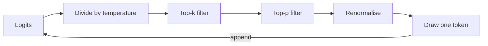

# Week 1, Day 3: Sampling & Decoding: The Creativity Dial

**Time:** ~2.5h · **Needs:** no API key (local model)

## Learning objectives
- Explain greedy decoding, **temperature**, **top-k** and **top-p (nucleus)** sampling from the math.
- Implement all three in numpy and verify them against a real model's logits.
- Know which knobs *exist* on which provider today (this changed a lot), and which tools replace them.
- Measure diversity versus temperature instead of guessing.

---

## 1. The decode loop

After the forward pass the model has one **logit** (raw score) per vocabulary token. Generating text is a loop:

```
logits  →  (adjust)  →  softmax  →  probabilities  →  pick one token  →  append  →  repeat
```

"Decoding strategy" means *how you pick*, and it is where randomness enters. The model itself is deterministic: same input, same logits.



| Strategy | Rule | Character |
|---|---|---|
| **Greedy** (T=0) | Always take the most likely token | Repeatable, safe, can loop or be bland |
| **Temperature** | Divide logits by T before softmax | T<1 sharper, T>1 flatter |
| **Top-k** | Keep only the k best tokens | Hard cut on count |
| **Top-p (nucleus)** | Keep the smallest set whose probabilities sum to p | Adaptive cut: few tokens when the model is sure, many when it isn't |

Order of operations in most stacks: **temperature → top-k → top-p → renormalise → draw**.

## 2. The math

```python
def softmax(logits, T=1.0):
    z = logits / T
    z -= z.max()                 # numerical stability, doesn't change the result
    e = np.exp(z)
    return e / e.sum()
```

Toy distribution over `The / A / My / Our / Unicorn` (real output from today's solution):

| T | The | A | My | Our | Unicorn | Entropy (bits) |
|---|---|---|---|---|---|---|
| 0.2 | 95.2% | 4.7% | 0.01% | 0.00% | 0.000% | 0.28 |
| 1.0 | 54.8% | 30.1% | 9.1% | 6.1% | 0.05% | 1.56 |
| 3.0 | 34.0% | 27.8% | 18.6% | 16.3% | 3.3% | 2.08 |

- **Low T** concentrates the mass on the leader, so the model becomes decisive.
- **High T** spreads it out, and "Unicorn" goes from 0.05% to 3.3%. Over a 100-token answer, those small chances add up to weird text.
- T→0 is greedy; T→∞ is uniform random over the whole vocabulary.

### Why top-p beats top-k
Take the real next-token distribution after *"The quick brown fox jumps over the"* from Qwen2.5-0.5B (151,936-token vocabulary). At T=1 the model is ~97% sure of `' lazy'`. Heat it up to T=1.5 and see what each nucleus keeps:

| Setting | Tokens kept |
|---|---|
| T=1.5, top_p=0.99 | 40,047 |
| T=1.5, top_p=0.9 | 2,286 |
| T=1.5, top_p=0.6 | 3 |

A fixed `top_k=50` can't adapt: too many when the model is sure, too few when many continuations are legitimate. Top-p adapts automatically, which is why `top_p` is the knob most APIs kept.

## 3. What you can actually set today (read this before copying old tutorials)

Sampling parameters have been **removed or locked** on many current models, because reasoning/thinking models manage their own sampling:

| Provider / model | `temperature` / `top_p` / `top_k` |
|---|---|
| Claude Opus 5 / 4.8 / 4.7, Sonnet 5, Fable | **Removed**: sending them returns a 400. Control behaviour with the prompt, `output_config.effort`, and structured outputs. |
| Claude Opus/Sonnet 4.6 | Allowed |
| Claude Haiku 4.5 | Allowed |
| OpenAI GPT-6 family | Check the model page. Reasoning-capable models restrict or ignore some sampling parameters. |
| Local / open models (Ollama, vLLM, Hugging Face) | **All available.** You control everything. |

Consequences for how you design systems:
1. **Don't build behaviour that depends on `temperature=0`.** On models where it's locked you can't rely on it, and even where it works, hosted APIs are only *mostly* deterministic (batching and floating-point effects). Test with **evals and validation**, not exact-match snapshots.
2. If you need diversity (brainstorming, synthetic data), **ask for it in the prompt** or sample several times and pick; if you need consistency, use structured outputs and validation (Week 2).
3. If you need hard control over the sampler (banning words, forcing a grammar), use an **open model** with constrained decoding. That's Weeks 10–11.

> **Old trick you'll see in tutorials: `logit_bias`.** OpenAI's Chat Completions API let you add ±100 to specific token IDs to ban or force them (e.g. force `SAFE`/`UNSAFE`). It is niche, tokenizer-specific, and not supported everywhere. Today the robust way to force a label is **structured outputs with an enum** (Week 2, Day 3).

## 4. Practical settings (open/local models and any API that exposes them)

| Task | Suggested |
|---|---|
| Code, JSON, extraction, classification | T=0–0.2 |
| Q&A / chat | T=0.5–0.8, top_p≈0.9 |
| Brainstorming, creative writing | T=0.9–1.2, top_p≈0.95 |
| Never | T>1.5 without a cap: you get garbage (see below) |

Real output from the challenge solution, 20 samples of "invent a coffee-shop name" per temperature:

```
   T  distinct  entropy  examples
 0.0         1     0.00  ['Coffee Haven']
 0.3         5     1.29  ['Green Lane Coffee House', 'Coffee Haven', 'The Coffee Haven', ...]
 0.7        16     3.74  ['Green Brew Haven', 'Coffee Haven', '咖啡树坊', ...]
 1.0        20     4.32  ['Minute Coffeehouse', 'Stone Brews', 'Ipocorns Buzz Co.', '憩息咖啡馆']
 1.7        20     4.32  ['Minute Coffee Fram..\nEu [.clusions mixing minions$/', 'StoneKeeper perimeter Design Pocket bourbon bend.CenterScreen FINALまだまだ', ...]
```

Two lessons: diversity **saturates** (20 distinct of 20 by T=1.0, so "distinct count" stops being informative), while **quality keeps falling** after that. A diversity metric alone is never enough. You also need a quality check (Week 7).

## Pitfalls & production notes
- **Temperature isn't "creativity", it's "risk".** Higher T raises the chance of every wrong token too.
- **Greedy can get stuck in repetition loops** on small models. A slight T or a repetition penalty helps.
- **Seeds**: a `seed` parameter (where it exists) improves repeatability but doesn't guarantee it across model/hardware changes.
- **Sample-and-vote** (self-consistency, Week 2 Day 2) turns randomness into accuracy: sample 5 reasoning paths, take the majority answer.

---

## Daily Challenge: The Diversity Meter

Using `Qwen/Qwen2.5-0.5B-Instruct` locally:

1. **Implement from scratch** (numpy only, no library samplers): `softmax(logits, T)`, `top_k_filter`, `top_p_filter`, and `sample(...)` that chains them.
2. **Verify** `sample` empirically: draw 20,000 samples from a toy distribution and show the frequencies match the theoretical probabilities.
3. **Apply to real logits**: print the top-5 next tokens for *"The quick brown fox jumps over the"* at T = 0.1, 1.0 and 1.5, plus how many tokens each top-p value keeps.
4. **Measure diversity vs. temperature.** For T in {0, 0.3, 0.7, 1.0, 1.3, 1.7}, generate 20 completions of the prompt *"Invent a name for a new coffee shop. Reply with the name only."* (max 10 new tokens, `top_k=0`, `top_p=1.0`). Compute for each T: number of distinct outputs and the entropy of the output distribution. **Plot both** against T and save the figure.

**Acceptance criteria**
- At T=0 there is exactly 1 distinct output.
- Diversity at T=1.3 is clearly greater than at T=0.3.
- Empirical sampling frequencies are within ~1–2 percentage points of the theoretical ones.
- A saved PNG with a labelled x-axis and both curves.

**Stretch**
- Add a *quality* proxy per temperature (e.g. fraction of outputs that are ASCII-only and ≤ 5 words) and show the diversity/quality trade-off in one plot.
- Repeat with `top_p=0.9` at T=1.3. How much of the "garbage" disappears?
- Add a repetition penalty and test it on a greedy loop.

**Solution:** [solutions/day3_solution.py](solutions/day3_solution.py)

## Further reading
- Holtzman et al., *The Curious Case of Neural Text Degeneration* (the top-p paper).
- Hugging Face: [Text generation strategies](https://huggingface.co/docs/transformers/generation_strategies).
- Anthropic docs: model-specific parameter notes on the [Models overview](https://docs.claude.com/en/docs/about-claude/models/overview).
