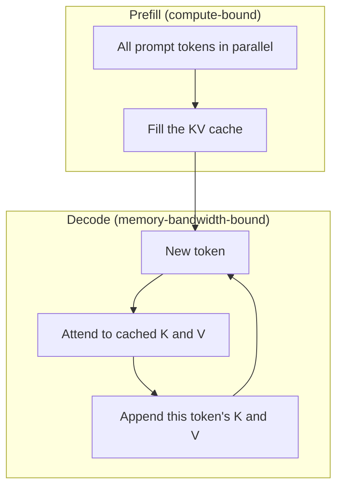

# Week 1, Day 4: Context Window, KV Cache & Prompt Caching

**Time:** ~3h · **Needs:** nothing for Parts A–B; an Anthropic key for Part C

## Learning objectives
- Explain why long contexts make requests slower and more expensive.
- Derive and use the **KV-cache memory formula**.
- Explain why chat cost grows ~quadratically with turns, and the three levers that bend it: bounded history, summarisation, **prompt caching**.
- Use prompt caching correctly (what to put first, how to verify hits, what silently breaks it).

---

## 1. The context window

The **context window** is the maximum number of tokens (input **and** output, plus any hidden reasoning tokens) the model can handle in one request. Current frontier models offer 200k to 1M tokens. Bigger is not free:

- You **pay for every input token on every call**: the API is stateless, so a "conversation" is the whole history re-sent each turn.
- Latency grows with prompt length (the *prefill* phase has to process all of it).
- Quality can degrade when the relevant fact is buried in a huge, noisy context ("lost in the middle"). More context is not automatically better context.

## 2. Why: attention and the KV cache

To predict the next token the model "attends" to **every previous token**. For each token and each layer it computes a **key** and a **value** vector. Recomputing those for the whole history on every new token would be wasteful, so the server **caches them in GPU memory**: the **KV cache**.

```
Prefill  : process all prompt tokens in parallel   → fills the KV cache   (compute-bound)
Decode   : one new token at a time, reuse the cache → appends 1 entry     (memory-bandwidth-bound)
```



**Memory formula**

```
KV bytes = 2 (K and V) × layers × kv_heads × head_dim × tokens × bytes_per_element × batch
```

Verified in today's solution against a real model: the formula predicted **4,939,776 bytes** for a 201-token prompt on Qwen2.5-0.5B and the actual cache measured **4,939,776 bytes**.

At fp16, scaling up (real configs):

| Model | Weights | KV cache, 32k ctx, 1 user | 128k ctx, 1 user | 32k ctx, 32 users |
|---|---|---|---|---|
| Qwen2.5-0.5B | 0.9 GiB | 0.38 GiB | 1.50 GiB | 12 GiB |
| Llama-3.1-8B | 14.9 GiB | 4 GiB | 16 GiB | **128 GiB** |
| Llama-3.1-70B | 130 GiB | 10 GiB | 40 GiB | **320 GiB** |

With many users and long contexts the cache, not the weights, fills the GPU. That drives GQA (few KV heads), cache quantisation and PagedAttention (Weeks 9 and 11).

**Why it matters for speed:** generating 30 tokens after a 201-token prompt took **1.6 s with the cache vs 10.4 s without** (×6.6) on a laptop CPU, and the gap grows with length.

## 3. The bill

Because history is resent, cost per turn grows with conversation length, and the total grows ~quadratically. Simulated (300 new user tokens + 400 reply tokens per turn, `claude-opus-5` prices):

| Turns | Naive | Prompt caching | Window 4k tokens | Caching + window |
|---|---|---|---|---|
| 5 | $0.09 | $0.06 | $0.09 | $0.06 |
| 20 | $0.90 | $0.30 | $0.56 | $0.26 |
| 50 | $4.86 | $1.00 | $1.51 | $0.67 |
| 100 | $18.48 | $2.88 | $3.08 | $1.34 |

(A user pasting a 10k-token log in turn 1 makes this far worse: you re-pay for that log every turn until you drop it.)

### Three levers
1. **Bound the history**: keep the last K messages (sliding window), drop or summarise the rest. (Memory strategies are Week 2 Day 5.)
2. **Summarise** old turns into a short note with a cheaper model.
3. **Cache the stable prefix** (below).

## 4. Prompt caching

If the **beginning** of your prompt is identical across requests, the provider can reuse the already-computed KV state for that prefix instead of recomputing it.

| | Anthropic | OpenAI |
|---|---|---|
| How | You opt in with `cache_control` (top-level, or on specific blocks) | Automatic for long prompts; tune with `prompt_cache_key` / retention options |
| Cache read price | ~0.1× input price | Discounted (see pricing page, e.g. 10× cheaper on current models) |
| Cache write price | ~1.25× input price (5-min TTL; 1-hour option costs more) | No write surcharge |
| Min prefix | Model-dependent (roughly 512–4096 tokens) | Long prompts only (check docs) |
| Verify with | `usage.cache_read_input_tokens`, `cache_creation_input_tokens` | `usage.input_tokens_details.cached_tokens` |

```python
r = client.messages.create(
    model="claude-opus-5",
    max_tokens=1024,
    cache_control={"type": "ephemeral"},        # cache everything up to the last cacheable block
    system=LONG_HANDBOOK,                       # stable, big → cacheable
    messages=[{"role": "user", "content": question}],   # varies → after the cached prefix
)
print(r.usage.cache_creation_input_tokens, r.usage.cache_read_input_tokens, r.usage.input_tokens)
```

**It's a prefix match.** The render order is tools → system → messages. Any byte that changes inside the prefix invalidates everything after it. So:

- **Stable first, volatile last.** Put the long instructions/documents/tool definitions first; the user's question and anything dynamic last.
- **No silent invalidators in the prefix**: timestamps, request IDs, random ordering (`json.dumps` without `sort_keys=True`), a tool list that changes per request.
- **Verify, don't assume.** If `cache_read_input_tokens` is 0 on repeated calls, a silent invalidator is at work, or your prefix is under the minimum size.
- Caches are **per model** and expire (5 min default on Anthropic, refreshed each hit), so they pay off for bursts of related requests, not once-a-day jobs.

## Pitfalls & production notes
- Cost estimates must include **cache reads and writes** separately; mixing them with normal input tokens will misprice your logs. (`common/llm.py` normalises this.)
- A bigger context window is not a substitute for **retrieval**. Sending the 800-page manual every time works until it doesn't. RAG is Week 3.
- **Count before you send** when you accept user uploads: `client.messages.count_tokens(...)` for Claude, `tiktoken`/HF tokenizer for models that use them.
- Don't truncate silently. If an input doesn't fit, tell the user or chunk it deliberately.

---

## Daily Challenge: The Context Accountant

**Part A: KV-cache calculator (no key).**
Write `kv_calc.py` with `kv_cache_bytes(layers, kv_heads, head_dim, seq_len, batch, bytes)`.
1. Load a real model config with `transformers.AutoConfig` (use `Qwen/Qwen2.5-0.5B-Instruct`) and compute its predicted cache size for a 200-token prompt.
2. **Verify against reality**: run a forward pass with `use_cache=True`, sum the bytes of the returned cache tensors, and assert the two numbers are equal.
3. Print a table for 3 model shapes at 32k and 128k context, with 1 and 32 concurrent users.

**Part B: The chat bill (no key).**
Write `conversation_cost(turns, new_tokens, reply_tokens, in_price, out_price, cache_read_mult, history_cap)` and print the table above for 5/20/50/100 turns. Then answer in a comment: *at what turn does a 4k sliding window become cheaper than caching alone, for your parameters?*

**Part C: Real prompt caching (needs an Anthropic key).**
Build a deterministic ~4–5k-token "handbook" and ask it 4 questions, twice: without `cache_control`, then with it. For each call print fresh input tokens, cache-write tokens, cache-read tokens, latency, and cost.

**Acceptance criteria**
- Part A's assertion passes (formula == measured).
- Part B shows naive cost growing faster than linearly, and the window version flattening.
- Part C: with caching, call 1 shows cache-write tokens and calls 2–4 show cache-read tokens; total cost is lower than the uncached run. If you see no cache reads, find out why (hint: prefix size, anything non-deterministic) and write down the cause.

**Stretch**
- Show what happens when you put a timestamp at the top of the system prompt (cache hits drop to 0).
- Add a one-line summary of a 10k-token pasted log in place of the log after turn 2 and recompute the bill.

**Solution:** [solutions/day4_solution.py](solutions/day4_solution.py). Parts A and B were executed and checked while writing. Part C needs an API key and has not been run by the course author; if your numbers differ, trust `usage`.

## Further reading
- Anthropic docs: Prompt caching (placement patterns, TTLs, minimum sizes).
- Kwon et al., *Efficient Memory Management for LLM Serving with PagedAttention* (vLLM).
- Liu et al., *Lost in the Middle: How Language Models Use Long Contexts*.
