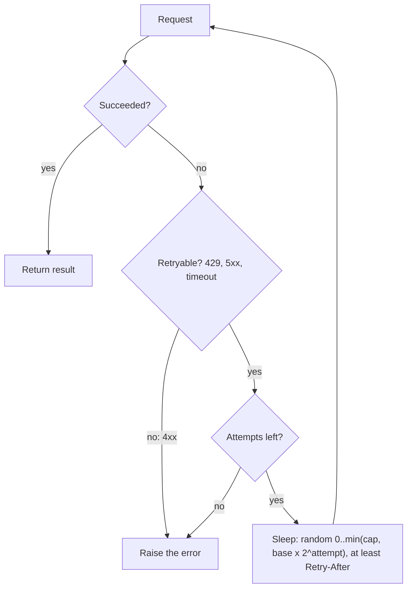

# Week 1, Day 5: Streaming, Async, Retries & Rate Limits

**Time:** ~2.5h · **Needs:** nothing for the challenge (it uses a fake flaky client); a key if you want to try the real API

## Learning objectives
- Explain why LLM calls are slow and **how streaming fixes perceived latency** (TTFT vs. total time).
- Write `async` LLM code and bound its concurrency with a semaphore.
- Build retries that are *correct*: retry only retryable errors, exponential backoff with jitter, honour `Retry-After`.
- Know what the official SDKs already do for you, and what they don't.
- Use timeouts everywhere, and know the failure modes of long-running calls.

---

## 1. Why LLM calls are slow, and what streaming changes

Generation is sequential: one token at a time (Day 3). A 500-token answer at ~50 tokens/s takes ~10 s. Two numbers matter:

- **TTFT (time to first token):** prefill + network. Typically 0.3–2 s, far longer for huge prompts or reasoning models.
- **Throughput:** tokens per second after that.

**Streaming** sends tokens as they're generated (Server-Sent Events over HTTP). Total time is the same, but the user sees text after TTFT instead of after the whole answer. It also protects you from long-request timeouts: some SDKs refuse non-streaming requests with very large `max_tokens` for exactly that reason.

```python
# Anthropic
with client.messages.stream(model="claude-opus-5", max_tokens=2000, messages=msgs) as s:
    for text in s.text_stream:
        print(text, end="", flush=True)
    final = s.get_final_message()          # full message + usage when done

# OpenAI (Responses API)
for event in client.responses.create(model="gpt-6.1-sol", input=msgs, stream=True):
    if event.type == "response.output_text.delta":
        print(event.delta, end="", flush=True)
    elif event.type == "response.completed":
        usage = event.response.usage
```

Our wrapper hides the difference: `for chunk in stream("...", on_done=lambda r: print(r.usage)): ...` (see `common/llm.py`).

**Streaming gotchas**
- The **usage/stop reason arrive at the end**; a dropped connection means you may not get them. Record partial text and handle the error.
- If you stream into a UI, **don't re-render the whole message per token**; batch updates (~every 30–50 ms).
- Structured output (JSON) can't be used until the stream finishes. Stream text for humans, wait for the final message for machines.
- Tool-call arguments also stream; never execute a tool from a partial JSON fragment.

## 2. `async` in 60 seconds

LLM calls are I/O-bound: your program waits on the network. `asyncio` lets one thread wait on many requests at once.

```python
import asyncio
from common.llm import acomplete

async def main():
    prompts = [f"Summarize document {i}" for i in range(20)]
    results = await asyncio.gather(*(acomplete(p) for p in prompts))   # 20 in flight at once!
```

Two traps:
1. **Unbounded `gather` = stampede.** 20 requests is fine, 5,000 will trigger rate limits (HTTP 429) immediately. Always bound concurrency with `asyncio.Semaphore(n)`.
2. **Blocking calls freeze the event loop.** Calling the *sync* client (or `time.sleep`, or a heavy CPU loop) inside an `async def` stalls every other task. Use the async client (`AsyncAnthropic`, `AsyncOpenAI`) and `await asyncio.sleep`.

## 3. Failures are normal. Retry correctly.

At scale something fails every day. Classify errors first:

| Status / error | Meaning | Retry? |
|---|---|---|
| 429 | Rate limit (requests or tokens per minute) | **Yes**, after the `retry-after` header, or backoff |
| 500 / 502 / 503 / 529 | Server error / overloaded | **Yes** with backoff |
| Timeout, connection reset | Network | **Yes** (but see idempotency below) |
| 400 | Your request is invalid (bad schema, too long) | **No**: fix the request |
| 401 / 403 | Bad key / no permission | **No** |
| 404 | Wrong model name or endpoint | **No** |
| `max_tokens` / `refusal` stop reason | Not an HTTP error | **No**: handle in logic |



**Exponential backoff with full jitter:**

```python
delay = random.uniform(0, min(cap, base * 2**attempt))     # 0..0.5s, 0..1s, 0..2s, 0..4s ...
```

- *Exponential* gives an overloaded server room to recover.
- *Jitter* is essential. Without it, 100 clients that failed at the same instant all retry at the same instant, forever (the "thundering herd").
- `Retry-After` is the server telling you the minimum wait. Treat it as a floor.
- **Cap the number of retries** and surface the final failure; infinite retries turn an outage into a bill.

### What the SDKs already do
Both official SDKs retry connection errors, 408, 409, 429 and 5xx with backoff, **2 times by default**. Tune with `max_retries` on the client (or `with_options(...)` per call); `max_retries=0` disables it. Write your own retry loop only when you need something extra: a global retry budget, fallbacks to another model/provider, circuit breaking, or per-item bookkeeping in a batch (today's challenge).

### Rate limits
Providers limit **requests/min**, **input tokens/min** and **output tokens/min**, per model and per organisation tier. Implications:
- A few huge prompts can exhaust the token budget even at low request rates.
- Concurrency limits must be tuned from the limits shown in your console, not guessed.
- For non-urgent bulk work, use the provider's **Batch API** (asynchronous, ~50% cheaper, separate rate limits) rather than hammering the realtime API.

### Timeouts
SDK defaults are generous (the Python SDKs use ~10 minutes). Set your own:
`Anthropic(timeout=60.0)` or `asyncio.timeout(...)` around each attempt. A request with no timeout is an outage waiting to happen.

### Idempotency
A retried request may be **processed twice** (the first succeeded but the response was lost). For pure text generation that only costs money. For anything with side effects (tool calls that send email or charge cards, Week 5), make the side effect idempotent with an idempotency key.

---

## Daily Challenge: The Batch Processor

Build `run_batch(items, worker, *, concurrency, max_retries, base_delay, max_delay, attempt_timeout)`, a provider-agnostic async runner.

**Requirements**
1. **Bounded concurrency** using `asyncio.Semaphore`. The semaphore must be held only while a request is in flight (not while sleeping in backoff).
2. **Retries** with exponential backoff and **full jitter**; honour a `retry_after` hint as a floor.
3. **Error taxonomy:** `RetryableError` vs `FatalError`. Fatal errors are never retried. Map real SDK exceptions (anything with `status_code` 429/5xx) onto it.
4. **Per-attempt timeout** via `asyncio.timeout`.
5. **Results in input order**, with a per-item record: `ok`, `value`, `error`, `attempts`, `latency_s`. One failed item must not stop the batch.
6. Return stats: succeeded, failed, total attempts, wall time, p50/p95 latency.

**Test it without spending money.** Write a `FakeClient` with random latency (20–80 ms), ~20% 429s, ~10% 500s, and one item that always returns 400. Then:
- run at `concurrency=1` and `concurrency=8`, and compare wall time;
- track peak in-flight requests inside the fake and assert it never exceeds 8;
- assert the 400 item has exactly **1** attempt and all others eventually succeed;
- assert an always-500 client stops after `max_retries + 1` attempts.

**Acceptance criteria**
- All assertions above pass.
- Concurrency 8 is meaningfully faster than concurrency 1 (≈5–6× on the sample numbers).
- Run it against a real provider (12 short summaries, `concurrency=4`) and show the stats table.

**Stretch**
- Add a **token-bucket** rate limiter (e.g. 50 requests/min) in addition to the concurrency cap.
- Add a global **retry budget** (e.g. max 20% of calls may be retries) and a circuit breaker that pauses all workers for 10 s after 5 consecutive 429s.
- Add provider **fallback**: after 2 failed attempts on provider A, try provider B.

**Solution:** [solutions/day5_solution.py](solutions/day5_solution.py). Sample output on a laptop (retry counts vary a little between runs because concurrent tasks share the fake's RNG):

```
concurrency=1:  wall=2.88s  attempts=56 (16 retries)  p50=0.05s
concurrency=8:  wall=0.47s  attempts=53 (13 retries)  p50=0.05s   → speed-up ×6.2, peak in-flight = 8
```

## Further reading
- AWS Architecture Blog: *Exponential Backoff and Jitter*.
- Anthropic and OpenAI docs: rate limits and error codes pages; Batch API guides.
- Python docs: `asyncio.timeout`, `asyncio.Semaphore`, `asyncio.TaskGroup`.
