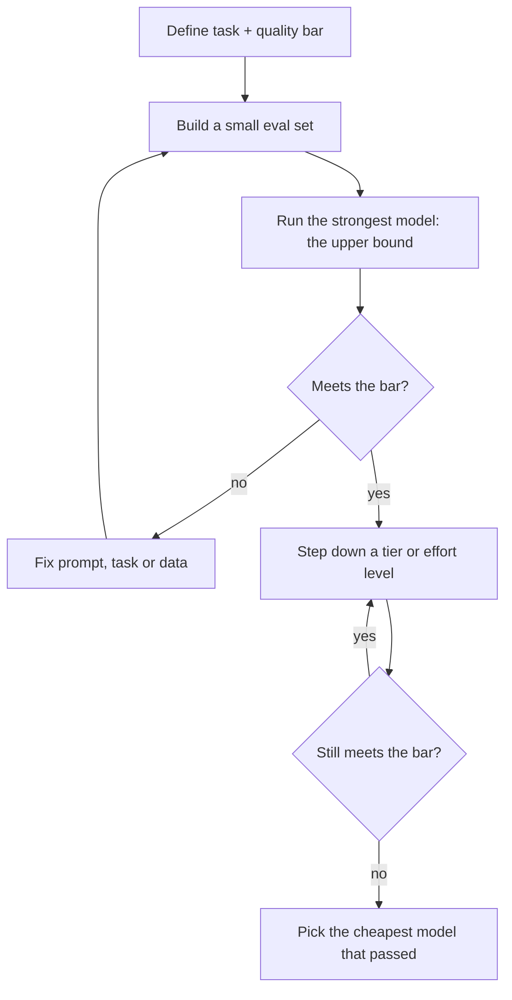

# Week 1, Day 6: The Model Landscape & How to Choose

**Time:** ~2.5h · **Needs:** at least one API key for the real run (the harness also has a keyless `--mock` mode)

## Learning objectives
- Map the model landscape: tiers, reasoning vs. non-reasoning, closed vs. open-weights, multimodal.
- Understand reasoning/"thinking" models: what they cost and when they pay off.
- Send images and PDFs to a model.
- Choose a model with **data on your task**, not leaderboards or vibes.

---

## 1. Tiers: the same family, different trade-offs

Every major vendor ships a ladder. Capability, price and latency all rise together:

| Tier | Typical use | Examples (Oct 2026 snapshot) | $/MTok in / out |
|---|---|---|---|
| **Frontier** | Hard reasoning, long agentic work, ambiguous tasks | Claude Fable 5.1, GPT-6 Astra | 10 / 50 |
| **Flagship** | The default for serious product work | Claude Opus 5 / Opus 5.5, GPT-6.1 Sol | 4–5 / 20–25 and 2 / 10 |
| **Balanced** | High-volume production | Claude Sonnet 5 | 2 / 10 |
| **Small / fast** | Classification, extraction, routing, sub-agents | Claude Haiku 4.5, GPT-6 Luna | 1 / 5 and 0.1 / 0.5 |
| **Open-weights** | Privacy, cost at scale, fine-tuning, offline | Llama, Qwen, Mistral, Gemma, DeepSeek families | free to run, *you* pay for GPUs |

Prices differ by ~100× between the top and bottom of this table, so model choice is the single biggest cost lever you have (more than any prompt trick). **Names and prices change every few months**; keep them in config (`common/llm.py`) and re-check the pricing pages.

## 2. Reasoning ("thinking") models

Modern models can spend extra **hidden reasoning tokens** before answering. They are trained with reinforcement learning to work through problems step by step.

- **Better** at math, code, multi-step planning, tricky instructions.
- **Slower**: TTFT can be many seconds, sometimes minutes on hard problems.
- **More expensive**: thinking tokens are billed as *output* tokens even when hidden or summarised.
- **Controlled by an effort dial**, not a temperature dial:
  - Claude: `thinking={"type": "adaptive"}` + `output_config={"effort": "low"|"medium"|"high"|"xhigh"|"max"}`. On the newest models thinking can't be turned off at all, so *lower the effort* for easy tasks.
  - OpenAI: a `reasoning={"effort": ...}` parameter on reasoning-capable models.
- Don't ask a reasoning model to "think step by step" in the prompt; it already does. Do give it a clear goal and constraints.

**Rule of thumb:** use low effort or a small model for classification, extraction and formatting; reserve high effort for problems where a wrong answer is expensive. Always **measure**: lower effort on a newer model often matches an older model at high effort.

## 3. Multimodal input

Current flagship models accept images and PDFs (and some audio/video). You pay in tokens, and an image is typically a few hundred to a couple of thousand tokens depending on its size.

```python
# Claude: image (base64) + PDF; content is a list of typed blocks
import base64
img = base64.standard_b64encode(open("chart.png", "rb").read()).decode()
msg = client.messages.create(
    model="claude-opus-5", max_tokens=1000,
    messages=[{"role": "user", "content": [
        {"type": "image", "source": {"type": "base64", "media_type": "image/png", "data": img}},
        {"type": "text", "text": "What trend does this chart show?"},
    ]}],
)
# PDF: {"type": "document", "source": {"type": "base64", "media_type": "application/pdf", "data": b64}}
```

```python
# OpenAI Responses API: input_text / input_image parts (check the docs for PDFs via input_file)
r = client.responses.create(
    model="gpt-6.1-sol",
    input=[{"role": "user", "content": [
        {"type": "input_text", "text": "What trend does this chart show?"},
        {"type": "input_image", "image_url": f"data:image/png;base64,{img}"},
    ]}],
)
```

Put the image/document **before** the question, and say what you want extracted. Vision is great for charts, screenshots, forms and scanned documents. We build on it in Week 4 (multimodal RAG).

## 4. Open vs. closed

| | Closed API (Claude, GPT) | Open-weights (run yourself) |
|---|---|---|
| Peak quality | Highest | Close behind on many tasks, gap shrinks yearly |
| Setup | One API key | GPUs, serving stack, ops (Week 11) |
| Cost at low volume | Cheapest | Idle GPU cost dominates |
| Cost at high volume | Linear in tokens | Can be far cheaper (Week 11 break-even calculator) |
| Data control | Data leaves your boundary (contracts/ZDR help) | Fully on your infrastructure |
| Customisation | Prompting, tools, limited fine-tuning | Full fine-tuning, quantisation, custom decoding |
| Risk | Deprecations, outages, price changes | You own reliability |

Most real systems are **hybrid**: a frontier model for the hard 10%, a small model for the easy 90%, an open model where privacy demands it.

## 5. A selection process that works



1. **Define the task and a quality bar** in measurable terms ("≥ 90% correct labels on 100 real examples").
2. **Build a small eval set** from real data (even 30–50 examples) with a code-based or rubric-based grader (Week 7 does this properly).
3. **Start at the top.** Run your best model to see what's *possible*, then step down tier by tier and effort level by effort level until quality falls below the bar. Pick the cheapest model that clears it.
4. Compare on **three axes together**: quality, latency (p50 *and* p95), **cost per correct answer** (not cost per call: a cheap model that is wrong half the time is expensive).
5. Check hard constraints: context length, structured-output and tool support, rate limits, data residency/retention, region, licence.
6. **Re-run when anything changes**: new model releases, prompt changes, provider updates. Pin model IDs, and review deprecation notices.
7. Consider a **cascade**: try the cheap model first; escalate to the expensive one only if confidence is low or validation fails (Week 7, Day 5).

## Pitfalls & production notes
- **Public benchmarks ≠ your task.** They are contaminated, saturated, and measure someone else's problem. Your 40-example eval is more predictive.
- **Tiny eval sets are noisy.** With 10 items, one answer is 10 points of accuracy. Report counts, not just percentages, and don't over-read small gaps.
- **Quality is not monotonic in price.** Expensive models over-explain, break strict formats, or reason too long on trivial tasks.
- **Latency budgets** decide a lot: a 30-second reasoning call is unusable in a chat UI but fine in a nightly job.
- Don't mix **prompt tuning for one model** with a fair comparison. Where it matters, tune each model's prompt a bit, or at least note the caveat.

---

## Daily Challenge: The Model-Selection Benchmark

Build a benchmark harness that answers: *"For each of these 3 tasks, which model should I use?"*

**Tasks (graded by code, no LLM judge):**
1. **Classification:** sentiment of 10 reviews → exact-match label.
2. **Math:** 8 multi-step word problems → numeric match on a final `ANSWER: <n>` line.
3. **Constraint-following:** 8 prompts with hard, checkable rules (exactly 3 bullets, no letter "e", JSON with exactly these keys, ...).

**Requirements**
1. A candidate list from env/config (`provider:model` pairs). Default to each configured provider's main and cheap model.
2. Run each candidate over all items with your **Day 5 batch runner** (bounded concurrency + retries). An API error counts as a wrong answer but is reported.
3. Print per model × task: accuracy, mean latency, total cost, and **cost per correct answer**.
4. Print a recommendation: *the cheapest model with accuracy ≥ 80%* per task.
5. **Validate your graders before trusting them.** Unit-test each checker with a known-good and known-bad response, and verify every ground-truth answer by hand or by script.
6. Add a `--mock` mode with fake models (controlled accuracy, price, latency) so you can test the harness itself for free.

**Acceptance criteria**
- `--mock` run passes its own assertions (the more accurate/expensive mock wins on accuracy and loses on cost; recommendations differ by task).
- A real run with ≥ 2 models prints the full table and a recommendation for each task.
- Answer in a short note: did the cheap model clear the bar on any task? How many items separate the models, i.e. is the difference larger than the noise?

**Stretch**
- Re-run each real model 3× and report the **variance** in accuracy.
- Add reasoning-effort variants as separate candidates (e.g. `low` vs. `high`) and see whether effort buys accuracy on the math task.
- Add a **cascade** policy (cheap first; escalate when the output fails the grader) and compute its accuracy and blended cost.
- Add a local Ollama model as a candidate.

**Solution:** [solutions/day6_solution.py](solutions/day6_solution.py). Run `uv run python weeks/week01_how-llms-work/solutions/day6_solution.py --mock` for the offline harness test, or with keys for the real run. The graders and answer key were unit-tested while writing (which caught one wrong answer key). The real-model numbers have not been run by the course author, so your table is the result.

## Further reading
- Anthropic: [Models overview](https://docs.claude.com/en/docs/about-claude/models/overview) and the extended-thinking/effort docs.
- OpenAI: [Models](https://developers.openai.com/api/docs/models) and the reasoning guide.
- Hamel Husain, *Your AI Product Needs Evals* (what to do instead of trusting leaderboards).
