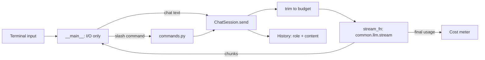

# Week 1, Day 7: Weekly Challenge: `llm-cli`

**Time:** 3–4h · **Needs:** one API key to use it for real; the tests need nothing

## The brief
Build **`llm-cli`**, a terminal chat client you would actually keep using. It pulls together everything from this week: provider-agnostic calls (Day 1), token and cost awareness (Days 2 and 4), streaming and failure handling (Day 5), and model choice (Day 6).

```
$ python -m llm_cli --provider anthropic
llm-cli · anthropic/claude-opus-5 · /help for commands · Ctrl-D to exit

you> Explain the KV cache in two sentences.
The KV cache stores the key and value vectors of every token already processed, so each new
token only needs one forward step instead of recomputing the whole prompt. ...
[anthropic/claude-opus-5 · in 31 · out 58 · $0.00161 · first token 0.84s · session $0.0016]

you> /provider openai
now using openai/gpt-6.1-sol (2 messages carried over)
you> Now explain it to a 10 year old.
...
```

## Requirements

### Must have
1. **Streaming output.** Tokens print as they arrive. Show **time to first token** in the footer.
2. **Provider switching mid-conversation.** `/provider <name> [model]` swaps providers *without losing history* (so store history in a provider-neutral format). Also `/model <name>`.
3. **Per-turn footer + session cost meter.** After each answer: model, input/output/cached tokens, cost, TTFT, running session total. `/cost` prints totals and a per-model breakdown.
4. **Context budget.** `/budget <tokens>` + automatic **sliding-window trimming**: drop the oldest messages until the conversation fits, always keeping the newest message and never starting with an assistant turn. Tell the user when messages were dropped. Never truncate the user's newest message silently.
5. **Resilience.**
   - Retry transient errors (429/5xx/timeouts/connection) with exponential backoff + jitter and a visible `retrying in 1.3s...` notice, **only when nothing has been printed yet**.
   - Never retry 4xx.
   - A failure *mid-stream* keeps the partial answer (marked `[partial]`) and offers `/retry`.
   - **Ctrl-C while streaming stops the generation but keeps the session alive.**
   - A failed turn must not leave a dangling user message in the history.
6. **Commands:** `/help /provider /model /system /budget /history /undo /retry /clear /cost /save /load /quit`.
7. **Persistence:** `/save` and `--load` round-trip the whole session (history, system prompt, provider and model).
8. **Separation of concerns:** chat logic (history, trimming, retries, metering) must be testable **without a terminal and without the network**: inject the stream function, the sleep function and the token counter.

### Tests (required)
Write offline unit tests with a **fake stream function**. At minimum cover:
- history grows correctly and cost is metered from the final usage;
- a transient error is retried, a 400 is not, and retries stop after the limit;
- mid-stream failure keeps the partial text and does not retry;
- Ctrl-C (`KeyboardInterrupt`) keeps the partial text;
- trimming: result fits the budget, starts with a user turn, newest exchange kept, system prompt counted;
- an oversized newest message is kept and flagged;
- provider switch keeps history and routes the next call to the new provider;
- save/load round-trip; each slash command.

> **Prove your tests can fail.** Break your own code on purpose (e.g. make `trim` a no-op, make every error retryable) and confirm that at least one test goes red for each. Tests that pass against broken code are worse than no tests.

### Rubric (100 pts)
| Area | Points |
|---|---|
| Streaming, TTFT and footer work on at least 2 providers | 20 |
| Switching providers keeps history; costs metered correctly per model | 15 |
| Trimming is correct (budget, valid start, newest kept, user told) | 15 |
| Retry semantics (transient vs fatal, jitter, nothing-printed-yet rule, mid-stream, Ctrl-C) | 20 |
| Tests: offline, meaningful, and they fail when the code is broken | 20 |
| Code quality: separation of concerns, no hidden global state, readable | 10 |

### Stretch goals
- **Markdown rendering** of finished answers with `rich`.
- **Auto-summarise** dropped history into a one-paragraph note (cheap model) instead of discarding it (Week 2 Day 5 goes deeper).
- **`/compare <prompt>`**: send the same prompt to two providers in parallel (Day 5's runner) and show answers, latency and cost side by side.
- **`/cache on`**: use prompt caching for a large system prompt and show cache hits in the footer.
- **Fallback chain:** if provider A fails after retries, transparently try provider B.
- Estimate the cost of an **interrupted** generation (the provider still bills for tokens generated before you hit Ctrl-C) from the streamed text.

## Reference solution
[solutions/weekly/](solutions/weekly/):

| File | Role |
|---|---|
| `llm_cli/chat.py` | `ChatSession`: history, trimming, streaming with retries, cost meter, save/load |
| `llm_cli/commands.py` | slash commands → plain text results (no terminal I/O) |
| `llm_cli/__main__.py` | thin terminal layer (input loop, printing, argparse) |
| `test_llm_cli.py` | 20 offline tests with a fake stream function |

```bash
cd weeks/week01_how-llms-work/solutions/weekly
python -m pytest -q                      # 20 offline tests
python -m llm_cli --provider anthropic   # needs a key  (or --provider ollama for a local model)
```



Design notes worth studying:
- **Retries live in the CLI, not the SDK.** `__main__` sets `LLM_MAX_RETRIES=0` so the user *sees* the retry notices instead of hidden SDK retries.
- **The "nothing printed yet" rule.** You can't un-print half an answer, so a mid-stream failure surfaces instead of silently starting over.
- **History is stored as plain `{role, content}`**, with our own `partial` flag stripped before every API call. That's what makes provider switching trivial.
- **Token counting for trimming is an estimate** (tiktoken); billing always comes from the API's `usage`.
- **Known limitation:** an interrupted turn has no final `usage`, so its cost isn't in the meter (see stretch goals).

## Week 1 checklist
- [ ] I can explain training vs. inference, and why the API is stateless.
- [ ] I can predict token counts and cost, and I know `tiktoken` is wrong for Claude.
- [ ] I can implement temperature / top-k / top-p and I know which models still expose them.
- [ ] I can compute KV-cache memory and explain why chat cost grows ~quadratically.
- [ ] I can write retry logic that doesn't create thundering herds or retry fatal errors.
- [ ] I choose models using measured quality, latency and cost per correct answer.
- [ ] `common/llm.py` is something I understand line by line. **Every later week imports it.**

**Next:** Week 2, *Prompting & Structured Outputs*: turning this raw text interface into something reliable enough to put inside software.
