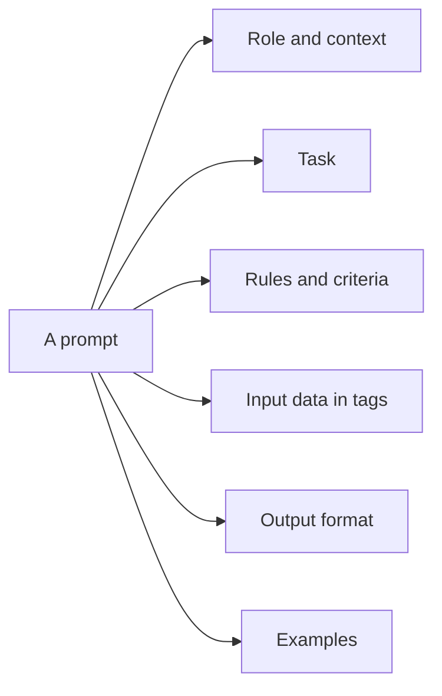

# Week 2, Day 1: Prompt Anatomy: Prompts Are Code

**Time:** ~2.5h · **Needs:** an API key for the real run; the harness has an `--offline` self-test

## Learning objectives
- Name the parts of a good prompt and what each one buys you.
- Separate **instructions** from **data** with delimiters, and know why that also matters for security.
- Choose between zero-shot and few-shot, and write good examples.
- Template and version prompts instead of pasting f-strings around.
- **Measure** a prompt change instead of eyeballing one output.

---

## 1. A prompt is a program with a fuzzy interpreter

Treat prompts like code: they have inputs (variables), structure, a spec, and tests. The "compiler" is a model that reads your intent and guesses what you meant. **Every ambiguity you leave is a guess you're delegating.**

### The parts

| Part | Question it answers | Example |
|---|---|---|
| **Role / context** | Who is the model and what's the situation? | "You triage support tickets for a payments company." |
| **Task** | What exactly should it do? | "Assign one priority to the ticket." |
| **Rules / criteria** | What counts as right? Edge cases? | "P1 = service down, data loss or security issue..." |
| **Input data** | The thing to operate on, clearly fenced off | `<ticket>...</ticket>` |
| **Output format** | Exactly what to return | "Reply with only `P1`, `P2` or `P3`." |
| **Examples** | What good looks like | 2–5 input/output pairs |



You don't need all six every time. Simple tasks need two; classification with subtle rules needs most.

## 2. The principles that matter

1. **Be specific about the outcome, not just the topic.** "Summarise this" → "Summarise in at most 20 words for a busy engineer; no preamble."
2. **Give the reason behind a rule.** "Reply with a single word, because your output is parsed by a script" generalises better than a bare "Reply with a single word."
3. **Tell it what to do, not only what to avoid.** "Write flowing prose paragraphs" beats "don't use bullet points".
4. **Fence the data.** Wrap untrusted or variable text in tags (`<email>…</email>`). The model can then tell instructions from content, you can reference the tags in the instructions ("the text inside `<email>`"), and it is your first (partial) defence against prompt injection (Week 8).
5. **Say what to do when information is missing.** "If no deadline is given, use `null`." Otherwise the model invents one.
6. **Examples beat adjectives.** Showing 3 input→output pairs often fixes what a paragraph of description can't. Make them *diverse* and include an edge case; avoid examples that are all alike (the model copies surface patterns).
7. **Put long reference material first and the question last.** For big documents, this ordering consistently helps.
8. **Don't shout.** Current models follow normal instructions; ALL-CAPS, "CRITICAL!!!" and stacked "never" lists tend to cause over-application. Use emphasis sparingly.
9. **Change one thing at a time and measure.** Otherwise you can't tell what helped.

> **Newer models need less scaffolding.** Prompts written for older, weaker models ("think step by step", elaborate role-play, repeated warnings) are often unnecessary or harmful on current ones. Re-test old prompts when you switch models.

## 3. Structure with XML-style tags

Tags are plain text; no special syntax is required, but consistent names help (Claude in particular is trained to respect them; they work fine on GPT too).

```python
PROMPT = """\
You triage support tickets for a payments company.

<priority_definitions>
P1: service down, data loss, security issue, or money moved incorrectly
P2: a feature is broken but a workaround exists, or many users are inconvenienced
P3: questions, how-to, cosmetic issues, feature requests
</priority_definitions>

<ticket>
{ticket}
</ticket>

Choose exactly one priority for the ticket above.

<output_format>
Reply with only P1, P2 or P3. No other text.
</output_format>"""
```

## 4. Few-shot examples

```
<examples>
<example>
<ticket>I can't find where to download my invoice.</ticket>
<answer>P3</answer>
</example>
<example>
<ticket>Customers are being charged twice since this morning.</ticket>
<answer>P1</answer>
</example>
</examples>
```

- 3–5 examples is the sweet spot; more costs tokens and risks over-fitting to their quirks.
- Wrap them in tags so the model doesn't confuse them with the real input.
- Cover the **boundary** between classes, not just the easy cases.
- Examples are also a cheap way to pin down output *format*.

## 5. Templates, not string soup

```python
from string import Template

TICKET_PROMPT = Template("...<ticket>\n$ticket\n</ticket>...")  # or an f-string inside a function
prompt = TICKET_PROMPT.substitute(ticket=ticket_text)
```

Habits worth having from day one:
- Prompts live in **named constants or files**, one per task, not inline in business logic.
- A **version** string in the name or a comment (`TRIAGE_V3`), so you can tell which version produced which output (you'll log it in Week 7).
- User-controlled text goes only inside the fenced slot. **Never** concatenate it into the instructions.
- If your template contains literal braces (JSON), prefer `string.Template` or a function over `str.format`.

## 6. System prompt vs. user message

- **System prompt:** durable behaviour: role, rules, format, tone. Stable across turns, so it's also the part you cache (Week 1 Day 4).
- **User message:** the per-request task and data.

The split is a convention for convenience and caching, not a security boundary. Don't put secrets in either.

## Pitfalls & production notes
- **One example output ≠ evidence.** Prompts must be evaluated on a *set* of inputs with a pass/fail check. Today's challenge builds that harness; Week 7 scales it.
- **Over-long prompts** bury the instruction and cost money on every call. Delete rules that don't change measured results.
- **Contradictory instructions** ("be brief" + "explain thoroughly") produce random compromises.
- **Prompts are model-specific.** A prompt tuned on one model may regress on another; keep your eval set around.

---

## Daily Challenge: Rewrite 3 Bad Prompts, Prove It

You get three tasks, each with a deliberately weak "bad" prompt. For each:

| Task | Bad prompt | Pass criterion (checked by code) |
|---|---|---|
| **A. Action items** from meeting notes | `Get the action items from this: {notes}` | Output is exactly `NONE` or only `- ` bullet lines, with the right number of bullets |
| **B. Ticket priority** | `What priority is this ticket? {ticket}` | Output is exactly `P1`, `P2` or `P3` and equals the gold label |
| **C. Review summary** | `Summarize: {review}` | ≤ 20 words, no preamble like "Here is…", and mentions the key term |

**Requirements**
1. Write a **good prompt** for each task using the principles above (role/context, delimiters, rules, output format, and examples where they help).
2. Build a harness: ≥ 6 inputs per task with gold answers and a checker function per task.
3. Run the bad and good prompts on every input and print a table of **pass rate before vs. after**, per task.
4. Include a failure listing (input, output, why it failed) for the good prompt so you can iterate.
5. Add an `--offline` mode that uses `common.fake` to self-test the harness.

**Acceptance criteria**
- With a real model, the good prompts score ≥ 90% on every task and strictly beat the bad prompts overall.
- The harness runs offline (`--offline`) with no keys and prints a clearly-labelled self-test.
- Checkers are validated: each has at least one passing and one failing sample string in a test.

**Stretch**
- Add a 4th task of your own where examples matter (e.g. normalise messy dates to ISO-8601).
- Ablate your good prompt: remove one component at a time (rules / examples / delimiters / format) and see which one carried the gain.
- Run the same prompts on a cheaper model. Which prompt features matter more for the small model?

**Solution:** [solutions/day1_solution.py](solutions/day1_solution.py) (`--offline` runs the harness self-test; real results come from your keys).

## Further reading
- Anthropic: *Prompt engineering overview* (clarity, examples, XML tags, long-context ordering).
- OpenAI: *Prompt engineering guide*.
- Eugene Yan: *Prompting Fundamentals and How to Apply them Effectively*.
