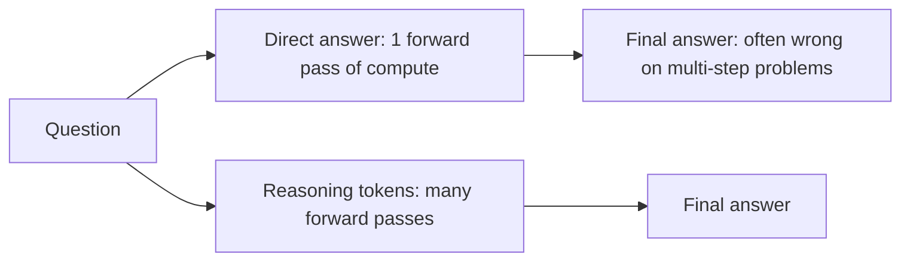
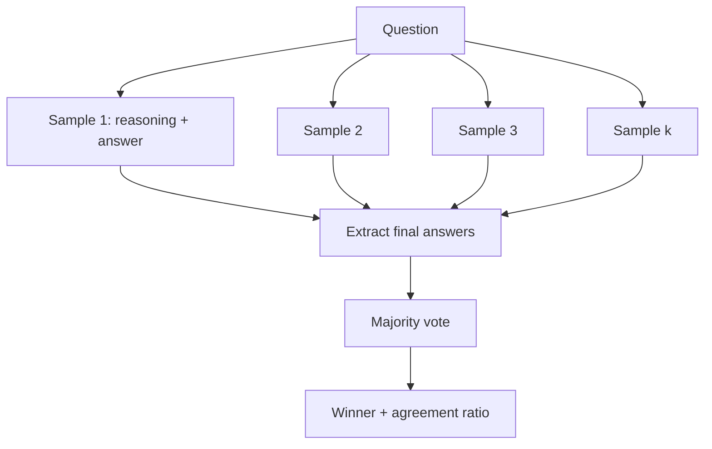

# Week 2, Day 2: Reasoning: CoT, Thinking Models & Self-Consistency

**Time:** ~2.5h · **Needs:** nothing (default run uses a local model, ~4 min on CPU); an API key for `--backend api`

## Learning objectives
- Explain why intermediate reasoning improves answers (tokens are compute).
- Use chain-of-thought correctly, and know when **not** to (reasoning models, simple lookups).
- Control built-in reasoning with the **effort** dial instead of prompt incantations.
- Implement **self-consistency** (sample several paths, majority-vote) and use **agreement as a confidence signal**.
- Understand when voting helps, and when it can't.

---

## 1. Why reasoning helps

A transformer does a fixed amount of computation **per generated token**. Hard problems need more computation than one token provides. Letting the model write intermediate steps gives it more "scratch space" and more forward passes. Each step is easier than the whole.



Classic effect: *"Tom has 3 apples, eats 2, buys 5 more. How many?"* A guess answers `6` or `9`; written-out steps (`3-2=1`, `1+5=6`) get it right far more often.

## 2. Techniques

| Technique | How | Notes |
|---|---|---|
| **Zero-shot CoT** | Add "Think step by step" | Cheap, often enough |
| **Few-shot CoT** | Show 2–3 worked examples | Fixes *format* and *method*; costs tokens |
| **Structured reasoning** | JSON with a `reasoning` field **before** `answer` | Fields are generated in order, so reasoning comes first; easy to parse and log |
| **Plan-then-solve** | "First list the sub-problems, then solve each" | Good for long, multi-part tasks |
| **Built-in thinking** (reasoning models) | Provider reasons internally before answering | See below |
| **Self-consistency** | Sample several answers, take the majority | Trades cost for reliability |

## 3. Reasoning models: stop prompting them to "think"

Current frontier models are trained (with reinforcement learning) to reason **before** answering. You control *how much* with a dial, not with magic words:

```python
# Anthropic (Claude): adaptive thinking + effort. Read the blocks yourself to see thinking.
r = client.messages.create(
    model="claude-opus-5",
    max_tokens=16000,
    thinking={"type": "adaptive", "display": "summarized"},  # display: summary of the reasoning
    output_config={"effort": "medium"},  # low | medium | high | xhigh | max
    messages=[{"role": "user", "content": problem}],
)
for block in r.content:
    if block.type == "thinking":
        print("THINKING:", block.thinking)
    elif block.type == "text":
        print("ANSWER:", block.text)

# OpenAI: a reasoning effort setting on reasoning-capable models
r = client.responses.create(model="gpt-6.1-sol", input=problem, reasoning={"effort": "medium"})
```

Practical rules:
- **Thinking tokens are billed as output tokens**, even when hidden. High effort on easy tasks wastes money and time.
- **Pick effort per task**, and measure: `low` for classification/extraction/formatting, `medium`/`high` for multi-step reasoning, the top levels only where correctness is worth the cost and latency.
- **Don't add "think step by step"** to a reasoning model; it already does, and prescriptive scaffolding can make it worse. Give a clear goal, the constraints and the output format.
- The visible reasoning is a **summary, not a guaranteed-faithful trace**. Don't treat it as proof of *why* the answer is right.
- Some of the newest models can't turn thinking off at all, only lower the effort.
- Our wrapper passes extra arguments through: `llm.complete(prompt, thinking={...}, output_config={...})`.

## 4. Self-consistency

For problems with one **checkable final answer** (a number, a label, a choice):



1. Sample the question **k times** with randomness on.
2. **Extract** each final answer (robustly. See pitfalls).
3. **Majority vote.** The share of samples agreeing with the winner is the **agreement**.

Why it can work: a hard problem has many wrong paths, which scatter, and few right ones, which converge. Errors that are *random* cancel out in the vote.

**When it does NOT help** (this is the important part):
- If the model's errors are **systematic** (same wrong method every time), all samples agree on the wrong answer and voting amplifies it.
- If the model is mostly wrong, voting between *different* wrong answers picks noise.
- Open-ended outputs (summaries, essays) have no single answer to vote on (use best-of-n with a judge instead).
- It costs **k× tokens** and adds latency (parallelise: Week 1 Day 5).

### The most useful by-product: agreement is a confidence signal
Even when voting doesn't raise accuracy, **how much the samples agree** tells you whether to trust the answer, which is exactly what you need to decide *when to escalate to a human, a stronger model, or a tool*.

### Real result (local Qwen2.5-0.5B, 10 word problems, k=5)

| Metric | Result |
|---|---|
| Greedy (T=0) accuracy | 70% |
| Mean single-sample accuracy (T=0.8) | 62% |
| **Majority-vote accuracy (k=5)** | **60%**, no better than one sample |
| Accuracy when all 5 samples **agree** | **4/4** |
| Accuracy when a majority agrees (3 or 4 of 5) | 2/3 |
| Accuracy when samples are **split** | **0/3** |

Voting did not help here, since this 0.5B model's mistakes are often consistent (e.g. `36` four times for a question whose answer is `12`) and it is too weak for most paths to converge. But **unanimity was 100% accurate and a split vote was 0% accurate**. A larger model has more *random* and fewer *systematic* errors, which is where voting pays off. Run `--backend api` and compare. The gap between a small and large model is itself a lesson about when this technique is worth its k× cost.

## Pitfalls & production notes
- **Answer extraction is a real source of bugs.** The 0.5B model ignored "end with `ANSWER: n`" about half the time and used `\boxed{}`, "Final Answer:" or prose. The solution tries several conventions and falls back to the last number. In production, **use structured output** (Day 3) so the answer is a typed field.
- **Don't set `temperature` for diversity on models that reject it.** Independent calls to current hosted models differ anyway because they sample by default.
- **Vote on the normalised answer** (`14`, `14.0` and `$14` must count as equal).
- **Ties:** break deterministically (first seen) or escalate. A tie is itself a low-confidence signal.
- **Log the agreement** with every answer. It becomes a feature for routing and monitoring (Week 7).
- **Cost control:** use a cheap model for the k samples and a strong one only when agreement is low (a cascade).

---

## Daily Challenge: The Self-Consistency Voter

Implement self-consistency and measure whether it helps.

**Requirements**
1. A `PROBLEMS` list of ≥ 10 word problems with numeric gold answers.
2. `extract_number(text)`: tries several answer conventions (`ANSWER:`, `\boxed{}`, "final answer", "the answer is") and falls back to the last number; handles `$`, commas and decimals.
3. `vote(answers)`: majority vote ignoring unparseable samples, deterministic tie-break, returns `(winner, agreement)`.
4. A backend-independent `self_consistency(sample_fn, question, k)`. Provide a **local** backend (batched sampling with `transformers`) and an **API** backend (`asyncio.gather` over `llm.acomplete`).
5. An evaluation printing: greedy accuracy (local), mean single-sample accuracy, majority-vote accuracy, and **accuracy bucketed by agreement** (unanimous / majority / split).
6. An `--offline` self-test with unit tests for the extractor and the voter and a scripted sampler (each sample right with p = 0.6) showing vote accuracy > single-sample accuracy.

**Acceptance criteria**
- The extractor passes edge cases: `\boxed{14}`, `Final Answer: 9`, `1,250`, `$2.50`, no digits → `None`.
- The offline test proves the voter beats a p=0.6 sampler, which is the *ideal* case for voting.
- Run it on a real model and **write down** whether voting helped and what the agreement buckets show. "It didn't help, and here's why" is a valid, valuable result.

**Stretch**
- Plot accuracy vs. k (1, 3, 5, 9, 15) for a model of your choice.
- Implement a **cascade**: answer with a cheap model; if agreement < 80%, re-answer with a stronger model. Report accuracy and cost vs. always using the strong model.
- Compare against a reasoning model at `low` vs. `high` effort on the same problems. Which is cheaper per correct answer?
- Try **universal self-consistency** for free-text answers: ask an LLM to pick the most consistent of the k answers.

**Solution:** [solutions/day2_solution.py](solutions/day2_solution.py). The default (local) run produced the table above; `--offline` runs the unit tests.

## Further reading
- Wei et al., *Chain-of-Thought Prompting Elicits Reasoning in Large Language Models*.
- Wang et al., *Self-Consistency Improves Chain of Thought Reasoning in Language Models*.
- Anthropic / OpenAI docs: extended thinking / reasoning effort, and billing of reasoning tokens.
