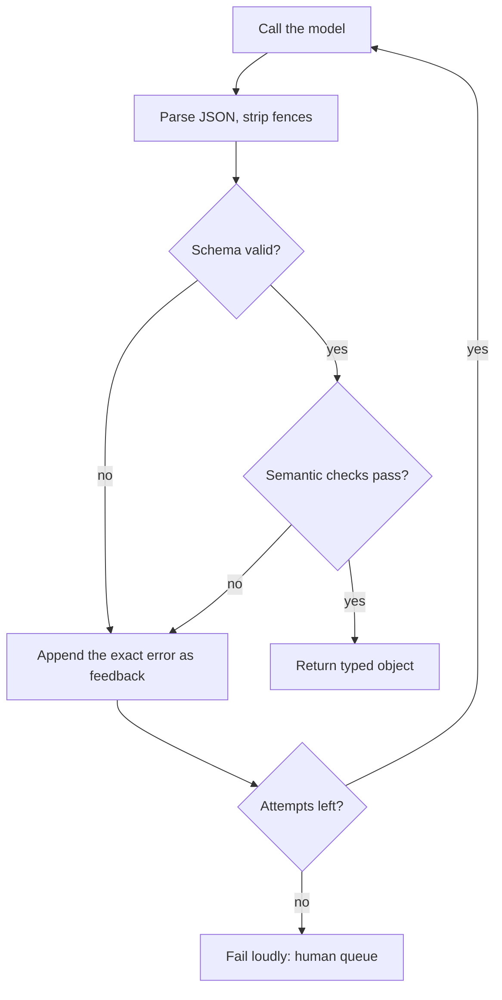

# Week 2, Day 3: Structured Outputs: Turning Text into Types

**Time:** ~3h · **Needs:** a key for the real run; `--offline` self-test needs none

## Learning objectives
- Explain the four ways to get structured data from an LLM, and pick one.
- Design Pydantic schemas that models fill in reliably (enums, `Optional`, descriptions).
- Use each provider's **native structured output**, and know what it does *not* guarantee.
- Add **semantic validation** and a **validate-and-retry** loop that feeds errors back to the model.
- Measure schema failures and field-level accuracy.

---

## 1. Why this matters

Your program can't `if` on a paragraph. The moment an LLM output feeds code (a database row, an API call, a UI), you need **machine-readable, validated output**. Most "LLM app" bugs are really parsing bugs.

## 2. The four approaches (weakest → strongest)

| # | Approach | How | Guarantee |
|---|---|---|---|
| 1 | **Ask nicely** | "Reply in JSON with keys a, b, c" + `json.loads` | None. Models add prose, markdown fences, trailing commas |
| 2 | **JSON mode** | Provider flag: "output is valid JSON" | Valid JSON, but *not* your schema (missing keys, wrong types) |
| 3 | **Native structured outputs** | Pass a JSON Schema / Pydantic model; the provider **constrains decoding** so output matches | Schema-valid, as long as generation finishes (not truncated or refused) |
| 4 | **Tool/function call** | Define the schema as a tool the model "calls" (Week 5) | Same idea; also lets the model choose *whether* to call |

On top of any of them: **validate in your own code** (Pydantic) because (a) native modes support only a subset of JSON Schema, (b) valid ≠ correct, and (c) local/open models may not offer constrained decoding.

### Native structured output in each SDK

```python
from pydantic import BaseModel


class Contact(BaseModel):
    name: str
    email: str | None


# Anthropic
r = client.messages.parse(
    model="claude-opus-5",
    max_tokens=1000,
    messages=[{"role": "user", "content": text}],
    output_format=Contact,
)
contact = r.parsed_output

# OpenAI (Responses API)
r = client.responses.parse(model="gpt-6.1-sol", input=text, text_format=Contact)
contact = r.output_parsed
```

`common.llm.structured(messages, Contact)` wraps both (and Ollama's `chat.completions.parse`).

**What native modes don't save you from**
- **Truncation:** if `max_tokens` is hit mid-object, you get invalid output. Check the stop reason.
- **Refusals:** a refused request can return no parsed object. Handle `None`.
- **Unsupported schema features:** numeric bounds, string patterns, deep recursion etc. may be dropped or rejected, so enforce them in Pydantic validators too.
- **Wrong values:** the JSON is well-formed and *confidently wrong*. Valid structure says nothing about truth.

## 3. Designing the schema is prompt engineering

The schema is part of the prompt: field names and `description`s are read by the model.

```python
class Order(BaseModel):
    is_order: bool = Field(description="False if the email does not place an order")
    order_id: str | None = Field(None, description="Order reference such as 'A-1042', if stated")
    urgency: Literal["low", "normal", "high"] = Field("normal", description="high if ASAP...")
    delivery_date: date | None = Field(None, description="ISO-8601 YYYY-MM-DD")
```

Rules of thumb:
- **`Optional` + "use null if absent"** for every field the source might not contain. A required field *forces* the model to invent a value (the #1 cause of hallucinated extraction).
- **`Literal`/`Enum` for closed sets**, with the meaning of each value in the description.
- **Normalise at the schema** (ISO dates, numbers not strings, one currency code) so downstream code is trivial.
- **Keep schemas flat and small.** One schema per task; split big ones into stages (Day 4).
- **Put a `reasoning`/`notes` string first** if the extraction needs judgment. Fields are generated in order, so thinking before answering helps (and costs tokens).
- Add an **escape hatch** (`is_order: false`, `"unknown"`) so "none of the above" isn't forced into a wrong category.

## 4. Semantic validation: what the schema can't say

```python
@model_validator(mode="after")
def order_needs_core_fields(self):
    if self.is_order and not (self.order_id and self.customer_name and self.items):
        raise ValueError("an order must have customer_name, order_id and at least one item")
    return self


def semantic_checks(o):
    if o.delivery_date and o.delivery_date < RECEIVED:
        raise ValueError(f"delivery_date {o.delivery_date} is before the email was received")
```

Cross-field rules, date ranges, "sum of line items equals total", references that must exist in your database: validate all of these in code.

## 5. Validate-and-retry




```python
for attempt in range(max_attempts):
    reply = llm.complete(messages).text
    try:
        return parse_and_validate(reply)
    except (ValidationError, ValueError) as exc:
        messages += [
            {"role": "assistant", "content": reply},
            {
                "role": "user",
                "content": f"That output failed validation:\n{exc}\nFix it and reply with only the corrected JSON.",
            },
        ]
```

Why it works: the validation message is *specific* ("delivery_date 2025-01-03 is before the email was received"), so the model can fix exactly that. Practices:
- **Cap attempts** (2–3). Persistent failure usually means a bad prompt, schema, or input, not bad luck.
- **Log every failure** with the input and error. This is your best source of prompt improvements.
- Be tolerant on the **parse** layer (strip ```` ```json ```` fences) but strict on **validation**.
- Return a typed result like `Extraction(order|None, attempts, errors)` so callers must handle failure explicitly.
- On the final failure, **fail loudly**: route to a human queue; don't silently write garbage.

## Pitfalls & production notes
- **`temperature`/format tricks aren't validation.** Measure: *first-try validity* and *final validity* are different metrics.
- **Schema drift:** changing a field name silently changes prompts. Version schemas with prompts.
- **Don't trust extraction of IDs/amounts** without a cross-check against the source (e.g. the order ID string must appear in the email text).
- **Open/local models:** use constrained decoding (llama.cpp grammars, Outlines, xgrammar, vLLM guided decoding) to get the native-mode guarantee. We use them in Weeks 10–11.

---

## Daily Challenge: Typed Extraction With Zero Schema Failures

Extract orders from messy emails into a Pydantic `Order` model.

**Requirements**
1. Schema with: `is_order`, `customer_name`, `order_id`, `items[{name, quantity}]`, `urgency` (enum), `delivery_date` (date), `total_amount`, `currency` (enum). Absent facts must be `null`.
2. A validator: an order must have customer, ID and ≥ 1 item.
3. A semantic check: delivery date not before the email's received date; `total_amount` and `currency` come together.
4. `extract_native(...)` using structured outputs, and `extract_with_retry(...)` using prompt + parse + validate + error-feedback retry (max 3 attempts).
5. A dataset of ≥ 8 messy emails with gold labels (include: shouting/urgent, "no rush", a date written like "Nov 20 2026" or "the 3rd of January 2027", currency symbols or codes, missing fields, and a non-order such as a cancellation).
6. An evaluation that reports **first-try validity, final validity, and per-field accuracy**.

**Acceptance criteria**
- Final validity = 100% on your dataset (zero schema failures reach the caller).
- Field accuracy ≥ 90% with a real model; list which fields fail.
- Offline (`--offline`): the scripted model fails the first attempt in several different ways (fenced JSON, bad enum, missing required field, semantically invalid date) and the pipeline recovers. Assert that the retry prompt contains the actual error text.

**Stretch**
- Add a check that `order_id` and every item name actually appear in the email text (grounding).
- Compare native vs. retry on a cheaper model: which has the better first-try validity?
- Handle emails containing **two** orders: change the schema to a list and measure the effect.

**Solution:** [solutions/day3_solution.py](solutions/day3_solution.py). `--offline` was executed and asserts the retry mechanics (the scripted fake does not enforce schemas, so it tests *your* loop). Real-model accuracy is yours to measure.

## Further reading
- Anthropic and OpenAI docs: *Structured outputs* (supported schema subsets and refusal handling).
- Pydantic docs: validators; `model_json_schema()`.
- Outlines / XGrammar: constrained decoding for open models.
