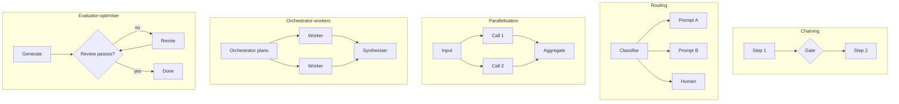

# Week 2, Day 4: Workflow Patterns: Orchestrating Calls With Plain Code

**Time:** ~2.5h · **Needs:** key for the real run; `--offline` self-test needs none

## Learning objectives
- Distinguish **workflows** (you control the flow in code) from **agents** (the model controls it), and default to workflows.
- Implement five patterns without a framework: chaining, routing, parallelisation, orchestrator-workers, evaluator-optimiser.
- Put **gates** between steps so failures are cheap and visible.
- Trace every step (time, tokens) so you can optimise.

---

## 1. Workflow vs. agent

| | **Workflow** | **Agent** |
|---|---|---|
| Who decides the next step? | Your code | The model |
| Predictability | High: same graph every time | Lower: path varies per input |
| Cost / latency | Bounded, estimable | Open-ended |
| Debugging | Read the trace of fixed steps | Read a transcript of decisions |
| Best for | Well-understood tasks with known steps | Open-ended problems where steps can't be listed in advance |

**Start with a single well-prompted call. Add a workflow only when it measurably improves results. Reach for an agent (Week 5) only when you cannot enumerate the steps.** Each added step multiplies latency, cost and failure modes.

## 2. The five patterns




### a) Prompt chaining
Break a task into sequential calls, each consuming the previous output. Trade latency for accuracy, because each call has an easier job.

```
extract facts ──▶ [gate] ──▶ write draft ──▶ translate
```
**Gates** are programmatic checks between steps ("is the JSON valid?", "is confidence ≥ 0.6?", "is the draft ≤ 90 words?"). A failed gate stops the pipeline early, so you don't pay for steps that can't succeed.
*Use when:* the task decomposes cleanly (outline → write, extract → transform, generate → localise).

### b) Routing
Classify the input, then send it to a **specialised** prompt/model/handler.

```
ticket ──▶ classifier ──▶ billing prompt | technical prompt | account prompt | human
```
Why it works: one prompt can't be optimal for every input type; specialised prompts are shorter and sharper. It also lets you send easy inputs to a cheap model and hard ones to a strong one. Always include an **"other / unsure" route** and a confidence threshold that escalates to a human.

### c) Parallelisation
Two flavours:
- **Sectioning:** independent sub-tasks run concurrently (summarise 20 documents; check a draft for 3 different issues in 3 parallel calls).
- **Voting:** run the *same* task several times and aggregate (self-consistency, Day 2; multiple reviewers for risky content).

`asyncio.gather` + a semaphore (Week 1 Day 5). Latency becomes the slowest call, not the sum.

### d) Orchestrator-workers
A model decides the subtasks **at run time**, workers do them, then results are synthesised.

```
orchestrator: "list the questions in this email" ──▶ N workers (one per question) ──▶ synthesiser
```
Use it when you can't know the number/type of subtasks in advance (e.g. "fix all failing tests"). It's the first step toward agents. Bound the fan-out (max subtasks) and the cost.

### e) Evaluator-optimiser
One call produces, another critiques against a **checklist**; loop until it passes or you hit a cap.

```
draft ──▶ review(checklist) ──pass──▶ done
              └─fail + problems──▶ revise ──▶ review ...
```
Works when you have **clear evaluation criteria** and revision measurably helps. Always cap the loops (2–3) and escalate on failure. A reviewer using the *same* model has blind spots; code-based checks (word count, forbidden phrases, schema) are cheaper and stricter, so use them whenever you can and use an LLM reviewer for fuzzier criteria.

## 3. Engineering practices

- **Make the control flow ordinary code.** `if/for/while`, typed results, exceptions. You can unit-test it by faking the LLM (that's what `--offline` does).
- **Typed hand-offs.** Every step returns a Pydantic model (Day 3), so the next step never parses prose.
- **Trace everything.** Record step name, duration, tokens and the input/output. You'll plug this into real tracing in Week 7.
- **Budget per request.** Max steps × max revisions × max tokens gives a worst-case cost. Know it.
- **Cheap models for easy steps.** Routers, reviewers and extractors are good candidates for small models; keep the strong model for the generation that matters.
- **Idempotency & retries** from Week 1 Day 5 apply to each step.
- **Fail visibly.** An escalation reason like `router: other @ 0.40` is worth more than a generic error.

## Pitfalls & production notes
- **Compounding error:** 5 steps each 95% reliable give ~77% end to end. Measure the whole pipeline, not just the parts.
- **Error amplification through chaining:** a wrong early step poisons later ones; gates and typed outputs limit this.
- **Over-orchestration:** if a good prompt in one call passes your eval, don't split it.
- **Latency:** every sequential call adds TTFT + generation time. Parallelise independent work and stream the final step.

---

## Daily Challenge: The Ticket Desk

Build a support-ticket pipeline from the patterns above.

**Requirements**
1. **Router:** `route(ticket) -> Route(category, confidence, reason)` with categories `billing | technical | account | other`, using structured output.
2. **Specialists:** a distinct system prompt per category. The billing prompt must forbid promising refunds; the account prompt must forbid asking for passwords.
3. **Gate:** if the category is `other` or confidence < 0.6, **escalate without drafting** (assert that no draft call is made).
4. **Evaluator-optimiser:** a reviewer checks the draft against a 4-item checklist; if it fails, revise using the reviewer's problems; at most 2 revisions, then escalate.
5. **Trace:** each result carries `[(step, seconds, tokens)]`.
6. **Parallel summariser:** `summarise_many(threads, concurrency)` summarises many ticket threads concurrently, preserving order.

**Acceptance criteria**
- Offline: with a scripted model, assert (i) a billing ticket goes route → draft → review → revise → review and ends with a compliant reply, (ii) an unclear ticket stops after `route`, (iii) the billing prompt is used only for billing tickets, (iv) summaries come back in input order.
- With a real model: run 4+ sample tickets and print each category, number of revisions and trace.

**Stretch**
- Add an **orchestrator-workers** step for tickets that contain several questions (the orchestrator lists them, workers answer, a synthesiser merges).
- Use a cheaper model for the router and the reviewer; compare cost and routing accuracy to the strong model.
- Add a hard token budget per ticket; abort and escalate when exceeded.
- Parallel **voting router**: classify 3 times, escalate when they disagree.

**Solution:** [solutions/day4_solution.py](solutions/day4_solution.py) (`--offline` executed; it verifies the control flow, not model quality).

## Further reading
- Anthropic, *Building effective agents* (the workflow patterns above).
- Hamel Husain / Eugene Yan: writing on evaluator-optimiser and LLM-as-judge.
- OpenAI Cookbook: orchestrating agents (routines and handoffs).
