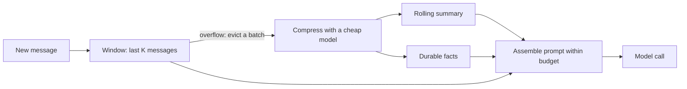

# Week 2, Day 5: Conversation Memory Under a Token Budget

**Time:** ~2.5h · **Needs:** key for the real run; `--offline` self-test needs none

## Learning objectives
- Explain why "memory" in an LLM app is something **you build**, not something the model has.
- Implement a **tiered memory**: sliding window, rolling summary, durable facts.
- Enforce a hard **token budget** every turn, with a sensible order of sacrifice.
- Measure what memory costs (extra calls) and what it buys (recall).

---

## 1. The problem

The API is stateless (Week 1). A "conversation" is you re-sending the history each turn, so:

1. **Cost grows** with every turn (quadratically in total, Week 1 Day 4).
2. **Latency grows**, because prefill processes the whole prompt every time.
3. **You hit the context limit** eventually.
4. **Quality degrades**: long, noisy contexts bury what matters.

Keeping everything is expensive; keeping only the last few messages **forgets the user's name and allergies**. Memory is the engineering of what to keep, in what form.

## 2. Tiers (like CPU cache → RAM → disk)

| Tier | Holds | Form | Cost | Loss |
|---|---|---|---|---|
| **1. Sliding window** | The last K messages | Verbatim | Free | Everything older |
| **2. Rolling summary** | Everything evicted from the window | A short summary, updated incrementally | 1 cheap LLM call per eviction batch | Detail |
| **3. Durable facts** | Things that must never be forgotten: names, constraints, preferences, decisions | A short list of one-line facts | Same call as tier 2 | Almost none |
| **(4. Retrieval)** | Old conversations / documents | Embeddings in a vector DB, retrieved on demand | Week 3 | Only what isn't retrieved |

The prompt each turn is assembled as:

```
system prompt
<memory>
  <facts> - The user's name is Priya  - Allergic to peanuts  - Planning a trip to Lisbon </facts>
  <summary> Earlier the user asked about travel and hobbies... </summary>
</memory>
[last K messages verbatim]
```



## 3. Design decisions

- **Evict in batches** (e.g. 4 messages at once) so you pay for one compression call every few turns, not every turn. Use a **cheap model** for compression.
- **Compression must be faithful.** Prompt it to *update* the existing summary and facts, "keep every old fact unless contradicted", "never invent". Hallucinated memories are worse than forgotten ones.
- **Separate facts from narrative.** The summary can be lossy; the facts list must not be. That distinction is the whole trick.
- **Enforce the budget at assembly time**, with an explicit order of sacrifice: oldest window messages first → shorten the summary → (almost) never drop the newest user message or the facts. If the newest message alone is too big, tell the user instead of silently truncating.
- **Keep the window valid:** never start with an assistant message; keep tool-call/tool-result pairs together (Week 5).
- **Cache-friendliness:** memory changes only every few turns, so the stable prefix (system + memory) can still be prompt-cached between evictions.
- **Privacy:** memory is stored user data. Decide retention, let users delete it, and don't persist secrets or PII you don't need (Week 8).

## 4. Why testing this is easy (and why a fake model works)

A model can only use what is **in its prompt**. So you can verify a memory system *without* a real model: build the prompt, then check it contains what it should. Today's offline test uses a fake model that answers recall questions strictly from the prompt text. A sliding window scores 0/3 because the opening message was evicted, while tiered memory scores 3/3. A real model adds language ability but cannot recall what was never sent.

Offline results (30-turn scenario, budget 250 tokens):

| Strategy | Recall of turn-1 facts | Max prompt tokens |
|---|---|---|
| Full history (naive) | 3/3 | **1,466** and growing |
| Sliding window only | 0/3 | 250 |
| **Tiered memory** | **3/3** | **239** (14 compression calls) |

## Pitfalls & production notes
- **Summaries drift.** Repeated summarise-the-summary loses detail and can distort facts. Keep facts separate and periodically verify against the raw log.
- **Contradictions:** the user says "I moved to Berlin" after "I live in Paris". Tell the compressor to replace, not append.
- **Don't summarise code or exact numbers**; keep those verbatim (or in a scratchpad file, Week 5 Day 5).
- **Server-side options exist** (provider "compaction", context-editing features that clear old tool results). Understand the manual version first; then see what your provider offers.
- **Evaluate memory** with scripted conversations and recall questions, as in the challenge. "Seems to work" is not a test.

---

## Daily Challenge: The Chatbot That Doesn't Forget (and Doesn't Go Broke)

**Scenario:** turn 1: *"Hi! My name is Priya and I'm allergic to peanuts. I'm planning a trip to Lisbon."* Then 29 turns of unrelated small talk. Then ask: *What is my name? What am I allergic to? Which city am I visiting?*

**Requirements**
1. Implement `TieredMemory(budget_tokens, keep_last, evict_batch)` with `add(role, content)` and `build() -> (system, messages)`.
2. Eviction compresses into a `Memo(summary, facts)` using structured output; existing facts are preserved across updates.
3. `build()` enforces the budget with the documented order of sacrifice, and keeps the window valid (starts with a user message).
4. Run three strategies on the scenario: **naive full history**, **window only**, **tiered**. Print recall (x/3), max prompt tokens, and number of compression calls.
5. An `--offline` mode with a scripted model that answers from the prompt text only.

**Acceptance criteria**
- Offline: tiered recalls 3/3 while window-only recalls 0/3; tiered prompt tokens ≤ budget on **every** turn; naive prompt size grows monotonically.
- Real model: tiered recalls ≥ 2/3 with a budget of ~250 tokens (report what it forgot and why).
- You can state the extra cost of tiered memory (compression calls × tokens) vs. the saving on the main calls.

**Stretch**
- Add **contradiction handling** ("actually, I'm allergic to cashews, not peanuts") and test it.
- Make the budget adaptive: use the remaining context window minus a reserve for the answer.
- Persist memory to JSON and resume a conversation across process restarts.
- Replace tier 3 with **retrieval**: embed each message and fetch the top-3 relevant old messages for the current question (we build this properly in Week 3).

**Solution:** [solutions/day5_solution.py](solutions/day5_solution.py) (`--offline` executed; real-model recall is yours to measure).

## Further reading
- Packer et al., *MemGPT: Towards LLMs as Operating Systems* (tiered memory idea).
- Anthropic / OpenAI docs on context management and compaction.
- LangGraph / LangMem docs: how frameworks model short- vs. long-term memory.
