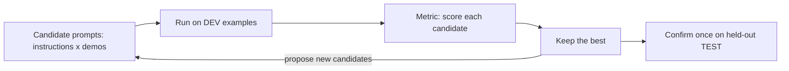

# Week 2, Day 6: Prompt Optimisation: Compile Prompts Against a Metric

**Time:** ~3h · **Needs:** key for the real run; `--offline` runs everything (including real DSPy code) against scripted fakes

## Learning objectives
- Treat a prompt as a **program with parameters** (instruction, demos) that you can search over.
- Split data into **train / dev / test** and explain what each is for, and why optimising on tiny dev sets overfits.
- Build a minimal prompt optimiser from scratch.
- Use **DSPy**: Signatures, Modules, optimisers (`BootstrapFewShot`), `Evaluate`.
- Version and track prompts like code.

---

## 1. The problem with hand-tuned prompts

You tweak a prompt, eyeball three outputs, feel good, ship. Then a model upgrade, a new input type or a teammate's edit silently breaks it. Hand tuning is **unmeasured, unrepeatable and model-specific**.

**Prompt optimisation** replaces intuition with a loop:



Prerequisites (these are the real work, and no optimiser can fix their absence):
1. **A task with a metric you trust** (exact match, schema validity, a rubric you've validated).
2. **Labelled examples**, even 30–100.
3. **A baseline** so you know whether the optimiser did anything.

## 2. Train / dev / test, and why tiny data lies

| Split | Used for | Rule |
|---|---|---|
| **Train** | Source of few-shot demos / bootstrapped examples | The optimiser may look at it freely |
| **Dev** | Choosing between candidate prompts | Looked at *many* times, so it gets optimistic |
| **Test** | One final honest score | Touch it **once**, after choosing |

With 10 dev examples, one example is 10 points. The "best of 15 candidates" is partly the luckiest, so its dev score overstates reality (**selection bias**). Reporting dev accuracy as the result is the classic mistake. Only the test number is honest, and with 10 examples it's still noisy. Real projects use 100+ examples per split (Week 7 shows how to build them).

## 3. A from-scratch optimiser (what DSPy automates)

A prompt = `instruction` + `demonstrations` + the input slot. Search both:

```python
@dataclass(frozen=True)
class Config:
    instruction_key: str  # one of several candidate instructions
    demos: tuple  # a k-subset of TRAIN examples used as few-shot demos


demo_sets = [()] + [tuple(rng.sample(train, k)) for _ in range(n)]  # () = zero-shot
results = [(accuracy(Config(i, d), dev), Config(i, d)) for i, d in product(INSTRUCTIONS, demo_sets)]
best = max(results, key=lambda r: r[0])
```

Offline run (a keyword-matching stand-in that *learns from demos in the prompt*):

```
hand-written baseline : dev 50%  test 40%
optimised winner      : dev 80%  test 70%  (defs, 4 demos)
```

The mechanism is real: richer instructions + demonstrations that cover the input vocabulary lift the score. **The numbers are not**: a scripted stand-in, 10 examples each. Your real-model run decides.

Always include the **zero-shot** config as a candidate, so the winner can't be worse than the best hand-written prompt on dev.

## 4. DSPy: programming, not prompting

[DSPy](https://dspy.ai) (Stanford) lets you declare *what* you want and compiles *how* to prompt for the model you use.

```python
import dspy
from typing import Literal

lm = dspy.LM("anthropic/claude-sonnet-5")  # or "openai/gpt-6.1-sol", "ollama_chat/llama3.2:3b"
dspy.configure(lm=lm)


class Triage(dspy.Signature):  # a typed contract, no prompt text
    """Classify a customer support ticket."""

    ticket: str = dspy.InputField()
    category: Literal["billing", "technical", "account", "other"] = dspy.OutputField()


program = dspy.ChainOfThought(Triage)  # a Module: adds a reasoning step automatically
metric = lambda example, pred, trace=None: example.category == pred.category

trainset = [dspy.Example(ticket=t, category=c).with_inputs("ticket") for t, c in train]
optimiser = dspy.BootstrapFewShot(metric=metric, max_bootstrapped_demos=3, max_labeled_demos=4)
compiled = optimiser.compile(
    program, trainset=trainset
)  # runs the program, keeps traces that pass the metric

evaluate = dspy.Evaluate(devset=testset, metric=metric, num_threads=8)
print(evaluate(compiled))
compiled.save("triage_v1.json")  # the "compiled prompt" is an artifact
```

| DSPy concept | Equivalent in your hand-made prompt |
|---|---|
| **Signature** | The task contract: input/output fields, types, docstring instruction |
| **Module** (`Predict`, `ChainOfThought`, `ReAct`...) | The prompting *strategy* (direct, reasoning, tool use) |
| **Metric** | Your checker function |
| **Optimiser** (`BootstrapFewShot`, `MIPROv2`, `GEPA`...) | The search loop above: demos, instructions, even reflective rewrites |
| **`compile`** | Run the search, return the best program |

`BootstrapFewShot` runs your program on training examples and keeps the **successful traces** as few-shot demos. `MIPROv2` and `GEPA` additionally propose and refine *instructions* and are the heavier tools.

**This lesson's DSPy code was executed** (Predict, ChainOfThought, `BootstrapFewShot.compile`, `Evaluate`) against a scripted OpenAI-compatible server with DSPy 3.4; its API has changed a lot since the older `dspy.OpenAI(...)` / `dspy.settings.configure` style, which no longer exists.

### DSPy gotchas (found by running it)
- **Don't put `from __future__ import annotations` in a file that defines a Signature with typed fields.** The hints become strings and DSPy raises `Field types must be types`.
- **Dependency pins:** DSPy pulls in `litellm`, which pins `openai<3`, while this repo's wrapper uses `openai>=3`. Pip warns; the two coexisted fine in testing, but if you hit odd errors, put DSPy in its own virtualenv.
- **Caching:** DSPy caches LM calls by default. Great for iteration; disable (`cache=False`) when measuring variance.
- **Cost:** optimisers make *many* calls (traces × candidates × examples). Cap with `max_*` arguments and start with a cheap model.

## 5. Prompts are artifacts: version them

Whether you use DSPy or not:
- Keep each prompt in its own file/constant with a **version id** (`TRIAGE_V3`) and a change note.
- **Log the version** with each production call (you'll need it for tracing and A/B tests in Week 7).
- **Re-run the eval on every change**, and gate merges on it (Week 7 puts this in CI).
- Re-optimise after **model changes**: a prompt tuned for one model is not optimal for another. That portability is DSPy's main selling point.

**When not to use an optimiser:** no metric, fewer than ~30 labelled examples, a task so simple that the baseline already scores 98%, or an eval so noisy that you can't tell candidates apart. Fix the eval first.

## Pitfalls & production notes
- **Overfitting to dev:** use a fresh test split; don't peek; prefer more dev data over more candidates.
- **Metric hacking:** optimisers exploit weak metrics (e.g. always answering the majority class). Check the confusion matrix, not just accuracy.
- **Demos leak:** if test inputs resemble train demos too closely, scores inflate. Deduplicate.
- **Cost of the search** can exceed the value for low-volume tasks.

---

## Daily Challenge: Beat Your Own Prompt

**Task:** classify support tickets into `billing | technical | account | other` using a dataset of ≥ 30 labelled tickets (provided in the solution; extend it with your own).

**Requirements**
1. **Split** into train / dev / test with a fixed seed. Never score test during search.
2. Write a **hand-written baseline** prompt (the first thing you'd write) and score it on dev and test.
3. Implement an **optimiser**: ≥ 3 candidate instructions × several random few-shot demo sets (always including zero-shot), scored on dev; report the top 5 and the winner's **test** score.
4. Implement the same job in **DSPy** (`Signature`, `ChainOfThought`, `BootstrapFewShot`, `Evaluate`) and report before/after on test.
5. State, in a short note, why the winner's dev score is optimistic and what you'd do with 500 labelled examples.

**Acceptance criteria**
- The search never touches the test split; the winner's dev score ≥ the baseline's dev score (guaranteed if zero-shot is a candidate).
- `--offline` runs the optimiser against a scripted model *and* the DSPy code against a scripted HTTP server, with no keys.
- With a real model you report baseline vs. optimised on **test**, and whether the gain is bigger than the noise (state the test size!).

**Stretch**
- Let an LLM **propose** new instructions from the failures of the current best (a simple reflective optimiser, which is what GEPA does), then re-score on dev.
- Add a second metric (cost or latency) and report the Pareto front, not a single winner.
- Run `dspy.MIPROv2` and compare it with your optimiser on the same splits.
- Repeat the optimisation on a **different model** and compare the winning configs.

**Solution:** [solutions/day6_solution.py](solutions/day6_solution.py) (`--offline`, `--dspy`; both executed offline, real-model results are yours).

## Further reading
- Khattab et al., *DSPy: Compiling Declarative Language Model Calls into Self-Improving Pipelines*.
- DSPy docs: <https://dspy.ai> (Signatures, Modules, Optimizers).
- Agrawal et al., *GEPA: Reflective Prompt Evolution Can Outperform Reinforcement Learning*.
