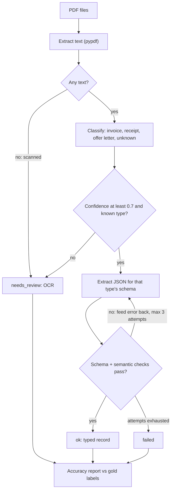

# Week 2, Day 7: Weekly Challenge: The Document-Extraction Pipeline

**Time:** 3–4h · **Needs:** nothing for the offline run; a key to run it on a real model

## The brief
Businesses drown in PDFs. Build **`doc_extract`**: drop a folder of PDFs in, get **validated, typed JSON** plus an **accuracy report** out, and know exactly which documents need a human.

This uses every skill from the week: prompt structure (Day 1), reasoning/agreement as confidence (Day 2), structured outputs with validate-and-retry (Day 3), workflow patterns: routing, gating, parallelism (Day 4), and measurement-driven iteration (Days 1 and 6).



## Requirements

### Must have
1. **PDF to text** with `pypdf`. A PDF with **no extractable text** must be routed to review, not sent to the model.
2. **Classifier** returning `doc_type` (`invoice | receipt | offer_letter | unknown`) and `confidence`, with a **gate**: unknown or confidence < 0.7 → `needs_review`, and *no extraction call is made*.
3. **One Pydantic schema per type**, with `Optional` for facts that can be absent, enums for closed sets, and **semantic validators**: invoice line items must sum to the subtotal; subtotal + tax = total; due date not before invoice date; plausible years.
4. **Extraction with validate-and-retry** (max 3 attempts) where the retry prompt **quotes the exact validation error**. Tolerate code fences and prose around the JSON in the parse step only.
5. **Concurrency:** process the folder with a bounded semaphore; results come back in file order; one crashing document must not kill the batch.
6. A `Record` per file: `status (ok | needs_review | failed)`, type, confidence, data, attempts, errors, reason, cost, seconds.
7. **Accuracy report** (Markdown) against gold labels: status counts, classification accuracy + confusion, fully-correct documents, per-field accuracy per type, retries, total cost, p50/p95 latency, and lists of *not-ok* documents and *wrong fields*.
8. A **sample generator** that creates real PDFs with ground truth: vary label wording (`Invoice No.` / `Invoice #`), **date formats** (ISO, `14 Aug 2026`, `08/14/2026`), currencies, and tax rates, so normalisation is genuinely tested.

### Tests (required)
With real generated PDFs and a **scripted model that injects faults**, assert every branch:
- an arithmetic error is caught by the validator and fixed on retry (and the retry prompt contains the error);
- an invalid enum and an unparseable date are caught the same way;
- a **misclassification** with high confidence ends as `failed` after 3 attempts (wrong schema);
- a low-confidence classification is **gated** with zero extraction calls;
- a **silently wrong value** (valid but incorrect vendor) is *not* caught by validators and **is** visible in the report's wrong-fields list;
- a crash in one document leaves the others intact;
- blank PDF → review; your own ground truth satisfies your own schemas.

> **Mutation-check your tests.** Remove the confidence gate, disable a validator, drop the error text from the retry prompt, swallow exceptions; each must turn at least one test red.

### Rubric (100 pts)
| Area | Points |
|---|---|
| Correct routing: empty text, classifier gate, type → schema | 15 |
| Schemas + semantic validators that match real business rules | 20 |
| Validate-and-retry with specific error feedback; bounded attempts | 20 |
| Report is accurate and shows *silent* errors | 15 |
| Tests (real PDFs, fault injection, mutation-checked) | 20 |
| Concurrency, cost/latency tracking, clean structure | 10 |

### Stretch goals
- **Run it on a real model** and compare cheap vs. strong model on field accuracy and cost per document.
- Add a **cross-check/grounding validator**: every extracted string (vendor, invoice number) must appear in the source text; use it to catch the "silently wrong value" case.
- **Confidence per field** via self-consistency (Day 2): extract twice, flag fields that disagree.
- Add a fourth document type and measure how much of the code you had to touch.
- **OCR path** for scanned PDFs (e.g. `pytesseract`, or send page images to a vision model, Week 4).
- Write the results to **JSON Lines** + a review queue CSV for the `needs_review` and `failed` documents.

## Reference solution
[solutions/weekly/](solutions/weekly/)

| File | Role |
|---|---|
| `doc_extract/schemas.py` | Pydantic models + semantic validators |
| `doc_extract/samples.py` | Generates 12 real PDFs and gold labels (reportlab) |
| `doc_extract/pipeline.py` | text → classify → gate → extract → validate/retry → `Record` (async, bounded) |
| `doc_extract/report.py` | Accuracy report builder |
| `doc_extract/offline_model.py` | Scripted fake model with 6 injected faults |
| `test_doc_extract.py` | 9 offline tests |

```bash
cd weeks/week02_prompting-and-structured-outputs/solutions/weekly
python -m pytest -q                       # 9 tests (real PDFs + real pypdf, scripted model)
python -m doc_extract --offline           # full pipeline + report, no keys
python -m doc_extract                     # same, with your provider
```

Offline result with the scripted faults (this checks the *pipeline*, not a model):

```
documents: 12 | ok: 10 | needs_review: 1 | failed: 1
classification accuracy: 11/12 | fully-correct documents: 9/12 | needed a retry: 4
Wrong fields: 03.pdf: vendor          <- valid JSON, plausible value, silently wrong
```

Design notes worth studying:
- **Status is three-valued, not boolean.** `needs_review` ("I'm not sure") is a first-class outcome. A pipeline that always answers is a pipeline that is sometimes confidently wrong.
- **Gates run before spending tokens:** an empty-text PDF and a doubtful classification never reach the extractor.
- **Validators encode business rules**, so retries have something specific to say.
- **Validation ≠ correctness.** The silent vendor error passes every check; only a gold-label comparison (or a grounding check) finds it. This is why the report exists.
- Cost shown offline is estimated from character counts of the scripted fake; real runs use the API's `usage`.

## Week 2 checklist
- [ ] I can rewrite a vague prompt and **prove** the new one is better on a dataset.
- [ ] I know when reasoning/CoT/thinking effort pays off, and I read agreement as a confidence signal.
- [ ] I get typed, validated output from any provider, and retry with the exact error.
- [ ] I can build chain / route / parallel / orchestrator / evaluator workflows as plain code.
- [ ] I can keep a long chat inside a token budget without losing key facts.
- [ ] I split train/dev/test, and I know why a dev score is optimistic.
- [ ] I treat prompts as versioned, measured artifacts.

**Next:** Week 3, *Embeddings, Vector Search & RAG*: giving the model knowledge it was never trained on.
