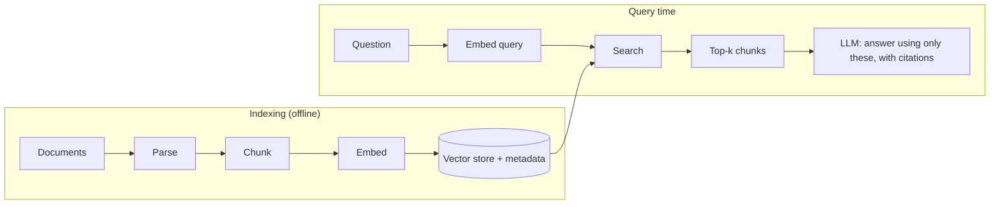

# Week 3: Embeddings, Vector Search & RAG

**Phase 2: Retrieval** · ~2.5–3 hours/day · Prerequisites: Weeks 1–2

A model only knows its training data and your prompt. **Retrieval-Augmented Generation (RAG)** puts the *right* knowledge into the prompt at the moment of need: your docs, your database, yesterday's news. This week you build the full stack from the ground up: embeddings → vector search → chunking → generation with citations → hybrid search → query transformation. Then you ship a Q&A bot.

**The corpus is this course's own lessons.** It's real prose with headings, code and tables, it works offline, and you can judge every answer because you have just read the material.

## Learning goals
By Sunday you can:
- Explain what an embedding is and compute semantic similarity in plain numpy.
- Choose and operate a vector store (brute force, HNSW, Chroma, Qdrant, pgvector) and explain the trade-offs.
- Parse and **chunk** documents, and show with data how chunking changes retrieval.
- Build RAG that **cites sources** and says "I don't know" when the context doesn't contain the answer.
- Combine keyword (BM25) and vector search, and re-rank.
- Rewrite queries (multi-query, HyDE, decomposition) to rescue hard questions.
- Ship a documented Q&A bot with tests.



## Schedule
| Day | Lesson | Challenge | Needs |
|---|---|---|---|
| 1 | [Embeddings & similarity](day1_embeddings.md) | Semantic search in pure numpy, measured against a keyword baseline | Local model (no key) |
| 2 | [Vector databases](day2_vector-databases.md) | Same corpus in numpy / HNSW / Chroma / Qdrant / pgvector; compare filters and latency | Local; Docker for pgvector |
| 3 | [Ingestion & chunking](day3_ingestion-and-chunking.md) | Fixed vs recursive vs semantic chunking, scored on retrieval | Local |
| 4 | [End-to-end RAG with citations](day4_rag-with-citations.md) | Answers cite `[source]` and refuse when unsupported | `--offline` or key |
| 5 | [Hybrid search & re-ranking](day5_hybrid-search-and-reranking.md) | BM25 + vectors + RRF + reranker, with wins shown per query | Local |
| 6 | [Query transformation](day6_query-transformation.md) | Multi-query, HyDE, decomposition: compare recall on hard queries | `--offline` or key |
| 7 | [Weekly challenge](day7_weekly-challenge.md) | **Docs Q&A bot** | `--offline` or key |

## Setup
```bash
uv sync --extra local --extra rag    # torch, transformers, chromadb, qdrant-client, hnswlib, rank-bm25, psycopg, pgvector
```
The first run downloads `BAAI/bge-small-en-v1.5` (~130 MB) from Hugging Face. Embeddings are cached in `outputs/embed_cache.sqlite`, so re-running lessons is instant. Prefer OpenAI embeddings? `EMBED_PROVIDER=openai`. No model download at all? `EMBED_PROVIDER=hash` (instant, **not semantic**, for plumbing tests only).

## What has been verified
| Item | How |
|---|---|
| Day 1 | Real run: bge-small embeddings over 808 sentences; every number in the lesson is from that run (including that BM25 beat embeddings at hit@1) |
| Day 2 | Real run against numpy, hnswlib, Chroma, Qdrant **and a live pgvector container**; 26 contract tests over all five stores; the selective-filter failure of hnswlib was reproduced and pinned by a test |
| Day 3 | Real run; 12 property tests for the chunkers (found: headingless documents were silently dropped) |
| Day 4 | Real retrieval, scripted extractive reader; 9 tests (found: `>` in prompt attributes broke source parsing) |
| Day 5 | Real run with a 278M-parameter cross-encoder; 7 tests for fusion maths |
| Day 6 | Real run with a local Qwen2.5-0.5B rewriter (cached generations); 16 tests. **Hosted-model results not run by the author** |
| Day 7 | `common/rag.py` (13 tests, mutation-checked; found: embedder name without dimension) + `docs_qa` (8 tests, golden set guarded against lesson edits) |

Anything involving a *hosted* LLM (answer quality, rewriting quality) was not run by the author (no API keys); the retrieval half of every lesson is real.

> **Memory note:** the local models (embedder 130 MB, reranker 1.1 GB, Qwen 1 GB) plus Docker for pgvector can strain an 8 GB laptop. If runs stall, stop the pgvector container (`docker compose ... down`) while running the model-heavy days.
