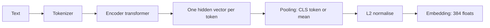

# Week 3, Day 1: Embeddings & Similarity: Meaning as Geometry

**Time:** ~2.5h · **Needs:** nothing but the local embedding model (downloaded on first run)

## Learning objectives
- Explain what an embedding is, how a text encoder produces one, and why we normalise.
- Compute cosine similarity / dot product and do **k-nearest-neighbour search in pure numpy**.
- Know the asymmetry between **query** and **document** embeddings (and the instruction prefix some models need).
- Measure retrieval honestly (hit@k, MRR) against a baseline, and read the results without hype.
- Name what embeddings *can't* do (negation, facts, exact identifiers).

---

## 1. What an embedding is

An **embedding** is a vector (a list of numbers) that represents a piece of text so that **texts with similar meaning land near each other**. It's a learned coordinate system for meaning.



- The **encoder** is a transformer like the ones from Week 1, but trained to make related texts similar (contrastive learning on pairs: question/answer, paraphrase, title/body) instead of predicting the next token.
- **Pooling** collapses one vector per token into one vector per text. `bge` uses the `[CLS]` token; others use the mean.
- **Normalising** to length 1 means **dot product = cosine similarity**, so search is one matrix multiplication.

```python
from common.embed import get_embedder  # local BAAI/bge-small-en-v1.5, 384 dims

emb = get_embedder()
D = emb.embed_documents(sentences)  # shape (n, 384), each row has norm 1.0
q = emb.embed_query("why can't a model count letters?")
scores = D @ q  # cosine similarity against every document at once
top = np.argsort(-scores)[:5]
```

That's the entire search engine. Everything in the next days (vector databases, HNSW, Chroma) is about making this scale past millions of rows and adding filtering.

## 2. Similarity measures

| Measure | Formula | Use |
|---|---|---|
| **Cosine** | `a·b / (‖a‖‖b‖)` | The default; ignores vector length |
| **Dot product** | `a·b` | Same as cosine when vectors are normalised; fastest |
| **Euclidean (L2)** | `‖a−b‖` | Equivalent ranking to cosine for normalised vectors |

Use whatever the model was trained with (almost always cosine/dot). Verified in today's run: a stored vector's norm is `1.0000` and `dot == cosine` (`0.6036` both ways).

## 3. Practical facts you need

- **Dimensions:** 384 (small local models) to 3,072 (large API models). Memory = `n × d × 4 bytes`. **808 sentences × 384 dims = 1.2 MB**; 10M chunks × 1,536 dims = 61 GB, and that's when you need a real vector DB.
- **Speed:** brute-force search over 808 vectors took **0.02 ms**; embedding a query takes ~10 ms on CPU. Brute force is fine up to ~100k–1M vectors. ANN indexes (Day 2) matter beyond that.
- **Query ≠ document.** Retrieval models are trained on *(short question, long passage)* pairs. Many need an **instruction prefix on the query** (bge: `"Represent this sentence for searching relevant passages: "`) and **none on documents**. Forgetting it quietly costs accuracy (below).
- **Max input length** (512 tokens for bge-small): longer text is truncated *silently*. This is why we chunk (Day 3).
- **Same model for both sides.** Never compare vectors from different models; changing the model means re-embedding everything.
- **Cost:** local = free; OpenAI `text-embedding-3-small` = $0.02 per million tokens (embedding 1M tokens of docs costs two cents). Embedding is cheap; *LLM generation* is the expensive part of RAG.
- **Choosing a model:** start from the **MTEB** leaderboard, then **test on your own queries**. Leaderboards average over tasks that aren't yours.

## 4. Measuring retrieval honestly

We'll grade *retrieval* separately from generation. For each query we know which lesson(s) answer it. **Hit@k** = did the right lesson appear in the top k results? **MRR** = mean of `1/rank` of the first right result.

Real results from today's solution: 808 sentences from the Week 1–2 lessons, 15 deliberately **paraphrased** queries (e.g. *"how do I stop my app from hammering an API that keeps failing"* → the retry/backoff lesson):

| Retriever | hit@1 | hit@5 | MRR |
|---|---|---|---|
| Keyword baseline (TF-IDF word overlap) | **60%** | 80% | **0.69** |
| Semantic (bge-small, numpy) | 47% | **87%** | 0.63 |
| Semantic, query **without** the bge prefix | 40% | 87% | 0.60 |
| Semantic, `title + sentence` | 47% | 80% | 0.64 |

Read this carefully, because it is the most important lesson of the week:

1. **Embeddings are not magic.** On this small, jargon-heavy corpus a 20-line keyword baseline beats them at hit@1. They win at hit@5 (they bridge vocabulary: "hammering an API" ↔ "retry"), the keyword method wins when the exact term is present. **They fail differently, which is why hybrid search (Day 5) works.**
2. **Single sentences are poor retrieval units.** The top hit for the retry query was *"An API error counts as a wrong answer but is reported."*, topically near but useless. Chunk design (Day 3) matters more than the model.
3. **The prefix matters** (47% → 40% hit@1 without it): small, silent, easy to forget.
4. **A title prefix did not help.** Not every plausible trick works; **measure before adopting.**
5. 15 queries is a tiny eval. Differences of one or two queries aren't significant; we make the eval set serious in Week 4.

## 5. What embeddings cannot do

Real similarities from the solution:

| Pair | Cosine |
|---|---|
| "The service is available." vs "The service is **not** available." | **0.81** |
| "Revenue rose 20 percent." vs "Revenue **fell** 20 percent." | **0.86** |
| "The service is available." vs "The weather is lovely today." | 0.65 |

- **Similarity ≠ truth, and ≠ relevance.** Opposites look nearly identical: embeddings encode *topic* strongly and *polarity* weakly. Never use them to decide whether two claims agree (use an LLM or NLI model for that).
- **Everything is somewhat similar** (the unrelated pair scores 0.65), so there's no universal threshold. Calibrate a cut-off per model and corpus (Day 4 uses one to say "I don't know").
- **Exact strings:** order IDs, error codes, function names and numbers are poorly captured. Use keyword search for these (Day 5).
- **Domain shift:** a general model may do poorly on legal/medical jargon or your internal acronyms; evaluate, then consider a domain model or fine-tuning (Week 10).
- **Multilingual:** use a multilingual model if your queries and documents differ in language.

## Pitfalls & production notes
- **Never mix embedding models** in one index; store the model name and version alongside the vectors.
- **Normalise** (or confirm the model does) before using dot product.
- **Cache embeddings** (we use SQLite keyed by model + text hash); re-embedding unchanged documents is pure waste.
- **Batch** your embedding calls (hundreds per request for APIs; 32–128 per forward pass locally).
- **Re-embedding is a migration:** plan for it (keep the raw text), because you'll change models.

---

## Daily Challenge: Semantic Search in Pure Numpy

Build semantic search over **≥ 500 sentences** and measure it against a baseline.

**Requirements**
1. Build a corpus of ≥ 500 prose sentences from the Week 1–2 lessons (`common.corpus.split_sentences`), keeping each sentence's source lesson.
2. Embed all sentences (matrix `n × d`). **Implement top-k search yourself** with `@` and `argsort`/`argpartition`; no vector DB, no `sklearn`.
3. Write a **keyword baseline** (TF-IDF-weighted word overlap, or BM25) *without* an NLP library.
4. Write ≥ 12 **paraphrased** queries with the lesson(s) that answer them, and report **hit@1, hit@5, MRR** for both retrievers.
5. Run **two ablations**: (a) query without the model's instruction prefix; (b) any one idea of your own (title prefix, lower-casing, longer units...).
6. Print the top-3 for one query; and print cosine for the three "similarity is not truth" pairs above.

**Acceptance criteria**
- Stored vectors have norm 1 ± 1e-4, and you demonstrate `dot == cosine`.
- Both retrievers' numbers are in a table, with your honest reading of it (which won, where, and why).
- You can say which queries failed for each method and *why* (vocabulary mismatch? sentence too short? wrong lesson?).
- Everything is computed. No hard-coded results.

**Stretch**
- Try a second embedding model (a larger one, or `EMBED_PROVIDER=openai`). Does it change the ranking of retrievers?
- **Matryoshka truncation:** keep only the first 128 of the dimensions (and re-normalise), and measure the accuracy drop vs. memory saved.
- **Quantise** the vectors to int8 and measure the effect.
- Plot a 2-D projection (PCA/UMAP) of the embeddings coloured by lesson.
- Add a **score threshold** and chart precision vs. recall as you move it.

**Solution:** [solutions/day1_solution.py](solutions/day1_solution.py). The numbers above come from a real run.

## Further reading
- Reimers & Gurevych, *Sentence-BERT*; Muennighoff et al., *MTEB: Massive Text Embedding Benchmark*.
- BAAI `bge` model cards (query instructions, pooling).
- Kusupati et al., *Matryoshka Representation Learning*.
