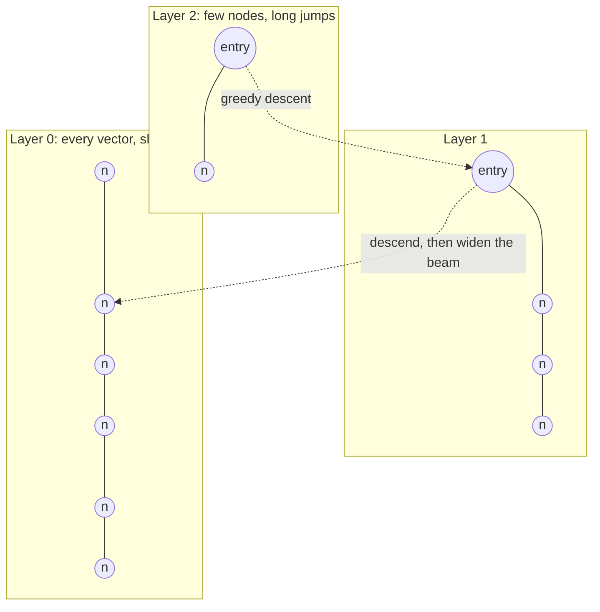
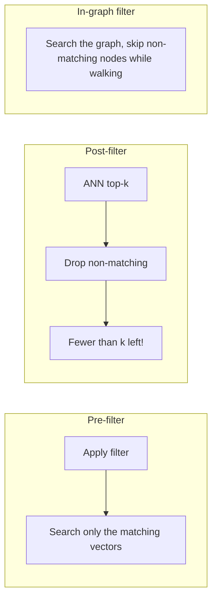
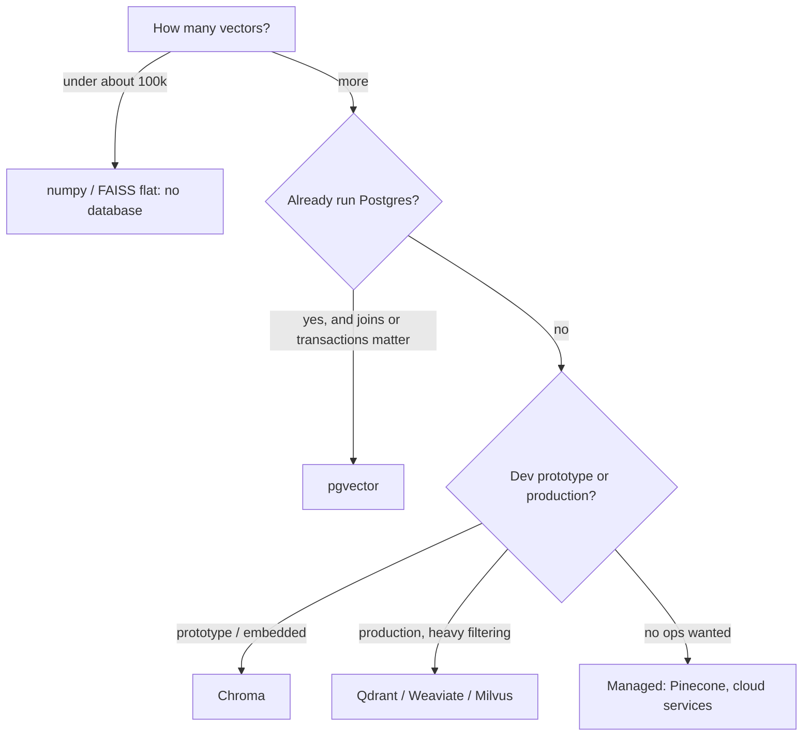

# Week 3, Day 2: Vector Databases: Approximate Search, Filters & Trade-offs

**Time:** ~3h · **Needs:** local embedding model; Docker for the pgvector part (optional)

## Learning objectives
- Explain why brute-force search stops scaling, and how **HNSW** gets sub-linear search.
- Tune the HNSW knobs (`M`, `ef_construction`, `ef_search`) and read a recall/latency trade-off.
- Combine vector search with **metadata filters**, and know the failure mode of filtered ANN.
- Operate five stores behind one interface (numpy, hnswlib, Chroma, Qdrant, pgvector) and choose between them.

---

## 1. What a vector database adds to numpy

Day 1's search was one matrix multiplication, which is exact and perfectly fine up to ~100k–1M vectors. A vector database adds:

| Capability | Why you need it |
|---|---|
| **Approximate nearest-neighbour (ANN) index** | Sub-linear search over millions/billions of vectors |
| **Metadata filtering** | "only docs from week 2", "only this tenant's files", "newer than March" |
| **Persistence, CRUD, concurrency** | Update and delete documents; survive restarts; serve many users |
| **Hybrid / sparse support** (some) | Keyword + vector in one query (Day 5) |
| **Operations** | Replication, backups, quantisation, multi-tenancy |

## 2. HNSW in one picture

**Hierarchical Navigable Small World** graphs are the dominant ANN index (used by Chroma, Qdrant, pgvector, Weaviate, Lucene...). Each vector is a node linked to a few near neighbours; upper layers are sparse "express lanes".



**Search:** enter at the top, greedily hop toward the query, drop a layer, repeat; at layer 0 keep a beam of `ef` candidates and return the best `k`.

| Knob | Controls | Bigger means |
|---|---|---|
| `M` | links per node | better recall, more memory, slower build |
| `ef_construction` | beam width while **building** | better graph, slower build |
| `ef_search` (`ef`) | beam width while **querying** | better recall, slower queries. The knob you tune at runtime |

**It is approximate**: you trade a little recall for a lot of speed. You must **measure recall against exact search on your own data**.

### Real measurements (today's solution)
**On the 808-sentence corpus** every store returned 100% of the exact top-10, and all are fast:

| Store | Build | Per query | recall@10 |
|---|---|---|---|
| numpy (exact) | 0.1 ms | 0.02 ms | 100% |
| hnswlib | 61 ms | 0.23 ms | 100% |
| Chroma | 190 ms | 0.82 ms | 100% |
| Qdrant (in-memory) | 124 ms | 0.56 ms | 100% |
| pgvector (HNSW, Docker) | 244 ms | 0.59 ms | 100% |

At this size **numpy wins**: an index adds build time and overhead and gains nothing. Don't reach for a database before you need one.

**At 50,000 vectors × 384 dims** (so the index starts to matter), with two kinds of data:

| Data | Index | Build | Per query | recall@10 |
|---|---|---|---|---|
| clustered (realistic) | exact numpy | 0 | 1.63 ms | 100% |
| clustered | HNSW `ef=16` | 6.6 s | **0.16 ms** | 95% |
| clustered | HNSW `ef=64` | 6.6 s | 0.29 ms | **100%** |
| uniform random (worst case) | exact numpy | 0 | 1.62 ms | 100% |
| uniform random | HNSW `ef=16` | 23 s | 0.33 ms | **5%** |
| uniform random | HNSW `ef=256` | 23 s | 3.13 ms | 37% |

Two lessons: (1) on structured data HNSW is ~6–10× faster at ≥ 95% recall (and the gap grows with size); (2) **ANN depends on structure in the data**. On structureless random vectors in high dimensions nearly every point is equally far away and recall collapses no matter the knob. Real text embeddings cluster, so they behave like the clustered case; but *test on your own vectors* instead of trusting defaults.

## 3. Metadata filtering: where ANN gets tricky

Filters are essential in real systems (tenant isolation, permissions, dates, doc types). There are three strategies:



- **Pre-filter** (exact scan of matching rows): always correct and returns k results, but slow if many rows match.
- **Post-filter** (search, then discard): fast, but a **selective** filter can leave you with far fewer than `k` results, or none, even though matches exist.
- **In-graph / filterable HNSW** (Qdrant, Chroma, hnswlib's `filter=`, pgvector with iterative scans): filter during traversal; the right default, but a very selective filter can still make the graph hard to navigate. Qdrant switches strategy automatically; hnswlib may raise ("cannot return k results") when the filter is too selective, which our adapter handles by degrading `k`. (Verified: a filter matching 5 of 2,000 rows with `k=10` makes raw hnswlib raise `RuntimeError: Cannot return the results in a contiguous 2D array`; the adapter returns the 5 that exist, and a regression test pins this.)

Today's check (query about structured output, top-10): `week == 2` (400 matching rows), one lesson only (62 rows) and a nonexistent lesson (0 rows) returned exactly `10 / 10 / 0` results from **every** store, all satisfying the filter. Always test **selective filters** on your real data: they are where stores differ.

Rules of thumb:
- Make the **filter fields part of the schema** from day one (tenant, source, date, doc type, language).
- Filter for **security** (per-user access) *inside the database query*, never after retrieval in app code. A post-filtered leak is one bug away.

## 4. Choosing a store



| Store | Strengths | Watch out for |
|---|---|---|
| **numpy / FAISS flat** | Exact, trivial, no infra | Linear in corpus size |
| **hnswlib / FAISS HNSW/IVF** | Fast library, you own everything | No persistence/filters/CRUD built in |
| **Chroma** | Easiest start, embedded or server | Younger; check scale/ops limits for production |
| **Qdrant** | Rich payload filtering, quantisation, great docs | One more service to run |
| **pgvector** | One database for rows *and* vectors; SQL joins, transactions, backups you already have | You tune Postgres; very large scale needs care |
| **Managed (Pinecone etc.)** | No ops | Cost, lock-in, data leaves your network |

```sql
-- pgvector in one screen (what PgvectorStore does)
CREATE EXTENSION vector;
CREATE TABLE chunks (id text PRIMARY KEY, text text, metadata jsonb, embedding vector(384));
CREATE INDEX ON chunks USING hnsw (embedding vector_cosine_ops);        -- build AFTER bulk load
SELECT id, text, 1 - (embedding <=> $1) AS score                         -- <=> is cosine distance
FROM chunks WHERE metadata->>'week' = '2'
ORDER BY embedding <=> $1 LIMIT 10;
```

## 5. Operating a vector store
- **Memory:** HNSW wants the graph + vectors in RAM. 10M × 1,536 dims × 4 bytes ≈ 61 GB before the graph. Mitigate with **quantisation** (int8, binary, product quantisation) and lower dimensions (Matryoshka).
- **Updates and deletes:** HNSW handles inserts well, deletes via tombstones; heavy churn needs periodic rebuilds.
- **Versioning:** store the **embedding model + version** with every vector; changing models means re-indexing into a *new* collection and switching over.
- **Idempotent ingestion:** use stable chunk IDs (hash of source + position) so re-running an import doesn't duplicate.
- **Evaluate recall** of the ANN vs exact on a sample whenever you change the index parameters or data.

---

## Daily Challenge: Same Corpus, Five Stores

Use the 808-sentence corpus from Day 1 (with metadata `lesson` and `week`).

**Requirements**
1. A common interface (`add`, `search(query, k, where)`, `count`, `close`) and **adapters** for numpy, hnswlib, Chroma, Qdrant and pgvector (skip pgvector gracefully if Postgres isn't running).
2. **Contract tests**: every adapter passes the *same* tests: exact self-match, cosine-valued scores, top-1 agreement with numpy on random queries, equality filters (single and AND-ed), `k` larger than the corpus, nonexistent filter → `[]`, and filtered recall ≥ 0.9 against exact numpy.
3. A comparison table: build time, per-query latency, **recall@10 vs exact** on your 15 queries.
4. A **filter experiment** with a broad, a very selective, and an empty filter. Report result counts per store and verify every result satisfies the filter.
5. A **scale experiment**: ≥ 50k synthetic vectors, uniform vs clustered, HNSW at three `ef` values: recall and latency vs exact.

**Acceptance criteria**
- All adapters pass the contract tests (25 tests: 5 contracts × 5 stores).
- Your report states, in two sentences, when you would pick numpy, Chroma, Qdrant and pgvector, based on *your measurements*.
- You can explain why recall collapsed on uniform data and held on clustered data.

**Stretch**
- Add **FAISS** (`IndexFlatIP`, `IndexHNSWFlat`, `IndexIVFFlat`) as a sixth adapter.
- Persist and reload an index (Chroma `PersistentClient`, Qdrant on disk, Postgres restart). Verify results are unchanged.
- **Quantise to int8 / binary** and measure memory saved vs recall lost.
- Reproduce the post-filter failure: build a post-filtering wrapper over numpy ANN and show it returning `< k` results for the selective filter.

**Solutions:** [solutions/day2_solution.py](solutions/day2_solution.py), the adapters in [`common/vectorstores.py`](../../common/vectorstores.py), and the contract tests in [`tests/test_vectorstores.py`](../../tests/test_vectorstores.py). pgvector: `docker compose -f weeks/week03_embeddings-and-rag/docker-compose.yml up -d`.

## Further reading
- Malkov & Yashunin, *Efficient and robust approximate nearest neighbor search using HNSW graphs*.
- Qdrant docs: filtering and payload indexes. pgvector README (HNSW, iterative scans, quantisation).
- ann-benchmarks.com: recall/latency curves across libraries.
