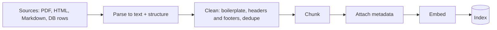
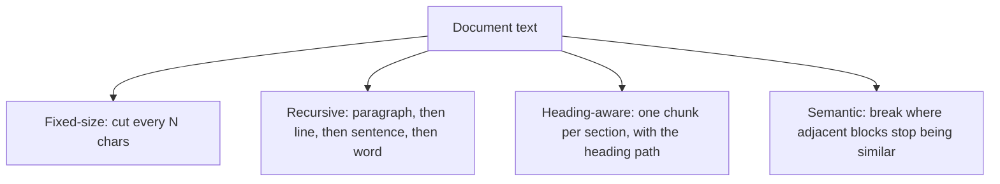

# Week 3, Day 3: Ingestion & Chunking: Garbage In, Garbage Retrieved

**Time:** ~3h · **Needs:** local embedding model

## Learning objectives
- Build a robust **ingestion** path: parse → clean → chunk → attach metadata → embed → index.
- Implement and compare **fixed, recursive, heading-aware and semantic** chunkers from scratch.
- Choose chunk size and overlap by the trade-offs, then **measure** with size-fair metrics.
- Avoid the classic evaluation trap where bigger chunks look better.

---

## 1. Ingestion is most of the work

Most "the RAG is bad" problems are *ingestion* problems: the answer was never in the index in a usable form.

**Parsing**
- **Markdown/HTML:** keep headings, lists, code fences; strip nav bars, cookie banners, footers (e.g. `trafilatura`, BeautifulSoup).
- **PDF:** extract **page by page** (`pypdf`, `pdfplumber`, PyMuPDF) so chunks carry a page number. Watch for multi-column layouts, tables, repeated headers/footers on every page, hyphenation, and scanned pages with *no text layer* (those need OCR or a vision model: Week 4).
- **Tables and figures** are the hardest. Flattened to text, a table loses its meaning; convert to Markdown/CSV or summarise it separately.
- Always **inspect parsed output by eye** on a sample. Silent parser failures (empty pages, jumbled columns) are common.

**Metadata** (you'll filter, cite and debug with it): `source` (path/URL), `page`, `section path`, `doc type`, `language`, `last_modified`, `version`, **access control** (who may see it) and a **stable chunk ID** (hash of source + position) so re-ingestion is idempotent.

## 2. Why chunk at all?

- **The embedder has a limit** (bge-small: 512 tokens ≈ 2,000 characters). Longer text is *silently truncated*.
- **One vector per chunk** is an average of its content. A chunk about five topics matches none of them well.
- **The LLM's context is finite and costly.** You only want to pay to read relevant text.
- **Citations** need a small, precise unit to point at.

## 3. The core trade-off

| | Small chunks (100–300 tokens) | Large chunks (800+ tokens) |
|---|---|---|
| Embedding | Focused, precise | Diluted (averages many topics) |
| Context | The answer's *surroundings* are cut off | Lots of context, much of it irrelevant |
| Cost | More vectors; cheap per answer | Fewer vectors; expensive per answer |
| Typical failure | "The fix is to restart it." (restart *what*?) | The right paragraph buried in noise |

Common starting points: **200–500 tokens with 10–20% overlap**, then tune on *your* data. **Overlap** guards against cutting an answer at a boundary at the price of extra chunks.

## 4. Strategies (all implemented in today's solution)

| Strategy | How | Pros | Cons |
|---|---|---|---|
| **Fixed-size** | Every N characters/tokens, optional overlap | Trivial, predictable | Cuts mid-sentence, mid-code-block |
| **Recursive** | Split on `"\n\n"`, then `"\n"`, then `". "`, then `" "`; repack neighbours up to N | Respects natural boundaries; the usual default | Still structure-blind |
| **Structure-aware** | Split on headings/sections (Markdown, HTML, code functions); **prefix the heading path** into the chunk | Chunks match how authors organised ideas; headings give context | Needs structured sources; uneven sizes |
| **Semantic** | Embed blocks; start a new chunk where neighbouring similarity drops below a threshold | Chunks follow topic shifts | Costs embeddings at ingest; threshold needs tuning; not always better |
| **Parent-child** | Embed **small** chunks, but return their larger **parent** to the LLM | Precision of small + context of large | More plumbing (Week 4) |

## 5. Measuring chunkers (and a trap)

Chunkers produce different chunks, so you can't label chunks as right or wrong in advance. Use **chunker-independent ground truth**: each query has a *lesson* and a *key phrase* that answers it, and a retrieval counts when a returned chunk is from that lesson **and contains the phrase**.

**The trap:** `hit@5` rewards large chunks, since a 3,000-character chunk "contains" almost everything, while handing the LLM 12 KB of context. So we add two size-fair measures: **complete** (the paragraph around the answer lives in *one* chunk) and **hit@2k** (answer found within a fixed 2,000-character context budget).

Real results (14 lessons, 122k chars, 15 queries):

| Chunker | Chunks | Mean chars | complete | hit@1 | hit@5 | **hit@2k** | MRR | ctx of top-5 |
|---|---|---|---|---|---|---|---|---|
| fixed 800, overlap 0 | 159 | 768 | **40%** | 27% | 53% | 33% | 0.39 | 3,922 |
| fixed 800, overlap 150 | 196 | 761 | 47% | 20% | 60% | 33% | 0.35 | 3,877 |
| recursive 800, overlap 100 | 202 | 618 | 80% | 13% | 33% | 13% | 0.23 | 3,276 |
| headings + path prefix | 159 | 859 | **93%** | 20% | 67% | 27% | 0.37 | 4,864 |
| headings, no prefix | 159 | 769 | 93% | 20% | 53% | 20% | 0.34 | 4,285 |
| semantic (p30, max 1200) | 221 | 551 | 93% | 20% | 47% | 20% | 0.30 | 3,988 |

Chunk-size sweep (recursive, overlap 12%):

| Size | Chunks | complete | hit@5 | **hit@2k** | ctx of top-5 |
|---|---|---|---|---|---|
| 200 | 822 | 7% | 20% | 20% | 762 |
| 400 | 421 | 40% | 27% | 27% | 1,562 |
| 800 | 202 | 80% | 33% | 13% | 3,276 |
| 1600 | 96 | 100% | 60% | 13% | 6,455 |
| 3200 | 51 | 100% | **87%** | 27% | **12,074** |

How to read this honestly:
1. **Structure matters for not breaking answers.** Heading-aware and semantic chunkers keep the answer's paragraph whole **93%** of the time; naive fixed cuts do so only **40%**. That is the clearest signal in the table.
2. **hit@5 is misleading.** The 3,200-char setting reaches 87% hit@5 but only 27% under a 2k budget, because it pays 12 KB of context to get there. *Always compare retrievers at equal context cost.*
3. **Past ~2,000 characters the embedder silently truncates** the chunk, so big chunks are partly invisible to search. Another reason not to go huge.
4. **Differences in hit@1/hit@2k (13–33%) are within noise.** With 15 queries, one query is 6.7 points. Do **not** conclude "fixed beats recursive" from this. The real lesson is *how* to measure; Week 4 builds a bigger eval.
5. A heading-path prefix helped a little at hit@5 (53% → 67%) with the same chunks: free context, worth trying.
6. Absolute scores are modest: single-vector retrieval on paraphrased queries over a small, jargon-heavy corpus is hard. Day 5 (hybrid + re-ranking) and Day 6 (query rewriting) are the fixes.

## Pitfalls & production notes
- **Chunk for both consumers:** the embedder (needs focus) *and* the LLM (needs enough context to answer). Parent-child retrieval serves both.
- **Never split code blocks, tables or lists** if you can avoid it. They're meaningless in pieces.
- **Deduplicate** near-identical chunks (boilerplate, repeated headers) or they crowd out useful results.
- **Re-ingest idempotently** (stable IDs); handle deletions (a removed document must disappear from the index).
- **Tune on your eval**, not on a blog's "best chunk size". There isn't one.
- **Store raw text and source offsets** so you can re-chunk later without re-parsing.

---

## Daily Challenge: The Chunker Bake-off

Implement chunkers from scratch and compare them with size-fair metrics.

**Requirements**
1. `fixed(text, size, overlap)`, `recursive(text, size, overlap)` (separator hierarchy, then repack), `by_headings(text, size)` (Markdown sections, heading path prefix, merge tiny/split huge) and `semantic(text, embedder)` (break on similarity drops, with a max-size cap).
2. Ingest the Week 1–2 lessons with each chunker; keep `doc` and heading path as metadata.
3. A gold set of ≥ 12 queries, each with a **lesson and a key phrase**; assert every phrase exists in its lesson (bad gold = invalid experiment).
4. Report per chunker: chunk count, mean size, **complete**, hit@1, hit@5, **hit@(2,000-char budget)**, MRR, and average context size of the top-5.
5. A **chunk-size sweep** (e.g. 200 → 3,200) for one strategy.
6. A **PDF parsing demo** extracting text page by page with page numbers as metadata.

**Acceptance criteria**
- All chunkers return only non-empty chunks, none far over the size cap (except unavoidable single blocks), and re-running produces identical chunks (deterministic).
- Your write-up answers: which chunker keeps answers whole; which looks best at hit@5 but not at fixed budget, and why; and whether your differences exceed the noise of your eval size.

**Stretch**
- **Parent-child:** index 300-char child chunks, return the 1,500-char parent; compare answer completeness and context cost.
- Add **contextual prefixes** to chunks via an LLM (one sentence situating the chunk in its document). Compare hit@2k (Week 4 does this properly).
- Chunk **code** by function using `ast`, and **tables** as Markdown rows.
- Write a **near-duplicate detector** (cosine > 0.95) and show how many chunks it removes.
- Sweep overlap (0/10/20/30%) and plot completeness vs. index size.

**Solution:** [solutions/day3_solution.py](solutions/day3_solution.py). All numbers above are from a real run.

## Further reading
- Greg Kamradt, *5 Levels of Text Splitting* (the strategies above, visually).
- LangChain/LlamaIndex docs: text splitters and node parsers (to compare with your own).
- Anthropic, *Introducing Contextual Retrieval* (previewed in Week 4).
