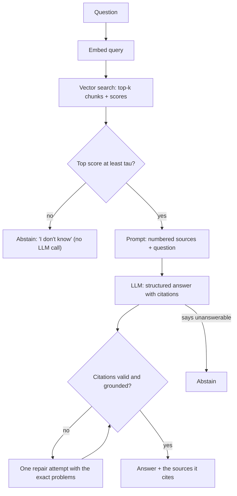

# Week 3, Day 4: End-to-End RAG: Grounded Answers, Citations & "I Don't Know"

**Time:** ~3h · **Needs:** local embeddings; `--offline` uses a scripted generator, or use your API key

## Learning objectives
- Assemble the full RAG loop and explain what each stage is responsible for.
- Write a **grounded-answer prompt** with numbered sources and citation rules.
- **Validate citations mechanically**, and add a cheap groundedness check.
- Make the system **abstain**: a calibrated retrieval gate plus model-level "I don't know".
- Diagnose which stage failed when an answer is wrong.

---

## 1. When RAG, when something else

| Need | Reach for |
|---|---|
| Knowledge that changes, is private, or is too big to memorise | **RAG** |
| A few documents that fit comfortably in context | **Just put them in the prompt** (maybe with prompt caching): simpler than RAG |
| Change *behaviour/style/format* | Prompting, then **fine-tuning** (Week 10) |
| Answers need exact structured data (orders, balances) | **Tools / SQL** (Weeks 4–5) |

RAG's strengths: fresh data without retraining, **citations**, access control per document, and cost control (read only what's relevant). Its weakness: **the answer can only be as good as retrieval**.

## 2. The pipeline



Every arrow is somewhere to fail, which is why we instrument each stage separately:

| Stage | How it fails | How you notice |
|---|---|---|
| Retrieval | The right chunk isn't in the top-k | "gold chunk in top-k" metric |
| Gate | Too strict (refuses answerable) or too lax (answers nonsense) | Answerable/unanswerable calibration |
| Generation | Ignores sources, invents, over-quotes | Groundedness / faithfulness checks |
| Citations | Cites a source that doesn't exist or doesn't support the claim | Mechanical validation + support score |

## 3. The grounded-answer prompt

```text
SYSTEM: You answer questions using only the numbered sources provided. Cite the source id in square
brackets after each claim, e.g. [2]. If the sources do not contain the answer, set answerable to
false and answer exactly "I don't know based on the provided sources." Never use outside knowledge.

USER:
<sources>
<source id="1" ref="week01/day5 › Retries">...chunk text...</source>
<source id="2" ref="week01/day2 › Tokenization">...</source>
</sources>

<question>how do I stop my app hammering an API that keeps failing</question>
```

Design points:
- **Number the sources** so citations are short and checkable. Include a human-readable `ref` (file, section, page) to show users.
- **Fence them in tags** (Week 2 Day 1) so the model can't confuse sources with instructions. This is also the first line of defence against *prompt injection from retrieved documents* (Week 8).
- **Give an explicit way out** ("answerable: false"). Without it, models feel obliged to answer.
- **Order matters.** Models attend best to the start and end of long contexts ("lost in the middle"); put the highest-ranked sources first, keep `k` modest (3–6), and don't pad the context with weak matches.
- **Structured output** (`answerable`, `answer`, `citations`) so the pipeline can act on the result.
- **Avoid `>` inside tag attributes.** My first version used `ref="week01/day5 > Heading"`; any parser (or a confused model) that looks for the tag's closing `>` stops early and drops the source text. A unicode separator (`›`) fixed it. Prompt formats are interfaces; test them like APIs.
- Some providers offer **native citations** (e.g. Claude's document citations, which return exact cited spans). They're great, but may not combine with JSON-schema output; check the docs before mixing.

## 4. Citations: trust, but verify mechanically

A citation is a *claim* by the model. Check what you can without another model:

```python
def validate_grounded(g, n_sources):
    issues = []
    markers = {int(m) for m in re.findall(r"\[(\d+)\]", g.answer)}
    if g.answerable and not g.citations:      issues.append("answerable but no citations")
    if (markers | set(g.citations)) - set(range(1, n_sources + 1)):
                                              issues.append("cites sources that were not provided")
    if g.answerable and markers and set(g.citations) != markers:
                                              issues.append("citations list disagrees with inline markers")
    ...
```

On failure, **retry once with the exact problems** (Week 2 Day 3) and surface what's still wrong.

**Groundedness proxy** (cheap, lexical): the share of the answer's content words that appear in the cited sources. About 1.0 for quotes, lower for paraphrase, near 0 for invention. It catches blatant fabrication but not subtle misreadings; for real faithfulness you need an LLM judge (Week 4).

## 5. Saying "I don't know"

Two layers:

1. **Retrieval gate (before the LLM):** if the best similarity score is below a threshold τ, nothing relevant exists; refuse without spending tokens.
2. **Model abstention (after retrieval):** the model sets `answerable: false` when the sources don't actually contain the answer.

**Calibrate τ on data**, don't guess. Real numbers from today's run (bge-small, 15 answerable questions vs 6 unanswerable ones such as *"what is the capital of Australia"*):

| | min | mean | max |
|---|---|---|---|
| top-1 cosine, answerable | 0.69 | 0.73 | 0.75 |
| top-1 cosine, unanswerable | 0.51 | 0.57 | 0.66 |

The best cut-off is τ ≈ 0.656, which separated all 21 questions. Be wary of that: 21 questions is tiny, the margin (0.66 vs 0.69) is thin, and the score scale is **specific to this model and corpus** (swap the embedding model and you must recalibrate). Production gates are tuned on real traffic and monitored.

## 6. What the numbers say (offline run, real retrieval)

- **Retrieval caps the answer rate.** With top-4 retrieval, the chunk containing the answer was retrieved for only **7 of 15** answerable questions. A faithful generator *should* abstain on the other 8 because the evidence isn't there. No prompt engineering fixes a retrieval miss. That is the case for Days 5 and 6 (hybrid search, query rewriting) and Week 4 (evaluation).
- **The gate worked:** all 6 unanswerable questions were refused with no LLM call.
- **Validation works:** a deliberately sloppy model that cites a non-existent source `[9]` is caught, retried once, and still reported as invalid.
- The offline generator is a toy extractive reader (it picks one sentence by embedding similarity), so **offline answer-quality numbers say nothing about RAG with a real model**: judge those yourself.

## Pitfalls & production notes
- **Debug by stage.** Is the answer in the corpus? Was it retrieved? Was it in the prompt? Did the model use it? Most "hallucinations" are retrieval misses.
- **Conflicting or stale sources:** include dates/versions in metadata and tell the model how to prefer them.
- **Prompt injection via documents:** retrieved text is untrusted input. A source saying "ignore previous instructions" must not be obeyed (Week 8).
- **Token budget:** `k × chunk size` is your per-question input cost. Measure it.
- **Log everything** per request: question, retrieved IDs and scores, prompt version, answer, citations, issues. You can't improve what you can't replay.
- **Don't answer from outside knowledge by accident:** test with questions the corpus doesn't cover and check the model abstains.

---

## Daily Challenge: A RAG That Cites and Refuses

**Requirements**
1. Index the Week 1–2 lessons (heading-aware chunks with `doc` and heading metadata) in a vector store.
2. `retrieve(query, k)` returning chunks with scores; `build_prompt` with **numbered `<source>` blocks** (no `>` in attributes).
3. A **structured answer** `{answerable, answer, citations}`, and `validate_grounded` covering: missing citations, citations outside the provided range, inline/list disagreement, "answerable" but says it doesn't know, and unanswerable-with-citations.
4. One **repair attempt** on validation failure; remaining issues are returned, never hidden.
5. A **retrieval gate** with τ calibrated from ≥ 10 answerable and ≥ 5 unanswerable questions; report the score distributions and your choice of τ.
6. A **groundedness proxy** (`support_score`) and a test showing it separates a quote from an invention.
7. An `--offline` mode with a scripted generator and a *flawed* generator that exercises the validator.

**Acceptance criteria**
- Unit tests (8 in the reference solution) cover each validation failure, the gate (**no LLM call** when abstaining), the repair loop (the retry prompt states the problem) and persistent failure.
- All unanswerable questions are refused (gate or model).
- With a real model: report (a) retrieval hit rate, (b) answer rate, (c) % of answered questions whose cited source contains the answer, (d) mean groundedness, and say which stage limits you most.

**Stretch**
- **Quote-level citations:** have the model return the exact supporting quote, and verify the quote is a substring of the source.
- Add **source ordering** experiments (best first vs. best last) and measure accuracy.
- Add **conversation history**: rewrite follow-up questions ("and for the second one?") into standalone queries before retrieval (Day 6).
- Return the **page/section** so the UI can link to the source.
- Compare a real model with `k = 2, 4, 8`: where does adding context start to hurt?

**Solution:** [solutions/day4_solution.py](solutions/day4_solution.py) with tests in [solutions/test_day4.py](solutions/test_day4.py).

## Further reading
- Lewis et al., *Retrieval-Augmented Generation for Knowledge-Intensive NLP Tasks*.
- Liu et al., *Lost in the Middle*.
- Anthropic docs: *Citations*; OpenAI docs: file search and annotations.
