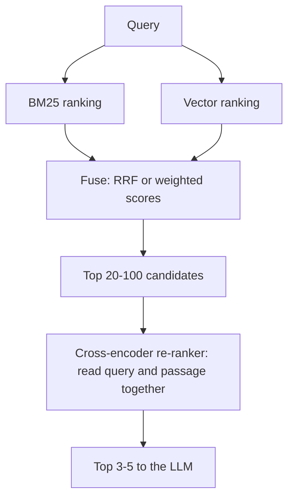
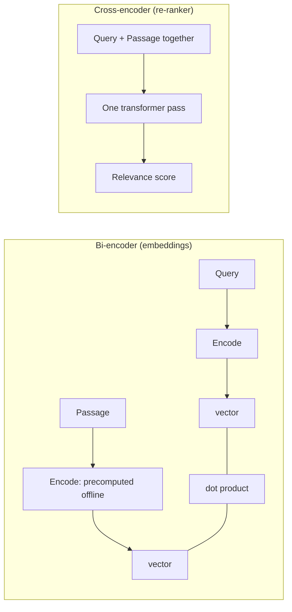

# Week 3, Day 5: Hybrid Search & Re-ranking

**Time:** ~3h · **Needs:** local models (embedder + reranker, ~1.4 GB total; first run takes a couple of minutes)

## Learning objectives
- Explain how **BM25** works and what it is good and bad at compared with embeddings.
- Implement **Reciprocal Rank Fusion (RRF)** and score-based fusion, and know when each is used.
- Explain **bi-encoder vs cross-encoder** and add a **re-ranking** stage.
- Evaluate retrievers on *different kinds of queries* and read per-query wins/losses instead of one average.

---

## 1. Two kinds of "similar"

| | **Lexical (BM25)** | **Semantic (embeddings)** |
|---|---|---|
| Matches | The *same words* | The *same meaning*, even in different words |
| Great at | Identifiers, error codes, names, rare terms, exact phrases (`model_validator`, `HTTP 429`, `o200k_base`) | Paraphrase, synonyms, natural-language questions, cross-language |
| Fails on | "How do I stop hammering a failing API?" when the doc says "exponential backoff with jitter" | Exact strings and numbers; rare tokens the model never learned |
| Cost | Cheap, no model, explainable | Embedding model + vector index |

**BM25** is TF-IDF with two corrections: term-frequency *saturation* (the 10th occurrence of a word adds much less than the 1st) and *length normalisation* (long documents don't win just by being long). In short: *rare query words that appear often in a short document score high.* It's the default ranker in Elasticsearch/Lucene/OpenSearch and a very strong baseline.

Real systems use **both**.

## 2. The hybrid pipeline



**Stage 1, recall:** cheap retrievers cast a wide net (top 50–100). **Stage 2, precision:** an expensive model re-orders a short list. Each stage does what it's best at.

## 3. Fusing two rankings

BM25 scores are unbounded (e.g. 0–30); cosines live in 0–1. You can't add them raw.

**Reciprocal Rank Fusion** sidesteps scales by using **ranks only**:

```
RRF(d) = Σ over rankers  1 / (k + rank_ranker(d))        (k ≈ 60 by convention)
```

A document ranked high by *both* lists beats one ranked #1 by only one. No tuning needed.

**Weighted score fusion**: min-max normalise each score list to 0–1, then `α·vector + (1-α)·bm25`. Uses score *magnitudes* (so a big margin matters) but needs `α` tuned and normalisation to behave.

```python
def rrf(rankings, k=60):
    score = defaultdict(float)
    for ranking in rankings:
        for rank, doc in enumerate(ranking, 1):
            score[doc] += 1.0 / (k + rank)
    return sorted(score, key=lambda d: -score[d])
```

## 4. Bi-encoder vs cross-encoder



- **Bi-encoder:** query and passage never see each other, so passage vectors are precomputed and search is a dot product. Fast and scalable, but coarse.
- **Cross-encoder:** reads query *and* passage jointly, so it can see that "stop hammering a failing API" is answered by "backoff with jitter". Much more accurate, but you can't precompute anything and cost is one forward pass **per candidate**. That's why you only re-rank a shortlist.
- Rerankers can be local (`BAAI/bge-reranker-*`, MiniLM cross-encoders) or hosted (Cohere Rerank, Voyage, Jina). Or use an **LLM as a reranker** (slower, pricier, sometimes best).

## 5. Real results: 29 queries, 159 chunks

Two kinds of queries: 15 **paraphrased** questions and 14 **exact-term** lookups (`model_validator`, `o200k_base`...).

| Method | paraphrased hit@1 / hit@5 / MRR | exact-term hit@1 / hit@5 / MRR | all-29 MRR |
|---|---|---|---|
| BM25 only | 33% / 47% / 0.42 | 86% / 100% / 0.93 | 0.66 |
| Vector only | 20% / **67%** / 0.37 | 50% / 93% / 0.67 | 0.52 |
| Hybrid, **RRF** (k=60) | 13% / 60% / 0.38 | 79% / 100% / 0.88 | 0.62 |
| Hybrid, **weighted** (α=0.5) | 33% / 60% / 0.46 | 93% / 100% / 0.96 | 0.71 |
| Hybrid + **re-rank** top-20 | **40%** / 47% / **0.50** | 93% / 100% / 0.96 | **0.72** |

Re-ranking cost: **~2.4 s per query** for 20 candidates on a laptop CPU (278M-parameter model).

What this teaches (and these are lessons you won't get from a blog post):

1. **The two retrievers fail differently.** Vector search found answers BM25 couldn't (*"what setting makes the output more random"*: BM25 rank 98, vector rank **1**), and BM25 found what vectors couldn't (`evict_batch`: BM25 rank **1**, vector rank **73**). That complementarity is why hybrid exists.
2. **Hybrid is not automatically better.** RRF with k=60 (MRR 0.62) did *not* beat plain BM25 (0.66). On this corpus BM25 is the stronger ranker, and RRF's equal-vote averaging dilutes it (exact-term MRR 0.93 → 0.88). Weighted fusion did better (0.71). **Always evaluate fusion on your data**; RRF is a robust default, not a guarantee.
3. **Tune the weight.** The alpha sweep: `α = 0` (BM25) 0.66 → 0.25: 0.67 → **0.5: 0.71** → 0.75: 0.65 → 1.0 (vector) 0.52. A peak in the middle; the right mix depends on your queries and models.
4. **Re-ranking helped most where it mattered**: hit@1 on paraphrased queries 33% → 40% and the "rerank helped" rows (retry storms: 13 → 3; GPU memory: 6 → 1). But it **can only re-order the candidates you give it**: hit@5 *fell* (60% → 47%) because some answers weren't in the top-20 and some correct chunks were pushed down. Retrieval depth is a knob (`rerank_depth` 20 → 50 trades latency for recall).
5. **Paraphrased queries remain hard** (best hit@1 = 40%). On a small, jargon-heavy corpus with ~29 queries every number is noisy; Week 4 builds a proper evaluation.
6. **Tokenisation matters for BM25.** We keep underscores (`model_validator` stays one token) and split on dots (`asyncio.Semaphore` → `asyncio`, `semaphore`). Default tokenisers that split on `_` or lowercase wrongly hurt identifier search.

## Pitfalls & production notes
- **Don't average ranks blindly across wildly different quality rankers.** If one is much worse, weight it down (or drop it).
- **Use the DB's native hybrid** when available (Elasticsearch/OpenSearch, Qdrant sparse+dense, Postgres full-text + pgvector, Weaviate hybrid) instead of fusing in app code.
- **Re-rank latency budget:** 20 candidates ≈ 2 s on CPU, ≪ 100 ms on GPU or via a hosted API. Cache scores for repeated (query, passage) pairs.
- **Reranker scores are logits**: compare only within one query; to threshold, calibrate per model.
- **Stopwords/stemming:** help BM25 on prose, hurt on code. Choose per corpus.
- **Metadata filters apply to both legs** (lexical and vector); make sure they're consistent.

---

## Daily Challenge: Hybrid + Re-rank, With Receipts

**Requirements**
1. Over the heading-aware chunks of the Week 1–2 lessons, implement: `rank_bm25` (with a code-friendly tokenizer), `rank_vector`, `rrf(rankings, k)`, `weighted_fusion(alpha)`, and `rerank(candidates, depth)` using a cross-encoder.
2. A query set with **two types**: ≥ 12 paraphrased questions and ≥ 12 exact-term/identifier queries, each with `(lesson, answer phrase)`; assert all phrases exist.
3. A results table (hit@1, hit@5, MRR per type and overall) for BM25, vector, RRF, weighted and hybrid+rerank.
4. A **per-query rank table** flagging where hybrid beats both single rankers and where re-ranking helped. Name three queries that improved and one that got worse, and explain why.
5. Sweep **RRF k** and **weighted α**; report the best, and say how confident you are given your query count.
6. Measure **re-ranking latency** per query.

**Acceptance criteria**
- Unit tests cover RRF (agreement beats a lone first place; deterministic ties), tokenization of identifiers, `gold_rank` (right lesson *and* phrase), weighted-fusion extremes (`α=0` equals BM25, `α=1` equals vector), and the metrics.
- Your write-up states whether hybrid beat the best single retriever **on your data** and what you'd do next if not. "RRF didn't help" is a valid, valuable finding.

**Stretch**
- Increase rerank depth (10, 20, 50, 100) and plot MRR vs latency.
- Try a **smaller/faster reranker** or a hosted one; compare quality and cost.
- Use an **LLM as the reranker** (score each candidate 0–10 with a cheap model) and compare to the cross-encoder.
- Add **query-type routing**: if the query looks like an identifier (contains `_`, `.`, digits, CamelCase) weight BM25 higher; otherwise weight vectors higher. Does it beat a global α?
- Replace `rank_bm25` with the **database's native full-text search** (Postgres `tsvector`) and fuse in SQL.

**Solution:** [solutions/day5_solution.py](solutions/day5_solution.py) with tests in [solutions/test_day5.py](solutions/test_day5.py); the reranker lives in [`common/rerank.py`](../../common/rerank.py).

## Further reading
- Cormack, Clarke & Büttcher, *Reciprocal Rank Fusion outperforms Condorcet and individual rank learning methods*.
- Robertson & Zaragoza, *The Probabilistic Relevance Framework: BM25 and Beyond*.
- Nogueira & Cho, *Passage Re-ranking with BERT*; BAAI `bge-reranker` model cards.
