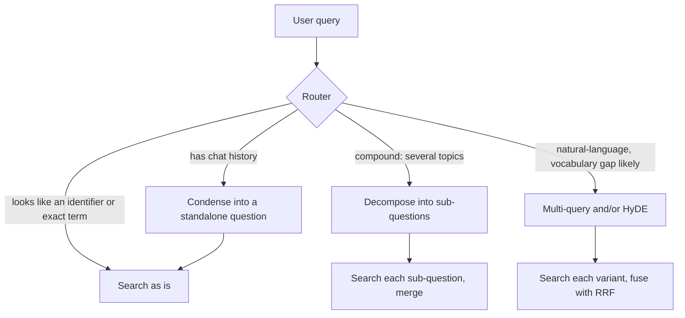
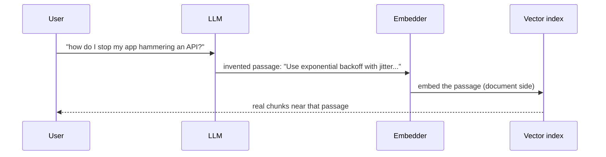

# Week 3, Day 6: Query Transformation: Fixing the Question Before You Search

**Time:** ~3h · **Needs:** local models (embedder + a small local LLM, cached); or your API key with `--api`

## Learning objectives
- Diagnose *why* a query fails to retrieve (vocabulary gap, ambiguity, compound question, lost conversation).
- Implement **follow-up condensation, multi-query, HyDE and decomposition**.
- Know their costs (extra LLM calls, latency) and the ways they **hurt**.
- Route queries so transformations only run where they help, and start from the **free baseline**.

---

## 1. Why queries fail

| Failure | Example | Fix |
|---|---|---|
| **Vocabulary gap** | "stop my app hammering a failing API" vs docs saying "exponential backoff with jitter" | Multi-query, HyDE |
| **Conversational / context-dependent** | "And how do I limit that?" (that = ?) | Follow-up condensation |
| **Compound** | "How do I get valid JSON *and* keep a chat within budget?" (two topics, one vector) | Decomposition |
| **Too vague / too specific** | "performance" / a very particular error string | Step-back (broaden) / keep as-is |
| **Identifier / exact term** | `model_validator`, `HTTP 429` | **Do not rewrite**, since BM25 handles it |

## 2. The techniques

### Follow-up condensation (conversational RAG)
Turn *"And how do I limit that?"* into *"How do I limit concurrent retries of failed API calls?"* using the last few turns. Without it, retrieval sees only the pronoun-laden fragment. **Skip the LLM call when there's no history.**

### Multi-query
An LLM writes N alternative phrasings; you search each and fuse the rankings with RRF. It raises recall when the user's words differ from the document's.

### HyDE (Hypothetical Document Embeddings)
Ask the LLM to *invent a plausible answer passage*, then embed **that**. A hypothetical answer looks like a document, so its embedding lands near real answers even when the question doesn't:

The invented passage may be **wrong**; it's only a search probe and is never shown as an answer. Averaging its vector with the query's vector is a common stabiliser.

### Decomposition
Split "A, and also B?" into sub-questions, retrieve for each (a few chunks each), and merge. This fixes the "one vector can't point at two topics" problem.

### Step-back
Ask a more general question first ("what is the general principle behind this?") and retrieve on that too. Good for specific questions whose answers live in broad conceptual passages.

### Routing: don't transform everything
Rewriting is *risky for exact terms*. A cheap rule (`looks_like_identifier`: contains `_`, `.`, `-`, digits or camelCase and ≤ 4 words) sends those queries straight to the baseline.

## 3. Real results (and why to be sceptical of blog posts)

Setup: the Day 5 weighted-hybrid retriever as the baseline; the rewriting LLM is a **small local model (Qwen2.5-0.5B)**: weak on purpose, because it makes the downside visible. 29 queries (15 paraphrased, 14 exact-term).

| Method | paraphrased hit@1 / hit@5 / MRR | exact-term hit@1 / hit@5 / MRR | all-29 MRR |
|---|---|---|---|
| Baseline (hybrid) | 33% / 60% / 0.46 | 93% / 100% / 0.96 | **0.71** |
| Multi-query (3) + RRF | 13% / 60% / 0.34 | 64% / 93% / 0.77 | 0.55 |
| HyDE | 33% / 60% / 0.48 | 93% / 100% / 0.96 | 0.71 |
| Multi-query, **routed** | 13% / 60% / 0.34 | 93% / 100% / 0.96 | 0.64 |

An example of why: for *"how do I stop my app from hammering an API that keeps failing"* the 0.5B model produced *"How to disable API calls in your application?"* and *"How can I configure my app to avoid API failures?"*, which drifted from **retries** toward **disabling** and **failures**.

| Task | Result |
|---|---|
| **Compound questions** (5; both answers must be in the top-6) | direct **4/5**, decomposed **4/5**: no gain. Hybrid top-6 already covers most two-topic questions, and the model failed to split one of them (1 sub-question) |
| **Follow-ups** (5; hit@5) | follow-up alone **3/5**, **history + follow-up concatenated 4/5**, LLM rewrite **4/5** |

What to take from it:
1. **A weak rewriter hurts.** Multi-query cost 16 MRR points overall. The technique is only as good as the LLM behind it, so *test with the model you'll deploy*, not with a blog's claims.
2. **Routing contains the damage** (exact-term queries recovered to 0.96) but can't fix a bad rewriter on paraphrased queries.
3. **HyDE was roughly neutral** (paraphrased MRR 0.46 → 0.48). It only changes the dense side, so identifier queries are untouched, which is a nice property.
4. **Try the free baseline first.** Simply concatenating the previous question with the follow-up (zero LLM calls, zero latency) scored **4/5, the same as the LLM rewrite**. For many chat products that's the right first version.
5. **Decomposition didn't help here**, because the compound set was easy (hybrid top-6 is broad enough), not because decomposition is useless. It matters when topics are far apart and `k` is small. Build the hard cases that match *your* users.
6. **Everything here is noisy** (29 queries; 5 for follow-ups/compound). Week 4 introduces confidence intervals so you stop reading tea leaves.

Run `--api` (or `--model Qwen/Qwen2.5-1.5B-Instruct` if your connection can fetch it) and compare. A strong model is expected to turn several of these rows from losses into gains. **That comparison is the exercise.**

## Pitfalls & production notes
- **Latency & cost:** every transformation adds an LLM call (+0.5–3 s) and extra searches. Use a **small, fast model**, cache by `(prompt, query)`, and set timeouts with a fallback to the raw query.
- **Query drift:** the rewrite quietly changes the user's intent. Log both the original and rewritten queries and sample them regularly.
- **Defensive parsing:** models add numbering, bullets, quotes and chatter even when told not to (`clean_lines` strips stacked markers like `* •` and dedupes).
- **Cap the fan-out:** N variants × M sub-questions multiplies search cost; limit to ~3×3.
- **Keep the original query** among the variants (RRF then favours chunks that match both the original and the rewrites).
- **Don't show the HyDE passage as an answer.** It is a probe, not knowledge.
- **Prompt injection:** a user-supplied question that tells the rewriter to "ignore previous instructions" attacks the rewriter, not just the answerer. Treat rewriter output as untrusted too (Week 8).

---

## Daily Challenge: Which Transformation Earns Its Keep?

**Requirements**
1. Implement `multi_query(q, n)`, `hyde(q)`, `decompose(q)` and `rewrite_followup(history, q)` as LLM calls, plus **defensive output parsing** (`clean_lines`) with unit tests for numbering/bullets/quotes/duplicates/empty output.
2. Retrieval variants on top of the Day 5 hybrid: multi-query + RRF; HyDE (average query and passage vectors); decomposition (per-sub-question top-3, merged round-robin up to `k=6`).
3. A **router** (`looks_like_identifier`) and a routed multi-query variant; test it on ≥ 9 example queries.
4. Evaluate on the 29 queries (separate paraphrased vs. exact-term), **5+ compound questions** (each needing two lessons; metric = both found in the top-6) and **5+ follow-ups** with three baselines: raw, history-concatenated, LLM-rewritten.
5. Report cost: LLM calls per query and added latency for each method.

**Acceptance criteria**
- Unit tests (16 in the reference solution) cover parsing, keeping the original query first, no-history → no LLM call, decomposing single questions unchanged, the router, and a custom dense vector in the hybrid ranker.
- Your write-up states, for *your* rewriting model, which methods helped, which hurt, and by how much, and whether the **free baseline** was enough for follow-ups.
- If a transformation hurts, the router/guard you add must demonstrably contain the damage.

**Stretch**
- Run with a **stronger model** (`--api`) and compare the table. What changed?
- Implement **step-back** prompting and test it on questions whose answers are conceptual.
- Make the router **learned**: classify queries (identifier / natural-language / compound / follow-up) with a few-shot LLM call or a tiny classifier trained on your logs.
- Add a **confidence gate**: only transform when the baseline's top score is low (the baseline is already confident otherwise).
- Build **harder compound questions** (topics from distant lessons, `k=3`) where decomposition should win, and verify.

**Solution:** [solutions/day6_solution.py](solutions/day6_solution.py) (tests: [solutions/test_day6.py](solutions/test_day6.py)). Local-model generations are cached in `outputs/local_llm_cache.json`, so re-runs are instant.

## Further reading
- Gao et al., *Precise Zero-Shot Dense Retrieval without Relevance Labels* (HyDE).
- Zheng et al., *Take a Step Back: Evoking Reasoning via Abstraction* (step-back prompting).
- LlamaIndex / LangChain docs: *multi-query retriever*, *query decomposition*, *chat engines (condense question)*.
