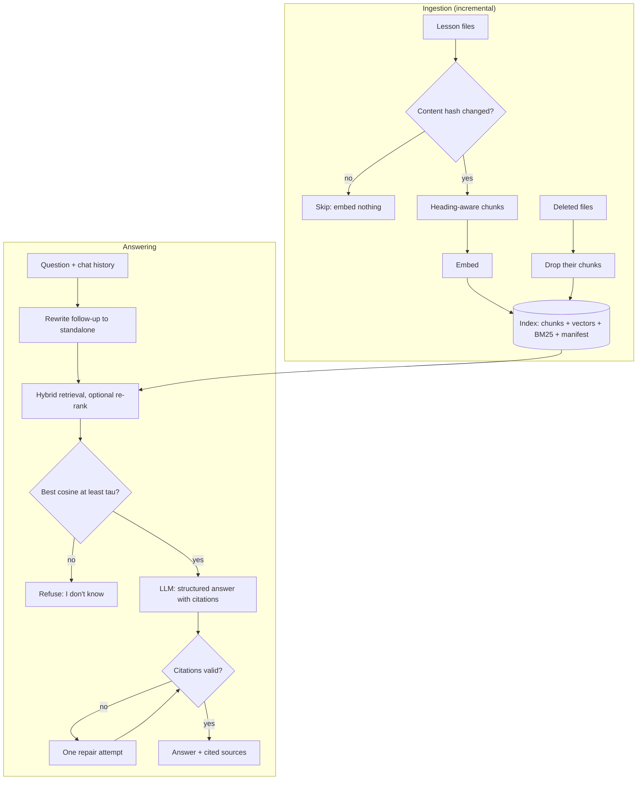

# Week 3, Day 7: Weekly Challenge: The Docs Q&A Bot

**Time:** 4–5h · **Needs:** nothing for the offline run (real retrieval, scripted reader); a key for real answers

## The brief
Build **`docs_qa`**: a Q&A bot over a real documentation set that
- **indexes incrementally** (re-running embeds nothing; editing one file re-embeds only that file; deleting a file removes it),
- **retrieves with hybrid search** (BM25 + vectors, optional re-ranking),
- **answers only from sources**, with validated `[n]` citations,
- **refuses** when the evidence isn't there,
- **understands follow-up questions** ("and how do I limit that?"),
- and ships with an **evaluation harness** that tells you *which stage* is failing.

The document set is this course's own lessons (19 files and growing), so you can judge every answer yourself. Swap in the Python or FastAPI docs for a stretch.



## Requirements

### Must have
1. **Incremental, persistent ingestion** (`sync(docs) -> report` of added / updated / removed / unchanged). Content-hash per document; stable chunk IDs; the index survives a restart; a different **embedding model or dimension** triggers a rebuild instead of silently mixing vectors.
2. **Heading-aware chunking** with the heading path in each chunk and in the citation. A document with **no headings must still be indexed**.
3. **Hybrid search**: normalised BM25 + vector scores with a tunable `alpha`, metadata filters (`where={"week": 2}`), and optional cross-encoder re-ranking.
4. **Grounded answers**: numbered `<source>` blocks, structured output `{answerable, answer, citations}`, mechanical **citation validation**, **one repair attempt** that quotes the problems, and a **groundedness** score.
5. **Abstention**: a retrieval **gate** with `tau` calibrated from answerable vs. unanswerable questions, *and* model-level "I don't know". The gate must refuse **without an LLM call**.
6. **Follow-ups**: rewrite a follow-up into a standalone question using the last few turns (skip the LLM call when there's no history).
7. **Evaluation harness** over a golden set (≥ 15 answerable with `(lesson, answer phrase)`, ≥ 6 unanswerable, ≥ 3 follow-ups) printing: retrieval hit@k, answered, **over-refusals** (answer was retrieved but the bot refused), **cited the chunk that contains the answer**, citation validity, groundedness, unanswerable-refused, follow-up hit@k raw vs. rewritten, and latency. It must **fail loudly if a gold phrase isn't in the corpus**.
8. A **CLI**: `index`, `ask`, `chat` (with history), `eval`, plus `--offline` and `--rerank`.
9. A short **README** of design decisions *with numbers from your own eval*.

### Tests (required)
Offline and fast (a hash embedder + scripted LLM). At minimum:
- sync is **idempotent** (second run embeds 0 chunks), **incremental** (one edited doc → only its chunks re-embedded), and **removes** deleted docs from search results;
- persistence round-trip, and a **same-name/different-dimension** embedder does *not* reuse stored vectors;
- hybrid search: BM25-only finds an identifier; filters restrict results; empty index returns `[]`;
- chunk IDs are stable across runs;
- the **gate** refuses with no LLM call; a repair prompt names the exact problem; persistent invalid output is surfaced;
- the source-block prompt **survives headings containing `>` and quotes** (a real bug we hit);
- follow-ups use history (and skip the LLM without it);
- the **golden set's phrases exist in the corpus**.

> **Mutation-check them.** Disable the gate, stop dropping removed docs, drop the citation-range check, make the embedder key ignore the dimension, remove the attribute sanitiser. Each must turn a test red. (Several of these revealed *missing tests* in the reference solution.)

### Rubric (100 pts)
| Area | Points |
|---|---|
| Incremental persistent ingestion (idempotent, removals, model/dim safety) | 20 |
| Retrieval quality: hybrid + filters + (optional) rerank, measured on your golden set | 15 |
| Grounded answers: citations validated, repair loop, groundedness | 20 |
| Abstention: calibrated gate, no-LLM refusal, unanswerable leak reporting | 15 |
| Evaluation harness is honest (stage-by-stage, fails on bad gold) | 15 |
| Tests (fast, meaningful, mutation-checked) + README with real numbers | 15 |

### Stretch goals
- **Run it with a real model** and write down which stage limits you (retrieval? generation? the gate?).
- Swap the corpus for **FastAPI or Python docs** and rebuild the golden set.
- **Parent-child retrieval** (embed small chunks, show the parent section).
- **Query transformation** (Day 6): multi-query/HyDE gated by an identifier-detector; measure on your set.
- **Streaming UI** with clickable citations (Week 11 builds the real thing).
- **Access control**: add `allowed_groups` metadata and enforce it *inside* the search, with a test proving a restricted chunk is never returned (or even embedded into the prompt).
- A **feedback loop**: log (question, retrieved IDs, answer, thumbs) to JSONL and mine the thumbs-down for new golden questions.

## Reference solution
[solutions/weekly/](solutions/weekly/) plus the reusable engine in [`common/rag.py`](../../common/rag.py) and [`common/chunking.py`](../../common/chunking.py), which Weeks 4–12 import.

| File | Role |
|---|---|
| `common/rag.py` | `RagIndex` (incremental persistent hybrid index), `RagBot` (gate, grounded answer, repair, follow-ups) |
| `common/chunking.py` | Fixed / recursive / heading-aware chunkers |
| `docs_qa/app.py` | Loads the lessons, builds the index and bot |
| `docs_qa/golden.py` | 20 answerable, 8 unanswerable, 5 follow-up questions |
| `docs_qa/evaluate.py` | Golden-set evaluation and Markdown report |
| `docs_qa/offline.py` | Scripted extractive reader + follow-up rewriter |
| `tests/test_rag.py`, `test_docs_qa.py` | 13 + 8 offline tests |

```bash
cd weeks/week03_embeddings-and-rag/solutions/weekly
python -m pytest -q                       # 8 weekly tests (+ 13 engine tests in /tests)
python -m docs_qa index                   # build/sync the index (second run embeds nothing)
python -m docs_qa eval --offline          # golden-set report, no keys
python -m docs_qa ask --offline "how do I stop hammering a failing API?"
python -m docs_qa chat                    # with your provider
```

Offline report on the 19-lesson index (real retrieval, **toy extractive reader**, so ignore the answer-quality lines):

```
index: 19 lessons, 225 chunks | gate tau = 0.574 | k = 4
retrieval: gold chunk in top-4: 14/20
answered: 19/20 | over-refused: 1 | cited the chunk containing the answer: 7/20
unanswerable refused: 7/8   (leaked: "how do I configure a router for port forwarding")
follow-ups (5): hit@4 raw 3, rewritten 4
```

Read it like an engineer:
- **Retrieval (14/20 = 70%) is the real, trustworthy number**, and it is the ceiling for everything downstream. Six questions never reach the generator with their evidence, and no prompt can fix that. Week 4 is about measuring and raising it.
- **7/20 correct citations** reflects the toy reader choosing one sentence by similarity, not RAG quality; a real model will do better *when retrieval succeeds*. Compare yours.
- **The gate leaked one unanswerable question.** `tau` was calibrated on only 8 + 20 questions and the margin is thin. Production gates need more data and monitoring.
- **Follow-up rewriting helped (3 → 4 of 5)** even with a crude rewriter.

Bugs this project *found in itself* (all now have regression tests):
1. `by_headings` silently returned **zero chunks** for a document with no headings.
2. Heading paths like `A > B` inside the `ref="..."` attribute broke source parsing (`>` ended the tag early), so the model saw 1 source instead of 4.
3. The stored-index compatibility check compared embedder *names*; two embedders with the same name but different dimensions would have loaded wrong-sized vectors.

## Week 3 checklist
- [ ] I can explain embeddings, and I know they miss negation, exact identifiers and facts.
- [ ] I can pick a vector store (numpy / HNSW / Chroma / Qdrant / pgvector) and tune `ef`, and I've measured recall vs. exact search.
- [ ] I chunk by structure, measure chunkers with size-fair metrics, and don't trust hit@k alone.
- [ ] My RAG cites sources, validates citations, and refuses when it can't answer.
- [ ] I know BM25, RRF, weighted fusion and re-ranking, and that hybrid is *not* automatically better.
- [ ] I can rescue hard queries with multi-query, HyDE, decomposition and follow-up rewriting, and I know when they *hurt*.
- [ ] My ingestion is idempotent and incremental, and my tests are mutation-checked.

**Next:** Week 4, *Advanced RAG & Retrieval Evaluation*: building golden sets, measuring faithfulness, and making retrieval measurably better.
