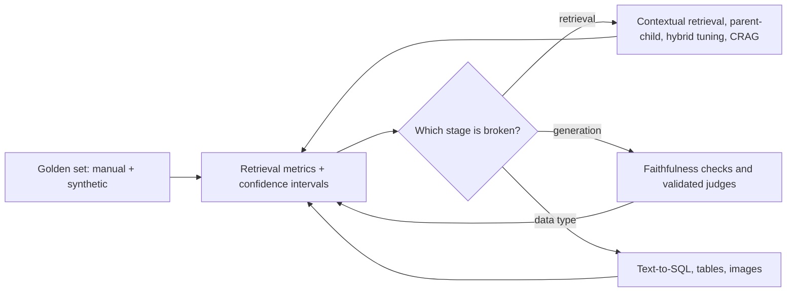

# Week 4: Advanced RAG & Retrieval Evaluation

**Phase 2: Retrieval** · ~3 hours/day · Prerequisites: Week 3 (`common/rag.py`, hybrid search, `docs_qa`)

Week 3 ended with a working RAG bot and a lot of numbers that were *suspiciously noisy*. This week replaces vibes with measurement. You'll build a real **evaluation harness** (golden sets, metrics, confidence intervals, paired tests, judges that are themselves validated), then use it to decide which advanced techniques deserve to ship: contextual retrieval, parent-child indexing, corrective/agentic retrieval, text-to-SQL, and multimodal ingestion.

> **The rule of this week:** a technique that isn't *measured, with an interval, on held-out questions* hasn't been shown to work. Several famous techniques will fail that test here, and that's the point.



## Learning goals
By Sunday you can:
- Build a golden set (hand-written + synthetic with quality filters) and explain its biases.
- Compute hit@k / MRR / nDCG, attach **bootstrap confidence intervals**, and compare two systems with a **paired test**.
- Evaluate generation: faithfulness, relevance, and **LLM-as-judge**, including how to validate the judge against human labels (Cohen's kappa).
- Implement and *measure* contextual retrieval, parent-child retrieval and corrective RAG.
- Build a **safe** text-to-SQL path (validation, read-only execution) and evaluate by execution accuracy.
- Ingest PDFs with tables so numeric facts are actually retrievable.
- Produce a before/after report where every claimed improvement has an interval.

## Schedule
| Day | Lesson | Challenge | Needs |
|---|---|---|---|
| 1 | [Retrieval metrics & golden sets](day1_retrieval-metrics-and-golden-sets.md) | 50-question golden set; score the Week 3 retrievers with CIs and paired tests | Local models |
| 2 | [Evaluating generation](day2_evaluating-generation.md) | Build a labelled faithfulness set; validate three judges against it | Local models |
| 3 | [Advanced indexing](day3_advanced-indexing.md) | Contextual retrieval, parent-child: measured recall deltas | Local models |
| 4 | [Corrective & agentic RAG](day4_corrective-and-agentic-rag.md) | A CRAG loop; how many baseline misses does it rescue? | Local models |
| 5 | [Structured data: text-to-SQL & GraphRAG](day5_text-to-sql-and-graphrag.md) | Safe NL-to-SQL over SQLite, execution accuracy | Local; key for real quality |
| 6 | [Multimodal & table-aware RAG](day6_multimodal-and-tables.md) | Answer questions whose answers live in PDF tables | Local; key for vision |
| 7 | [Weekly challenge](day7_weekly-challenge.md) | Upgrade the Week 3 bot and publish a before/after report with intervals | Local or key |

New shared code: `common/evalkit.py` (metrics + statistics), used by every later week.

```bash
uv sync --extra local --extra rag
pip install pdfplumber sqlglot networkx scipy      # Week 4 extras (see pyproject)
```

## What has been verified
| Item | How |
|---|---|
| `common/evalkit.py` | 10 tests incl. bootstrap **coverage ≈ 95%**, paired-vs-unpaired sensitivity, kappa, nDCG on hand-computed cases |
| Day 1 | Real run: local embeddings + reranker + Qwen-0.5B-generated synthetic questions (strict *and* loose filters); 11 tests for the generation filters |
| Day 2 | Real NLI model and a local LLM judge scored against 36 hand-labelled examples; 13 tests incl. dataset integrity (every context verified in the lessons) |
| Day 3 | Real run of 5 index variants (LLM variants use cached local-model generations); 6 tests |
| Day 4 | Real run: CRAG rescued 0/9 misses (honest negative); `common/crag.py` mutation-checked (6 mutants, 1 initial survivor fixed); agent-loop guardrails tested |
| Day 5 | Real run with a local SQL writer; `common/sqlsafe.py` has 48 adversarial tests; 10 mutants all killed (one initially survived, revealing layers that mask each other); 20 tests for the pipeline |
| Day 6 | Real 6-page generated PDF with 8 tables and a chart; pdfplumber/pypdf run for real; the **vision step is a scripted stand-in** (no vision API key) |
| Day 7 | `rag_upgrade` end to end on real data; 14 tests, 9 mutants killed |

**Not run by the author (no API keys):** hosted-model results, a real vision model, and OCR.
