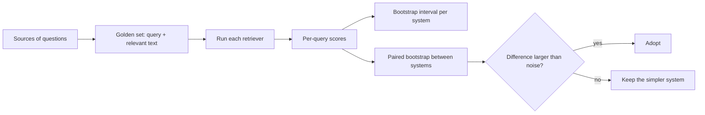
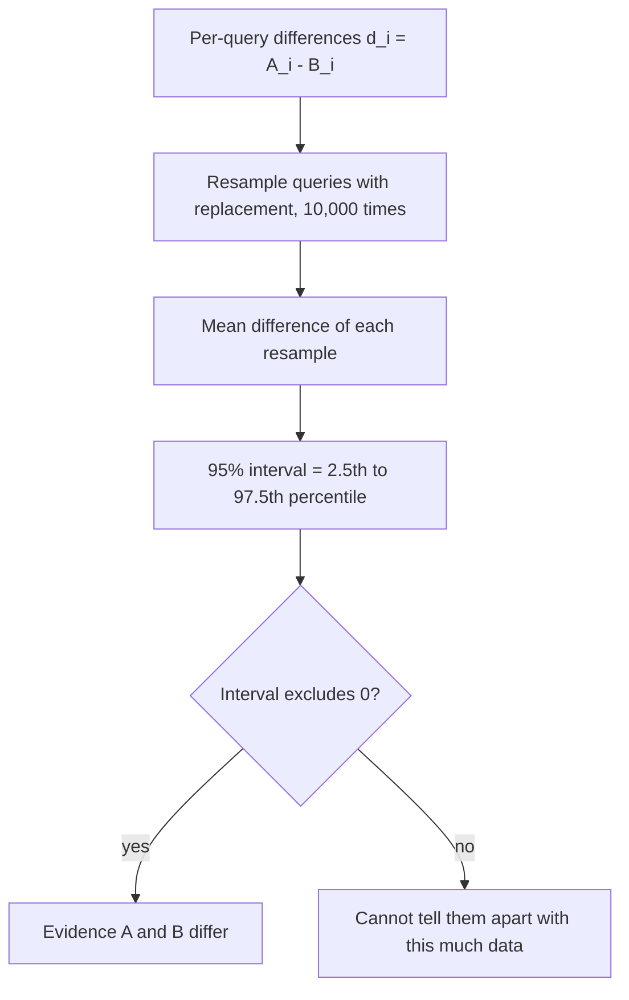

# Week 4, Day 1: Retrieval Metrics, Golden Sets & Honest Statistics

**Time:** ~3.5h · **Needs:** local models (embedder, reranker, a small local LLM; everything is cached after the first run)

## Learning objectives
- Build a **golden set** with chunker-independent ground truth, and explain the biases of each source of questions.
- Compute **hit@k, recall@k, precision@k, MRR and nDCG**, and know when to use which.
- Attach **bootstrap confidence intervals** and compare systems with a **paired bootstrap test**.
- Recognise when a golden set's *construction* decides the winner, and defend against it.

---

## 1. Why this is the most important day of the week

Every improvement idea in RAG ("add a reranker", "use bigger chunks", "try HyDE") is a hypothesis. Without a **test set** and **statistics**, you're adopting techniques because a blog said so. Last week the numbers were noisy; today we find out *how* noisy.

## 2. The golden set

A **golden set** is a list of questions with known-correct answers/evidence. Ours is `GoldQuery(query, doc, phrase)`: a retrieved chunk is **relevant iff it comes from `doc` and contains `phrase`**.

Why text-based relevance rather than chunk IDs? **Chunk IDs change every time you change the chunker**, which would invalidate the set the moment you improve chunking. A phrase survives any re-chunking (Week 3 Day 3).

### Where do questions come from?
| Source | Pros | Cons / biases |
|---|---|---|
| **Real user queries** (logs, support tickets) | The true distribution: typos, jargon, vagueness | Needs a deployed product; privacy; need labelling |
| **Hand-written by domain experts** | High quality, covers important cases | Slow; authors write like authors (not like users) |
| **Synthetic: an LLM writes a question per passage** | Cheap, scalable, labelled by construction | **Biased**: easier, more lexical, phrased like the passage; quality depends on the generator |
| **Adversarial / hard cases** | Targets known weaknesses | Unrepresentative if it's your whole set |

Practical recipe: **start with 30–50 hand-written questions from real needs, add synthetic questions for breadth, never evaluate on synthetic alone**, and refresh the set from production logs as soon as you have them. Keep a **held-out slice you never tune on**.

## 3. Metrics

| Metric | Question it answers | Notes |
|---|---|---|
| **hit@k** (a.k.a. success@k, recall@k with one relevant doc) | Was *any* relevant result in the top k? | The metric that matters for "does the LLM get the evidence at all?" |
| **recall@k** | What fraction of *all* relevant items did we retrieve? | Needs the count of relevant items; matters when answers need several chunks |
| **precision@k** | What fraction of the top-k is relevant? | Context quality: noise in the prompt |
| **MRR** (mean reciprocal rank) | How high is the *first* relevant result? `1/rank` | Rewards rank 1 strongly; good for "one answer suffices" |
| **nDCG@k** | Are the *most* relevant items near the top? `Σ (2^gain − 1)/log2(rank+1)`, normalised | Handles graded relevance; position-discounted |

Rules of thumb: report **hit@k and MRR** for single-evidence questions; add **recall@k** for multi-hop; track **precision@k / context size** because a retriever that dumps 20 chunks has high recall and a ruinous prompt.

## 4. Statistics: stop reading tea leaves

With 20–50 queries, a single query is 2–5 points of accuracy. Differences you'd shrug at in a blog table are *within noise*.

**Bootstrap confidence interval.** Resample the queries *with replacement* thousands of times, recompute the mean each time, and take the 2.5%–97.5% quantiles. It makes no distribution assumptions and works for any metric.

**Paired bootstrap for comparing two systems.** Both systems ran on the *same* queries, so compute the per-query difference `a_i − b_i`, resample those, and ask whether the interval excludes zero. **Pairing matters:** query difficulty varies enormously, and pairing cancels it. `tests/test_evalkit.py` demonstrates a case where two separate intervals overlap heavily but the paired test sees the consistent gap.

How to read results:
- **Report the interval, not just the mean** (`68% [54%-80%]`).
- **A "not significant" result is not "no difference"**; it's "this test set can't tell". The remedy is more (or better) questions.
- **Wins/losses/ties** per query are a sanity check: 17 wins vs 5 losses sounds decisive, yet the *magnitudes* decide the bootstrap on MRR.
- Many comparisons → some false positives. Pre-register the 2–3 comparisons you care about.
- **Never tune on the questions you report on.** Split dev/test.

## 5. Real results: 50 questions (20 manual + 30 synthetic), 252 chunks

The synthetic questions were generated by a **small local model (Qwen2.5-0.5B)** from one sentence of a chunk, then filtered. We ran it twice with different filters, to show that **construction changes conclusions**.

**Strict filters** (reject meta words like "the passage"; require ≥ 2 content words shared with the source sentence; reject near-copies; dedupe) vs **loose filters** (format and near-copy only). Funnel (strict): 53 candidates tried → 2 bad format, 5 meta-references, 10 not grounded, 6 too close to the passage → 30 kept.

All 50 questions (95% bootstrap intervals):

| Retriever | hit@1 | hit@5 | MRR |
|---|---|---|---|
| BM25 | 68% [54–80] | 74% [62–86] | 0.72 [0.59–0.82] |
| vector | 34% [22–48] | 66% [52–78] | 0.47 [0.35–0.58] |
| hybrid (α=.5) | 66% [52–78] | 78% [66–88] | 0.73 [0.61–0.83] |
| hybrid + rerank | 72% [58–84] | 82% [70–92] | 0.78 [0.67–0.87] |

*(strict filters; loose filters give BM25 0.62, vector 0.41, hybrid 0.63, hybrid+rerank 0.69, the same ordering with lower numbers.)*

**The split that matters**, MRR by question source (strict run):

| Retriever | **manual (20)** | **synthetic (30)** |
|---|---|---|
| BM25 | 0.56 | **0.82** |
| vector | **0.52** | 0.43 |
| hybrid | 0.59 | 0.82 |
| hybrid + rerank | 0.58 | 0.91 |

Paired tests on MRR, all 50 queries (strict):

| Comparison | diff | 95% interval | p | verdict |
|---|---|---|---|---|
| hybrid − BM25 | +0.011 | [−0.035, +0.061] | 0.67 | not significant |
| hybrid − vector | +0.259 | [+0.140, +0.381] | <0.001 | significant |
| hybrid+rerank − hybrid | +0.053 | [−0.025, +0.132] | 0.19 | **not significant** |
| vector − BM25 | −0.248 | [−0.381, −0.116] | <0.001 | significant (BM25 better) |

What this teaches:
1. **The questions you pick decide the winner.** On hand-written paraphrases, *vector* search is competitive (hit@5 **80%** vs BM25 **60%**). On synthetic questions, which share words with their source sentence by construction, BM25 dominates (hit@5 83% vs 57%). A team that evaluated only on synthetic data would conclude "drop the embeddings"; one that evaluated only on manual paraphrases would conclude the opposite. Neither is the truth about *your* users.
2. **Tightening the filter changed the synthetic distribution** (it now requires lexical overlap, which inflates BM25: 0.66 → 0.82). *Quality filters aren't neutral.*
3. **Even n = 50 is imprecise**: hybrid's hit@5 interval is 22–26 points wide at n=50 and **40 points at n=20**.
4. **Re-ranking's gain was not significant at n=50** (+0.053, p = 0.19). In an earlier draw of 30 synthetic questions the same reranker looked significantly better (+0.133, p = 0.003), and on the manual questions it did nothing (0.59 → 0.58) and *lowered* hit@5. Same system, different sample, different conclusion. That is sampling noise plus a dependence on question style, not a contradiction.
5. **BM25 beating pure vectors is real on this corpus** (p = 0.002 even under the loose filter): jargon-heavy technical text with exact terms favours lexical matching. It is *not* a general law.
6. The synthetic questions from a 0.5B generator are often mediocre (*"What is the best way to visualize the concept of weights in neural networks?"*, from a sentence about a video series). **Always read a sample.** A stronger generator, and an LLM judge to filter for "answerable from this passage and specific", would raise quality; the pipeline here is the same.

## Pitfalls & production notes
- **Don't let the generator and the retriever share a bias.** If the same embedding model generates and filters questions via "does retrieval find it?", you bake in its blind spots.
- **Round-trip filtering** ("only keep questions the retriever can answer") discards exactly the hard cases you want to improve.
- **Leakage:** if synthetic questions are generated from the same chunks you later use for contextual retrieval or fine-tuning, scores inflate.
- **Keep the golden set in version control** with a changelog; a changed set invalidates historical comparisons (we write it to JSONL).
- **Stratify results** (by question type, source, document, difficulty). The average hides the story.
- **Cost of evaluation:** cache model calls (we cache embeddings, rerank scores and generations); a 1,000-query evaluation should take minutes, not hours, or nobody will run it.

---

## Daily Challenge: Build the Ruler Before You Measure

**Requirements**
1. `common/evalkit`-style functions with **unit tests**: `hit_at_k`, `reciprocal_rank`, `recall_at_k`, `precision_at_k`, `ndcg_at_k` (verify on hand-computed cases), `bootstrap_ci`, `paired_bootstrap`, `cohens_kappa`.
2. Statistical tests that *prove the statistics work*: the CI contains the mean and shrinks with more data; **coverage ≈ 95%** over repeated samples; a paired test detects a real gap and ignores two coin flips; pairing beats overlapping unpaired intervals.
3. A **golden set of ≥ 50 questions**: ≥ 20 hand-written (with `(lesson, answer phrase)`) and ≥ 30 synthetic from a local or hosted LLM, with a **funnel** of rejected candidates by reason (format, meta-reference, not grounded, near-copy, duplicate).
4. Evaluate **BM25, vector, hybrid, hybrid + rerank**: hit@1, hit@5, MRR with 95% intervals, **split by manual vs. synthetic**.
5. **Paired comparisons** on MRR for the 4 pairs above, with wins/losses/ties.
6. Write down: which retriever wins on each source, whether any difference is significant, and what you would do to get more power.

**Acceptance criteria**
- Evaluation code has tests; `evaluate_retriever` is verified end to end on a toy corpus (including two relevant chunks and nDCG).
- Your golden set is saved as JSONL, and every manual gold phrase is verified to exist in the corpus.
- Your conclusions cite intervals and p-values and mention the manual-vs-synthetic split.

**Stretch**
- Re-run synthetic generation with a **stronger model** (or `--api`) and an **LLM answerability filter**; compare the retriever ranking.
- Compute **recall@k for multi-evidence questions** (two relevant chunks).
- Add **stratified bootstrap** and report a CI per question type.
- Do a **power analysis**: how many questions would you need to detect a +0.05 MRR difference?
- Plot **hit@k curves** for k = 1…20 for each retriever.

**Solution:** [solutions/day1_solution.py](solutions/day1_solution.py) (`--loose` for the loose-filter variant), tests in [solutions/test_day1.py](solutions/test_day1.py), and the toolkit in [`common/evalkit.py`](../../common/evalkit.py) with [`tests/test_evalkit.py`](../../tests/test_evalkit.py).

## Further reading
- Efron & Tibshirani, *An Introduction to the Bootstrap* (chapters 1–2 are enough).
- Järvelin & Kekäläinen, *Cumulated Gain-Based Evaluation of IR Techniques* (nDCG).
- Hamel Husain, *Your AI Product Needs Evals*; Eugene Yan, *Patterns for Building LLM-based Systems & Products* (evals section).
- Smucker et al., *A Comparison of Statistical Significance Tests for Information Retrieval Evaluation*.
