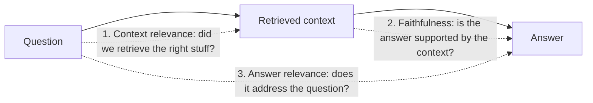

# Week 4, Day 2: Evaluating Generation: Faithfulness, Judges & Validating the Judge

**Time:** ~3.5h · **Needs:** local models (NLI cross-encoder ~70M params, small local LLM)

## Learning objectives
- Separate the **RAG triad**: context relevance, **faithfulness (groundedness)**, answer relevance.
- Use three kinds of judges: lexical, **NLI**, **LLM-as-judge**, and know their failure modes.
- **Validate a judge against human labels** (accuracy, recall of bad answers, Cohen's kappa) with proper dev/test separation.
- Break detection quality down **by failure type**, because the average hides what a judge is blind to.

---

## 1. What to evaluate

Retrieval metrics (Day 1) say whether the evidence arrived. They say nothing about what the model *did* with it.



| Property | Failure | Typical check |
|---|---|---|
| **Context relevance / recall** | Evidence missing or buried in noise | Retrieval metrics (Day 1); "was the gold chunk in the prompt?" |
| **Faithfulness / groundedness** | **Hallucination**: claims not supported by (or contradicting) the context | NLI, LLM judge, citation checks |
| **Answer relevance** | Correct but off-topic; verbose; evasive | LLM judge, or question-answer similarity |
| **Correctness** (vs. a reference answer) | Wrong even if faithful (the context was wrong) | Reference comparison, human review |

A system can be **faithful but wrong** (the retrieved document is outdated) or **right but unfaithful** (the model knew it from training, unsupported by your sources, which is a risk when you promise citations).

Failure types of an unfaithful answer, which matter because **judges are good at some and blind to others**:
- **Contradiction**: says the opposite of the source.
- **Numeric**: changes a number, date or name.
- **Swap**: same words, relations reversed ("A beats B" → "B beats A").
- **Fabrication**: adds a plausible claim the source doesn't contain.

## 2. The judges

| Judge | How | Cost | Strength | Blind spot |
|---|---|---|---|---|
| **Lexical support** | Share of the answer's content words found in the context | ~0 | Instant; catches wild invention | A corrupted answer *reuses the same words*: swaps and flipped relations look perfect |
| **NLI** (natural-language inference) | A cross-encoder reads (context, claim) and outputs P(entailment / contradiction / neutral) per claim | One small-model pass per claim | Understands negation, contradiction, many swaps; deterministic; cheap | Length limit (512 tokens), weak on **numbers**, needs a good claim split |
| **LLM-as-judge** | Prompt an LLM: "Is every claim supported?" | An LLM call per answer | Flexible: any criterion, in plain language | Biased, inconsistent, **only as good as the model**; must be validated |

NLI faithfulness, concretely: split the answer into **claims** (sentences, minus `[1]` markers), score each against windows of the context, and let the **weakest claim decide**: `score = min over claims of P(entailment)`.

```python
from common.judges import NLIJudge
r = NLIJudge().faithfulness(context, answer)
r.score          # min claim entailment (1.0 = fully supported)
r.contradicted   # some claim is more likely contradicted than entailed
r.claims         # per-claim probabilities, so you can show *which* claim failed
```

## 3. LLM-as-judge: powerful and dangerous

Good practice (and what the biases are):
- **Narrow, concrete criteria** ("is every claim supported by the context?") beat vague ones ("is this good?").
- **Binary or small-scale labels** are more reliable than 1–10 scores.
- Ask for **a short justification before the verdict** (chain of thought), then parse a structured verdict.
- **Position bias**: in pairwise comparisons, judges favour the first (or last) answer; randomise order and judge both orders.
- **Verbosity bias**: longer answers score higher. **Self-preference**: models favour their own style/outputs.
- **Parsing defaults are a hidden bias.** Our toy judge treats anything that doesn't start with "no" as "faithful" (tested), and that default silently inflates faithfulness.
- Use a **stronger or different** model for judging than for generating, and **calibrate it against human labels**: the rest of this lesson.

## 4. Validate the judge: the experiment

A judge is a measurement instrument; **an uncalibrated instrument is worse than none** (false confidence). We hand-labelled **36 examples**: 18 contexts (verbatim sentences from the lessons) × {1 faithful answer, 1 deliberately unfaithful answer}, with the corruption type recorded. Pairs are **split by context** (9 dev, 9 test) so a threshold tuned on dev never sees the test contexts.

Procedure: tune each score's threshold on **dev**, report on **test** with bootstrap intervals; treat *unfaithful* as the positive class (we want to **catch hallucinations**).

Test-set results (18 examples, 9 unfaithful):

| Judge | Accuracy [95% CI] | Catches unfaithful | Precision | Cohen's κ |
|---|---|---|---|---|
| Baseline: always "faithful" | 50% [28–72] | 0% | n/a | 0.00 |
| Lexical support (threshold 0.42) | 67% [44–89] | 44% | 80% | 0.33 |
| **NLI (min claim entailment)** | **94% [83–100]** | **89%** | **100%** | **0.89** |
| LLM judge (Qwen 0.5B, Yes/No) | 56% [33–78] | 11% | 100% | 0.11 |

Recall of unfaithful answers **by failure type**, all 18 unfaithful examples:

| Judge | contradiction (9) | fabrication (2) | numeric (4) | swap (3) |
|---|---|---|---|---|
| Lexical support | 5 | 2 | 1 | 1 |
| **NLI** | **9** | **2** | 3 | **3** |
| LLM judge (0.5B) | 4 | 1 | 0 | 0 |

Reading it:
1. **NLI is a genuinely good faithfulness detector here** (κ = 0.89: near-perfect agreement with the human labels) *and* it's tiny and local. It caught every contradiction and every swap.
2. **Its one miss is revealing**: *"…a single example shifts the score by 1 point"* vs. the context's *"10 points"*. NLI models are weak at **numeric** changes; for numbers, add a **deterministic check** (every number in the answer must appear in the context).
3. **The lexical judge fails exactly where theory predicts.** On swaps, the corrupted answer scores the same as the faithful one (mean gap 0.06, versus 0.25 for contradictions), because it reuses the same words. It's a fine *first filter*, not a faithfulness judge.
4. **The small LLM judge is nearly useless** (κ = 0.11): it says "Yes" to almost everything. A "judge" that rubber-stamps looks fine until you measure it. This is the central warning: **LLM-judge quality is not a property of "LLM judges", it's a property of *this model, this prompt, this task*.** A strong hosted model with a good prompt would do far better; *you won't know until you validate it the way we just did.*
5. **The intervals are wide.** 18 test examples give 94% [83–100] for NLI, which is great, but for the lexical judge 67% [44–89] overlaps with "always faithful" at 50% [28–72]. Real validation needs **100+ labelled examples**, drawn from your *own* system's outputs (real failures, not my synthetic corruptions), and re-checked whenever the judge model or prompt changes.
6. **A threshold tuned on 18 dev examples is fragile** (NLI's came out at 0.03). Production judges need more calibration data and monitoring for drift.

## 5. Putting it into a pipeline

```python
r = judge.faithfulness(context, answer)
if r.contradicted or r.score < TAU:
    flag_for_review(answer, r.claims)     # or regenerate, or refuse
```
Use judges at three places: **offline** (regression evals on a golden set, Week 7), **online as a guardrail** (flag/regenerate risky answers), and **sampled monitoring** (score a % of production traffic and track the trend). Always keep the per-claim detail: "claim 2 of 3 is unsupported" is actionable; "score 0.41" is not.

## Pitfalls & production notes
- **Judge the claims, not the whole answer** (an answer with one fabricated claim among five true ones is still unfaithful).
- **Citations are not faithfulness.** An answer can cite `[1]` and still contradict source 1. Check entailment *against the cited chunk*.
- **Don't use the generating model to judge itself** without validation (self-preference, shared blind spots).
- **Human labels are the ground truth**, and humans disagree too. Measure inter-annotator agreement (κ) on a sample.
- **Track judge drift:** when you upgrade the judge model, re-run the validation set before comparing scores across time.
- **Report recall of the bad class**, not just accuracy: "always faithful" gets 50% accuracy on a balanced set and 95% on a mostly-faithful stream while catching nothing.

---

## Daily Challenge: Is Your Judge Any Good?

**Requirements**
1. Build a **labelled faithfulness set** of ≥ 30 examples (context, answer, label, failure type) with *real* context text from the corpus; ≥ 4 failure types, balanced labels, **split by context** into dev and test. Include a test that every context exists in the corpus and that unfaithful answers aren't trivially longer/shorter.
2. Implement three judges: **lexical support**, **NLI** (`common.judges.NLIJudge` or your own), and an **LLM judge** (local model or your API) with careful output parsing.
3. Tune thresholds on **dev only**; report on **test**: accuracy with a bootstrap CI, recall and precision of the *unfaithful* class, Cohen's κ, and a comparison with an "always faithful" baseline.
4. A **per-failure-type recall table** and a list of the judge's mistakes (with the example text).
5. Add a **deterministic number check** to the best judge and show whether it fixes the numeric misses.

**Acceptance criteria**
- Tests cover: dataset integrity, `best_threshold` (separable, inseparable, single example), detector metrics with "unfaithful" as the positive class, LLM-judge parsing (including the dangerous default), and that the lexical judge cannot distinguish swaps.
- Your write-up names which judge you would deploy, for which failure types, **and what its interval says about how much to trust that choice**.

**Stretch**
- Run the LLM judge with a **hosted model** (`common.llm`), with and without a chain-of-thought justification, and compare κ.
- Measure **position bias**: judge pairs (A, B) in both orders and report how often the verdict flips.
- Build a **claim-level** evaluation: label which *claim* is wrong and measure whether the judge points at it.
- Evaluate on **real outputs** from your Week 3 bot (generated with a hosted model) labelled by you.
- Implement the **numeric/entity consistency check** (all numbers and capitalised entities in the answer must occur in the context) and measure its precision/recall alone and combined with NLI.

**Solution:** [solutions/day2_solution.py](solutions/day2_solution.py), data in [solutions/faithfulness_data.py](solutions/faithfulness_data.py), tests in [solutions/test_day2.py](solutions/test_day2.py); the reusable judges are in [`common/judges.py`](../../common/judges.py) (tests in [`tests/test_judges.py`](../../tests/test_judges.py), run against the real NLI model).

## Further reading
- Es et al., *RAGAS: Automated Evaluation of Retrieval Augmented Generation* (the RAG triad).
- Zheng et al., *Judging LLM-as-a-Judge with MT-Bench and Chatbot Arena* (position/verbosity biases).
- Honovich et al., *TRUE: Re-evaluating Factual Consistency Evaluation* (NLI-based faithfulness).
