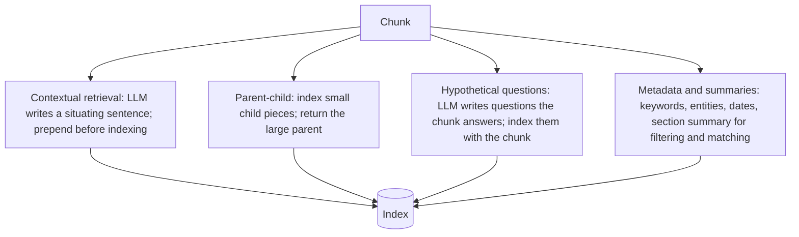

# Week 4, Day 3: Advanced Indexing: Contextual Retrieval, Parent-Child & Friends

**Time:** ~3.5h · **Needs:** local models; the LLM-generated variants need a one-off ~15 min generation run (cached)

## Learning objectives
- Explain *why* chunk-level retrieval loses information, and the main fixes: **contextual retrieval, parent-child, hypothetical questions, metadata**.
- Implement each as "the same retriever over differently-prepared text".
- **Measure** each against a baseline with paired tests, and weigh gains against index size, ingest cost and generation quality.
- Understand why a technique that works for a strong LLM can **hurt** with a weak one.

---

## 1. The problem with a chunk

Once text is cut into chunks, each chunk is embedded **alone**. Three things go missing:

| Lost | Example chunk | Retrieval consequence |
|---|---|---|
| **Which document/section?** | "The company's revenue grew by 3% over the previous quarter." | Which company? Which quarter? A query "ACME Q2 2023 revenue" can't match |
| **Antecedents** | "It must be set before the first request." | *It* = ? |
| **Document-level topic** | A paragraph on "caching" inside a lesson about *security* | Matches queries about caching generally, not the intended one |

Chunk size is a dilemma (Week 3 Day 3): small chunks are precise but context-free; large chunks have context but dilute the embedding. The techniques below try to get both.

## 2. The techniques



**Contextual retrieval.** For each chunk, ask an LLM (showing the chunk and its document) for one or two sentences that situate it ("*This chunk is from ACME Corp's Q2 2023 filing; it discusses revenue growth relative to Q1.*"), and **prepend that to the chunk before embedding *and* before BM25 indexing**. The prompt can include the whole document; with provider **prompt caching** (Week 1 Day 4) the document is read once and each chunk costs only its own tokens, which is what makes the technique affordable. *Reported* gains from the public write-up of this method are large, but they were measured with a strong hosted model and their dataset. **You must measure on your own data** (below).

**Parent-child (small-to-big).** Embed small *child* pieces (a sentence or two) so matching is precise, but **return the parent** chunk (or section) so the LLM gets context. Variants: *sentence-window retrieval* (return ±N neighbouring sentences) and *auto-merging* (if several children of one parent match, return the parent).

**Hypothetical questions (doc2query).** Have an LLM write 2–3 questions each chunk answers and index them alongside the chunk. This bridges the **phrasing gap** between how users ask and how documents are written (question ↔ question similarity is easy for embedders).

**Metadata & summaries.** Extract keywords/entities/dates/section titles/summaries per chunk. Use them for **filtering** ("only 2023 filings"), for **boosting**, or as extra index text. Hierarchical summaries (RAPTOR-style trees) help global questions.

All of these are **ingest-time** costs: they multiply your LLM calls and index size, and they must be **regenerated when documents change** (key them by content hash, as in Week 3's incremental `sync`).

## 3. The experiment

Same hybrid retriever (BM25 + vector, α = 0.5) over 252 chunks (21 lessons), scored on the 50-question golden set from Day 1 (20 manual + 30 synthetic), paired against the baseline. The LLM for generated variants is a **small local model (Qwen2.5-0.5B)**: weak, and it matters.

| Variant | What changes | hit@1 | hit@5 | MRR [95% CI] | MRR manual / synthetic |
|---|---|---|---|---|---|
| **Baseline** | heading-aware chunks | 66% | 78% | 0.73 [0.61–0.83] | 0.59 / 0.82 |
| Extractive context | prepend lesson title + first objective | 64% | 76% | 0.71 [0.59–0.81] | 0.58 / 0.79 |
| Parent-child (350) | search 350-char children, return parent | 68% | 76% | 0.73 [0.61–0.83] | **0.46 / 0.90** |
| LLM context (0.5B) | model writes a situating sentence | 60% | 76% | 0.69 [0.57–0.79] | 0.57 / 0.77 |
| Hypothetical Qs (0.5B) | model writes questions; indexed with chunk | 66% | **84%** | 0.75 [0.65–0.85] | 0.59 / 0.86 |

Paired comparison against the baseline (MRR):

| Variant | diff | 95% interval | p | W/L/T | verdict |
|---|---|---|---|---|---|
| Extractive context | −0.018 | [−0.042, −0.003] | 0.005 | 3/10/37 | slightly **worse** |
| Parent-child | −0.000 | [−0.069, +0.073] | 0.99 | 6/11/33 | no difference overall |
| **LLM context (0.5B)** | **−0.038** | [−0.075, −0.009] | **0.003** | 3/12/35 | **worse** |
| Hypothetical Qs | +0.026 | [−0.032, +0.091] | 0.39 | 11/8/31 | not significant (hit@5 +6 pts, p = 0.23) |

What this teaches:
1. **None of these clearly earned its cost here.** Two were significantly *worse*, one was neutral, one trended better but not significantly. "Advanced" is not "better".
2. **A weak generator poisons the index.** The 0.5B model's "context" sentences were mostly noise (*"The router handles ticket categorization and approval, ensuring no drafts are made."* prefixed to an unrelated chunk), so the embedding was pulled toward wrong topics. Contextual retrieval's published results rely on a **strong LLM that sees the whole document**. The technique isn't wrong; the model was. Expect this to flip with a capable model, but **verify, don't assume**.
3. **Parent-child is a trade, not a gain**: overall MRR identical (0.73), but it **helped synthetic questions (0.82 → 0.90) and hurt manual ones (0.59 → 0.46)**. Small children match sentence-derived questions extremely well, and match paraphrased, multi-sentence questions worse. Which is "right" depends on what your *users* ask, so the golden set's composition (Day 1) decides what you ship.
4. **Free "context" (title + objective) hurt slightly** (significant but tiny, −0.018): the heading path was already in each chunk (Week 3), so the prefix was mostly noise that diluted the embedding.
5. **Hypothetical questions** were the only positive signal (hit@5 78% → 84%), even though the model's output was sloppy (one chunk got a repeated, code-fenced list of questions). Not significant at n = 50: *the experiment cannot tell*, which is itself the finding. More questions (Day 1's stretch) would settle it.
6. **Always count the costs.** Parent-child: 884 index rows vs 252 (3.5× vectors). LLM variants: one generation per chunk (252 calls here; at 1M chunks that is a serious bill), and a re-run whenever a document changes.

## 4. Doing it properly with a hosted model

```python
from common import llm

def contextual_prefix(document: str, chunk: str) -> str:
    prompt = (f"<document>\n{document}\n</document>\n<chunk>\n{chunk}\n</chunk>\n"
              "Write 1-2 sentences situating this chunk within the document to improve search retrieval. "
              "Output only the context.")
    return llm.complete(prompt, max_tokens=120, cache_prompt=True).text   # the document prefix is cached
```
- Put the **document first** and the chunk last, so the document prefix is identical across chunks and **prompt-cacheable** (cache reads cost ~10% of input; Week 1 Day 4).
- Use a **small, fast model** (it's a simple task) but not a tiny one, and **validate the output** (length, no meta-talk).
- **Index both** the prefixed text for embeddings *and* for BM25; **return the original** chunk to the answerer (the prefix is for search only).
- Regenerate only changed documents (content hash).

## Pitfalls & production notes
- **Don't let generated text leak into answers.** Show the original chunk (plus citation), not the synthetic prefix/questions.
- **Eval contamination:** if hypothetical questions are generated by the same model/process that generated your *synthetic golden questions*, they match each other and inflate scores. Evaluate on **manual/real** questions.
- **Index bloat:** every technique multiplies rows or text. Track index size and p95 latency alongside quality.
- **Update path:** a changed document must invalidate its generated context/questions. Idempotent, hash-keyed regeneration (Week 3 Day 7).
- **Prompt-injection surface:** the LLM reads *document text* at ingest; a poisoned document can write malicious "context" that is then indexed (Week 8).
- **Try the cheap, free fixes first:** a heading-path prefix, sensible chunk size, hybrid search, a reranker. They're usually worth more than an LLM-per-chunk pipeline.

---

## Daily Challenge: Earn Your Place in the Pipeline

**Requirements**
1. A `MiniIndex` that does hybrid (BM25 + vector) search over arbitrary *index texts* but returns *display texts*, with an optional **parent-group collapse**. Unit-test: display ≠ index text; collapse returns one result per parent and the parent's text; a contextual prefix makes a chunk findable without changing what is returned.
2. Implement these variants over the same chunks: **baseline**, **extractive context**, **parent-child** (child size configurable), and (with a local or hosted LLM) **LLM contextual prefix** and **hypothetical questions**. Test the generation helpers with a stub LLM (first-line extraction, truncation of long inputs, flattening of numbered lists).
3. Evaluate on the Day 1 golden set: hit@1, hit@5, MRR with 95% CIs, **split by manual vs. synthetic**, plus **paired comparison vs. the baseline** with W/L/T.
4. Report **costs**: index rows, mean chars, number of LLM calls, estimated ingest tokens.
5. For each variant, write one sentence: *ship / don't ship / need more data*, justified by the interval, the manual-vs-synthetic split and the cost.

**Acceptance criteria**
- Every claimed improvement is accompanied by its paired interval and p-value, and every non-significant result is described as such.
- At least one variant is evaluated *separately* on manual and synthetic questions, and you state whether the conclusion differs.
- The LLM-generated variants cache their generations (re-runs are instant).

**Stretch**
- Use a **hosted model** with prompt caching for contextual retrieval (see section 4), and compare to the local-model result. Report cost per 1,000 chunks.
- **Sentence-window retrieval** (return ±2 sentences) and **auto-merging**; compare to fixed parent-child.
- **Metadata extraction** (keywords/dates) used as a *filter* for questions that name a lesson or week.
- Tune **child size** (150, 250, 350, 500) and plot MRR (manual vs. synthetic) against size.
- Generate **3 questions per chunk** and filter them with your Day 1 quality filters before indexing.

**Solution:** [solutions/day3_solution.py](solutions/day3_solution.py) (`--llm` for the generated variants); tests in [solutions/test_day3.py](solutions/test_day3.py). All numbers above are from a real run (generations are cached in `outputs/local_llm_cache.json`).

## Further reading
- Anthropic, *Introducing Contextual Retrieval* (the method; check its claimed gains against your own data).
- Nogueira et al., *Document Expansion by Query Prediction* (doc2query).
- Sarthi et al., *RAPTOR: Recursive Abstractive Processing for Tree-Organized Retrieval*.
- LlamaIndex docs: sentence-window retrieval, auto-merging retriever.
