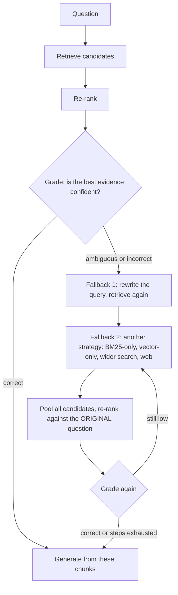
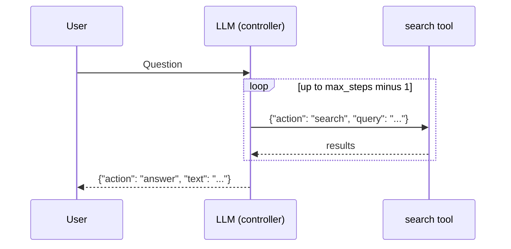
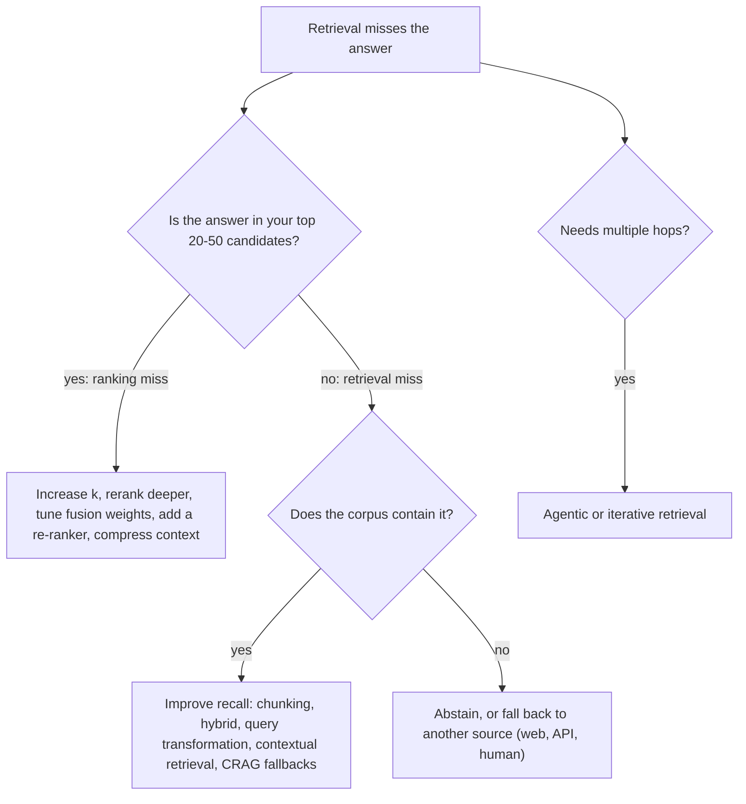

# Week 4, Day 4: Corrective & Agentic RAG: Retrieve, Grade, Correct (and Know When It Can't Help)

**Time:** ~3.5h · **Needs:** local models (embedder, reranker, a small local LLM as the rewriter)

## Learning objectives
- Implement **corrective RAG (CRAG)**: grade retrieval quality and fall back when it looks wrong.
- Build an **LLM-driven retrieval loop** (agentic RAG) with hard guardrails.
- **Diagnose which failure you actually have** (retrieval miss vs. ranking miss) *before* choosing a fix.
- Calibrate a grader's threshold **without leaking** the data you evaluate on (leave-one-out).
- Compare "clever" machinery with the cheap lever (just return more chunks).

---

## 1. The idea

A fixed RAG pipeline retrieves once and hopes. **Corrective RAG** adds a *judge* between retrieval and generation:

Design rules (each enforced by a test in `common/crag.py`):
1. **Return immediately when confident**: no extra cost and no risk of making a good answer worse.
2. **Score against the user's original question, never a rewrite.** A rewrite can drift; if you grade against it, you "prove" the wrong thing.
3. **Pool candidates; never discard the original best chunks** in favour of a rewrite's results.
4. **Bound the work** (`max_steps`) and log every step (action, query, pool size, top score, grade) for cost accounting.

**Graders** can be: a cross-encoder's top score (cheap; used here), an NLI/LLM relevance judgment per chunk, or a mix. **Fallbacks** can be: query rewrite, a different retriever, a wider `k`, a different index, or a **web search** when the corpus clearly lacks the answer.

## 2. Agentic RAG: let the model drive

In **agentic RAG** the *model* decides what to do next:

It handles multi-hop questions ("find X, then use X to look up Y") that a fixed pipeline can't. The costs: **more LLM calls, latency, nondeterminism, and new failure modes**. The loop in `agentic_search` therefore has guardrails (each tested):
- **Bounded steps**, and the **last turn may only answer**. (A bug the tests caught: the first version still executed a search requested on the final "answer now" turn, silently exceeding the budget.)
- **Malformed model output is surfaced** to the model and the trace ("not valid JSON"), never silently ignored.
- Search results are **fed back verbatim** into the next turn, and the trace records every query for debugging.
- A model that never answers yields **no answer**, not an infinite loop.

We'll build full agents (tool use, planning, MCP) in Week 5; here it's the retrieval-specific version.

## 3. First, diagnose the failure

Before building a correction mechanism, ask: **when retrieval fails, *how* does it fail?**

| Failure | Meaning | Fix |
|---|---|---|
| **Retrieval miss** | The answer chunk isn't among the candidates at all | Better recall: hybrid, query rewriting, bigger candidate pool, better chunking, **CRAG-style fallbacks** |
| **Ranking miss** | The answer chunk is in the candidates but ranked below your cut-off | Better ranking: re-ranker, **return more chunks (larger k)**, tune fusion |
| **Evidence is spread out** | The answer needs 2–3 chunks together | Larger k, parent-child, multi-hop retrieval |

Our measurement (50 golden questions, hybrid + cross-encoder re-rank, answer present = relevant chunk with the gold phrase):

| Cut-off k | answer found within top-k |
|---|---|
| 1 | 36 / 50 |
| 3 | 39 / 50 |
| 5 | 41 / 50 (82%) |
| **10** | **49 / 50 (98%)** |
| 20 | 49 / 50 |

The 9 questions that missed at k=5 are **ranking misses**: for 8 of them the answer sits at rank 6–10, and it was in the candidate pool all along. Exactly **1** question is a true retrieval miss.

## 4. Results: CRAG on this corpus

Setup: grader = top cross-encoder score; threshold τ learned with **leave-one-out** (each question's τ is learned from the other 49, so we never grade the controller on data that tuned it); fallbacks = 2 rewrites from a local 0.5B model, then BM25-only and vector-only retrieval; `max_steps = 4`.

| | hit@5 | MRR |
|---|---|---|
| Baseline (hybrid + rerank) | 82% [70–92] | 0.78 |
| Corrective (CRAG) | 82% [70–92] | 0.76 |

- **Rescued 0 of 9** baseline misses; harmed 0 of 41 hits; hit@5 difference exactly 0.
- **MRR fell slightly (−0.023, 95% [−0.038, −0.009])**: re-pooling candidates reshuffled a few already-good rankings.
- **The grader is weak: AUC 0.64.** The top re-rank score averaged +1.62 when the top-5 contained the answer and +0.44 when it missed, but heavily overlapping, because the re-ranker is confidently wrong about *plausible-looking* chunks. Only 7 of 50 questions even triggered a correction.
- **Cost:** 1.42 searches per question (vs 1), ~22 re-rank pairs (vs 20), 0.14 LLM calls (vs 0): cheap, because it rarely fired. And it bought nothing.

Why it failed, in one sentence: **CRAG fixes retrieval misses, and this system's failures are ranking misses.** Re-retrieving adds *more candidates*; it can't move an answer from rank 8 to rank 3. The cheap lever, **return 10 chunks instead of 5, lifts hit rate from 82% to 98%** at the cost of 2× context tokens.

Honest caveats: tiny sample (9 misses); the rewriter was a weak 0.5B model; the grader was a single score. A strong rewriter and an LLM-based relevance grader might rescue some. Also, on a corpus with real retrieval gaps (large, messy, or missing documents), CRAG's web/other-index fallback is where it earns its keep. The lesson is the **method**: measure the failure distribution first.

## 5. A decision guide

## Pitfalls & production notes
- **A grader that is nearly as unreliable as the retriever adds noise.** Measure the grader's AUC on your data before wiring it into control flow.
- **Calibrate thresholds with held-out data.** Tuning τ on the same questions you evaluate is optimistic; use leave-one-out or a separate split.
- **Re-ranker scores are logits**, specific to the model and not comparable across queries or models; thresholds don't transfer.
- **Loops cost money.** Put a *budget* on retrievals, LLM calls and tokens per question, and alert when it's hit.
- **Agent traces are your debugger.** Log query, results count and decision at each step.
- **Prefer determinism where you can.** A fixed pipeline with a larger `k` is easier to test, cheaper and often as good; reach for agents when the *task* genuinely needs multi-step search.

---

## Daily Challenge: Does Correction Pay For Itself?

**Requirements**
1. Implement `corrective_search(index, query, reranker, tau, rewriter, k, depth, max_steps)` with the four design rules above, returning hits, final grade, and a **step trace** (action, query, pool size, top score, grade) plus counts of searches and re-rank pairs.
2. **Test it with stubs** (no models): immediate return when confident; a rewrite that rescues; the ladder order and early stop; `max_steps` respected; original best chunks never displaced by bad rewrites; **every pair scored against the original question** (include a multi-rewrite case); pair accounting. Mutation-check at least four of these.
3. A **diagnosis** on your golden set: hit@k for k = 1, 3, 5, 10, 20, and the number of questions whose answer is absent from the top-20.
4. A **grader evaluation**: mean top score for hits vs. misses and the **AUC**; calibrate τ with **leave-one-out**.
5. Compare baseline vs. CRAG: hit@5 and MRR with intervals, a **paired test**, **rescued and harmed counts**, and the per-question cost (searches, pairs, LLM calls).
6. Implement `agentic_search` with guardrails (bounded steps, last turn must answer, malformed JSON surfaced) and test it with a scripted model.

**Acceptance criteria**
- Your report says whether CRAG helped *and why*, referencing the failure distribution (retrieval vs. ranking misses).
- Your report compares CRAG to the simple alternative of **larger k** with its cost in context tokens.
- Every statistical claim has an interval or p-value.

**Stretch**
- Use an **LLM relevance grader** (per chunk: relevant / irrelevant) instead of the re-ranker score and compare AUC and rescue rate.
- Add a **web or second-index fallback** for queries graded incorrect and build a small set of questions *outside* the corpus to test it.
- **Context compression**: re-rank to top-10, then keep only the highest-scoring sentences of each chunk to cut tokens without losing the answer.
- Run `agentic_search` with a **hosted model** on multi-hop questions (two lessons needed) and compare with the fixed pipeline on cost and accuracy.
- Add **MMR (maximal marginal relevance)** diversification and test whether it helps multi-evidence questions.

**Solution:** [solutions/day4_solution.py](solutions/day4_solution.py) (tests: [solutions/test_day4.py](solutions/test_day4.py)); the controller is [`common/crag.py`](../../common/crag.py) with [`tests/test_crag.py`](../../tests/test_crag.py).

## Further reading
- Yan et al., *Corrective Retrieval Augmented Generation (CRAG)*.
- Asai et al., *Self-RAG: Learning to Retrieve, Generate, and Critique through Self-Reflection*.
- Yao et al., *ReAct: Synergizing Reasoning and Acting in Language Models* (the loop behind agentic search; Week 5).
