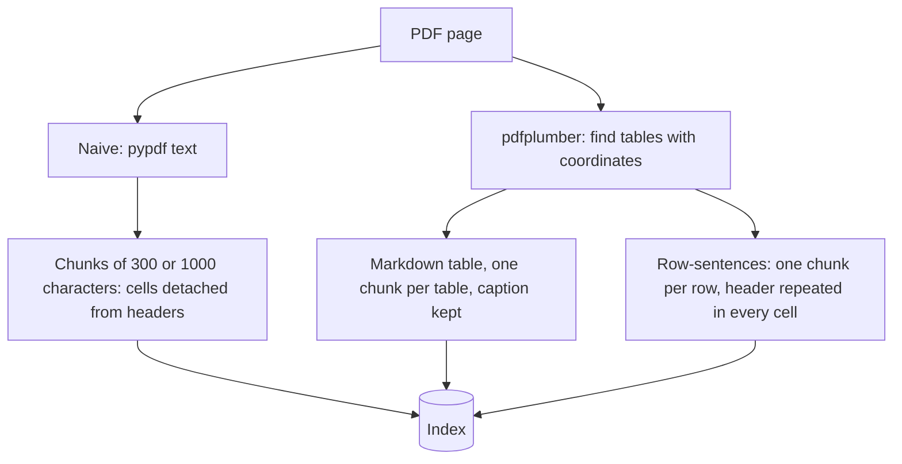
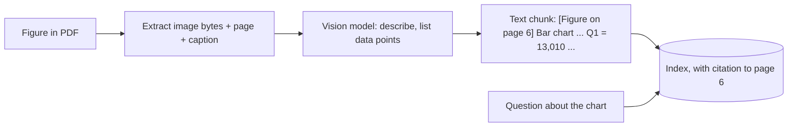

# Week 4, Day 6: Multimodal & Table-Aware RAG: PDFs, Tables, Charts

**Time:** ~3.5h · **Needs:** local libraries only (pypdf, pdfplumber, reportlab); a vision-capable API key if you want to run the image part for real

## Learning objectives
- Explain why naive PDF text extraction **destroys tables**, and measure the damage on retrieval.
- Compare four ingestion strategies for tables: naive text, bigger chunks, Markdown tables, row-sentences.
- Define a **fair evidence-completeness metric** for table questions.
- Turn **charts and images** into retrievable, citable text with a vision model, and know the cost and risks.
- Choose between parsers and vision-language approaches.

---

## 1. Why PDFs are hard

A PDF is a **page-description format**, not a document structure: it says "draw this glyph at (x, y)". Tables, columns, headings and reading order are *inferred*. Common failure modes:

| Problem | Effect on RAG |
|---|---|
| **Tables flattened** | Cells become a vertical list; a number is detached from its row and column header |
| **Multi-column layouts** | Lines from different columns interleave into nonsense |
| **Headers/footers/page numbers** | Repeat on every page; pollute chunks and embeddings |
| **Split tables** (across pages) | The header is on page 3, the rows on page 4 |
| **Scanned pages** | No text layer at all: needs OCR |
| **Figures/charts** | The answer is in pixels, invisible to text extraction |

Real behaviour of `pypdf` on today's 6-page report: **every table cell is on its own line**, so the output reads `Item | Q1 2024 | Q2 2024 | Q3 2024 | Q4 2024 | North America | <value> | <value> ...`, with the header nowhere near the number that needs it (the solution prints the real lines, and a test asserts that a row's label and value are never on the same line).

Tools, roughly from simple to powerful: **pypdf** (text only) → **pdfplumber / PyMuPDF** (coordinates, tables) → **layout/ML parsers** (Docling, Unstructured, Marker, hosted parsers) → **vision-language models** that read the page *image*. Pick the cheapest that works on **your** documents; test on your worst ones.

## 2. Four ways to ingest a table



```text
Markdown table chunk (values illustrative)    Row-sentence chunk
Table 2: Headcount by department              Table 2: Headcount by department. Item: Engineering.
| Item | Jan 2024 | Apr 2024 | Jul 2024 |      Jan 2024 = 212; Apr 2024 = 224; Jul 2024 = 240; Oct 2024 = 251
|---|---|---|---|
| Engineering | 212 | 224 | 240 |
```

- **Markdown tables** keep structure and are great for LLMs to *read*, but a big table makes a diluted embedding and may exceed the chunk budget.
- **Row-sentences** repeat the header in every row so each chunk is **self-contained** and precise to retrieve; the cost is more chunks and repeated text.
- **Always keep the caption and units** ("USD thousands") with the numbers; "5,120" means nothing without them.
- For *large* tables or aggregation questions ("total across regions?"), don't retrieve cells at all: load the table into **pandas/SQL** and use text-to-SQL (Day 5).

## 3. A fair metric: can the chunk answer the question?

For a cell question *"In the headcount table, what was Jul 2024 for Sales?"* we know the triple **(row = Sales, column = Jul 2024, value = 101)**. A chunk **answers** it iff it contains the row label, the column header *and* the value: the minimum evidence an LLM needs. (This is generous to naive text, which can still scramble which number belongs to which column.) We report:
- **answerable:** the question can be answered from *some* chunk at all (the retrieval ceiling: if chunking cut the evidence apart, no retriever can recover it);
- **hit@1 / hit@3** with 95% bootstrap intervals.

## 4. Real results: 6 pages, 8 tables, 40 cell questions

| Strategy | Chunks | Mean chars | Answerable | hit@1 | hit@3 |
|---|---|---|---|---|---|
| naive-300 (pypdf) | 48 | 262 | **27 / 40** | 55% [40–70] | 68% [52–82] |
| naive-1000 (pypdf) | 14 | 901 | 35 / 40 | 88% [78–98] | 88% [78–98] |
| **tables-md** (pdfplumber) | 8 | 391 | **40 / 40** | **100%** | **100%** |
| **row-sentences** | 61 | 112 | **40 / 40** | **100%** | **100%** |

Reading it:
1. **Small naive chunks make a third of the questions unanswerable *before retrieval even runs*** (27/40). The header and the value land in different chunks. No re-ranker can fix evidence that was destroyed at ingest.
2. **Bigger naive chunks "fix" it** (35/40; 88%), which is why people don't notice. But 1,000-character chunks of text-with-tables are exactly the large, diluted chunks Week 3 warned about, and 5 questions are still impossible.
3. **Table-aware ingestion is 100%** on this benchmark. That's partly because the benchmark is clean (generated, perfect borders, one table per question topic). **Real PDFs are far messier** (merged cells, no gridlines, footnotes, rotated headers, scans), and you should expect a lower score and measure it on your own documents.
4. **Markdown vs. row-sentences** tie here, but they diverge with scale: a 200-row table as one Markdown chunk is unusable; row-sentences scale, at the cost of 61 chunks vs. 8.
5. Another lesson hiding in the data: **the questions named the table topic** ("in the headcount table…"). With ambiguous column names repeated across tables (`Q1 2024` appears in three of them), a question without the topic would collide. Captions are not decoration.

## 5. Images and charts

When the answer lives in a chart, no text extractor helps. Options:

| Approach | How | Trade-offs |
|---|---|---|
| **Captions / alt text** | Index the figure caption and surrounding text | Free; often not enough |
| **Describe at ingest** (what we build) | A vision model writes a text description (and data points) once; index it with page metadata | One-off cost; the description can be wrong |
| **Read at query time** | Retrieve the page image and send it to a vision model *with the question* | Most faithful to the question; costs image tokens on every query |
| **Joint multimodal embeddings** (CLIP-style, ColPali-style) | Embed page images directly; text queries retrieve pages | No parsing; needs special models and indexes |
| **Chart → data table extraction** | Ask a VLM to emit the underlying numbers as a table, then treat it as a table | Best for numeric questions |



Provider message shapes (**not executed here; needs a vision API key**):

```python
# Anthropic
{"role": "user", "content": [
    {"type": "image", "source": {"type": "base64", "media_type": "image/png", "data": b64}},
    {"type": "text", "text": "Describe this chart and list every data point."}]}

# OpenAI Responses API
{"role": "user", "content": [
    {"type": "input_text", "text": "Describe this chart and list every data point."},
    {"type": "input_image", "image_url": f"data:image/png;base64,{b64}"}]}
```

Cost intuition: an image costs tokens roughly proportional to its pixels (a common rule of thumb is `width × height / 750`: **~139 tokens for a 400×260 chart**, much more for full pages). **Describing once at ingest and indexing the text** is far cheaper than re-sending the image on every question, and makes the figure searchable and citable. Our solution does exactly that with a scripted stand-in (we generated the chart, so we know its values), and the test suite verifies the plumbing: the image is extracted from the PDF as a real PNG, becomes a chunk with its page number, and the chart question retrieves it.

**Risks to design for**
- **Charts are read approximately.** Vision models misread bar heights and axis scales; prompt them to say "approximately", prefer **printed data labels**, and cross-check with the underlying table when you have it.
- **OCR/vision digits are error-prone** (1/7, 0/6, decimal points). Validate numbers against totals where possible.
- **Hallucinated descriptions** get indexed as if they were fact. Label them ("[Figure description, machine-generated]") and cite the page so users can check.
- **Sensitive data in images** (faces, IDs, screenshots) needs the same privacy handling as text (Week 8).

## Pitfalls & production notes
- **Parse once, store the structure**: keep `{page, bbox, type: table|text|figure, caption}` per element so you can re-chunk without re-parsing.
- **Repeat headers** when a table spans pages or chunks.
- **Strip repeated page furniture** (headers, footers, page numbers) before chunking.
- **Preserve units and footnotes**: "USD thousands" and "* excludes one-off items" change the meaning of every number.
- **Test your parser on your worst documents**, not the clean ones, and build a small golden set of cell-lookup and figure questions per document type.
- **Compare against "just give the page image to a vision model"** for low-volume, high-value documents: it can beat any parser pipeline, at a higher per-query cost.
- **Scanned documents** need OCR (Tesseract, cloud OCR, or a vision model); this environment has no OCR engine installed, so we didn't run that path.

---

## Daily Challenge: Make the Numbers Findable

**Requirements**
1. Generate a **multi-page PDF report** (reportlab) with ≥ 6 tables (8–10 rows each) interleaved with narrative filler, plus one chart image. Keep tables unbroken across pages (or handle splits).
2. Implement four strategies: **naive-300**, **naive-1000** (pypdf), **tables → Markdown** (pdfplumber, caption detected from geometry), **row-sentences** (header repeated).
3. Generate ≥ 30 **cell-lookup questions** (row, column, value) spread across tables, rows and columns, deterministically. Define `answers(chunk, question)` = row label, column header and value all present.
4. Report, per strategy: chunks, mean length, **answerable count** (ceiling), hit@1, hit@3 with intervals.
5. **Image path:** extract the image from the PDF (assert real PNG bytes, correct page), describe it with a pluggable function, index it as a chunk with its page, and retrieve it for a chart question. Provide `image_message(provider, png, question)` for both providers and **unit-test the message shapes**.
6. Write down: which strategy you'd ship, and what documents would break it.

**Acceptance criteria**
- Tests prove: pdfplumber recovers every table **exactly** (header, rows, caption); naive text really splits a row's label and value onto different lines; Markdown chunks are well-formed; row sentences are self-describing; every question is answerable by the table-aware strategies but **not** by small naive chunks; the generated question set spreads across rows and columns (mutation-check this).
- Your report separates the **ceiling (answerable)** from the **retrieval** score.

**Stretch**
- Run a **real vision model** over the chart and compare its extracted numbers with the truth; report the error.
- Add **aggregation questions** ("total headcount in Dec 2024?"): route to pandas/SQL (Day 5) and compare with RAG-over-rows.
- Try **PyMuPDF** or a **layout parser** (Docling/Unstructured) on a *messy* PDF (no gridlines, merged cells) and measure what pdfplumber misses.
- Implement **table-split repair**: when a table continues on the next page, repeat the header and merge.
- Add **OCR** (Tesseract) for a scanned page and measure digit error rate.
- Use **page images + a vision model at query time** for the top-3 retrieved pages and compare with text-only answering.

**Solution:** [solutions/day6_solution.py](solutions/day6_solution.py) (tests: [solutions/test_day6.py](solutions/test_day6.py)). The numbers above come from a real run on the generated report (the vision step uses a scripted describer).

## Further reading
- pdfplumber docs (table-finding settings); Docling and Unstructured docs.
- Faysse et al., *ColPali: Efficient Document Retrieval with Vision Language Models*.
- Anthropic and OpenAI docs: *Vision* / *PDF support* (image formats, size limits, token accounting).
