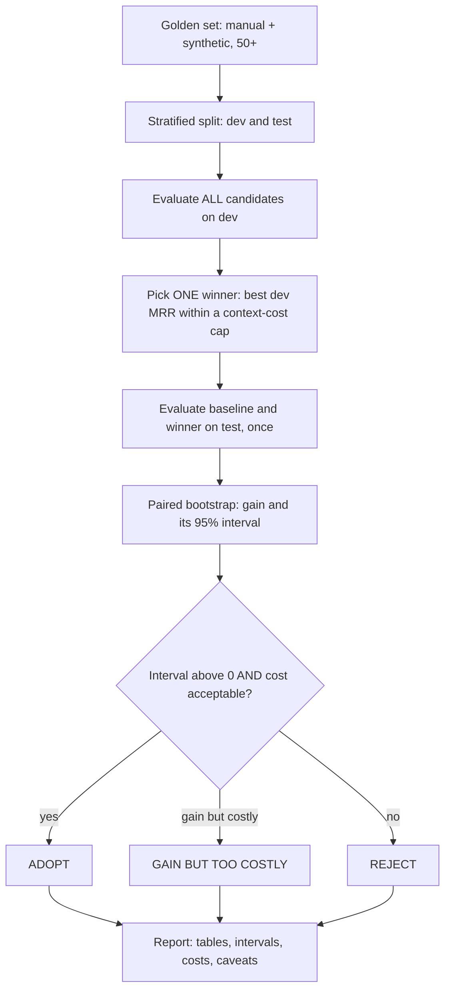

# Week 4, Day 7: Weekly Challenge: Upgrade the Bot, Prove It

**Time:** 4–5h · **Needs:** local models (everything is cached from Days 1–4); a hosted model is optional

## The brief
Last week's bot works. This week you learned eight ways to "improve" it. **Which ones should you ship?**

Build **`rag_upgrade`**: a harness that evaluates candidate upgrades the way a careful team would, and writes a **before/after report** whose every claim has an interval. The skill being tested isn't implementing techniques (you did that all week); it's **deciding with evidence**, including the humbling outcome where the answer is "none of them".



## Requirements

### Must have
1. **Candidates** (≥ 6, each a `Config(name, retrieve, k, rerank_pairs, llm_calls, index_rows)` over the *same* chunks): the baseline hybrid retriever, a fusion-weight variant, **just sending more chunks (k=8)**, re-ranking, parent-child, at least one LLM-generated-index variant (hypothetical questions or contextual prefix), and corrective RAG.
2. **Stratified, deterministic dev/test split** of the golden set (by manual/synthetic), disjoint and complete.
3. **Selection on dev only**: highest dev MRR among candidates whose context size is within a cap (default 2.5× baseline); ties go to the cheaper one (smaller context, then fewer re-rank pairs).
4. **Confirmation on test, once**, with a **paired bootstrap** on MRR and hit@5 against the baseline (diff, 95% interval, p, wins/losses/ties).
5. **Verdict rules** that need *both* a significant gain (interval excludes 0) and acceptable cost, with distinct outcomes: `ADOPT`, `GAIN BUT TOO COSTLY`, `REJECT: no significant improvement`, `REJECT: significantly worse`, `NO CHANGE`.
6. **Measured costs**, not guesses, for at least one technique (the CRAG retriever counts its own re-rank pairs and LLM calls).
7. A **Markdown report** with: split sizes, the dev table, the chosen winner, the test confirmation, the verdict, **all candidates on test for transparency** (not for selection), and caveats.
8. **Pre-register** your hypotheses and decision rule in the README *before* running (what you expect to win and why).

### Tests (required)
- Split: deterministic, disjoint, complete, stratified; the seed matters.
- Selection: respects the cost cap; prefers the cheaper config on ties **at each tie-break level**; falls back to the baseline when it is the only option.
- Verdict: a table-driven test of all five outcomes including boundary (`ci_low == 0` is *not* an adoption).
- `evaluate_config`: retrieves **once per query** (memoised) and uses measured costs when a retriever reports them.
- A **"winner's curse" test**: construct data where a candidate beats the baseline on dev by luck and not on test, and assert the pipeline refuses to adopt it.
- Report: every required section is present; "NO CHANGE" when the winner is the baseline.
- An **end-to-end** CLI run with stubbed models that would fail if the pipeline retrieved nothing.

> **Mutation-check them** (`python scripts/mutate.py ...`): drop the shuffle, ignore the cost cap, break each tie-break, loosen the verdict threshold, bypass the memo, ignore measured costs. Every mutant must die. (Two of the eight survived at first in the reference solution, which showed missing tests.)

### Rubric (100 pts)
| Area | Points |
|---|---|
| Disciplined procedure: dev/test split, selection on dev only, single confirmation on test | 25 |
| Statistics: paired intervals, W/L/T, honest reading of "not significant" | 20 |
| Cost accounting (context size, re-rank pairs, LLM calls, index size) incl. at least one *measured* | 15 |
| Candidates implemented correctly and fairly (same chunks, same eval) | 15 |
| Tests (incl. winner's-curse test) + mutation check | 15 |
| Report clarity and honest caveats; pre-registered hypotheses | 10 |

### Stretch goals
- **Re-run with a hosted model** for generated variants and the answerer; compare which verdicts change.
- Add **end-to-end answer evaluation**: groundedness with the NLI judge (Day 2) and a citation-correctness rate, so retrieval wins are tied to answer quality.
- **Repeated random splits** (e.g. 20 seeds) and report how often each candidate wins on test, a direct measurement of selection noise.
- **Expand the golden set** to 150+ (more manual questions from "real" needs) and see which verdicts become significant.
- **Power analysis**: how many test questions would you need to detect a +0.05 MRR gain?
- Add a **latency measurement** (p50/p95, cold vs. warm caches) to the report.

## Reference solution
[solutions/weekly/](solutions/weekly/)

| File | Role |
|---|---|
| `rag_upgrade/harness.py` | `Config`, stratified split, `evaluate_config`, `select_best`, `verdict`, `render_report` |
| `rag_upgrade/configs.py` | The 8 candidates, including a `CragRetrieve` that counts its own cost |
| `rag_upgrade/__main__.py` | CLI: sync index, split, evaluate, report |
| `test_rag_upgrade.py` | 14 offline tests (incl. the winner's-curse test and an end-to-end run) |

```bash
cd weeks/week04_advanced-rag-and-evaluation/solutions/weekly
python -m pytest -q                      # 14 tests
python -m rag_upgrade --llm              # full run (uses cached local-model generations); writes outputs/week4_report.md
```

### The reference result (real run, local models)

Step 1: eight candidates on **dev** (25 questions), used only to choose:

| config | k | MRR (dev) | context chars | rerank pairs/q | index rows |
|---|---|---|---|---|---|
| baseline (hybrid, k=4) | 4 | 0.65 [0.49–0.81] | 3,656 | 0 | 252 |
| hybrid α=0.25 | 4 | 0.68 | 3,703 | 0 | 252 |
| hybrid, k=8 | 8 | 0.65 | 7,432 | 0 | 252 |
| **hybrid + rerank, k=4** | 4 | **0.76** [0.61–0.89] | 3,848 | 20 | 252 |
| hybrid + rerank, k=8 | 8 | 0.76 | 7,639 | 20 | 252 |
| parent-child (350) | 4 | 0.66 | 3,667 | 0 | 884 |
| hypothetical Qs | 4 | 0.71 | 3,635 | 0 | 252 |
| CRAG | 4 | 0.76 | 3,836 | **21.78 (measured)** | 252 |

**Chosen on dev: hybrid + rerank, k=4** (an 11-point MRR lead).

Step 2: confirmed on **test** (25 questions, touched once):

| metric | baseline | winner | paired diff [95% CI] | p | W/L/T |
|---|---|---|---|---|---|
| MRR | 0.80 | 0.80 | **−0.005 [−0.108, +0.101]** | 0.92 | 3/3/19 |
| hit@5 | 84% | 84% | +0.00 [−0.20, +0.20] | 1.00 | 3/3/19 |

**Verdict: REJECT: no significant improvement.**

How to read it:
- **The dev winner did not replicate**: +0.11 MRR on dev, **−0.005** on test. This is the *winner's curse*: out of eight candidates, the one that looked best on dev was partly the luckiest on dev. Had we reported the dev number (the standard mistake), we'd have "proved" an improvement that isn't there.
- **No test result is "bad news"**: it is the system correctly *declining* to add a 2-second-per-query re-ranker for no demonstrated gain.
- On test, **all eight candidates are within ±0.02 MRR of each other** (0.78–0.80), with intervals ±0.14. This test set can't distinguish them. The right response is **more and better questions**, not more techniques.
- Measured cost: CRAG scored ~21.8 re-rank pairs per question, about the same as plain re-ranking, for no gain (Day 4's finding, reproduced inside the harness).
- "Just send more chunks" (k=8) doubles the context (3.9k → 7.7k chars) and changes nothing here: consistent with Day 4 (the answer was already in the candidates).

Compare to Day 1, where the same re-ranker looked *significantly better* on a different 50-question draw (p = 0.003). **Same retriever, different samples, opposite conclusions**: this is precisely why we split, pair, and report intervals.

## Week 4 checklist
- [ ] I can build a golden set with chunker-independent ground truth and explain its biases (manual vs. synthetic).
- [ ] I attach bootstrap intervals to every metric and use **paired** tests to compare systems.
- [ ] I validate any judge (NLI, LLM) against human labels before trusting it, and I know where each judge is blind.
- [ ] I diagnose *retrieval misses vs. ranking misses* before choosing a fix, and I check the cheap lever (larger k) first.
- [ ] I treat model-generated SQL as untrusted input, with layers I have tested **independently**.
- [ ] My ingestion keeps tables and figures findable, and I measure it with a fair completeness metric.
- [ ] I choose upgrades by *dev selection + test confirmation*, and I'm comfortable shipping "no change".
- [ ] My tests are mutation-checked (and I know how to read the survivors).

**Next:** Week 5, *Tool Use & Single Agents*: from retrieving information to taking actions.
