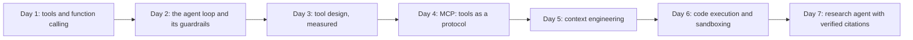

# Week 5: Tool Use & Single Agents

**Phase 3: Agents** · ~3.5 hours/day · Prerequisites: Weeks 1-4 (`common/llm.py`, `common/evalkit.py`, the RAG stack)

Weeks 1-4 gave you a model that answers. This week gives it **hands**: tools it can call, a loop that lets it decide what to do next, a protocol (MCP) for plugging tools in, discipline about what sits in its context window, and a sandbox for the code it writes. You build every piece from scratch before any framework (Week 6) and **measure** each design decision.

> **The rule of this week:** an agent is a model in a loop. Everything that makes it *safe and useful* is built around the loop: the tool interface, the budgets, the context, the isolation, and the **verification of its output by something that is not the model**.



## Learning goals
By Sunday you can:
- Explain function calling as a **protocol**, and translate one conversation format into the Anthropic, OpenAI Responses and Chat Completions wire formats.
- Write the agent loop with a step budget, cost/token budgets, repeated-call blocking and stuck detection, and read its trace to say *why* a run failed.
- Design tools as an **agent-computer interface** and prove an improvement with a paired test on held-out questions.
- Build and test an **MCP server**, and use any MCP server from your own loop through an allowlist.
- Keep a long-running agent inside a token budget with truncation, clearing, compaction and notes, and say which ones lose information.
- Run model-written code behind **resource limits and a container**, and state exactly what each isolation level does *not* stop.
- Verify an agent's cited report mechanically.

## Schedule
| Day | Lesson | Challenge | Needs |
|---|---|---|---|
| 1 | [Function calling](day1_function-calling.md) | Calculator + unit converter + date tools with parallel calls | Local model or key |
| 2 | [The agent loop from scratch](day2_agent-loop-from-scratch.md) | A raw-loop file agent with sandboxed tools and 7 final-state-graded tasks | Local model or key |
| 3 | [Tool design (the ACI)](day3_tool-design.md) | Redesign bad tools; measure first-call success with CIs and a held-out check | Local model or key |
| 4 | [MCP: build a server](day4_mcp-server.md) | An MCP server for a notes folder, tested over real stdio, used from a host *and* your own agent | `pip install mcp` |
| 5 | [Context engineering](day5_context-engineering.md) | An agent that survives a 50-step task inside a token budget | Local tokenizer |
| 6 | [Code execution & sandboxing](day6_code-agents-and-sandboxing.md) | A pandas data-analysis agent in a sandbox, plus an escape matrix | pandas; Docker for the container |
| 7 | [Weekly challenge](day7_weekly-challenge.md) | A research agent whose citations are machine-checked | Local or key |

New shared code (used by every later week): `common/chat.py` (tool-calling turns on every provider), `common/tools.py` (typed tools, validation, remote tools), `common/agent.py` (the loop), `common/context.py` (context hooks), `common/mcp_tools.py` (MCP bridge), `common/sandbox.py` (subprocess + Docker sandboxes).

```bash
uv sync --extra local --extra rag
pip install mcp pandas          # Week 5 extras (also listed under the `agents` extra in pyproject)
```

## What has been verified
| Item | How |
|---|---|
| `common/chat.py` | 15 offline tests through the **real SDKs** against a local server speaking all three wire formats (parallel calls, `tool_choice`, one-user-message tool results); 4 tests with the real local model (it calls the right tool with the right arguments, reports token usage) |
| `common/tools.py` | 20 tests: schema from signature + docstring, strict arguments, errors as text, timeouts, truncation, nested models, remote tools, verbatim `ToolFailure` |
| `common/agent.py` | 21 tests; every guardrail mutation-checked (13 mutants, 0 survivors after the fixed mutation tool) |
| `common/context.py` | 19 tests; call/result invariant checked after every strategy; 15 mutants killed (3 initially survived: boundary conditions) |
| `common/mcp_tools.py` + Day 4 server | real stdio subprocess tests (35); bridge mutants all killed |
| `common/sandbox.py` | 28 tests including **documented escape gaps** of the subprocess backend; the 9 Docker tests ran against a real daemon (`python:3.12-slim`) |
| Day 1 | real run with Qwen2.5-0.5B (5/8); 49 tests; 12 mutants killed |
| Day 2 | real run: 0/7 (a harness success, a model failure; analysed); 33 tests including path-escape and symlink tests; a symlink hole in `grep` found and fixed |
| Day 3 | real run: 15% → 75% → 98% success with CIs and paired tests; a **held-out** check (1/8 → 7/8); 61 tests |
| Day 4 | 35 tests; real run over MCP: 0/4 (analysed); one checker bug (`no` matching inside "note") found and fixed |
| Day 5 | real tokenizer counts for 6 strategies on a 50-step task; a **real Qwen summariser** that lost 4 of 5 facts (summaries inspected); 17 tests |
| Day 6 | real run 0/7 (a lucky guess is no longer counted); 27 tests; escape matrix executed on both backends |
| Day 7 | 49 tests: SSRF attacks, number-check bug, code-fence bug, poisoned page, CLI; live run 0/6 with every ungrounded answer rejected by the checker |

**Not run by the author (no API keys):** every hosted-model result (Claude, GPT); connecting the MCP server to Claude Code/Desktop; a real web search API. The local 0.5B model is a poor agent by design of this exercise: its failures are the lesson, and the harness was verified with scripted models and real SDK/HTTP/MCP/Docker traffic.

**Bugs the tests found in the author's own code this week** (a good reminder to test): a symlink escape in `grep`; stray tool arguments silently ignored; a `create` message that always said "Replaced"; an unbounded `limit`; a verifier that accepted an invented number because the digit appeared elsewhere on the page; code lines counted as claims; a malformed URL port that escaped the fetcher's error contract; `scripts/mutate.py` sharing stale `.pyc` files between mutants (fixed).
