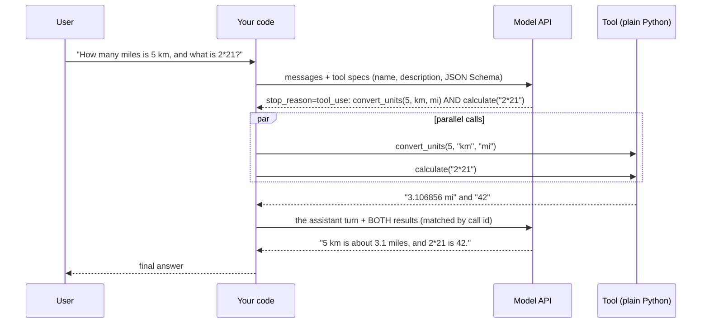
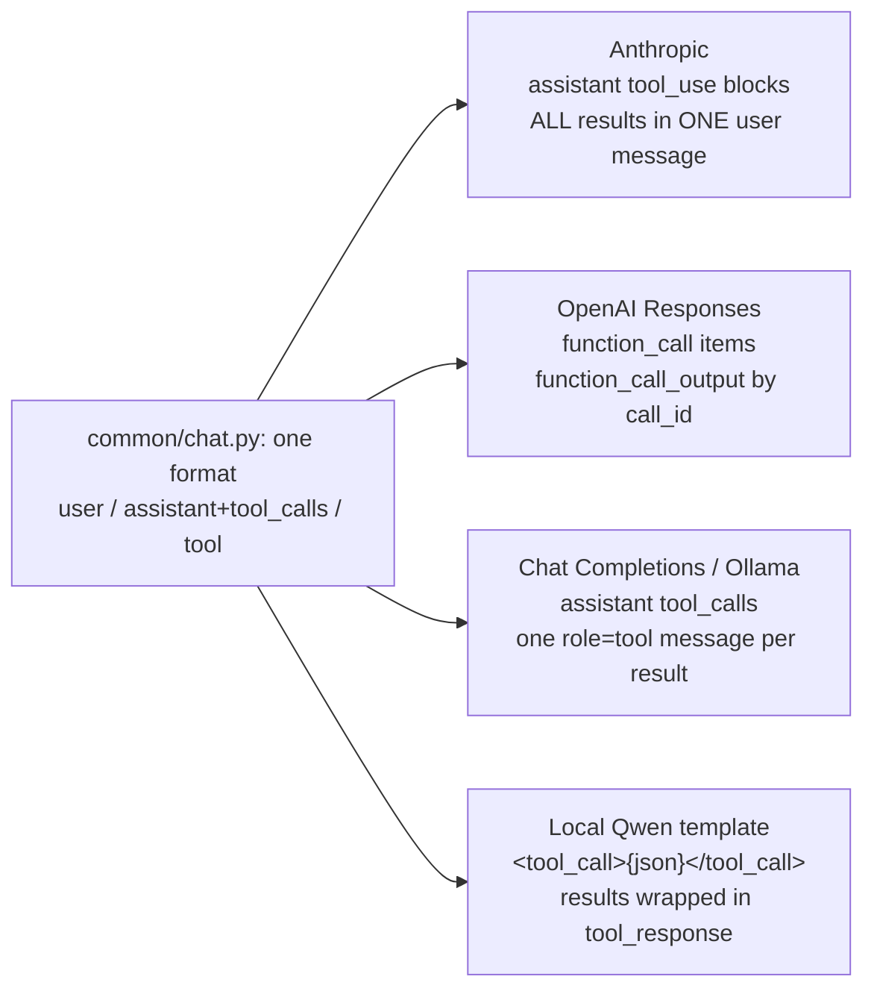

# Week 5, Day 1: Function Calling: The Model Asks, Your Code Acts

**Time:** ~3h · **Needs:** nothing for the tool code; the local Qwen model (or any API key) for the live run

## Learning objectives
- Explain what function calling actually is: a **protocol for the model to request an action**, never the model running code.
- Write tools as typed Python functions and generate their JSON Schema from the signature + docstring.
- Run the request → execute → respond loop, including **parallel calls** and **errors the model can recover from**.
- Know the three wire formats (Anthropic, OpenAI Responses, Chat Completions/Ollama) and why one internal format is worth having.
- Use `tool_choice` to force, forbid or allow tool use.
- Measure tool use by **what the model did**, not only by what it said.

---

## 1. The model never runs anything

An LLM produces tokens. "Function calling" means the provider has trained the model to emit a *structured request* when it decides a tool would help, and gives your code a clean way to read it. Your program does the work and sends the result back as the next message.



Three consequences worth tattooing somewhere:
1. **The tool description IS the prompt.** The model decides from the name, description and parameter docs alone.
2. **Arguments are untrusted input.** They come from a model that can be wrong, confused or manipulated (Week 8). Validate them like user input.
3. **Every call must be answered.** If you drop one result, providers return an error or the model loses the thread.

## 2. Tools as typed functions

`common/tools.py` builds the schema from the signature and a Google-style docstring:

```python
@tool
def convert_units(value: float, from_unit: str, to_unit: str) -> str:
    """Convert a value between units of the same kind (length, mass, volume or temperature).

    Args:
        value: The number to convert.
        from_unit: Unit symbol such as km, mi, ft, kg, lb, l, gal, c, f or k.
        to_unit: Unit symbol to convert into; must measure the same kind of thing as from_unit.
    """
```

becomes (abridged):

```json
{"name": "convert_units",
 "description": "Convert a value between units of the same kind ...",
 "parameters": {"type": "object", "additionalProperties": false,
   "properties": {"value": {"type": "number", "description": "The number to convert."},
                  "from_unit": {"type": "string", "description": "Unit symbol such as km, mi, ..."},
                  "to_unit":   {"type": "string", "description": "..."}},
   "required": ["value", "from_unit", "to_unit"]}}
```

The registry's `execute` does what a careful engineer would do at an API boundary:

| Situation | What the model sees |
|---|---|
| Unknown tool name | `Unknown tool 'x'. Available tools: calculate, convert_units, ...` |
| Wrong/missing/extra argument | `Invalid arguments for convert_units: value: Input should be a valid number... Expected: ...; required: [...]` |
| The tool raises | `Tool calculate failed: ZeroDivisionError: division by zero` |
| Slow tool | `Tool x timed out after 30s.` |
| Huge result | the first N characters + `[truncated: 9000 more characters; narrow the request]` |

All of these are returned **as a tool result with `is_error=True`**, never raised into the loop. The loop must survive anything a tool does. The *wording* matters: an error that says what is allowed (`Valid units: length: mm, cm, m, ...`) lets the model fix its own call on the next turn.

### Do not `eval()` a model's arithmetic
`calculate` is an AST walk with a whitelist: numbers, `+ - * / // % **`, parentheses, a few functions and constants. Everything else (`__import__`, attribute access, comprehensions, names) is rejected, and exponents are capped so `9**9**9` cannot hang the agent. The tests throw ten classic escape attempts at it. (Real isolation for code the model *writes* is Day 6.)

## 3. One internal format, three wire formats

Providers disagree about how a tool conversation is encoded:



You keep `messages` in the internal format and let the adapter translate. The tests verify the translation through the **real SDKs** against a local server that speaks each protocol: for example that Anthropic gets *exactly one* user message holding both `tool_result` blocks (splitting them is a common bug that produces API errors).

### Parallel calls
Models can return several calls in one turn. Run them concurrently (`execute_all` keeps the order) and send **all** results in one go. For independent lookups this cuts round trips: two sequential tool turns cost two model calls; one parallel turn costs one. Our local run did this on its own for "convert 5 km to miles **and** 10 lb to kg".

### `tool_choice`
| Value | Meaning | Use when |
|---|---|---|
| auto (default) | model decides | normal assistants |
| `any` / `required` | must call *some* tool | an extraction/routing step that must produce a call |
| a tool name | must call exactly that tool | forcing structured output through a "tool" |
| `none` | no tools this turn | summarising after enough evidence |

A forced choice must apply to the **first turn only**. If you keep forcing it, the loop can never end (the model is never allowed to answer). There's a test for exactly that.

### Strict schemas
Both major providers can constrain generation to the schema (`strict`): the arguments are then guaranteed to parse and match, which removes a class of retries. It requires a restricted subset of JSON Schema (all properties required, no unknown properties). Our generated schemas already follow that shape. Check each provider's current docs for what `strict` supports before relying on it, and keep validating on your side anyway: your `ToolRegistry` is the last line of defence.

## 4. The loop (≈20 lines)

```python
def run_tool_loop(question, registry, *, provider=None, max_turns=6, tool_choice=None):
    run = Run(question, messages=[{"role": "user", "content": question}])
    for _ in range(max_turns):
        t = chat.turn(run.messages, registry.specs(), system=SYSTEM, provider=provider,
                      tool_choice=tool_choice if run.turns == 0 else None)
        run.turns += 1
        if not t.wants_tools:
            run.answer, run.finished = t.text, True
            return run
        run.messages.append(chat.assistant_message(t))          # keep the model's request in history
        results = registry.execute_all(t.tool_calls)             # parallel, same order
        for call, res in zip(t.tool_calls, results, strict=True):
            run.messages.append(chat.tool_message(call, res.content, res.is_error))
    return run                                                   # finished=False: we ran out of turns
```

`max_turns` is the first of the guardrails Day 2 turns into a real agent (step budget, repeated-call detection, cost cap). Note the honest return value: `finished=False` says "I stopped, the model did not".

## 5. What a small model actually does (real run)

Everything below was **executed**: Qwen2.5-0.5B-Instruct locally with its native tool template, our six tools, eight questions (the exact transcript is in `outputs/w5d1_run.txt` after you run the solution):

| Question | What the model did | Verdict |
|---|---|---|
| `1250 * 0.08 + 15` | `calculate("1250 * 0.08 + 15")` → `115` | ✅ |
| 42.195 km in miles | **Wrote** "we can perform this using the `convert_units` function" and *didn't call it* | ❌ narrated instead of acting |
| 98.6 °F → °C | `convert_units(98.6, "f", "c")` → `37 c` | ✅ |
| days between two dates | `days_between` → `59` | ✅ |
| 45 days after 2026-02-10 | called **`weekday_of`**, answered "will be Tuesday" | ❌ wrong tool, confident wrong answer |
| weekday of 2026-07-04 | `weekday_of` → `Saturday` | ✅ |
| 5 km → mi **and** 10 lb → kg | **two parallel** `convert_units` calls | ✅ |
| "Say hello in French." | called an invented tool `say_hello_in_french` → our `Unknown tool` error → model apologised | ❌ (but the loop survived) |

**5/8 right tools, 5/8 right answers, 1 tool error.** Three different failure modes, all common with larger models too, just rarer:

1. **Narrating instead of calling** ("you could use convert_units"): a stop-reason of `end_turn` with no calls. Fix: a clearer system prompt, `tool_choice="required"` for steps that must call, or a verifier that notices when the answer contains numbers no tool produced.
2. **Choosing the wrong tool**: the descriptions overlapped (`add_days` vs `weekday_of`) or the model skimmed them. Fix: sharper descriptions (Day 3 measures this properly).
3. **Inventing a tool**: our `Unknown tool ... Available tools: ...` result is the right design, because a stronger model recovers from it on the next turn.

> This is a 0.5B model, run once per question (cached). Eight questions is a smoke test, not a benchmark: the intervals on `5/8` are enormous. Day 3 does the statistics. **Hosted models (Claude, GPT) were not run by the author (no API keys)**; run `LLM_PROVIDER=anthropic` (or `openai`) to see how much of this table turns green.

## 6. Pitfalls and production notes
- **Silent argument coercion is a bug source.** `extra="forbid"` means a misspelt argument becomes an error the model can fix, instead of a default quietly used.
- **Return strings the model can use**, units included (`"37 c"`), not bare floats.
- **Don't put secrets in tool results or descriptions**; they are context the model (and anyone who can influence it) sees.
- **Idempotency**: the model may call the same tool twice. Read-only tools are free; anything that writes needs an idempotency key or a confirmation (Weeks 5 D3 and 6).
- **Dates**: never let the model guess "today". Give it `current_date()`. (The solution reads `COURSE_TODAY` so tests are deterministic.)
- **Don't dump 40 tools on the model.** Selection accuracy falls as the menu grows; Day 3 and Day 4 return to this.

---

## Daily challenge: calculator + converter + date tools, with parallel calls

**Build** (reference: [`solutions/day1_solution.py`](solutions/day1_solution.py)):
1. `calculate` (safe arithmetic), `convert_units` (length, mass, volume, temperature), and date tools (`current_date`, `days_between`, `add_days`, `weekday_of`) as typed, documented functions.
2. A loop that handles **parallel tool calls** and feeds **errors back** to the model.
3. A question set with **expected tools and expected answers**, graded on both.

**Acceptance criteria**
- No `eval`/`exec`; ten escape attempts and `9**9**9` are rejected with an error message, not a crash or hang.
- Unit errors list the valid units; mismatched kinds (kg → m) say so; below absolute zero is rejected.
- Leap years and negative date offsets are correct.
- Every schema has `additionalProperties: false`, every parameter a description, every required field listed.
- A parallel turn returns all results in order, in the provider's required shape (test through at least one real SDK against the fake server).
- A forced `tool_choice` applies to the first turn only.
- Report: right-tool rate and right-answer rate over ≥8 questions, **plus a list of the failure modes you saw**.

**Stretch**
- Add a `tool_choice="required"` variant and measure whether it fixes "narrating instead of calling".
- Add a tool that returns structured JSON and compare the model's accuracy when it reads JSON vs a sentence.
- Add a per-call latency/cost table (`Run.cost_usd` is already tracked for API providers).

## Further reading
- Anthropic docs: *Tool use* (tool definitions, `tool_choice`, parallel tool use, handling errors).
- OpenAI docs: *Function calling* (Responses API, `strict`, parallel calls).
- Anthropic: *Writing effective tools for agents* (we use it heavily on Day 3).
- `common/chat.py` and `common/tools.py` in this repo, and their tests.
