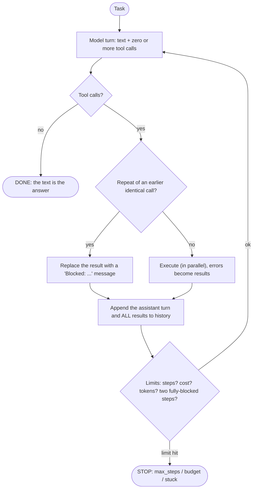

# Week 5, Day 2: The Agent Loop From Scratch (ReAct, Stop Conditions, Guardrails)

**Time:** ~3.5h · **Needs:** nothing for the harness and tests; a model for the live run (local Qwen works but is weak: that is part of the lesson)

## Learning objectives
- State precisely what makes something an **agent**, and what it is *not* (it is not a framework).
- Write the ReAct-style loop and the **stop conditions** every real loop needs.
- Add guardrails: step budget, cost/token budget, repeated-call blocking, "stuck" detection.
- Build **sandboxed file tools** and prove the sandbox holds (including symlinks).
- Grade an agent on **final state**, not on how convincing its text sounds.
- Read a trace to diagnose *why* a run failed: model, tool, or harness.

---

## 1. An agent is a loop where the model chooses the next step

Day 1's loop already ran tools. What changes on Day 2 is **who decides when to stop and what to do next**: the model. That freedom is the whole value, and the whole risk. In ReAct terms (Reason + Act): the model's text is its *thought*, its tool call is the *action*, the tool result is the *observation*.



There is no magic prompt format and no framework. The loop is `common/agent.py` (about 150 lines). Frameworks (Week 6) are conveniences over exactly this.

## 2. The guardrails, and what each one prevents

| Guardrail | Failure it prevents | Status when it trips |
|---|---|---|
| `max_steps` | endless loops, runaway cost | `max_steps` |
| **Last step hides the tools** (`tool_choice="none"` + a note in the system prompt) | the run ends with *no answer at all*; instead the model must summarise what it found | `done` (or `max_steps` if it still asks) |
| `max_cost_usd`, `max_total_tokens` | one bad run eating the budget; checked after every step | `budget` |
| Repeat blocking | the classic "call the same failing tool forever" | (no status; the call is refused with a message) |
| Two fully-blocked steps in a row | a model that ignores the "blocked" message | `stuck` |
| Provider errors caught | one 503 killing the batch | `error` (with the message) |
| Output cut at the token limit | mistaking a half answer for a final one | `truncated` |

Details that each have a test (and a mutant that proves the test is real):
- **Argument order does not hide a repeat** (`{"a":1,"b":2}` equals `{"b":2,"a":1}`).
- **Duplicates inside one step count**: two identical calls in one turn with `repeat_limit=1` execute once.
- **One blocked call alongside a new call is progress, not "stuck"**.
- **Calls requested on the last step are not recorded as calls made**, because they never ran. A test pins this: `run.calls` must match what is actually in the message history.
- **Statuses are honest**: `ok` means `done`. A run that ran out of steps never "passes", even if its last words happen to contain the right number.

```python
run = run_agent("Which file defines parse_config?", registry,
                max_steps=8, max_cost_usd=0.10, repeat_limit=2)
run.status, run.answer, run.errors, run.cost_usd
print(run.trace())     # what it said, called, got back, per step, with tokens
```

Two hooks keep the loop general: `context_hook(messages, run)` rewrites the history before each model call (Day 5 uses it for compaction) and `on_step(step)` streams progress to a UI or logger.

## 3. Tools that cannot escape: a sandboxed workspace

The agent gets four file tools over a project folder. The one security rule: **every path is resolved before it is checked**.

```python
def resolve(self, path):
    p = (self.root / path).resolve()      # resolves ".." AND symlinks first
    if p != self.root and self.root not in p.parents:
        raise ValueError(f"path {path!r} is outside the workspace")
    return p
```

Why the details matter, all tested:
- `../x`, `/etc/passwd`, `src/../..` and `~/../..` are refused by **all four** tools.
- A sibling folder `proj-evil` is not "inside" `proj` (a naive `startswith` check says it is).
- A *different* folder with the same name (`other/proj`) is not inside either.
- A **symlink inside the workspace pointing out of it** is refused by read/list/write.
- **Found by the tests, not by thought**: the recursive `grep` followed that symlink and happily returned the contents of a file outside the workspace. Resolving only the *starting path* is not enough; every file reached by walking must be re-checked. That is fixed and has its own test.

> A path check is a policy inside your own process. It stops a confused model and most mistakes. It does **not** stop a determined attacker running arbitrary code. Anything that executes model-written code needs real isolation (Day 6).

## 4. The fixture and the tasks

`build_workspace` writes a small deterministic project: four source files with five `TODO`s in total, `data/sales.csv`, a `VERSION` file, `config.toml`, and a 400-line log with exactly seven `ERROR` lines. Seven tasks, each graded on **final state**:

| Task | What a correct run does | Checker looks at |
|---|---|---|
| todo-count | `grep TODO src` | answer says 5 |
| find-def | `grep "def parse_config"` | answer names `src/config.py` |
| csv-total | read the CSV, `calculate` the sum | answer says 400 |
| write-report | `list_dir src`, then `write_file report.txt` | **the file's contents**, not the answer |
| version-port | read `VERSION` and `config.toml` | both facts present |
| log-errors | `grep ERROR logs/app.log` | answer says 7 |
| no-answer | notice the password is *not stored*, only the env var name `DB_PASSWORD` | answer mentions `DB_PASSWORD` |

The last one is a trap on purpose: the right behaviour is to **not invent a password**. Fixtures and checkers are verified independently of any model: a scripted agent solves each task in the minimum number of calls, and a *confident wrong answer* is rejected by every checker. That surfaced one checker bug: an answer ending in `5.` (a full stop) was rejected. `15` and `2.5` must still not match `5`, and a test pins both.

## 5. What actually happened (real run, Qwen2.5-0.5B, 7 tasks)

**Result: 0/7 passed.** 14 tool calls (minimum possible: 10), 10 of them errors, one run ended `stuck`. Reading the traces is the lesson:

| Task | What the trace shows | Cause |
|---|---|---|
| todo-count | called `grep` with `"/src"` (absolute), got *"outside the workspace"*, then tried `/usr/src/app`, then asked the user for the folder structure | **tool error didn't tell the model what to do** (we say what is wrong, not what is right); model gave up |
| find-def | listed the root, then repeatedly read `src/config.toml` (doesn't exist), until **repeat blocking** fired and the run ended `stuck` | model fixated; harness worked as designed |
| csv-total | read the CSV *correctly*, then answered **179.75** and invented a JSON result | model "did arithmetic in its head" despite a `calculate` tool; confident and wrong |
| write-report | no tool call at all; replied with a numbered plan | **narrates instead of acting** (Day 1's failure mode) |
| version-port | listed the root, then summarised the folder listing as if it were the answer | stopped one step early |
| log-errors | called `list_dir` on `/var/log/app.log` (a path from its training data) | hallucinated an absolute path, then asked the user |
| no-answer | listed the root, then claimed *"directories containing the database passwords"* | **fabrication where "not available" was the right answer** |

What this tells you:
- **The harness did its job**: no crashes, every error returned as text, the stuck loop was stopped after 5 steps, nothing wrote outside the workspace.
- **The model is not an agent.** A 0.5B model can emit a well-formed tool call (Day 1: 5/8) but cannot *plan across steps*, recover from errors, or resist inventing. Don't build agents on a model that can't.
- **Two failures are partly *our* fault** and are fixable without a better model: the path errors never said "use a path relative to the project root, like `src/app.py`", and the system prompt never told the model that the project root is `.`. Day 3 measures exactly this kind of fix.
- Input tokens grew **794 → 918 → 1043 → 1162** across one four-step run: the history is re-sent every turn. Day 5 is about that curve.

> **Not run by the author:** hosted models (no API keys). Expect Claude- or GPT-class models to pass most of these; the interesting question is *which* tasks still fail and why. Run `LLM_PROVIDER=anthropic` and read your own traces. Also note: the whole local run took ~19 minutes on a busy 8 GB laptop CPU (≈5 s/step), so treat local-model runs as slow experiments.

## 6. Pitfalls and production notes
- **Grade the outcome, not the prose.** `write-report` is checked by reading `report.txt`. If your agent changes state (files, tickets, rows), check the state.
- **Log everything**: the trace is your debugger. You can't fix what you can't replay.
- **Default `max_steps` low** (8–15) and make hitting it *visible*. An agent that silently stops at the limit looks like it "finished".
- **Don't let the model be the only safety.** The step cap, the cost cap and the sandbox are enforced by *your* code, not requested in a prompt.
- **Errors are prompts.** "outside the workspace" is correct but unhelpful; "use a path relative to the project root, e.g. `src/app.py`" lets a model recover.
- **Parallel execution** only helps independent calls; make sure tools are thread-safe (the file tools are read-mostly; `write_file` to the same path from two calls is a race you should prevent).

---

## Daily challenge: a raw-loop file agent

**Build** (reference: [`solutions/day2_solution.py`](solutions/day2_solution.py) on top of `common/agent.py`):
1. The agent loop with `max_steps`, repeated-call blocking, stuck detection, a cost/token budget, and a readable trace.
2. A sandboxed workspace with `list_dir`, `read_file` (paginated), `grep` (bounded output + total count) and `write_file`.
3. Seven tasks with final-state checkers, including one with **no answer in the data**.

**Acceptance criteria**
- Path traversal (`..`, absolute paths, same-prefix siblings, symlinks to files *and* folders, including via `grep`) is refused by every tool, with tests.
- Each task is solved by a *scripted* agent in the minimum number of calls, and each checker rejects a confident wrong answer.
- The loop never raises for a tool, provider or budget problem; it returns a status. A run that hits any limit never counts as a pass.
- Repeat blocking is argument-order-insensitive and counts duplicates within a step.
- Report the pass rate **and the failure category of each failing run** (model, tool design, or harness).

**Stretch**
- Add a `final_answer` tool as an explicit stop signal and compare it with "no tool call = done" on your failures.
- Re-run with a hosted model; for each task that still fails, say whether it is the model, the prompt or the tools.
- Make `write_file` refuse to overwrite an existing file unless `overwrite=true`; what does that do to the pass rate?

## Further reading
- Yao et al., *ReAct: Synergizing Reasoning and Acting in Language Models*.
- Anthropic, *Building effective agents* (workflows vs agents; keep the loop simple).
- `common/agent.py` and `tests/test_agent.py`: 21 tests, every guardrail mutation-checked.
