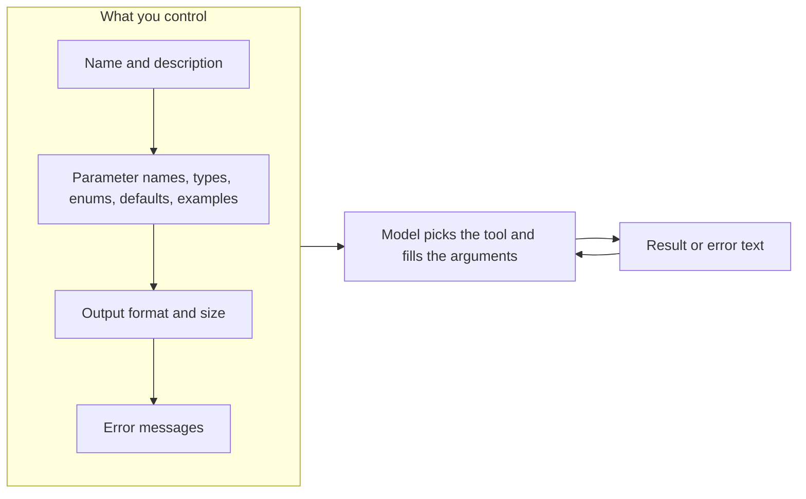
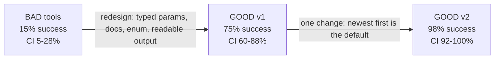

# Week 5, Day 3: Tool Design: The Agent-Computer Interface

**Time:** ~3.5h · **Needs:** nothing for the tools, tests and linter; the local model (or any API key) for the measurements

## Learning objectives
- Treat a tool definition as **the model's UI**, and design it with the same care as a human-facing API.
- Apply the main levers: **names and descriptions, parameter docs, enums, defaults, output format, pagination, errors, tool count and overlap**.
- **Measure** a redesign with a fixed question set, a strict scorer and a paired test, instead of eyeballing a few chats.
- Avoid the trap of **tuning on your own test set**, and check an improvement on held-out questions.
- Lint tool definitions statically, including those of a *third-party* MCP server.

---

## 1. The model can only see the interface

A human developer reads docs, tries things, and asks colleagues. The model gets a name, a description and a schema, once, in its prompt. Everything it knows about your tool is what you wrote. So tool design is mostly *writing for a reader who cannot ask questions*.

### The levers, with the reason for each
| Lever | Do | Why |
|---|---|---|
| **Name** | verb + object: `find_orders`, `get_order` | the model chooses by name first |
| **Description** | what it does, what it returns, **when NOT to use it** ("use `get_order` when you know the id") | resolves overlap between tools |
| **Parameters** | descriptive names, each with a description and an example | `q`, `f`, `n` tell the model nothing |
| **Closed sets** | `Literal[...]`/enum, never "a string that must be one of ..." | the schema prevents the error; a description only discourages it |
| **Defaults** | make the **common case the default** | the model rarely sets optional flags it was not asked about (measured below) |
| **Output** | one readable line per item, units included, ids the model can reuse in the next call | the result is the model's only view of the world |
| **Size** | `limit` plus "N more matched" hint; never dump everything | tokens cost money and crowd out the task (Day 5) |
| **Errors** | say what was wrong **and what is valid** | the model retries from your message |
| **Fewer, sharper tools** | consolidate overlapping tools; avoid near-synonyms like `get` / `fetch` / `lookup` | selection accuracy falls as the menu grows |

## 2. The experiment: same capability, two designs

A deterministic in-memory orders table (40 orders). The *same* lookups are exposed two ways:

| | BAD | GOOD |
|---|---|---|
| Search | `search(q, f, n)`, description *"Searches orders."* | `find_orders(customer_email, status, created_after, limit, newest_first)` with docs and examples |
| Filters | a hidden mini-language in `f`: `"status=shipped;after=2026-03-01;sort=desc"` | typed parameters; `status` is an **enum** |
| By id | `get(id)`, *"Gets stuff."* | `get_order(order_id)`, *"use find_orders to search by customer..."* |
| Everything | `list_all()` dumps all 40 rows | (does not exist; use `limit`) |
| Output | `{'id': 'A1001', 'c': 'alice@..', 's': 2, 't': 16300.0, 'd': '20260104'}` | `A1001 \| alice@example.com \| shipped \| $163.00 \| created 2026-01-04` |
| Errors | `Error: bad filter` | validation text listing allowed values; `limit must be between 1 and 50` |

> **The BAD design is deliberately awful** (real APIs are rarely *this* bad, so read the gap as an upper bound). What makes the comparison *fair* is verified by tests: **every one of the 40 questions can be answered perfectly with either design**, and the scorer is strict.

**Questions:** 5 kinds × 8 phrasings = 40: a customer's orders, customer + status, "the N most recent `<status>` orders", one order by id, status + created after a date. **Scoring:** execute the model's call(s); success only if the orders returned are *exactly* the expected set (a superset, a subset, no call at all, or `list_all` dumping everything all fail). A greedy local model is deterministic, so "trials" are different questions, not repeats.

### Results (real run: Qwen2.5-0.5B, local)

**A. First-call accuracy (40 questions)**

| | success (95% bootstrap CI) | called any tool | tool errors | by kind (✓ out of 8) |
|---|---|---|---|---|
| BAD | **15%** [5-28] | 35/40 | 20 | customer 4, cust+status 0, recent 0, by-id 2, after-date 0 |
| GOOD v1 | **75%** [60-88] | 40/40 | 1 | customer 8, cust+status 7, **recent 0**, by-id 7, after-date 8 |

Paired difference GOOD − BAD: **+60 points, CI [+45, +75]**, wins/losses/ties **24/0/16**. A paired test is the right tool here: both designs answer the *same* questions, so question difficulty cancels out.

How BAD failed: `search` was called 28 times, `list_all` 5 times (a dump, so never the exact set), `get` twice, and **5 times no tool at all**. Many `search` calls guessed the filter syntax (for example `f="shipped"` with no `key=`) and got `Error: bad filter`; 20 of the 40 BAD runs ended in an error.

**The instructive failure, GOOD `recent` = 0/8.** Every call was right *except* the model never set `newest_first=true`, even though the description says to for "most recent" questions. It asked for `limit=3, status="cancelled"` and got the three *oldest*. Models rarely flip optional flags nobody asked them to. The fix is a design change, not more prose:

**D. GOOD v2: newest first is the default** (the description and the parameter doc are rewritten to match; nothing else changes):

| | success | by kind |
|---|---|---|
| GOOD v2 | **98%** [92-100] | recent 8/8; the only miss is cust+status 7/8 |

Paired v2 − v1: **+22 points, CI [+10, +35]**, wins/losses/ties 9/0/31. Zero losses: the change broke nothing else.

**E. Held-out check.** v2 was designed *after* I looked at v1's failures on those same 40 questions, so +22 is optimistic by construction. I wrote **8 new "most recent" questions** (different wording and counts) afterwards: **v1 1/8 → v2 7/8**. The effect replicates, so it is not just fitted to the original questions. (Eight questions is small: treat it as confirmation, not as a precise rate.)

**B. Does a better error message help a weak model recover?** After a failing first call (`f="status:shipped"`, a plausible mistake), the model sees either the opaque `Error: bad filter` or a helpful one that states the syntax, allowed keys and values. Then it answers:

| | retried correctly | retried at all | **reply states the fix** |
|---|---|---|---|
| opaque error | 0/8 | 0/8 | 0/8 |
| helpful error | 0/8 | 0/8 | **5/8** |

An honest, mixed result: the 0.5B model **never retried** with either message (it replies to the user instead), so "retried correctly" can't show a difference. What *did* change is that after the helpful error, 5/8 replies quote the correct syntax (`key=value`, `status=shipped`) versus 0/8 after the opaque one. The information gets through; this model just doesn't act on it. A stronger model, or a loop that nudges "fix your call and retry", is where error text pays off. (`reply states the fix` is a regex heuristic, not a judge.)

**C. Context cost of one result** (characters, no model needed): `list_all` 3,113 · `search` (10 rows, cryptic format) 785 · `find_orders limit=10` 703 · `find_orders limit=3` 261. The dump costs **4.4×** the paginated, readable result for the same intent. Multiply by every step of an agent run (Day 5).

## 3. Lint your tool definitions before any model sees them

`lint_spec` checks the things a reviewer would flag: description shorter than 40 characters, a parameter with no description, a one-letter name, a closed-set-looking parameter (`status`, `sort`, ...) with no enum.

| tool | issues |
|---|---|
| BAD `search` | 7 |
| BAD `get` | 2 |
| BAD `list_all` | 1 |
| GOOD `find_orders`, `get_order` | **0** |

It is cheap, deterministic, and runs in CI. Day 4's test applies it to a real MCP server's tool list. (That same test file first failed because the MCP SDK ignores docstring `Args:` sections, so the parameters had no descriptions until we described them explicitly.)

## 4. Pitfalls and production notes
- **Don't tune on your own test.** Whenever you change a design after looking at failures, re-measure on questions you haven't looked at (here: 40 → 8 held-out).
- **Opaque flags lose to defaults.** If 90% of calls want the same option, make it the default and document it.
- **A closed set belongs in the schema.** `status="shipping"` is rejected with the allowed values listed; a free string is a silent wrong answer.
- **Don't rely on error text alone with weak models.** Combine it with a retry nudge in the loop, and measure.
- **Idempotency and safety**: read-only tools can be retried freely. For tools that write, the *tool* should protect (`create_note` refuses to overwrite unless `overwrite=true`; Day 4), because a model will retry.
- **Tool descriptions are an attack surface** (Week 8): a third-party server's descriptions are text that goes into your prompt.
- **Statistics, not anecdotes**: 5/8 vs 3/8 is noise; 24 wins, 0 losses on 40 paired questions is not.

> **Not run by the author:** hosted models (no API keys). The *direction* of every lever here is well established; the *size* of the gap on a strong model will be smaller (strong models cope better with bad tools), which is exactly why you measure on your own tools and model: `LLM_PROVIDER=anthropic uv run python .../day3_solution.py`.

---

## Daily challenge: redesign badly designed tools and measure the improvement

**Build** (reference: [`solutions/day3_solution.py`](solutions/day3_solution.py)):
1. A set of **three deliberately bad tools** (cryptic names and parameters, an undocumented filter language, a dump-everything tool, opaque errors) and a **redesigned** set with the same capabilities.
2. A **fixed question set** (≥30, several kinds) with strict, set-based scoring. Prove with tests that *both* designs can answer every question.
3. Measure first-call success for both, with **bootstrap CIs and a paired difference**.
4. Make one more design change motivated by a failure, then **re-measure on new held-out questions**.
5. A static `lint_spec` that flags the bad designs and passes the good ones.

**Acceptance criteria**
- A fairness test: every question is answerable by both designs (otherwise the comparison is rigged).
- The scorer rejects supersets, subsets, no call, and a dump of everything; question sets contain no empty answers.
- Report success rates with intervals, the paired difference with wins/losses/ties, and a **one-line cause for each failing question kind**.
- The held-out result is reported separately and the report says why it is needed.
- Context cost (characters per result) for at least two result formats.

**Stretch**
- Add an "error recovery" experiment with a loop that nudges the model to retry. Does the helpful message now matter?
- Consolidate `get_order` into `find_orders(order_id=...)`: does fewer tools help or hurt selection?
- Run the same suite on a hosted model and compare the *size* of each lever.

## Further reading
- Anthropic: *Writing effective tools for agents* (tool consolidation, namespacing, response formats, token efficiency, error messages).
- Anthropic: *Building effective agents*, appendix on prompt-engineering your tools (the agent-computer interface).
- OpenAI docs: *Function calling*, best practices for tool definitions.
