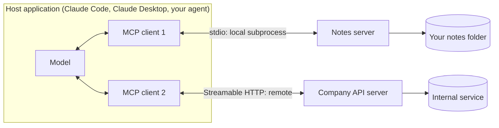
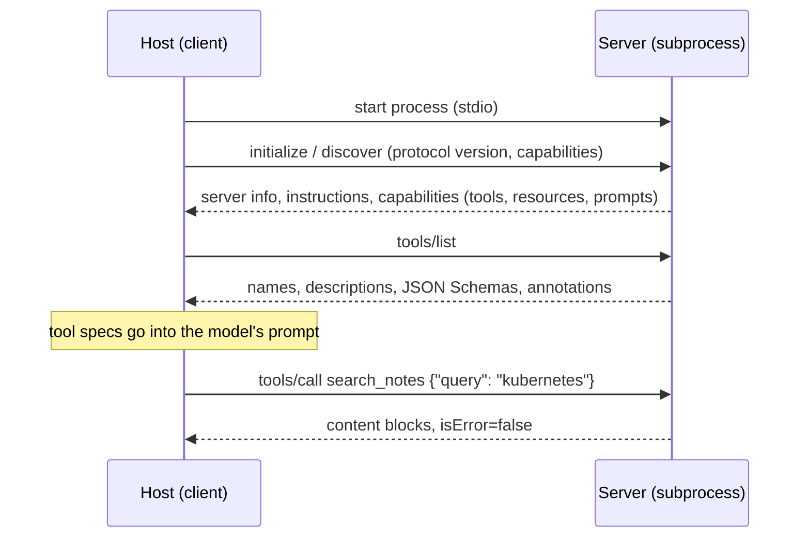

# Week 5, Day 4: Model Context Protocol: Build a Server, Use It From Anywhere

**Time:** ~4h · **Needs:** `pip install mcp` (the tests and demo use real subprocesses, no API key); optionally Claude Code or Claude Desktop to plug the server into

## Learning objectives
- Explain what MCP standardises and who controls each of its **three primitives** (tools, resources, prompts).
- Build an MCP server with the Python SDK, including **errors the model can read** and **tool annotations**.
- Test a server the way a host would: by launching it as a **real stdio subprocess** and speaking the protocol.
- Bridge an MCP server into your own agent loop with an **allowlist**.
- Know the security stance: an MCP server is trusted code, and its descriptions go into your prompt.

---

## 1. The problem MCP solves

Before MCP, connecting *N* AI applications to *M* tools meant *N × M* custom integrations. MCP is a small open protocol (JSON-RPC) so a tool is written **once** as a server and works in any host that speaks it: Claude Code, Claude Desktop, IDEs, or the agent you built on Day 2.



A **host** runs one **client** per **server**. Two transports matter: **stdio** (the host launches your server as a subprocess; for local tools) and **Streamable HTTP** (a deployed, possibly authenticated service).

### Three primitives, three different controllers
| Primitive | What it is | Who decides to use it | In our server |
|---|---|---|---|
| **Tools** | functions the model can call | the **model** | `search_notes`, `read_note`, `list_notes`, `create_note`, `append_to_note` |
| **Resources** | data addressed by URI (`notes://caching-ideas`) | the **application / user** (attach to context) | `notes://index`, `notes://{name}` |
| **Prompts** | reusable templates, often surfaced as slash-commands | the **user** | `summarize_note`, `weekly_review` |

Most servers are only tools; the other two are what make "attach this note" and "/weekly_review" possible in a host's UI.

### What happens at connection time


## 2. The server (`solutions/day4_notes_server.py`)

> **SDK version note.** `pip install mcp` currently installs the **2.x** line: the server class is `MCPServer` (it was `FastMCP` in 1.x) and the client is `Client`. If you need 1.x, pin `mcp>=1.28,<2`. Everything below was run against 2.2.0.

The logic is in a plain `NotesStore` (unit-testable without MCP); the server is a thin layer:

```python
mcp = MCPServer("notes", instructions="Personal markdown notes. Search first, then read ...")

@mcp.tool(annotations=READ_ONLY)
def search_notes(
    query: Annotated[str, Field(description='Words to look for, e.g. "kubernetes upgrade plan".')],
    limit: Annotated[int, Field(description="Maximum notes to return (1-20).")] = 5,
) -> str:
    """Search all notes for words; best matches first, each with matching lines.
    Use this before read_note when you do not know the exact note name."""
    return fmt_hits(guard(lambda: store.search(query, limit)))
```

Three SDK behaviours that cost me time, all now covered by tests:

1. **Exception text is hidden from the model.** Raise `ValueError("no such note")` and the model sees only `Error executing tool X`; the message stays in the server log. To be *helpful*, raise **`ToolError`**: `Error executing tool read_note: no note named 'nope'. Existing notes: caching-ideas, ... Use search_notes to find one.` The `guard()` wrapper converts our domain errors into `ToolError`, so every failure tells the model what to do next (Day 3's rule).
2. **Docstring `Args:` sections are not turned into parameter descriptions.** The first version had no per-parameter docs at all (the Day 3 linter flags this). Use `Annotated[type, Field(description=...)]`. A test now runs `lint_spec` over the live server's tool list.
3. **stdout is the protocol channel in stdio mode.** A stray `print()` corrupts the stream. Log to stderr. (A test starts the server with no `NOTES_DIR` and checks the error goes to stderr and stdout stays empty.)

### Annotations: hints, not guarantees
```python
READ_ONLY = ToolAnnotations(read_only_hint=True,  destructive_hint=False, idempotent_hint=True,  open_world_hint=False)
OVERWRITE = ToolAnnotations(read_only_hint=False, destructive_hint=True,  idempotent_hint=True,  open_world_hint=False)
```
Hosts use these to decide when to ask for confirmation (read-only tools may run unprompted; destructive ones get a prompt). They are **hints from the server**, which a host should not trust from an untrusted server. Real protection lives in the tool itself:

- `create_note` **refuses to overwrite** unless `overwrite=true`, and its description says that flag *deletes the old text*. The model must opt in, and the error tells it to use `append_to_note` instead.
- Note names must match `^[a-z0-9][a-z0-9_-]{0,63}$`: no `/`, `..`, spaces or dots. A **symlink** inside the folder that points outside is neither listed, searched, read nor overwritten (tested for all four).
- Size limits (50,000 characters per note, 500 notes) and a bounded search.

## 3. Testing a server like a host would

Unit tests cover `NotesStore` (names, traversal, symlinks, ranking, overwrite, append, limits). The part that matters for MCP is the **integration test**: spawn `python day4_notes_server.py` as a real subprocess and speak the protocol to it:

```python
with McpBridge(stdio(sys.executable, SERVER, env={"NOTES_DIR": str(root), **os.environ})) as bridge:
    bridge.list_tools()                                   # discovered over the wire
    bridge.call_tool("search_notes", {"query": "kubernetes"})
    bridge.read_resource("notes://index")
    bridge.get_prompt("summarize_note", {"name": "reading-list"})
```

These tests check: the five tools and their schemas arrive; errors reach the model as readable text; writes change the folder; overwrite needs the flag; resources, templates and prompts work; parallel calls through one connection come back in order; a server that exits immediately or never starts produces a clear `McpError`; closing the bridge stops its thread.

## 4. Using the server from your own agent (`common/mcp_tools.py`)

The MCP SDK is async and holds one long-lived connection; our tool registry runs tools from worker threads. `McpBridge` owns a background thread with an event loop that keeps the connection open and exposes blocking methods, then converts the server's tools into a normal `ToolRegistry`:

```python
with McpBridge(stdio("python", "day4_notes_server.py", env=...)) as mcp:
    registry = mcp.registry(allow={"search_notes", "read_note", "list_notes"})   # NOT create/append
    run = run_agent("Who owns the kubernetes upgrade?", registry)
```

Design decisions, each with a test:
- **Allowlist.** The agent only sees (and can only call) the tools you list. A call to a hidden tool is `Unknown tool`, not forwarded. Asking for a tool the server doesn't offer raises, so a typo can't silently weaken your policy.
- **Server errors arrive verbatim** (`ToolFailure`), not wrapped in exception-class noise.
- **Timeouts and truncation** still apply, because remote tools go through the same registry path as local ones.
- A `prefix` option namespaces tools when you connect several servers.

## 5. Plugging it into Claude Code or Claude Desktop

```bash
# Claude Code (user-level, runs the server as a subprocess when needed)
claude mcp add notes -e NOTES_DIR=$HOME/notes -- uv run python /abs/path/solutions/day4_notes_server.py

# Claude Desktop: add to its config file
{"mcpServers": {"notes": {"command": "uv",
   "args": ["run", "python", "/abs/path/solutions/day4_notes_server.py"],
   "env": {"NOTES_DIR": "/abs/path/to/notes"}}}}

# Interactive inspector (try tools by hand, see the raw JSON)
uv run mcp dev weeks/week05_tool-use-and-agents/solutions/day4_notes_server.py
```
> **Not run by the author:** connecting to Claude Code or Claude Desktop (this would change your configuration, and there is no hosted model access here). The same server **was** driven end to end over real stdio by the SDK's own client. Use `/mcp` inside Claude Code to see the connection status.

## 6. What happened with a real (small) model

`day4_client_demo.py` starts the server, discovers its tools through MCP, and lets the local Qwen2.5-0.5B answer four questions with the read-only tools:

| Question | What happened | Cause |
|---|---|---|
| Who owns the kubernetes upgrade? | called `search_notes`; the result named `meeting-2026-03-14`; the model answered that **the owner is "meeting-2026-03-14"** | misread the result (a note *name* as a person); it should have `read_note`d it |
| When does my flight to Hanoi land? | **no tool call**; asked the user to "perform a search" | narrates instead of acting (Day 1) |
| What did I write about cache keys? | `read_note("cache keys")`, got the helpful *invalid note name ... e.g. 'meeting-2026-03-14'* error, then **apologised to the user** instead of retrying | the error was good; the model didn't act on it (matches Day 3, experiment B) |
| What is my favourite colour? (no such note) | no search; rambled | never looked, so it could not say "not found" |

**0/4.** The point is not the score. MCP gives you **standard plumbing**; it does not make the model plan, read results carefully or retry. Those are Day 2/3/5 problems and they look identical behind a server. What *is* verified, with the model removed from the picture: with a scripted model the same four questions pass 4/4 through the real subprocess (and 0/4 when the model "answers" without searching, which the checker now enforces).

> The first version of this checker passed the last question by accident: the regex `no` matched inside the word "**no**te". The model hadn't searched at all. Checkers get bugs too; `must_search` plus a stricter pattern and a test for that exact mistake fixed it.

## 7. Security: an MCP server is code you trust
- **Tool descriptions are prompt text.** A malicious or compromised server can put instructions in a description (or a result) ("tool poisoning" / indirect prompt injection). Prefer servers you wrote or audited, pin versions, and expose only what you need with an allowlist. Week 8 attacks this directly.
- **Least privilege per server**: a notes server gets the notes folder, not your home directory; a database server gets a read-only role.
- **Confirm destructive actions** in the host, and make destructive tools opt-in at the tool level.
- **Remote servers need real auth** (the protocol supports OAuth-based authorisation); never expose a stdio-style local server on a network port.

## 8. Pitfalls
- Printing to stdout in a stdio server; hanging servers with no startup timeout (the bridge has one); leaving the subprocess running after a failed test (the bridge `close()`s and its thread is a daemon).
- Returning huge results: truncate and paginate (Day 3). The registry also truncates, but the server should shape its own output.
- Over-exposing tools: every tool you list costs prompt tokens on **every** turn and competes for selection.
- Assuming a host will honour annotations.

---

## Daily challenge: an MCP server for a notes folder, used from a host

**Build** (reference: [`solutions/day4_notes_server.py`](solutions/day4_notes_server.py), [`solutions/day4_client_demo.py`](solutions/day4_client_demo.py), [`common/mcp_tools.py`](../../common/mcp_tools.py)):
1. An MCP server over a folder of markdown notes with **≥3 tools** (search, read, write), **one resource**, and **one prompt**.
2. Errors the model can act on; destructive operations opt-in; safe names and a path-escape defence (including symlinks).
3. A test suite that launches the server as a **real subprocess** and exercises it through an MCP client.
4. Use it from a host (Claude Code or Desktop) *and* from your own agent loop via an allowlist.

**Acceptance criteria**
- Every tool parameter has a description (verify with a linter, not by eye).
- A missing note returns an error that lists existing notes; an invalid name explains the format; overwriting an existing note without the flag fails and leaves the file untouched.
- Symlinks pointing outside the folder cannot be listed, searched, read or overwritten.
- Starting without configuration exits with a readable message on **stderr**, with nothing on stdout.
- The agent's registry exposes only the allowed tools; a call to a hidden tool is an error.
- Mutation-check the search ranking and the overwrite guard: each mutant should be caught by a test.

**Stretch**
- Add a Streamable HTTP transport and a bearer-token check; connect to it by URL.
- Add a `notes://recent` resource and let the host subscribe to changes.
- Write a second server (for example, a read-only SQLite server from Week 4's `common/sqlsafe.py`) and connect both with name prefixes.

## Further reading
- modelcontextprotocol.io: the specification and the *Architecture* / *Server concepts* pages.
- The MCP Python SDK docs (py.sdk.modelcontextprotocol.io): *Get started*, *Clients*, and the v1 → v2 migration guide.
- Anthropic: *Writing effective tools for agents* (applies unchanged to MCP tools).
