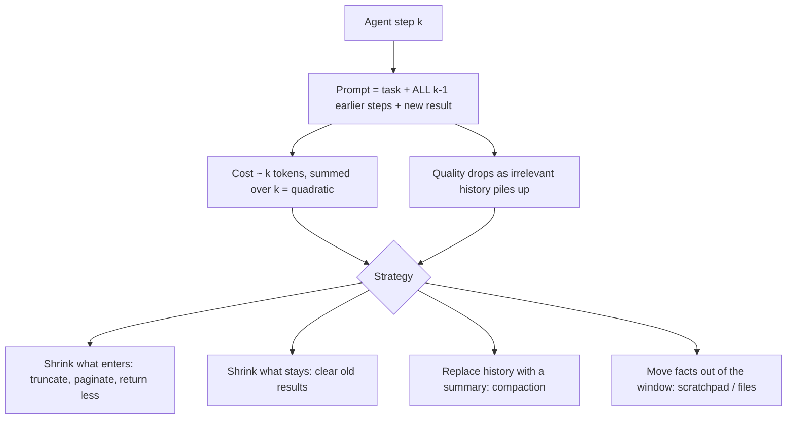

# Week 5, Day 5: Context Engineering for Long-Horizon Agents

**Time:** ~3.5h · **Needs:** nothing for the hooks, tests and simulation; the local Qwen model for the one real summariser

## Learning objectives
- Explain why an agent's cost grows **quadratically** with its step count, and measure it.
- Implement and compare four strategies: **truncation, clearing old tool results, compaction, and a scratchpad**.
- Keep the call/result **invariant** so trimmed histories are still accepted by providers.
- Know which strategies **lose information**, which ones **cannot recover it**, and why **order** matters.
- Pick a strategy with a number (tokens, codes recalled) instead of a feeling.

---

## 1. Why context is the scarce resource

Every model call re-sends the whole conversation. After *k* steps the prompt contains *k* tool results, so the cost of a run is the sum of an ever-growing prompt: quadratic in steps. Long prompts are also *worse*, not just pricier: relevant details get buried and models follow them less reliably the more noise surrounds them.

This is **context engineering**: deciding, at every call, what is in the window. (Prompt engineering is one input to it; so are tool outputs, memory and retrieval.)

## 2. The strategies, as hooks into the Day 2 loop (`common/context.py`)

Each is a *context hook*: `hook(messages, run) -> messages`, applied before each model call. `run_agent` keeps the hook's output as the working history (so a compaction is paid for once), and `run.transcript` keeps every message ever produced for debugging.

| Strategy | What it does | Loses | Cost |
|---|---|---|---|
| `truncate_tool_results(n)` | cap each result at *n* characters, with a visible note | the **tail** of every result | free |
| `clear_old_tool_results(keep_last)` | replace the content of old tool results with a placeholder; the **calls stay** | all old result contents | free |
| `Scratchpad` + `inject_notes` | `remember(key, value)` / `forget(key)` tools; the notes are re-shown at the top of every request | nothing the model chose to save | a tool call per note |
| `compact_history(summarizer, trigger_tokens)` | when over the trigger, fold older exchanges (not the task, not the last *k*) into a summary in the first message | whatever the summary omits | a summariser call |

### The invariant that makes trimming safe
Providers reject a conversation where a tool result has no matching call, or a call has no result. Every strategy works on **exchanges** (an assistant turn plus all its results) and never splits one. `check_invariants(messages)` is run on *every* model call in the experiment and in the tests (orphan result, unanswered call, interrupted call, duplicated call).

### Details worth knowing (each tested, each mutation-checked)
- Notes live **inside the first user message** (task, then summary, then notes), replaced on every call, never stacked and never added as an extra message. They are kept out of the summary (they are re-injected anyway).
- A second compaction **folds the previous summary into the next one**; a summariser that forgets to carry it forward loses the earlier facts. A test shows exactly that.
- Compaction triggers only when **strictly over** the threshold and only if there is something older than the last *k* exchanges.
- The summary is capped (`max_summary_chars`) so it cannot grow without bound.

## 3. The experiment: read 50 pages, report 5 codes

The task: `get_page(n)` returns a ~2,500-character page. Five pages end with `FACT: the access code for page N is XXXX-NNN`; every page also has a **decoy** (`Ticket reference QWE-123 (not an access code)`). After page 50 the agent must report the codes for pages 3, 17, 29, 44 and 48.

> **What is real and what is simulated.** Token counts are **real**: the Qwen2.5 tokenizer over exactly the messages each call received. The "model" is a **scripted policy**: it reads pages in order and, at the end, can only report codes **visible in its context** (page results, notes, or summary text). So *codes right* measures **what each strategy preserves**, not how well a real model would use it (a real model might also miss a visible code). The notes strategy assumes the model remembers to save each code; real models sometimes won't. One strategy uses a **real** summariser (Qwen2.5-0.5B).

### Results (executed)

| Strategy | Steps | Peak context | Total input tokens | vs naive | Codes right |
|---|---|---|---|---|---|
| naive (no trimming) | 51 | 17,124 | 437,072 | 100% | **5/5** |
| truncate results to 800 chars | 51 | 6,807 | 174,564 | 40% | **0/5** |
| clear old results (keep 3) | 51 | 2,675 | 90,965 | 21% | 1/5 |
| compaction, no summary | 51 | 5,915 | 162,524 | 37% | 1/5 |
| compaction, **Qwen summary** | 51 | 5,929 | 163,543 | 37% | 1/5 |
| clear old + scratchpad notes | 56 | 2,858 | 103,360 | 24% | **5/5** |

Every strategy kept the call/result invariant on all calls; none reported a *wrong* code (0 wrong in every row).

Context size at the call made on step *k* (tokens):

| Strategy | 1 | 10 | 20 | 30 | 40 | 50 |
|---|---|---|---|---|---|---|
| naive | 55 | 3,109 | 6,512 | 9,925 | 13,359 | 16,785 |
| truncate 800 | 55 | 1,254 | 2,607 | 3,957 | 5,321 | 6,669 |
| clear old (keep 3) | 55 | 1,266 | 1,606 | 1,975 | 2,297 | 2,643 |
| compaction, no summary | 55 | 3,109 | 1,453 | 4,866 | 3,181 | 1,454 |
| compaction, Qwen | 55 | 3,109 | 1,497 | 4,910 | 3,413 | 2,020 |
| clear old + notes | 55 | 1,301 | 1,377 | 2,004 | 2,387 | 2,438 |

### What the numbers say
1. **Naive is quadratic.** Reading the 50 pages costs **437k input tokens** while the pages themselves are about 17k tokens: ~25× overhead from re-sending history. (Prices are per input token, so cost scales the same way.)
2. **Head-truncation is the trap.** It cut the context by 60% and recalled **0/5**: the code is at the *end* of each page and a head-keeping truncation removes it **at the moment of reading**, before any later step could use it. Cap output where the information isn't (or return less, smarter: pagination, search, a "relevant lines" argument), not blindly.
3. **Clearing old results bounds the window** (peak 2.7k vs 17k) and is the cheapest fix, but it forgets everything outside the last three results (page 48 survived only because it was among them). Note it is **not flat**: each cleared result leaves a ~25-token placeholder and each call stays listed (≈ +34 tokens/step from step 10 to 50, versus ≈ +340 for naive).
4. **Compaction recovers the window but not the facts unless the summary keeps them.** With no summary it forgets like clearing does. The **real Qwen-0.5B summariser did not help (1/5)**. Its three summaries, inspected: #1 *"The provided text does not contain any pages or specific content to summarize"* (the transcript held TANGO-417 and the summary lost it entirely); #2 kept OSCAR-902 but not LIMA-058; #3 was a page-by-page recap of pages 44-46 with no codes. Small models are unreliable summarisers and **a summary is lossy by construction**: never trust it to carry an exact value.
5. **Notes win here: 5/5 at 24% of naive cost**, for 5 extra steps. The facts that must survive are written *outside* the history as exact values, then re-shown every call. That is the pattern behind agent "memory files" and todo lists.
6. **Order matters.** A test runs `clear_old → compact`: the summariser's input contains **no** `FACT:` line, because by the time compaction fires, the results were already cleared on an earlier call (hook output persists). Compact *before* clearing, or keep results uncleared for at least one compaction window.

### Which to use when
| Situation | Reach for |
|---|---|
| Tool results are big but only the latest matter | clear old results |
| Exact values/ids/decisions must survive | scratchpad notes (or write to a file) |
| Conversation is long and narrative (chat, coding sessions) | compaction with a **good** summariser, plus notes for exact values |
| A single result is huge | return less: pagination, a filter argument, or a search tool (Day 3) |
| One sub-task would flood the window | give it to a sub-agent with its own context; take back a short result (Week 6) |

## 4. Pitfalls and production notes
- **Prompt caching vs trimming.** Providers cache the *prefix* of your prompt. Editing an old message (clearing a result, inserting a summary) changes the prefix and **invalidates the cache from that point**. Trim in big, infrequent steps (compact at a threshold) rather than every call, and keep the stable parts (system prompt, tools) first. (Week 1, Day 4.)
- **Keep the transcript.** Trim the working history but log everything (`run.transcript`) so you can debug "why did it forget?".
- **Measure with the real tokenizer** (or the provider's token-count endpoint for Claude). `len(text)/4` was ~1.8× too high on this synthetic text (our approximate counter said 31k peak, the Qwen tokenizer said 17k).
- **Test summarisers on facts, not fluency.** Plant known values and check they survive, as above.
- **Notes need discipline.** Cap their size (`forget` exists for a reason), and make errors say what to do ("notes are full ... keys now: ...").
- **Summaries can be injected too:** whatever a tool returned and the model summarises ends up in the prompt as *your* text. Week 8.

> **Not run by the author:** a hosted model driving this task end to end (no API keys). The policy is deterministic by design, so the token and retention numbers above are reproducible; how well *Claude or GPT* would use notes, or summarise, is a separate experiment you should run: `LLM_PROVIDER=anthropic` with `llm_summarizer("anthropic")` and `inject_notes`.

---

## Daily challenge: an agent that survives a 50-step task inside a fixed context budget

**Build** (reference: [`solutions/day5_solution.py`](solutions/day5_solution.py) on top of [`common/context.py`](../../common/context.py)):
1. Context hooks for truncation, clearing, notes and compaction that **never break the call/result structure** (assert it on every call).
2. A 50-step task where **some facts must survive from early steps**, with decoys.
3. A comparison table: steps, peak context, **total input tokens**, and facts retained, for naive plus at least three strategies.
4. A hard **budget**: pick a window (for example 4,000 tokens) and show which strategies stay under it for all 50 steps.

**Acceptance criteria**
- Naive growth is shown to be roughly linear per step (and its total cost quadratic), with real token counts.
- At least one strategy keeps **all** the planted facts under the budget; at least one that cuts tokens does **not** (and you explain why).
- A test proves compaction folds the *previous* summary forward, and a test proves `clear → compact` starves the summariser.
- No strategy reports a wrong value (decoys are not mistaken for codes).
- Mutation-check the hooks: changing a boundary (`keep_last`, `>` vs `>=` on the trigger) must fail a test.

**Stretch**
- Add a **file-based memory**: the agent writes a `notes.md` with `write_file` and re-reads it; compare with `Scratchpad`.
- Add a **budget-enforcing hook** that escalates (truncate → clear → compact) until the window fits.
- Replace the scripted policy with a hosted model and measure how often it actually calls `remember` unprompted.

## Further reading
- Anthropic: *Effective context engineering for AI agents* (compaction, structured note-taking, sub-agent architectures, just-in-time retrieval).
- Anthropic docs: *Prompt caching*, and the context-editing / memory features in the API docs (verify current names and availability).
- Liu et al., *Lost in the Middle: How Language Models Use Long Contexts*.
