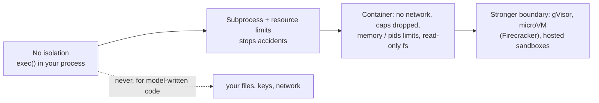

# Week 5, Day 6: Code-Executing Agents and Sandboxing

**Time:** ~4h · **Needs:** `pip install pandas` for the analysis agent; Docker Desktop for the container backend (its tests skip without it); the local Qwen model for the live run

## Learning objectives
- Explain why "let the model write code" is powerful, and why running that code on your machine is dangerous.
- Build a `run_python` tool with **resource limits, timeouts, process-group cleanup, a minimal environment and a throw-away directory**.
- State **exactly** what a subprocess sandbox stops and does not stop, backed by tests that attempt each escape.
- Use a **container** (no network, memory/CPU/pids limits, read-only filesystem, unprivileged user) for untrusted code.
- Design the tool's *output* for the model: bounded, with the **end** of a traceback.
- Know where computer-use and browser-use agents sit on the same spectrum.

---

## 1. Code as the action

Fixed tools cover what you anticipated. A code-executing agent can **compute**: group, join, plot, parse, loop, and check its own work. For data questions this beats a dozen narrow tools:

```python
@tool
def run_python(code: str) -> str:
    """Run Python 3 code in a fresh, isolated sandbox and return what it printed. pandas and numpy are installed.
    The file sales.csv is in the working directory. Only printed output (stdout) is returned, so print() every
    result you need. There is no network, and variables do NOT persist between calls: load the data again each time."""
```

The price: the model's output is now **arbitrary code running with your privileges**. The code may be wrong (an infinite loop), careless (deleting files), or **adversarial** (a prompt-injected document told the model to exfiltrate your keys). So the question is never "will it run safely" but "what is the worst it could do, and what stops it".



Each step right costs more setup and startup time and buys a stronger guarantee. Pick by **who writes the code and what an attacker could gain**: your own scripts, a trusted-ish model on your data, or text from the internet steering a model.

## 2. The subprocess sandbox (`common/sandbox.py`)

`SubprocessSandbox.run(code, files=...)` writes the code to a fresh temporary directory, starts a new Python in a **new process group**, and returns a `SandboxResult` (stdout, stderr, return code, which limit fired, seconds, files created).

| Mechanism | What it stops | Tested by |
|---|---|---|
| wall-clock timeout, then `killpg` | endless loops, `sleep(3600)` | busy loop and sleep loop |
| `RLIMIT_CPU` | CPU burn even with a generous wall clock (`SIGXCPU`, reason `cpu limit`) | 30 s wall / 1 s CPU |
| `RLIMIT_FSIZE` on files **and the stdout/stderr files** | output floods and huge files (reason `file size limit`); the parent never reads more than `max_output_bytes` | endless `print`, a 10 MB write |
| kill the whole **process group**, also after a normal exit | children the code started (`sleep 60`) outliving the run | grandchild PID is gone after a timeout and after success |
| minimal environment (`PATH=/usr/bin:/bin`, `HOME=<temp>`) | leaking `ANTHROPIC_API_KEY` and friends to the code | a secret env var is absent; PATH is exactly minimal |
| throw-away working directory, deleted afterwards | state leaking between runs, littering your project | files do not persist; the directory is gone |
| limits applied **inside the child** (a launcher), not with `preexec_fn` | `preexec_fn` is unsafe when the parent has threads, and an agent's tool executor does | 6 sandboxes in parallel threads, no interference |

Output is written to files (bounded by `RLIMIT_FSIZE`) rather than read through pipes, so a flood cannot exhaust your memory while you wait for it.

### What it does NOT stop (and the tests prove it)
Three tests named `test_GAP_...` assert that these **succeed** inside the subprocess sandbox. They exist so the documentation cannot drift away from reality, and they fail if someone "fixes" one without updating the lesson:

- **Reading any file you can read** (`~/.ssh`, `.env`, your whole project).
- **Opening network connections** (exfiltration, reaching internal services).
- **Writing outside its directory.**

Also not stopped on macOS: memory (`RLIMIT_AS` is not enforced there), and a **fork bomb** (those two are never run on the host in this repo; they run only in Docker).

> A subprocess with rlimits protects you from **mistakes**: the 5-minute loop, the 2 GB log, the stray child process. It does not protect you from **malice**. For anything an attacker can steer, use a container or stronger.

## 3. The container sandbox

`DockerSandbox` runs the code with every hardening flag we know to use:

| Flag | Effect |
|---|---|
| `--network none` | no network at all |
| `--memory 128m --memory-swap 128m` | an OOM kill instead of eating your RAM |
| `--cpus 1`, `--pids-limit 64` | bounded CPU and process count: a fork bomb stalls at the limit |
| `--read-only`, `--tmpfs /tmp:size=16m,noexec` | cannot modify the image; scratch space is small |
| `--cap-drop ALL`, `--security-opt no-new-privileges`, `--user 65534:65534` | no Linux capabilities, no privilege escalation, runs as `nobody` |
| `-v <tempdir>:/work:ro` | only the input directory is visible, read-only |
| `--rm`, a unique `--name`, and `docker kill <name>` on timeout | **killing the `docker` CLI does not stop the container**; we kill the container itself (a test asserts no container is left running) |
| output capped inside the container (`head -c`) | a flood cannot fill the CLI's memory |

### The escape matrix (executed)

The same hostile snippets, run against both backends (`escape_matrix()` in the Day 6 solution; the fork bomb and the 600 MB allocation are **only** ever run in Docker):

| Attempt | Subprocess | Docker |
|---|---|---|
| infinite loop | BLOCKED | BLOCKED |
| output flood (endless `print`) | BLOCKED | BLOCKED |
| write a 50 MB file | BLOCKED | BLOCKED |
| read a "secret" canary file outside the sandbox | **ALLOWED** | BLOCKED |
| read your environment variables | BLOCKED | BLOCKED |
| open a network connection (to a local listener) | **ALLOWED** | BLOCKED |
| write a file outside its working directory | **ALLOWED** | BLOCKED |
| fork bomb | not run on the host | BLOCKED |
| allocate 600 MB (128 MB limit) | not run on the host | BLOCKED |

That table *is* the lesson. Resource abuse is easy to stop; **confidentiality and network are not stopped without a container**.

Limits of this repo's container tests: they ran against `python:3.12-slim` on Docker Desktop for Mac (a Linux VM), so they show the flags work as intended there. Docker is **not** a perfect boundary either (kernel and runtime vulnerabilities exist); when the stakes are high, add a user-space kernel (gVisor) or a microVM, or use a hosted sandbox service, and keep secrets out of the sandbox entirely. The Docker backend also mounts inputs read-only, so it cannot hand back files the code creates; extend it with a writable output directory if you need that. A pandas image is a one-line `Dockerfile` (`FROM python:3.12-slim` + `RUN pip install pandas`) that you build once; the agent below uses the subprocess backend for pandas because it is installed on the host.

## 4. Designing the tool for the model

- **Return what the model needs**: stdout first; on failure only the **last ~12 lines** of the traceback (its end names the error; the top is noise); a note when output was truncated or a limit fired (`[stopped: timeout after 20s]`); the names of any files created. No output at all returns a hint (`use print()`).
- **Clean tracebacks.** The first version showed the sandbox launcher's own frames (`runpy.run_path ...`) in every error: noise that wastes tokens and confuses a model. The launcher now `exec`s the code and prints only the code's frames (`File "main.py", line 3, in <module>`); a test pins it.
- **Stateless by default.** Each call starts clean: simple, safe, and reproducible, but the model must re-load data every time. The description *says so*, because a model that assumes a persistent session writes `print(df.shape)` and gets `NameError` (a test asserts exactly that message). A persistent interpreter is faster for iterative analysis but needs a sandbox per *session*, timeouts per call, and memory growth control.
- **Put the schema where the model can see it** (system prompt and a `describe_data` tool). Don't make it discover column names by failing.

## 5. The data-analysis agent and a real (small) model

The dataset: 240 orders with messy rows (6 missing `units`). Seven questions. **Every ground truth is computed in plain Python**, then cross-checked: a scripted agent runs real pandas code in the real sandbox and its output must equal the key for all seven tasks (so a pandas mistake cannot hide in both the key and the solution). Every checker also rejects a confident wrong answer, and a hedging answer that names several candidates.

**Live run: Qwen2.5-0.5B, 7 tasks → 0/7 passed.** Reading the traces:

| Task | What it did | Failure |
|---|---|---|
| total revenue | `sum(sales['Revenue'].values)` → `NameError: name 'sales'` ... then stopped | **invented a variable and a column** instead of `pd.read_csv('sales.csv')`; **announced a retry in text and never called the tool** (the loop ends when there is no tool call) |
| top region | called `describe_data`, then answered *"south, with a total revenue of $240"* | never ran an analysis; **$240 is the row count it saw**. (The answer "south" happened to be correct, which is why the checker now requires a *successful sandbox run*: a lucky guess is not an analysis) |
| average units, product B | `describe_data`, then *"240 units"* | reused the only number it had seen |
| missing units | `describe_data`, then *"240 rows"* | same |
| top month | `describe_data({"code": ...})` | passed `code` to the wrong tool; our strict schema rejected it; the model apologised |
| north in March | a pandas expression with mismatched brackets → `SyntaxError`; then *"The code executed successfully..."* | **claimed success after a syntax error** |
| top product | `sales.groupby(...)` without loading → `NameError`; "I'll correct and rerun" and stopped | same as the first |

All the harness behaviour worked: the sandbox returned short, readable tracebacks, nothing crashed, the strict schema caught a stray argument. The model failed to plan, to load data, and to retry. This is a 0.5B model; **hosted models were not run by the author (no API keys)**, and code-writing is where large models are strongest, so expect most of these to pass. The point of the exercise is the harness: *with* a strong model, the sandbox decides whether a bad day is an annoyance or an incident.

## 6. Computer use and browser use (overview)

A *computer-use* or *browser-use* agent runs the same loop with different tools: **screenshot in, mouse/keyboard/URL actions out**. It is code execution's riskier cousin: it can click "buy" or "send", and it **reads untrusted web pages** that can contain instructions aimed at the agent (indirect prompt injection; Week 8). The sandbox rules above apply even more strongly: run it in a disposable VM or container with no access to your logged-in browser profile, no stored credentials, an allowlist of domains, a human confirmation for irreversible actions, and a hard step and time budget. Prefer an API or a structured tool over clicking whenever one exists; it is faster, cheaper and safer.

## 7. Pitfalls and production notes
- **Never `exec()` model code in your own process**, and never in a process that holds credentials.
- **Layer timeouts**: per-call (sandbox), per-run (agent step budget), per-request (your service).
- **Secrets**: the sandbox gets none. Pass data in; never environment variables; never mount your home directory.
- **Dependency installs** are a network and supply-chain risk: bake dependencies into the image, disable the network at run time.
- **Clean up**: temp directories and containers (`--rm`, unique names, kill on timeout); a leaked container is a leaked resource.
- **Reproducibility**: record the code the model ran and its output (the agent trace already does). When an answer looks wrong, the code is the evidence.
- **Don't trust the narration.** The model said "executed successfully" after a syntax error. Check results, not claims.

---

## Daily challenge: a data-analysis agent that runs pandas in a sandbox

**Build** (reference: [`solutions/day6_solution.py`](solutions/day6_solution.py), [`common/sandbox.py`](../../common/sandbox.py)):
1. A `run_python` tool backed by a sandbox with: wall-clock timeout, CPU limit, output cap, file-size limit, minimal environment, throw-away working directory, process-group cleanup.
2. A container backend with network off and memory/pids limits.
3. A dataset with a ground truth computed *independently of pandas*; ≥6 analysis tasks with answer checkers; a pass requires **successful code execution**, not just a plausible answer.
4. An **escape matrix** for both backends.

**Acceptance criteria**
- A test for each of: infinite loop, sleep, CPU burn, output flood, big file, grandchild process, secret environment variable. Each is stopped, reported with a reason, and leaves nothing running.
- Tests that document what the subprocess backend does **not** stop (file read, network, write outside).
- The Docker backend blocks network, host files, writes, a memory bomb and a fork bomb (tests skip cleanly without Docker), and leaves no container running after a timeout.
- Tracebacks returned to the model contain only the code's own frames and at most ~12 lines.
- A scripted agent solves every task with real pandas in the sandbox and agrees with the plain-Python key; each checker rejects a confident wrong answer.
- A correct answer with no (or only failing) code execution does not pass.

**Stretch**
- Add a writable output directory to the Docker backend and let the agent return a chart (PNG) or a CSV.
- Build a **persistent session** sandbox (one container per conversation) and measure how it changes the number of steps.
- Run the task with a hosted model and categorise each failure as model, tool or sandbox.

## Further reading
- Docker docs: *Runtime options with memory, CPUs, and GPUs*; *Security* (capabilities, seccomp, read-only containers).
- gVisor and Firecracker project docs (stronger isolation for untrusted code).
- Anthropic: the code-execution and computer-use tool documentation, and the guidance on securing computer-use agents.
- OWASP Top 10 for LLM Applications: *Insecure Output Handling* and *Excessive Agency*.
