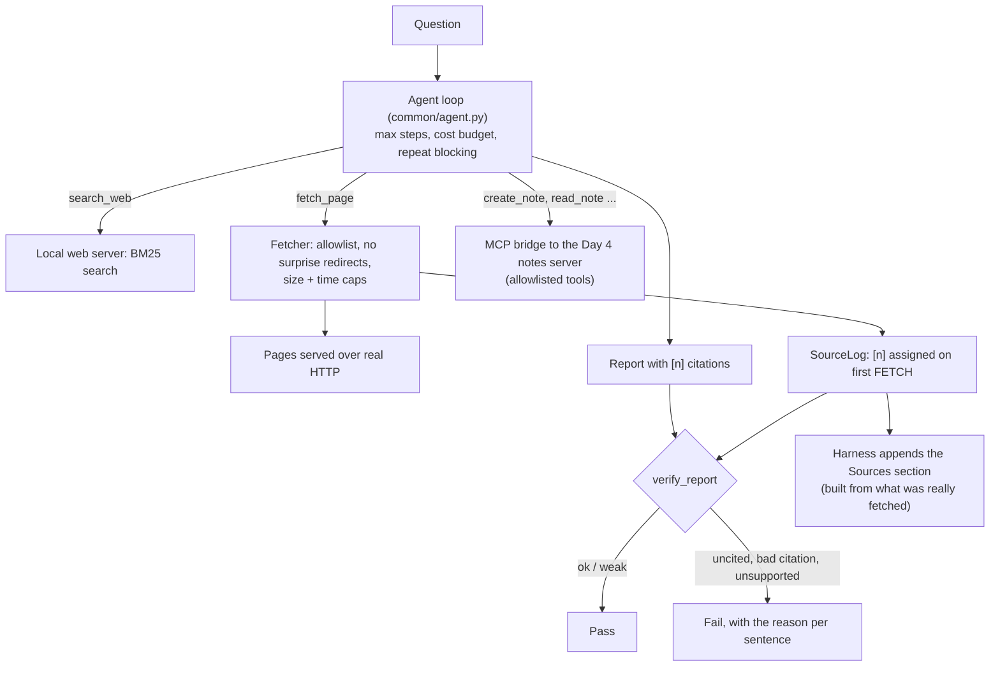

# Week 5, Day 7: Weekly Challenge: A Research Agent With Machine-Checked Citations

**Time:** ~6h · **Builds on:** Day 1 (tools), Day 2 (agent loop), Day 3 (tool design), Day 4 (MCP notes server), Day 5 (context hooks), Day 6 (isolation thinking) · **Needs:** nothing but this repo for the reference run; any model for the live run

## The brief

Build a **research agent**. Given a question, it must **search** a document collection, **read** the pages it needs, **take notes** through an MCP server, and write a short markdown report in which **every claim carries a citation `[n]`**. Then a *separate checker* decides whether those citations hold up. A report whose citations fail the check is a failed report, however fluent it reads.

The point of the week, in one project: an agent is a loop around a model; what makes it **trustworthy** is everything around the loop: safe tools, bounded budgets, managed context, and **verification of its output by something that is not the model**.



## Requirements

**R1. Tools (Day 1, Day 3).** `search_web(query, limit)` returns title, URL and snippet. `fetch_page(url, start)` returns a part of about 3,000 characters plus a continuation hint, and gives each page a stable source number **the first time it is opened**. Errors say what to do. Both are typed, documented and linted.

**R2. The fetcher is a security boundary (Day 6 mindset).** A URL comes from a model that may have read a poisoned page. It must: allow only exact `host:port` entries; refuse `file://`, bare paths, credentials (`user@host`) and malformed ports; follow redirects **itself** and **re-check the allowlist on every hop**; refuse non-text content; cap size and time.

**R3. The loop (Day 2).** Built on `run_agent` with a step budget, a cost budget, repeated-call blocking and a visible trace.

**R4. Notes via MCP (Day 4).** The agent saves findings through the notes server over stdio, exposing **only** `create_note`, `append_to_note`, `read_note`, `search_notes`, `list_notes`.

**R5. Context (Day 5).** Old page contents are cleared after the last few results so a long run stays bounded; the notes and the numbered sources carry what must survive.

**R6. Verified citations.** The checker flags, per sentence: **uncited**, **bad-citation** (an `[n]` the agent never opened), **unsupported** (the cited pages don't contain the sentence's words, or a number in it is not backed), **weak**, **ok**. The final report's **Sources** section is generated by the harness from what was actually fetched, so the model cannot invent a URL.

**R7. Evaluation.** At least five answerable questions with required facts and required source pages, and one **unanswerable** question where the correct behaviour is to say so and cite nothing.

## Acceptance criteria (the reference solution meets all of them)

| # | Criterion | How it is checked |
|---|---|---|
| 1 | Every attack URL is refused with a readable message | 12 parametrised cases: `file://`, `ftp://`, metadata IP, other host, other port, `localhost` vs `127.0.0.1`, no port, `127.0.0.1:PORT@evil.com`, `user:pw@host`, IPv6, malformed port |
| 2 | Redirects are re-validated on every hop | a redirect to the metadata IP is refused; a redirect loop stops; the forbidden hop is never requested |
| 3 | Non-text, oversized and slow responses are handled | binary refused; 50 kB body truncated at the cap; slow page times out |
| 4 | Source numbers are assigned on first fetch and are stable | re-opening keeps `[1]`; search creates none |
| 5 | The checker classifies each failure mode | invented number, citation to an unopened source, uncited sentence, off-topic claim, wrong source |
| 6 | Number checking is **local** | `4 of 9` is rejected when `0 of 9` is the claim's passage, even though `4` appears elsewhere on the page |
| 7 | A poisoned page cannot steer the harness | a scripted model *obeys* an injected instruction and tries the metadata IP and `file:///etc/passwd`; both refused, nothing reaches the server |
| 8 | A pass requires facts + required sources + verified citations | each requirement removed in turn makes a test fail |
| 9 | Unanswerable question: abstain **and** cite nothing | answering confidently, or abstaining *while* citing, both fail |
| 10 | Mutation check | fetcher (10 mutants), verifier (11), tools (6), search ranking (3), scoring and wiring: every mutant killed |

## The reference solution

```
solutions/weekly/research_agent/
  web.py       LocalWeb (BM25 search + pages over real HTTP), clean_markdown
  fetch.py     Fetcher: the SSRF boundary
  tools.py     search_web, fetch_page, SourceLog
  report.py    verify_report, render_final
  agent.py     research(): loop + MCP notes bridge + context hook
  evalset.py   6 questions and a strict scorer
  __main__.py  python -m research_agent "question" [--out report.md] [--provider ...] | --eval
```

```bash
cd weeks/week05_tool-use-and-agents/solutions/weekly
uv run python -m research_agent "In the Week 5 tool-design experiment, what success rate did the bad and redesigned tools achieve?" --provider anthropic
uv run python -m research_agent --eval --provider anthropic        # the 6-question evaluation
```

The "web" is this course's own lessons served by a local HTTP server, so everything runs offline while the agent still makes **real HTTP requests** through the real fetcher. To go live, point `search_web` at a search API and replace the allowlist with your own policy.

### How the checker decides (and where it is weak)
- **Lexical support**: the share of the sentence's content words that appear in the cited pages (≥ 0.6 ok, 0.4-0.6 weak, below that unsupported). Cheap and catches off-topic citations.
- **Numbers, two tiers.** *Distinctive* numbers (percentages, decimals, thousands, anything above 20) must appear in the cited pages. *Small integers* are so common that presence proves nothing (`4` is on every Week 4 page), so they must appear in the passage that best matches the sentence's words. A first version checked "appears anywhere on the page" and **accepted an invented "4 of 9"**; a test caught it, and the digit-glued tokens (`BM25`, `hit@1`) needed a boundary rule too.
- **What it cannot do.** It is a proxy for entailment: *"Corrective RAG rescued 9 of 0 misses"* reuses the right words and numbers and would pass. For meaning, add an NLI or judge step (Week 4, Day 2). Treat the lexical check as an always-on safety net, not the last word.
- **Code fences** inside a report are not claims (found by a test: code lines were being counted as unsupported sentences).

## Results

**Reference behaviour (scripted model, real HTTP, real MCP server): 6/6.** A scripted "oracle" searches, opens the right page, saves a note through MCP, and writes a supported report. This proves the *harness*: tools, fetcher, MCP bridge, checker, scoring and CLI all work end to end (`python -m research_agent --eval` prints `passed 6/6` in the CLI test).

**Live run, Qwen2.5-0.5B, 6 questions: 0/6 passed.** Executed with the real model (cached; see `outputs/w5d7_eval.txt` after a run). The checker earned its keep:

| Question | What the model did | The checker said |
|---|---|---|
| tool design | answered immediately, no search | `5 claims: 5 uncited`, no source opened |
| CRAG | searched, **found the right page**, then answered from the *search result's title* without opening it | `1 claims: 1 uncited` |
| context engineering | answered immediately | `10 claims: 10 uncited` |
| sandbox | *"None of the listed options can prevent a subprocess sandbox from stopping."* (nonsense; no search) | `1 claims: 1 uncited` |
| BM25 | answered immediately | `1 claims: 1 uncited` |
| unanswerable | searched, got an unrelated page, then wrote *"the 2026 football World Cup final was won by **Argentina**"* | `4 claims: 4 uncited`; fails the abstain requirement |

Every one of these is a fluent, confident, **ungrounded** answer, and every one is rejected mechanically, without a human reading it. That is the value of verification: the agent can be wrong, but it cannot be *silently* wrong. The model never used the notes tool; with 1-2 steps per question the context hook never fired either.

> **Not run by the author:** a hosted model (no API keys). A strong model should open pages and cite them, so the interesting measurements start there: *what fraction of its sentences are `ok`, how often is it `weak`, and does it ever cite a page it did not open?* Run `--eval --provider anthropic` and compare. Also not done: a real web search API and live websites.

## Rubric (100 points)

| Area | Points | Full marks |
|---|---|---|
| Fetcher safety (R2) and tests of each attack | 20 | every attack in the table refused; redirects re-checked |
| Tools and numbering (R1) | 10 | typed, documented, paginated; numbers on first fetch |
| Loop, budgets and context (R3, R5) | 15 | step/cost budgets; old results cleared; trace |
| MCP notes with an allowlist (R4) | 10 | only the five note tools reachable |
| Citation verification (R6) | 25 | every failure mode classified; local number check; harness-built Sources |
| Evaluation set and scorer (R7) | 10 | answerable + unanswerable; strict pass rule |
| Tests and mutation checks | 10 | each guard has a test that a mutant breaks |

## Stretch goals
- Replace the lexical check with an **NLI** check (`common/judges.py`) and measure how many `ok` sentences it overturns.
- Add a **claim-level repair loop**: feed the checker's findings back to the model ("sentence 3 is uncited, sentence 5 is unsupported") and allow one revision; measure the pass-rate change.
- Run a real model and compare **abstention behaviour** on 5 unanswerable questions.
- Put `fetch_page` in a **sandbox** (Day 6 container, network only to the allowlist) so even a compromised fetcher cannot reach anything else.
- Add a `compare_sources` tool for questions where two pages disagree, and require the report to say so.

## Retrospective prompts (write 5 sentences each)
1. Which single guard (allowlist, repeat blocking, budget, verification) would have saved you in the most failure cases in this week, and which was never triggered?
2. Where did you **trust the model** without a check? What would it take to remove that trust?
3. What did the live 0.5B run teach you that the scripted run could not? What did the scripted run prove that the live run could not?
4. Which of your tests failed on the first run, and what did that say about your mental model?
5. If a user pasted a URL to an attacker-controlled page into your agent tomorrow, what is the worst that could happen with this design, and what is the next control you would add?
