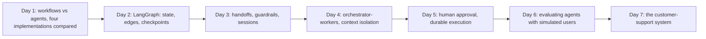

# Week 6: Agent Frameworks & Multi-Agent Systems

**Phase 3: Agents** · ~3.5-4 hours/day · Prerequisites: Week 5 (`common/agent.py`, `common/tools.py`, the research agent), Week 2 Day 4 (workflows)

Week 5 built an agent from scratch. This week asks **when a framework earns its place** and builds the things frameworks are *for*: durable graphs, handoffs, parallel subagents with isolated contexts, human approval that survives a restart, and an evaluation harness with simulated users. Every framework is **run** (LangGraph, OpenAI Agents SDK, PydanticAI) or honestly labelled as built-but-not-run (Claude Agent SDK), and every claim about their behaviour comes from a test.

> **The rule of this week:** the model is one component. What makes a multi-agent system trustworthy is *who owns what*, *what needs a human*, *what must never reach the customer*, and *evidence from an evaluation that all of it works*. A framework changes how much code you write, not whether you need those.



## Learning goals
By Sunday you can:
- Choose between a workflow, a single agent and a multi-agent design, and defend it.
- Port an agent to LangGraph, the OpenAI Agents SDK and PydanticAI and **compare them mechanically** (parity, size, limits, failure modes).
- Build a LangGraph graph with checkpoints and resume it after a crash, from another process, or from a past checkpoint.
- Explain **handoff vs delegation** and what each does to history, cost and who writes the answer.
- Run parallel workers with isolated contexts, **merge** their cited results safely and survive a worker failure.
- Pause a flow for a human, resume it days later, and make the irreversible step idempotent.
- Evaluate an agent on tool calls, real state and claims, with simulated users, `pass@k` and `pass^k`.

## Schedule
| Day | Lesson | Challenge | Needs |
|---|---|---|---|
| 1 | [Workflows, agents and frameworks](day1_workflows-agents-and-frameworks.md) | Port the Week 5 file agent into a framework; compare size, parity and limits | Local model |
| 2 | [LangGraph](day2_langgraph.md) | The Week 2 ticket router as a graph with SQLite persistence | None (scripted) |
| 3 | [Agent SDKs](day3_agent-sdks.md) | A two-agent handoff app on each SDK | Local model |
| 4 | [Multi-agent patterns](day4_multi-agent-patterns.md) | An orchestrator that fans out 3 research subagents and merges | Local model |
| 5 | [Human-in-the-loop](day5_human-in-the-loop.md) | A refund flow that pauses for approval and resumes after a restart | None |
| 6 | [Agent evaluation](day6_agent-evaluation.md) | A simulated-user eval harness with a pass rate | Local model |
| 7 | [Weekly challenge](day7_weekly-challenge.md) | A customer-support multi-agent system with approval, guards and an eval suite | Local or key |

New shared code: `common/local_server.py` (the local Qwen behind an OpenAI-compatible endpoint, so real frameworks can drive a real small model with no key) and `common/agent_eval.py` (trajectory graders, simulated users, claims-vs-state checks, `pass@k`/`pass^k`).

```bash
uv sync --extra local --extra rag --extra agents      # the `agents` extra now includes the Week 6 frameworks
```

## What has been verified
| Item | How |
|---|---|
| `common/local_server.py` | 6 tests: message conversion for every shape frameworks send, tool calls and usage through the real OpenAI SDK, JSON mode, and a **real** Qwen tool call |
| `common/agent_eval.py` | 36 tests: matching, every failure mode, users (scripted and model-driven), crashing agents, hand-computed `pass@k`/`pass^k`; mutation-checked (two equivalent mutants documented) |
| Day 1 | 55 tests: **all four frameworks solve all seven tasks identically** against a scripted OpenAI-compatible server; tool errors, bad arguments, parallel calls, step limits; real run with Qwen (1/7 in every framework); Claude Agent SDK options **built, not run** |
| Day 2 | 18 tests: parity with Week 2, crash/resume without repeating model calls, a **real second process** reading a checkpoint, fork from a past checkpoint, `Send` fan-out |
| Day 3 | 16 tests: handoff history and tools per agent, blocking vs parallel guardrail **cost**, SQLite sessions across a "restart", delegation isolation, shared usage limits (a claim corrected by a test), Claude subagent options built |
| Day 4 | 18 tests: parallel workers, failure isolation, **citation renumbering** across workers, context-isolation measurement, model-chosen fan-out, poisoned worker output; real planner run |
| Day 5 | 30 tests: pause/approve/resume, expiry, crash after the payment, **a real process restart**, malformed decisions, concurrent same-key payments; 3 real bugs found |
| Day 6 | 17 tests: a good agent passes; nine bad agents are each caught by the right check; a safety-only scenario passed by an idle agent; real run (1/6) |
| Day 7 | 43 tests (61 with the Week 7 options) + full evaluation: 10/10 with scripted models, the guard on/off comparison, card redaction, approval after a restart, escalations, budgets, CLI; real run (4/10) |

Mutation checks (with the fixed `scripts/mutate.py`) ran on Day 2's graph, Day 3's app, Day 4's merge, Day 5's refund flow, Day 6's scenarios, `common/agent_eval.py` and the Day 7 system; every behavioural mutant was killed, and the survivors were equivalent mutants (documented in the lessons).

**Week 7 later added** options to this system (`lean`, `hide_prefetched`, `reply_from_tool`, `cache`, `feedback()`, trace ids), all off by default; see Week 7 Days 4-6.

**Not run by the author (no API keys):** every hosted-model result; the Claude Agent SDK against a model (it needs the Claude Code CLI and credentials); the OpenAI Agents SDK against OpenAI itself (we used its Chat Completions path against local/scripted servers); Postgres checkpointers. The local 0.5B model is a weak agent by design of this exercise: its failures (skipped tool calls, misrouting, invented arguments) are the lesson, and the harnesses were verified with scripted models plus real HTTP, SQLite, subprocess and SDK traffic.

**Findings from testing the frameworks and the author's own code** (a reminder to test, not assume): the Agents SDK *raises* on an unknown tool where the others let the model recover; LangGraph applies reducer updates in task order, not completion order; PydanticAI 2.x shares usage limits with nested agent runs automatically (an older assumption was wrong); a malformed value resumed inside a LangGraph graph is replayed and **poisons the thread**; state written inside an interrupted node is lost (expiry never fired); one idempotency key per conversation made a tool answer the *second* invoice with the *first* refund; a log helper's keyword clash; a simulated user that trapped itself in a thank-you loop; a claim regex that missed terse lies.
