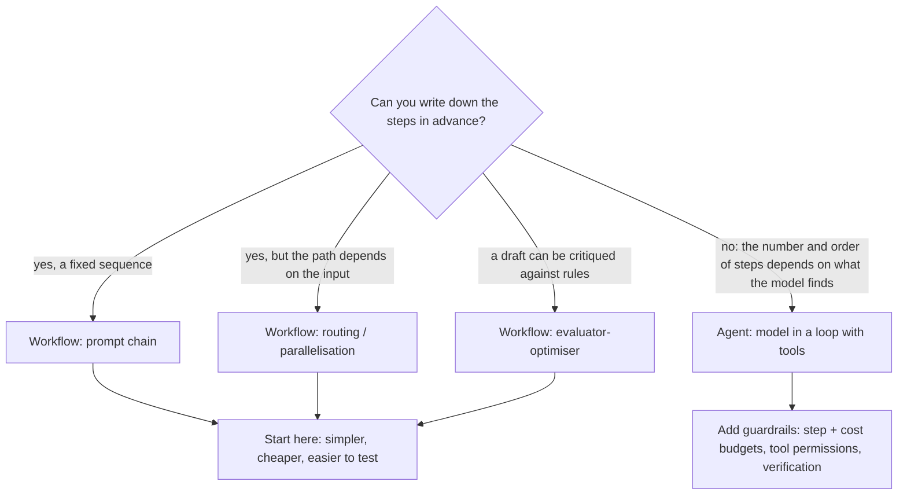

# Week 6, Day 1: Workflows vs Agents, and the Framework Landscape

**Time:** ~3.5h · **Needs:** `pip install langgraph openai-agents "pydantic-ai-slim[openai]" claude-agent-sdk`; the local Qwen model for the live run (no API key)

## Learning objectives
- Distinguish **workflows** (code decides the path) from **agents** (the model decides), and pick the simplest one that works.
- Describe what each major framework is *for*: LangGraph, OpenAI Agents SDK, PydanticAI, Claude Agent SDK, LangChain.
- Port one agent to several frameworks and **compare them mechanically**: behaviour parity, size, and what happens at a limit.
- Know which controls a framework gives you for free and which you must still build.
- Make a build-vs-adopt decision with evidence rather than fashion.

---

## 1. Workflows and agents (revisited)

Week 2 Day 4 built **workflows**: prompt chaining, routing, parallelisation, evaluator-optimiser. Week 5 built an **agent**. The difference is who holds the control flow:



Rule of thumb: **start with a single model call, then a workflow, and reach for an agent only when the path genuinely cannot be fixed in advance.** An agent costs more (many calls), is slower, harder to test, and fails in more ways. Frameworks do not change that trade-off; they change *how much code* you write and *what you get for free*.

## 2. The landscape

| Framework | What it is, in one line | Strong at | Verified here |
|---|---|---|---|
| **LangGraph** | a low-level graph runtime: typed **state**, nodes, edges, **checkpoints**, interrupts | durable, resumable, human-in-the-loop workflows; complex branching | ran |
| **OpenAI Agents SDK** | `Agent` + `Runner`, **handoffs**, guardrails, sessions, built-in tracing | multi-agent routing with little code; works with any Chat Completions endpoint | ran |
| **PydanticAI** | typed agents: **validated outputs and dependencies**, tools, usage limits | structured results, testability, type safety | ran |
| **Claude Agent SDK** | runs the **Claude Code** agent loop (files, shell, MCP, subagents, hooks, skills) as a library | coding/file/computer-style agents that can use Claude Code's built-in tools | built, **not run** (needs the CLI and credentials) |
| **LangChain** | a large component library (models, retrievers, loaders, chains) with agent helpers on top | integrations; pairs with LangGraph for orchestration | not used here |

All of them are conveniences over the loop you already wrote. None is a source of capability: the *model* and the *tools* decide what an agent can do.

## 3. The experiment: one agent, four implementations

The Week 5 Day 2 file agent (`list_dir`, `read_file`, `grep`, `write_file`, `calculate`; seven tasks graded on final state) was ported to:

| Port | How |
|---|---|
| `raw` | `common/agent.py` from Week 5 |
| `langgraph` | a `StateGraph` with a `model` node, a `tools` node and a conditional edge (the canonical agent graph) |
| `agents_sdk` | `Agent(...)` + `Runner.run_sync(...)`, our tools adapted to `FunctionTool` |
| `pydantic_ai` | `Agent(model, tools=[Tool.from_schema(...)])` + `run_sync(usage_limits=...)` |

All four call the **same OpenAI-compatible Chat Completions endpoint** and use the **same tool objects** (our registry executes the call in every port, so path-sandboxing, argument validation and errors-as-text are identical). The only variable is the framework. The model is served by `common/local_server.py`, which puts the local Qwen2.5-0.5B behind an OpenAI-compatible URL: a real framework driven by a real (small) model with no API key.

The LangGraph port, in full (the whole agent):

```python
class AgentState(TypedDict):
    messages: Annotated[
        list, operator.add
    ]  # a reducer: nodes return NEW messages, the framework appends


def model(state):
    t = chat.turn(
        state["messages"], registry.specs(), system=SYSTEM, provider="ollama", model="local-qwen"
    )
    return {"messages": [chat.assistant_message(t)]}


def tools(state):
    return {
        "messages": [
            chat.tool_message(c, execute(c["name"], c["args"]))
            for c in state["messages"][-1]["tool_calls"]
        ]
    }


graph = StateGraph(AgentState)
graph.add_node("model", model)
graph.add_node("tools", tools)
graph.add_edge(START, "model")
graph.add_conditional_edges(
    "model",
    lambda s: "tools" if s["messages"][-1].get("tool_calls") else END,
    {"tools": "tools", END: END},
)
graph.add_edge("tools", "model")
app = graph.compile()
app.invoke({"messages": [user_msg]}, {"recursion_limit": 2 * max_steps + 1})
```

### Verified: they behave the same where it matters
A scripted model (the fake OpenAI-compatible server) plays each of the seven tasks' correct tool sequences, one framework at a time. **All four solve all seven**, with the same tool calls and the same number of model requests (28 parametrised cases). The same suite also checks that every framework: sends the five tools and the system prompt; passes a tool error back to the model as text on the next request; reports bad arguments as `Invalid arguments for grep: ...`; runs parallel tool calls; and stops a model that loops forever.

### What the tests found that the docs would not tell you
| Behaviour | raw | LangGraph | Agents SDK | PydanticAI |
|---|---|---|---|---|
| Step limit reached | status `max_steps` | raises `GraphRecursionError` (limit counts **graph steps**, not model calls: we use `2 × steps + 1`) | raises `MaxTurnsExceeded` | raises `UsageLimitExceeded` (`request_limit`) |
| Model calls a **tool that does not exist** | error text returned, model retries | same (our registry) | **raises `ModelBehaviorError` and the run dies** | recovers |
| Several tool calls in one turn | executed concurrently, results in order | sequential in our node | executed **concurrently; completion order is not call order** | handled |
| Repeated identical call | **blocked** after N | not unless you write it | not | not |
| Cost / token budget | built in (`max_cost_usd`) | write it | read usage yourself | `UsageLimits(total_tokens_limit=..., cost_limit=...)` |
| Context trimming | `context_hook` | edit the state in a node | `RunConfig.call_model_input_filter` / sessions | the `ProcessHistory` capability |
| Persistence / resume | none | **checkpointers** (Days 2 and 5) | sessions (Day 3) | none built in |
| Tracing | `run.trace()` | state history; LangSmith | built in (uploaded to OpenAI by default: **disable it for private data**) | Logfire/OpenTelemetry |

Two practical consequences. **Normalise failures at your boundary**: three frameworks signal a limit with three different exceptions and one of them with a status; wrap each so your service reports `max_steps` the same way. And **do not assume a framework recovers from model mistakes**: the Agents SDK's unknown-tool exception would have turned a recoverable hiccup into an outage.

### Size
Non-blank, non-comment source lines of each port (a rough size, not a quality measure):

| | core lines |
|---|---|
| raw (the port + the loop it calls, `_run_agent` in `common/agent.py`) | **129** ¹ |
| LangGraph | 45 |
| Agents SDK | 44 |
| PydanticAI | **25** |

¹ This was 122 when the lesson was written; Week 7 added a 7-line `stop_when` hook to the loop (and a separate 16-line tracing wrapper, `run_agent`, which is not counted).

Honest reading: the raw version is longer **because it contains the guardrails** (budgets, repeat blocking, stuck detection, tracing) that the others leave to you. A framework port is shorter *until* you add those; then it is not. PydanticAI's size comes from `run_sync(usage_limits=...)` doing the loop for you.

### Live run (real model, executed): the framework does not decide success
Qwen2.5-0.5B through all four, the seven tasks:

| | passed | tool calls made |
|---|---|---|
| raw | 1/7 | 9 |
| LangGraph | 1/7 | 9 |
| Agents SDK | 1/7 | 5 |
| PydanticAI | 1/7 | 4 |

Every framework passes `todo-count` and fails the rest, for the same reasons as Week 5: narrating instead of calling, wrong arguments, giving up. `raw` and `langgraph` made **identical** calls, as they should (same `chat.turn` call, same prompts); the other two differ only in small prompt/format details. A 0.5B model is a poor agent in any framework: **changing frameworks does not change the model's ability**. (A hosted model was not run: no API keys.)

## 4. The Claude Agent SDK, briefly (built, not run)
The Claude Agent SDK wraps the Claude Code loop: it launches the Claude Code CLI and streams its messages. You configure it with `ClaudeAgentOptions` (`allowed_tools`, `system_prompt`, `mcp_servers`, `max_turns`, `max_budget_usd`, `permission_mode`, `hooks`, `agents` for subagents, `skills`, `sandbox`, ...) and iterate `query(prompt=..., options=...)`. The solution builds options that expose our five tools as an in-process MCP server (`mcp__files__<tool>`), with an **allowlist** so the built-in shell and editor are *not* available, plus turn and dollar budgets. A unit test checks the options; **nothing was run against a model** (no CLI/credentials here). Reach for it when you want Claude Code's own tools (file edits, shell, search) inside your application; use the others when you want to define the loop and tools yourself.

## 5. When to use what
| You need | Reach for |
|---|---|
| a fixed pipeline of LLM calls | plain functions (Week 2 Day 4); no framework |
| durable state, branching, human approval, resume after a crash | **LangGraph** (Days 2 and 5) |
| several specialised agents handing a conversation to each other | **OpenAI Agents SDK** (Day 3) |
| validated structured outputs and typed dependencies | **PydanticAI** |
| Claude Code's tools (files, shell) inside your app | **Claude Agent SDK** |
| a small agent with strong guardrails you fully control | **the raw loop** |

Warning signs a framework is hurting: you can't see the exact prompt and tool schema sent to the model; errors are swallowed or reshaped; you spend time fighting an abstraction to do something simple; the upgrade notes are longer than your code. **Always be able to print the raw request** (the tests do: `server.requests[0]["body"]`).

## 6. Pitfalls
- **Tracing defaults.** The Agents SDK uploads traces to OpenAI unless you call `set_tracing_disabled(True)` (or configure an exporter). Check each framework's telemetry defaults before sending real data.
- **Cached clients.** `common/llm.py` caches its HTTP client per process; switching base URLs needs `llm._ollama.cache_clear()` (a bug found while writing this day).
- **Versions move fast** (this week used LangGraph 1.2, Agents SDK 0.22, PydanticAI 2.52, `mcp` 2.2). Pin versions and re-run your tests on upgrade.
- **Library names collide**: three frameworks each define `Agent`, `Tool`, `Runner`. Import with explicit aliases.

---

## Daily challenge: port the Week 5 agent into one framework and compare

**Build** (reference: [`solutions/day1_solution.py`](solutions/day1_solution.py)):
1. Port the Week 5 Day 2 file agent into **one** framework of your choice (the reference does three, plus the Claude Agent SDK options).
2. Use the **same tools and the same seven tasks**, and point it at an OpenAI-compatible endpoint (a local server or a scripted fake).
3. Produce a comparison: **lines of code** vs the raw loop, **behaviour parity** on the tasks, and **what happens at a step limit and on an unknown tool**.

**Acceptance criteria**
- A scripted model solves all seven tasks identically in your port and in the raw loop (same tool calls, same number of requests).
- Tool errors reach the model as text; bad arguments produce a readable validation error.
- A looping model is stopped by a step budget, and the failure is reported as a normal result (not an uncaught exception).
- Your write-up lists at least **three controls the raw loop has that your framework port lacks (or vice versa)**, each demonstrated by a test, not asserted.
- The raw request sent to the model is printed or asserted (tools and system prompt).

**Stretch**
- Add repeated-call blocking and a cost budget to your port; count the lines again.
- Port to a second framework and find one behavioural difference the docs do not mention.
- Run the same seven tasks with a hosted model and report whether the frameworks still agree.

## Further reading
- Anthropic: *Building effective agents* (workflows vs agents; keep it simple).
- LangGraph docs: *Concepts* (state, nodes, edges, persistence).
- OpenAI Agents SDK docs: *Agents*, *Running agents*, *Handoffs*, *Tracing*.
- PydanticAI docs: *Agents*, *Tools*, *Usage limits*.
- Claude Agent SDK docs: *Python SDK reference* (options, hooks, subagents, MCP).
