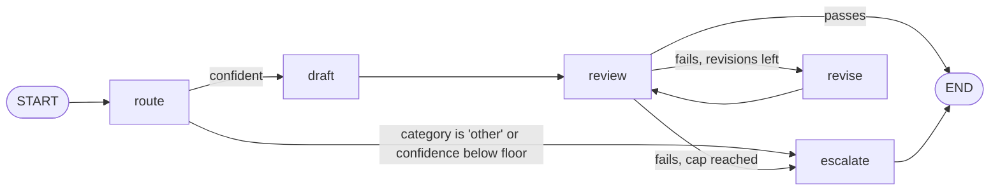

# Week 6, Day 2: LangGraph: State, Nodes, Edges, and Checkpoints

**Time:** ~3.5h · **Needs:** `pip install langgraph langgraph-checkpoint-sqlite`; the local model is optional (the tests use scripted models)

## Learning objectives
- Model a pipeline as a **graph**: typed state with reducers, nodes that return partial updates, static and conditional edges.
- Port a plain-Python workflow (Week 2's ticket pipeline) into a graph and **prove it makes the same decisions**.
- Use a **checkpointer** for durable execution: resume after a crash without repeating model calls, read state from another process, list and fork history.
- Use `Send` for map-reduce fan-out.
- Know what a graph runtime costs you, and the sharp edges (idempotent nodes, reducers, re-running a thread).

---

## 1. The model in one picture

LangGraph runs a **state machine**. You declare the **state** (a typed dict), write **nodes** (functions from state to a *partial update*), and wire them with **edges**. The runtime executes in *supersteps* and, with a **checkpointer**, saves the state after each one under a `thread_id`.



| Concept | In the code | Why it matters |
|---|---|---|
| **State** | `TicketState(TypedDict)`; `trace: Annotated[list[str], operator.add]` | the single source of truth; the `operator.add` **reducer** makes each node *append* to the trace instead of overwriting it |
| **Node** | `def review_node(state) -> dict` returns only what changed | easy to test alone: call it with a dict |
| **Conditional edge** | `after_route(state) -> "draft" \| "escalate"` | the *gate* and the *loop condition* are plain functions of the state, tested at their boundaries |
| **Checkpointer** | `SqliteSaver` (or `MemorySaver`) | durable state per step; the basis for resume, time travel and human approval (Day 5) |
| **Thread** | `config = {"configurable": {"thread_id": "ticket-42"}}` | the durable identity of one run |

`app.get_graph().draw_mermaid()` renders the compiled graph (the diagram above is that structure; LangGraph's own output also marks conditional edges with dotted lines).

## 2. The port, and proof it did not change behaviour

Week 2's `route`, `draft` and `review` are reused **unchanged**; the graph only owns the control flow. For each of the four sample tickets the test runs both implementations and compares: category, whether it escalated, revision count, final reply, and the sequence of steps (`route > draft > review > revise > review`). They are identical.

Beyond parity, the graph gives you things the function did not:

- **Boundary tests of the edges**: exactly at the confidence floor is trusted; `revisions == cap` escalates; a pass beats the cap.
- **A cap test with a reviewer that never passes**: the run is `route draft review revise review revise review escalate`, `revisions == 2`.
- **A stop before spending tokens**: for an "other" ticket the trace is `route > escalate` and no specialist prompt is ever sent (asserted on the model's call log).

## 3. Durable execution (the reason to use a graph runtime)

```python
with SqliteSaver.from_conn_string("tickets.sqlite") as saver:
    app = build_ticket_graph(saver)
    app.invoke({"ticket": text, "trace": []}, config_for("ticket-42"))
```

**Crash and resume.** The test makes the model call inside `review` fail once (a provider outage). The run raises. The checkpoint holds `next == ("review",)`, `trace == ["route", "draft"]` and the draft reply. Re-invoking with the same `thread_id` and `None` as input **continues at `review`**: the model log shows exactly one `route` call and one `draft` call in total, so the earlier work was **not repeated** (and not paid for twice).

**Across a process restart.** The test starts a *new Python process* that opens the same SQLite file and reads the thread's state: `{"next": ["review"], "trace": ["route", "draft"], "category": "billing"}`. A real service can crash, deploy, and pick up where it stopped.

**Idempotent by thread.** `handle_ticket` returns the stored result when a thread has already finished, and the model is not called. Without that guard, re-invoking a finished thread **appends** to its old state (the reducer!), producing a garbled trace. *A reducer plus a reused thread id is the classic LangGraph gotcha.*

**History and time travel.** Every superstep is a checkpoint. Listing them for the billing ticket:

```
next=('__start__',) trace=[]
next=('route',)     trace=[]
next=('draft',)     trace=['route']
next=('review',)    trace=['route', 'draft']
next=('revise',)    trace=['route', 'draft', 'review']
next=('review',)    trace=['route', 'draft', 'review', 'revise']
next=()             trace=['route', 'draft', 'review', 'revise', 'review']
```

You can **fork** from a past checkpoint: take the one before the first `review`, replace the draft with a better one via `update_state`, and `invoke(None, fork)`: the run proceeds from there (`review` passes, no revise). The original branch is **not deleted** (its checkpoints stay in the history) but the thread's *latest* checkpoint is now the fork's. That is how you debug "what if the draft had been different?" without re-running the model.

## 4. Map-reduce with `Send`

```python
def fan_out(state):
    return [Send("summarise_one", {"i": i, "thread": t}) for i, t in enumerate(state["threads"])]


g.add_conditional_edges(START, fan_out, ["summarise_one"])  # one task per thread, run in parallel
```

Each `Send` starts a node with its own input; their updates are merged through the reducer; a `merge` node then runs. A finding worth knowing: **LangGraph applies a reducer's updates in task order, not completion order.** The test makes thread 0 finish *last* (workers sleep in reverse) and `parts` still arrive as 0, 1, 2 ...; so the `sorted()` guard in `merge` is redundant under this version, an *equivalent mutant* the mutation test reported honestly. Keeping it costs nothing and does not depend on an internal guarantee. An empty thread list does not hang: the graph returns with no summaries.

## 5. What it costs, and the sharp edges
- **A new runtime to learn**, and a second source of truth for control flow (the graph) next to your prompts. Use it when you need durability, branching, approval or replay; use a function when you do not.
- **A crashed node re-runs from its start.** A node that calls the model *and* sends an email will send the email twice on resume. Keep side effects in their own node, make them idempotent (an idempotency key), and checkpoint after the model call.
- **State must be serialisable** and grows with every step; large blobs in state mean a large database. Keep ids and small values in state and big artefacts elsewhere.
- **Persisted state is a schema.** If you rename a state key, old threads in the database break. Version your state.
- **Choose `thread_id` deliberately**: one per business entity (ticket, order). Reusing one for unrelated work mixes their state.

## 6. What a small model did with it (real run)
The same graph, with the Week 2 prompts, driven by the local Qwen2.5-0.5B (through `common/local_server.py`, best-effort JSON mode):

| Ticket | Routed to | Confidence | Result |
|---|---|---|---|
| "charged twice" | **technical** (wrong; should be billing) | 0.95 | drafted a generic reply, reviewer passed it |
| "app crashes with error 0x5F" | technical | 0.90 | drafted, passed |
| "can't log in, account locked" | account | 0.95 | drafted, passed |
| "office in Berlin?" | other | 0.95 | gate escalated before drafting |

3 of 4 routed correctly. The misroute carried a **0.95 confidence**: a model's self-reported confidence is not calibrated (Week 4 measured the same thing for graders), so the gate catches *"other"* but not confident mistakes. The replies are template-like (`Dear [Customer's Name]`) and the 0.5B reviewer passes everything; this is a **plumbing demonstration, not a quality result**. Without JSON mode the first attempt failed outright (`ValidationError: expected JSON`), because the local server did not yet honour `response_format`; the server now injects the schema as an instruction, best-effort. Hosted models were not run (no API keys).

## 7. Verified
18 tests, including: parity with Week 2 (4 tickets), edge boundaries, revision-cap escalation, gate-before-tokens, crash/resume without repeated calls, a **real second process** reading a checkpoint, thread isolation and idempotency, history, a fork, `Send` order and an empty fan-out, and the drawn graph. Mutation check (edges, revision counter, resume and idempotency guards, the loop edge, the gate): every behavioural mutant was killed; the one survivor is the equivalent `sorted()` mutant explained above.

---

## Daily challenge: the ticket router as a graph, with persistence

**Build** (reference: [`solutions/day2_solution.py`](solutions/day2_solution.py)):
1. Port Week 2 Day 4's route/gate/draft/review/revise pipeline into a LangGraph `StateGraph` (reuse the model functions unchanged).
2. Checkpoint every step to SQLite under a per-ticket `thread_id`.
3. Make a run **resume after a crash** without repeating completed model calls.

**Acceptance criteria**
- For every sample ticket the graph and the original function agree on category, escalation, revisions, reply and step sequence.
- Edge functions are tested at their boundaries (confidence floor, revision cap).
- A forced failure mid-run followed by a re-invoke completes the ticket, and the model log proves route/draft were **not** repeated.
- A **separate process** can read a thread's saved state.
- Re-running a finished thread returns the stored result without calling the model.
- A history listing and one fork from a past checkpoint, with a test.

**Stretch**
- Add the Week 2 parallel summariser as a `Send` fan-out inside the same graph (summarise the customer's earlier threads before drafting).
- Store a `state_version` and write a migration for threads saved under an older state shape.
- Add a `human_review` node that interrupts before `escalate` (preview of Day 5).

## Further reading
- LangGraph docs: *Concepts* (state, reducers, nodes, edges), *Persistence* (checkpointers, threads, time travel), *Map-reduce with `Send`*.
- Anthropic: *Building effective agents* (routing and evaluator-optimiser workflows).
