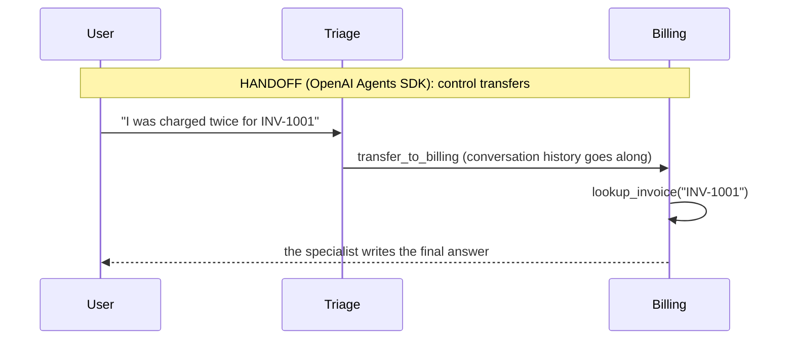
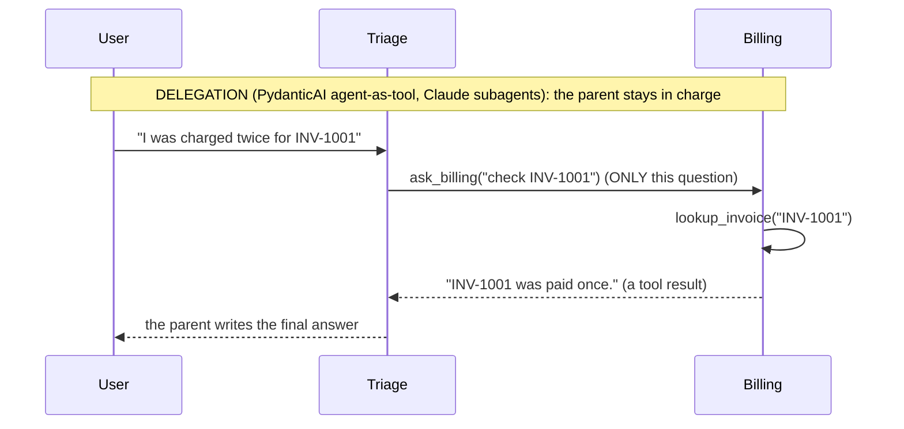

# Week 6, Day 3: Agent SDKs: Handoffs, Guardrails, Sessions and Hooks

**Time:** ~3.5h · **Needs:** `pip install openai-agents "pydantic-ai-slim[openai]" claude-agent-sdk`; the local model for the live run

## Learning objectives
- Distinguish a **handoff** (control transfers to a specialist) from **delegation** (the parent calls a specialist like a tool), and say what each does to history, cost and who writes the answer.
- Use the OpenAI Agents SDK's **handoffs, input guardrails, run hooks and sessions** and test each.
- Know the cost trap of **parallel guardrails** and prove it.
- Share **one usage limit** across a parent and its delegated agents in PydanticAI (and know when it is automatic).
- Read the Claude Agent SDK's **subagent** model (built here, not run).

---

## 1. Two ways to compose agents

The same support app, "triage, then a billing or tech specialist", can be built two ways:





| | Handoff | Delegation |
|---|---|---|
| Who talks to the user | the **specialist** | the **parent** |
| What the specialist sees | the **whole conversation** (verified) | **only the question it is asked** (verified) |
| Model calls for the same task | 3 | **4** (the parent re-writes the specialist's answer) |
| Guardrails and policy | have to be repeated or inherited per agent | the parent can inspect and filter every specialist answer |
| Good for | routing a conversation to the right owner; the specialist needs the full context | keeping a consistent voice, combining several specialists, **context isolation** (Day 4) |

Neither is "better". Use handoff when the *specialist should own the conversation*; delegation when the *parent should own the answer*.

## 2. OpenAI Agents SDK

```python
billing = Agent(
    name="Billing",
    handoff_description="Charges, invoices, refunds.",
    instructions=...,
    tools=[lookup_invoice_tool],
)
tech = Agent(
    name="Tech",
    handoff_description="Errors, crashes, outages.",
    instructions=...,
    tools=[service_status_tool],
)
triage = Agent(
    name="Triage",
    instructions="...hand off, do not answer yourself",
    handoffs=[billing, tech],
    input_guardrails=[no_card_numbers],
)
result = Runner.run_sync(triage, message, hooks=hooks, session=session)
result.last_agent.name, result.final_output
```

A handoff is implemented as a **tool call**: the triage agent's request lists exactly two tools, `transfer_to_billing` and `transfer_to_tech` (names derived from the agent names, lower-cased; verified in the request body). The specialist's next request lists *its own* tools (`lookup_invoice`) and its own system prompt, while the messages still include "charged twice" from the start.

What the tests verified (16 tests for Day 3):
- the specialist writes the answer (`handled_by == "Billing"`, path `Triage > Billing > lookup_invoice`);
- the handoff carries history; a triage agent that answers itself makes **one** request;
- a handoff to an agent that does not exist **raises** `ModelBehaviorError` in the SDK; the app catches it and reports it (compare Day 1: this SDK does not recover from model mistakes of this kind);
- **run hooks** see `("handoff", "Triage", "Billing")` and `("tool", "Billing", "lookup_invoice")`: the audit trail.

### Guardrails, and the parallel-guardrail cost trap
An input guardrail inspects the user's message (here: a card-number regex) and can trip a wire that stops the run. It has a `run_in_parallel` flag:

| Mode | When the check runs | Test result with a slow (0.4 s) guardrail |
|---|---|---|
| blocking (`run_in_parallel=False`) | **before** the first model call | blocked; **0 model requests** |
| parallel (the default) | **alongside** the first model call | blocked, **but 1 model request had already been sent** |

Parallel mode hides the guardrail's latency; the price is that **a blocked input can still be billed**, and the input (the card number!) has already been sent to the provider. For sensitive checks, use blocking mode. (With an instant, local check the SDK may cancel the model call before it is sent, so the cost depends on a race: do not rely on it.)

### Sessions
`SQLiteSession(session_id, db_path)` stores the conversation. The test runs a turn ("my name is Ada"), then a *new session object on the same file* (a restart) asks "what is my name?": the second request contains the earlier user message **and** the earlier answer. Different session ids are isolated (customer A's text never appears in B's request). This is conversation memory persisted by the framework, versus Week 2 Day 5's memory you built yourself.

## 3. PydanticAI: delegation with one shared limit

```python
@triage.tool
async def ask_billing(ctx: RunContext[None], question: str) -> str:
    r = await billing.run(question, usage=ctx.usage)  # share the parent's usage object
    return str(r.output)


triage.run_sync(message, usage_limits=UsageLimits(request_limit=8))
```
The parent's `request_limit` covers the **specialist's** requests too. The test: the flow needs 4 requests; with `request_limit=3` the run is stopped after 3 requests reached the server; with a limit of 10 it completes and the parent's reported usage is 4 requests (its own 2 plus the specialist's 2). **A version note, found by testing:** in PydanticAI **2.x** this happens *even if you omit `usage=ctx.usage`* (a nested run inherits the parent's usage and limits); older versions needed it. Passing it explicitly is harmless and documents the intent. (My first draft of this lesson said omitting it would let spend escape the limit; the test proved that false on the installed version. Re-test such claims when you upgrade.) The specialist saw only `"check INV-1001"` (not "charged twice"): **context isolation** by construction.

## 4. Claude Agent SDK: subagents (built, not run)
`ClaudeAgentOptions(agents={"billing": AgentDefinition(description=..., prompt=..., tools=[...]), ...})` declares subagents the main agent can delegate to. The solution gives each subagent **least privilege**: billing may only call `mcp__support__lookup_invoice`, tech only `mcp__support__service_status`, and the tools come from an in-process MCP server. Options also carry `max_turns` and `max_budget_usd`. A unit test checks all of it; **nothing was executed** (it needs the Claude Code CLI and credentials). Check the SDK docs for the exact name of the tool the main agent uses to invoke a subagent and put it in `allowed_tools`.

## 5. What a real (small) model did
Qwen2.5-0.5B through both SDKs (executed):

| Message | Agents SDK (handoff) | PydanticAI (delegation) |
|---|---|---|
| "charged twice for INV-1001" | handed off to **Billing** ✓ | called **ask_billing** ✓ |
| "export screen keeps crashing" | handed off to **Tech** ✓ | called **ask_tech** ✓ |
| "my card number is 4111 ..." | **blocked** by the guardrail, 0 answer | (guardrail not wired in this variant) |

**Routing worked** (the easy part). **The specialists did not:** neither called its tool (no `lookup_invoice` or `service_status` in the path) and the answers were fabrications or non-answers: *"The invoice INV-1001 has been transferred to your billing account"*, *"I've reviewed your record and confirmed that you were charged..."* (it had reviewed nothing: that sentence claims verification that never happened), *"I'm sorry, but I can't assist with that."* This is the Week 5 failure again, one level down: a specialist that is not forced to use its tool will confidently talk without it. Mitigations to try: `tool_choice="required"` for the specialist's first turn, an output check that rejects answers without a tool call, or an evaluator (Day 6). Hosted models were not run (no API keys).

## 6. Pitfalls
- **Handoffs can loop** (A hands to B, B hands back). Set `max_turns` and test the loop.
- **Guardrails need tests of both outcomes** (trips on bad input, silent on clean input), and a decision about parallel vs blocking.
- **Instructions drift in multi-agent systems**: every agent has its own prompt; a policy ("never approve refunds") must be present in each agent that could violate it, or enforced in a tool.
- **Telemetry**: disable or configure tracing before sending real customer text (the Agents SDK uploads traces to OpenAI by default).
- **Verify the contract between agents.** With delegation the parent trusts the specialist's text; with handoff the user does. Either way, the specialist's claims need the same verification as any model output.

---

## Daily challenge: a two-agent handoff app on each SDK

**Build** (reference: [`solutions/day3_solution.py`](solutions/day3_solution.py)):
1. A triage agent plus two specialists, each with one tool, on the **OpenAI Agents SDK** (handoff) and on **PydanticAI** (delegation); declare the equivalent subagents for the **Claude Agent SDK**.
2. On the Agents SDK add an **input guardrail**, **run hooks** that log handoffs and tool calls, and a **SQLite session**.
3. Test against a scripted OpenAI-compatible server, then run once with a real model.

**Acceptance criteria**
- Each specialist is reached by the right route and uses its own tool; the request bodies prove the tool lists differ per agent.
- A test shows what the specialist sees in a handoff (history) versus delegation (only the question).
- The guardrail blocks and passes correctly; a test compares blocking and parallel modes on cost.
- A session survives a "restart" (new session object, same database) and sessions are isolated.
- One usage limit covers the parent and the delegated agent (a test with a limit that is one request too small), and you have checked whether your framework version does this automatically.
- Subagent tools are least-privilege and the options carry turn and budget limits.

**Stretch**
- Add a handoff `input_filter` that strips tool calls from the history the specialist receives; measure the token saving.
- Add an *output* guardrail that rejects a specialist answer made without a tool call, and re-run the real-model messages.
- Add a third specialist and a handoff back to triage; write the test that detects an A→B→A loop.

## Further reading
- OpenAI Agents SDK docs: *Handoffs*, *Guardrails*, *Sessions*, *Lifecycle hooks*.
- PydanticAI docs: *Multi-agent applications* (agent delegation), *Usage limits*.
- Claude Agent SDK docs: *Subagents*, *Custom tools (SDK MCP servers)*, *Permissions*.
