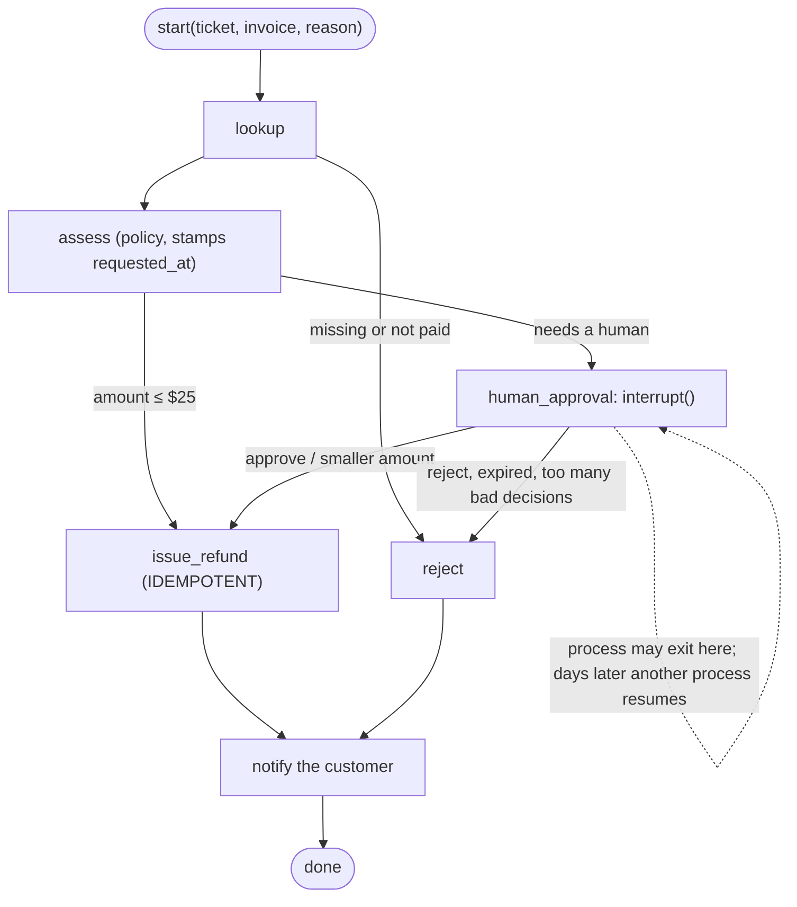

# Week 6, Day 5: Human-in-the-Loop and Durable Execution

**Time:** ~4h · **Needs:** `pip install langgraph langgraph-checkpoint-sqlite`; no model needed (a model only writes the customer message)

## Learning objectives
- Decide **where a human belongs** in an agent flow and what the human is shown and allowed to do.
- Use LangGraph's `interrupt()` and `Command(resume=...)` with a SQLite checkpointer so a run can **pause for days and resume in another process**.
- Know the semantics that bite: **the interrupted node re-runs from its start**, and **values written inside it are lost**.
- Make irreversible steps **idempotent** and prove it under crashes.
- Validate a human's decision **without poisoning the thread**.

---

## 1. Where a human belongs

An agent should ask a person when an action is **irreversible, expensive, regulated, or the model is unsure**: moving money, deleting data, sending external mail, changing permissions, anything with legal weight. The pattern is a *gate*: policy decides cheaply what can proceed alone, and everything else waits for a human with a **small, typed set of choices**.



The reference flow decides small refunds automatically (≤ $25), rejects missing or unpaid invoices, and pauses everything else. The human can **approve**, **reject**, or **approve a smaller amount** (never a larger one: the amount is capped at the invoice). A pending approval **expires after three days**; an expired approval pays nothing even if someone clicks "approve" afterwards.

## 2. The mechanics

```python
def human_approval(state):
    decision = interrupt(
        {"ticket_id": ..., "amount": ..., "reason": ...}
    )  # pauses; returns the resume value later
    ...


app.invoke(state_in, config)  # runs until the interrupt; the result has "__interrupt__"
app.invoke(Command(resume={"action": "approve", "approver": "dana"}), config)  # continues
```

With a checkpointer the pause is **durable**: the state sits in SQLite under the `thread_id`, so the process can exit. `RefundService` opens the database on every call, so *any* process can start a refund and *another* can decide it. The test does exactly that with two real Python processes: process 1 starts a $900 refund and exits (ledger still empty); process 2 lists the pending approval, approves $450 and the ledger gets one entry.

### Two semantics that cause real bugs (both found by tests)

**1. The interrupted node runs again from its start.** When you resume, LangGraph re-executes `human_approval` from the top; `interrupt()` then returns the stored value instead of pausing. Everything before it runs **twice**. The test counts calls: the "register this approval in the table" write ran twice (once before the pause, once on resume), and the table still has exactly **one row** because the write is `INSERT OR IGNORE`. Any side effect before an `interrupt()` must be safe to repeat.

**2. State written inside the interrupted node is lost.** My first version computed `requested_at = clock()` inside `human_approval`. That node never *returns* before the pause, so the value was never checkpointed; on resume it was recomputed as *now*, and **expiry could never fire**. A test that moved the clock past the TTL and approved anyway caught it (the refund went through). The fix: stamp `requested_at` in `assess`, a node that **completes** before the pause, so it is in the saved state.

## 3. A malformed decision can poison the thread

A reviewer UI sends `{"action": "maybe"}`. My first version validated inside the graph after `interrupt()` returned and **raised**. Result: LangGraph had already stored the resume value and **replayed it**; the thread was stuck, and *even a later valid decision failed with the same validation error*. Two defences, both in the reference:

- **Validate at the boundary before resuming** (`RefundService.decide` builds a `Decision` first; also guards a LangGraph 1.2 crash on `Command(resume=None)` and on bare strings: it fails with a clear `TypeError`).
- **Inside the graph, ask again instead of raising**: a bounded loop calls `interrupt()` again with the validation error attached, so a bad value that *does* reach the graph produces a new pending request (`approval.error` shows the reviewer what was wrong), and a valid decision then works. After three malformed attempts the request is closed (`too_many_invalid_decisions`) so it cannot ask forever.

## 4. Money moves once, whatever fails

A node that fails re-runs from its start, and a worker can retry the whole request. Two layers make the payment safe:

- **An idempotency key** (`ticket_id:invoice_id`) on the payment call. `Payments.refund` is *atomic*: `INSERT OR IGNORE` then read back, so 8 threads with the same key move money once and all get the same refund id. (My first version did `SELECT` then `INSERT`, which two concurrent callers can both pass; I rewrote it before writing the test, and the concurrency test now pins it.)
- **Idempotent entry points**: `start()` on an existing ticket never restarts it (a paused one stays paused with one approvals row, a finished one returns its result), and on a thread that **crashed** (not paused) it continues where it stopped.

The crash tests, each asserting the ledger has exactly one refund:

| Failure | What happens on retry |
|---|---|
| process dies **right after the payment call, before the checkpoint** | `issue_refund` re-runs; the same key returns the **same** refund id; no second payment |
| the notify step fails after the payment | the retry resumes at `notify`; the payment node is not repeated; the audit trail shows one `refund_issued` |
| the approver clicks approve twice | the second call sees a finished thread and changes nothing |
| approval arrives after the TTL | closed as `expired`, no payment |

A mutation test made the key depend on the clock (`key + clock()`): with a **frozen test clock it survived**; with a clock that moves on, as a real one does, it fails the crash test. The lesson: a test fixture that freezes time can hide exactly the bug the test is for. (One mutant, removing the "already finished" guard in `decide`, is equivalent: LangGraph ignores a resume on a finished thread; the guard stays as explicit intent.)

## 5. The audit trail and the reviewer's view
- **Audit**: every step appends `{actor, event, ...}` to the state (`policy needs_human`, `dana approved`, `system refund_issued`...). It is persisted with the checkpoint, so it survives restarts and is the answer to "who approved this, and when?"
- **Pending queue**: `approvals` is a small table written before the pause, so a reviewer UI can list what is waiting (ordered by request time) without scanning checkpoints. Resolved rows drop out.
- **What the reviewer sees** is exactly the interrupt payload: ticket, invoice, amount, reason, request time, and, after a bad submission, the validation error.

## 6. The model's (small) role
A model can write the customer message but **cannot change the outcome**: `llm_drafter` rewrites a template sentence and falls back to the template if the model drops a number or a refund id. Verified with a scripted model (keeps `$20.00` and `RF-0001` → used; drops them → template). Live, with the local Qwen2.5-0.5B: both messages were rewritten (*"We're pleased to inform you that your refund of $20.00 (RF-0001) has been successfully processed."*) and kept every fact. The decision itself is code and a person; keep it that way for money.

## 7. Pitfalls
- **Side effects before `interrupt()`**: repeat on resume. Put them in a *previous* node, or make them idempotent.
- **State inside the interrupted node is not saved.** Compute timestamps and ids in a node that completes.
- **Raising after accepting a resume value** can poison the thread. Validate first, or re-ask.
- **Approvals need an expiry and an owner.** A pause with no deadline is a leak.
- **Multiple processes on one SQLite file** work for this workload (the test runs four services concurrently), but for real concurrency use Postgres-backed checkpointers; and never share one thread id between two workflows.
- **Don't let the approver widen the request** (the amount is capped); **don't let a model approve what a human must**.
- **Authentication is yours**: `decide(ticket, {"approver": "dana"})` trusts the caller. In a service, derive `approver` from the authenticated session, never from the request body.

---

## Daily challenge: a refund flow that pauses for approval and resumes after a restart

**Build** (reference: [`solutions/day5_solution.py`](solutions/day5_solution.py)):
1. A LangGraph flow with a policy gate, an `interrupt()` for human approval, an idempotent payment step and a notification step, checkpointed to SQLite.
2. A service API (`start`, `decide`, `pending`) that opens the database per call so another process can resume.
3. Typed decisions (approve, reject, approve a smaller amount), an expiry, and an audit trail.

**Acceptance criteria**
- A test pauses a refund in one **real process**, then approves it from another; the ledger shows exactly one refund.
- The code before `interrupt()` is shown to run twice, with a test that proves the repeat is harmless.
- A test moves the clock past the TTL and shows no payment; one at exactly the TTL still pays.
- Crash tests: right after the payment call, and in a later node; each leaves one ledger row.
- A malformed decision pays nothing **and** a later valid decision still works.
- Same-key concurrent payments produce one row; `start`/`decide` are idempotent.
- Mutation check the TTL boundary, the auto limit, the amount cap, the idempotency key (with a moving clock) and the resume path.

**Stretch**
- Add a second approval level: refunds above $500 need **two different approvers**; the second approval must be a different person.
- Add an escalation: a pending approval older than one day pings a manager (a new node scheduled by a periodic job that calls `start` on stale tickets).
- Replace SQLite with Postgres (`langgraph-checkpoint-postgres`) and rerun the concurrency test.

## Further reading
- LangGraph docs: *Human-in-the-loop* (`interrupt`, `Command(resume=...)`), *Persistence*, *Durable execution*.
- Stripe docs: *Idempotent requests* (the same idea in a real payments API).
- Anthropic: *Building effective agents* (human checkpoints and guardrails).
