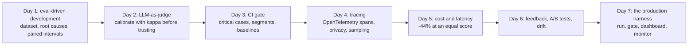

# Week 7: Evals, Observability & LLMOps

**Phase 4: Production quality** · ~4-5 hours/day · Prerequisites: Week 6 (the support system), Week 5 (`common/agent.py`, tools), Week 4 Day 1-2 (confidence intervals, judges)

Week 6 ended with a system that *seems* to work. This week builds the instruments that tell you whether it does, whether a change made it better, what it costs, what it did in production, and when it started doing something else. Every instrument is **run on the real local model** where there is one, **mutation-tested**, and labelled honestly where it is simulated.

> **The rule of this week:** a number is only worth acting on if you know **what produced it, how uncertain it is, and what it cannot see.** Every day ends by listing what its method missed.



## Learning goals
By Sunday you can:
- Run the **eval-driven loop**: dataset (dev/test, solvable, leak-free), root-cause diagnosis, one change at a time, paired intervals, a held-out check.
- **Calibrate a judge** against labels (kappa, TPR/TNR, bias checks) and know when code beats a model.
- Write a **CI gate** that handles critical cases, segments, baselines and a changed dataset.
- Emit **OpenTelemetry GenAI traces** that are private by default and connected across threads; **sample** them; read them; check them without an answer key.
- **Cut cost** with prompts, tool offers, call counts and caches, and prove the score did not drop.
- Run an **A/B test** (assignment, SRM, intervals, power, peeking, sequential designs) and detect **drift** with calibrated detectors.
- Assemble a **harness**: runs, gate, dashboard and monitor over one artifact format.

## Schedule
| Day | Lesson | Challenge | Needs |
|---|---|---|---|
| 1 | [Eval-driven development](day1_eval-driven-development.md) | Error-analyse the Week 6 system; improve it with evidence | Local model |
| 2 | [LLM-as-judge](day2_llm-as-judge.md) | A judge whose agreement with labels you measure | Local model (optional) |
| 3 | [Eval tooling and CI](day3_eval-tooling-and-ci.md) | A gate that fails a PR on a regression | None (saved results) |
| 4 | [Tracing](day4_tracing.md) | Full traces for the Week 6 system | Local model (optional) |
| 5 | [Cost and latency](day5_cost-and-latency.md) | Cut cost by 40% at an equal score | Local model |
| 6 | [Feedback loops, A/B tests, drift](day6_feedback-loops-ab-tests-and-drift.md) | An A/B harness with statistical comparison | None |
| 7 | [Weekly challenge](day7_weekly-challenge.md) | The production harness: run, gate, dashboard, monitor | Local model (optional) |

New shared code: `common/llm_judge.py`, `common/tracing.py` (OpenTelemetry spans, exporters, tail sampling, trace readers), `common/cache.py` (a response cache with guards), `common/abtest.py` and `common/drift.py` (statistics, verified by simulation), plus options on `common/tools.py` (compact specs, `without`, context propagation into worker threads) and `common/agent.py` (`stop_when`, an `invoke_agent` span). The support system gained `lean`, `hide_prefetched`, `reply_from_tool`, `cache`, `feedback()` and trace ids.

```bash
uv sync --extra local --extra rag --extra agents      # the `agents` extra now lists the OpenTelemetry SDK and OTLP exporter
```

## The week's headline numbers (all on the real local model, 50 cases)
| | |
|---|---|
| Day 1 | the baseline failed 70% of dev cases, 76% of those at **triage**; a keyword router lifted dev from 30% to 47% (test +10); the "obvious" fixes made it worse |
| Day 2 | a 0.5B judge scored **kappa 0.00** on every criterion despite "90% accuracy"; the code judge reached 0.90 (a ceiling, not a recommendation) |
| Day 3 | the gate separates "noise passes", "a segment collapses" and "a critical case regressed" on real run data |
| Day 4 | trace-only checks flagged 14 of 24 failures with 0 false alarms; they are blind to a lying model, a misroute and a wrong action |
| Day 5 | **−44% cost** (simulated prices, real tokens) while dev pass rate went 53% → 70% (test 50% → 65%); exact-match caching is safe, fuzzy is not |
| Day 6 | the A/B harness's 95% intervals covered a **known** true effect 93-96% of the time; naive peeking gives an 18% false-positive rate |
| Day 7 | the harness reproduces Day 5's decision through a six-check gate, and its monitor catches each drilled incident within ~15 turns (a route shift needs a window) |

## What has been verified
| Item | How |
|---|---|
| `common/llm_judge.py` | 16 tests: rubric prompts, loud failure, both-order logic, hand-computed calibration, planted pathologies |
| `common/tracing.py` | 43 tests: names against the installed semconv, privacy, redaction, parenting across threads, exporters (JSONL, a **real local OTLP/gRPC server**, tail sampling), trace readers |
| `common/cache.py` | 28 tests: normalisation, scope, TTL/LRU, the entity and negation guards, concurrency |
| `common/abtest.py` | 90 tests: hand-checked, **scipy-checked**, and **simulation-checked** (coverage, power, peeking, sequential boundaries) |
| `common/drift.py` | 22 tests: PSI and chi-square by hand and against scipy, permutation test, CUSUM calibration and delay by simulation |
| `common/tools.py`, `common/agent.py` additions | compact specs, `without`, thread-context propagation, `stop_when` |
| Days 1-6 solutions | 23 + 15 + 40 + 36 + 30 + 22 tests; weekly harness 73 tests; the support system's new options 18 + 4 tests |

**Mutation checks** (with `scripts/mutate.py`, which now takes `MUTATE_TIMEOUT` and `MUTATE_K`) ran on every new module and solution; every behavioural mutant was killed in the end, and the survivors that mattered each became a test. Examples of what they found: a redaction path that skipped the redactor, a tool *error* turned into a customer reply, a cache that stored a follow-up answer, a gate whose `--segment-drop` flag was never passed on, a monitor crash on single-route traffic, a CUSUM calibration that allocated gigabytes.

**Not run by the author:** every hosted-model result, **promptfoo** (its installation was declined: only a config sketch is provided), **the GitHub Actions workflows** (validated by parsing, not executed), **Langfuse, Phoenix and Jaeger**, a real provider prompt cache or batch API, and real production traffic or users. The A/B and drift work uses **replays and simulations** with the true effect known by construction, and says so each time. Dollar figures are simulated (real token counts, a price card) and latencies are estimated from an assumed model.

**Findings worth remembering:** shorter prompts *raised* a small model's pass rate; a revealing trace (the model repeating a lookup the system had done) pointed at a one-line fix; a cost cut can come from a *broken* system (the gate must check quality first); embedding similarity barely separated paraphrases from near-misses (0.868 vs 0.855 mean), so there is no safe fuzzy-cache threshold on that set; and a small SRM check cannot see a small bug.
