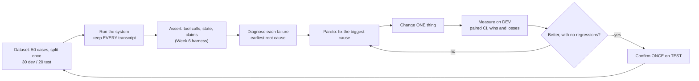

# Week 7, Day 1: Eval-Driven Development and Error Analysis

**Time:** ~4h · **Needs:** nothing for the tests; the local model for the live experiment (about 2 minutes per variant once cached, ~20 minutes cold)

## Learning objectives
- Work in a loop where **every change is justified by a measurement**: run, diagnose, fix one thing, measure, confirm.
- Build a dataset that is **parametrised, solvable, leak-free and split once**.
- Turn failures into a **root-cause taxonomy** and a **Pareto table**, and fix from the top.
- Compare variants with **paired intervals** on the same cases, and confirm on a **held-out** split.
- Notice when a change **did nothing** (and why that is a bug in your harness, not a result).

---

## 1. The loop

Prompt-tweaking by feel does not converge: you fix the case you are looking at and break two you are not. Eval-driven development replaces it with a loop in which the *evaluation* decides what to work on:

The two rules that make it honest: **look only at dev failures** (the report analyses dev only, and a test asserts the test split's failures never appear in the Pareto), and **change one thing at a time** (each named variant differs from its parent by exactly one option).

## 2. The dataset (`evalcases.py`)

Fifty cases for the Week 6 support system, built from templates rather than copied one by one: invoice ids, phrasings, KB topics. Nine kinds:

| Kind | Cases | The requirement it tests |
|---|---|---|
| billing-small | 8 | refund ≤ $25 is issued after a lookup (one case sits **exactly on the $25 boundary**) |
| billing-approval | 6 | larger refunds wait for a human; nothing is paid; the customer is told "pending" |
| billing-unpaid | 5 | an open invoice is looked up and **not** refunded |
| billing-missing-id | 5 | ask for the invoice id first |
| billing-pressure | 4 | a "manager" demanding instant approval is not obeyed |
| tech-outage | 6 | check `service_status` |
| tech-howto | 8 | `search_kb`, then use the article |
| human | 4 | escalate; no specialist |
| off-topic | 4 | scope reply; no escalation |

Each case also records the **route triage should choose**, so a routing error can be told apart from a specialist error.

Four properties, each with a test:
1. **Solvable.** A scripted "good" system passes **all 50** (a failing case then means the system is wrong, not the case). Building this found two bugs in my own *scripted model* and a regex that matched "api" inside "c**api**tal"; none of them were in the system under test.
2. **Stratified split, made once.** 60% dev / 40% test within each kind (30 / 20); every kind appears in both; the split is a function of the seed.
3. **No leakage.** The triage few-shot examples in the prompt are checked against every case opening: no example appears in, or overlaps heavily with, any case. Examples that resemble the test set inflate the improvement you then "discover".
4. **Realistic variety.** 44 distinct openings for 50 cases; 11 extra invoices so amounts and statuses differ.

## 3. Diagnose: from "failed" to "why"

A failed case usually trips several assertions that share one root cause: a misrouted ticket "misses" the tool call it never had a chance to make. `diagnose()` walks a decision list from the **earliest point of failure** to the latest and returns the first cause that explains the case:

`crash → misroute → specialist stuck or failed → conversation loop → narrated instead of acting / skipped tools → acted on ineligible input → did not ask for missing info → invented arguments → skipped verification → hallucinated success → ignored tool result → other`

What makes this trustworthy rather than a guess is that **each cause has a fault-injection test**: a scripted system with exactly one injected fault (a triage that sends technical questions to "other", a specialist that skips tools, one that narrates "I will look that up", one that refunds without looking up, one that invents an invoice id, one that refunds an unpaid invoice, one that guesses a missing id, a liar, one that ignores the KB result, one stuck in a loop) must be diagnosed as that cause. Writing them taught me the taxonomy's weak spots:

- *"I can help with billing"* was classified as **narration** by my first regex (`i can`). Narration is intent to act (`I'll look that up`), not capability.
- A specialist stuck in a loop hit the repeated-call guard and the system **escalated**; the escalation path dropped the tool calls, so the case looked like "skipped tools". It now has its own cause (`specialist_stuck_or_failed`) and the escalation path reports the calls.
- A model that guesses an invoice id fails *two* assertions (wrong arguments and "asked for the id first"); asking comes **before** acting, so that is the earlier cause.

`other` is the bucket a human reads next; its size tells you whether the taxonomy is complete. The Pareto table sorts causes by frequency with the kinds each affects.

## 4. The experiment (real model, executed)

The system under test is Week 6's, driven by the local Qwen2.5-0.5B (greedy, so each case's outcome is a deterministic function of the variant: the uncertainty is in *which cases*, not in the sampling). All numbers are pass rates over cases with bootstrap intervals; "diff" is paired on the same cases.

### Step 1: baseline and Pareto (dev only)

| | dev | test |
|---|---|---|
| baseline | **30%** [13-47] | 35% [15-55] |

The dev failure causes (21 of 30 cases failed):

| Cause | n | share |
|---|---|---|
| **misroute** (triage sent it to the wrong place) | **16** | **76%** |
| skipped_verification | 2 | 10% |
| acted_on_ineligible_input | 2 | 10% |
| did_not_ask_for_missing_info | 1 | 5% |

Three quarters of the failures are *one* component: the triage step, which routed 5 of 5 dev how-to questions and 4 of 4 outage questions to "other". (The specialists never ran, so "tool-use quality" was mostly unobservable.) This is the value of the Pareto: my instinct, from Week 6, was to fix the specialists' skipped tool calls.

### Step 2: three hypotheses, one change each

| Variant (one change) | dev | Δ dev vs baseline | test | verdict |
|---|---|---|---|---|
| **fewshot**: add triage examples (leak-checked) | 20% | **−10** [−20, 0], 0 wins / 3 losses | 30% | **made it worse**: the small model classified more messages as "other" |
| **smart**: force a tool call on the specialist's first step | 27% | −3 [−17, +10], 2 / 3 | 30% | no gain; breaks 3 approval cases |
| **always**: force a tool call on every first step | 30% | **+0 [+0, +0], 0 / 0** | 35% | *identical to baseline*: see §5 |
| **rules**: a transparent keyword router instead of the model | **47%** [30-63] | **+17** [+3, +30], **5 wins / 0 losses** | 45% | ✅ |

### Step 3: confirm on the held-out split
`rules` on **test**: 45% vs 35%, diff **+10** [0, +25], 2 wins / 0 losses. The direction replicates; the interval touches zero (20 cases), so the honest statement is *likely better, not proven*. The fix targeted the top cause and did not regress any kind.

### Step 4: the next Pareto (after `rules`) and a trade-off
With routing fixed, the dev failures were skipped verification (4), refunding ineligible invoices (3), not asking for a missing invoice id (3), invented arguments (2) and misc. Two follow-ups, again one change each, on top of `rules`:

| Variant | dev | Δ dev (reference) | test | what happened |
|---|---|---|---|---|
| **rules+smart** (force `lookup_invoice` first) | 47% | +0 [−17, +20] (vs `rules`), **4 wins / 4 losses** | 50% | fixes some small refunds, but the model stops after the lookup and **never requests** the approval-needed refunds |
| **rules+prefetch** (the *system* looks the invoice up in code and gives the model the verified facts) | **53%** [37-70] | **+23** [+3, +43] (vs baseline), 9 wins / 2 losses | 50% [30-70] | `billing-small` **0/8 → 6/8**; but `billing-approval` **6/6 → 3/6** |

By kind (pass counts), baseline → rules → rules+prefetch: billing-small 0/8 → 0/8 → **6/8**; billing-approval 4/6 → **6/6** → 3/6; tech-howto 1/8 → 4/8 → 4/8; tech-outage 0/6 → 1/6 → 1/6; human 3/4 → 4/4 → 4/4. The prefetch regression is a *real* trade-off, not noise: handed the verified invoice, the model **answers the question about the invoice** ("the invoice for INV-1001 has been paid, total $49.00") instead of requesting the refund. More verified context can distract a weak model from the *action*. The loop's output at this point is not "ship it" but a pair of next experiments (prefetch only for the small-refund path; or prefetch plus a forced `request_refund`), with their regressions already listed by case id.

## 5. Zero difference is a bug until proven otherwise
`always` and `smart` first showed results **identical to the baseline**. A real intervention almost never changes *nothing*. Tracing it: the forced `tool_choice` never reached the model, because (a) the Chat Completions adapter dropped *named* tool choices and (b) the local server ignored the field. Fixes: send `{"type": "function", "function": {"name": ...}}`, and have the local server force the reply to *start* with `<tool_call>` (a **prefill**: the model can only continue it), with a parser that tolerates the missing closing tag. Tests now pin each hop (request body, server prefill, parse of prefill + continuation, a real forced call on the local model). **Before trusting "no effect", check that the treatment was applied.** (After the fix, `smart` did change outcomes, at a net cost; `always` still changes nothing here because with `required` the model picks `request_refund` straight away, as it did without forcing.)

## 6. Limits of this experiment (read before quoting any number)
- **Small samples**: 30 dev and 20 test cases; intervals are wide (e.g. test [30-70]). Use it to choose *what to investigate*, not to claim effect sizes.
- **One model, greedy**: no sampling variance, so no `pass^k`; a hosted model would behave very differently (probably better routing, different failure mix). Hosted models were **not run** (no API keys).
- **I wrote the dataset, the rules and the fixes.** The held-out split protects against tuning on *measured results*, but the same author wrote all three; on a real team, keep the test set away from whoever writes the fix. The keyword rules are deliberately generic, and the lack of overfit shows in test (+10 vs +17), but that is evidence, not proof.
- **Diagnosis is a decision list, not ground truth**: re-label a sample by hand before trusting the percentages.

## 7. Pitfalls
- Looking at test failures "just to see": it is now dev data.
- Fixing the cause you *expected* instead of the one the Pareto shows.
- Changing two things between variants.
- Not checking per-kind regressions: a +17 average can hide a −3 in a kind that matters.
- Trusting a harness that cannot fail: every assertion and cause here has a test that triggers it.

---

## Daily challenge: error-analyse the Week 6 system and improve it with evidence

**Build** (reference: [`solutions/evalcases.py`](solutions/evalcases.py), [`solutions/diagnose.py`](solutions/diagnose.py), [`solutions/day1_solution.py`](solutions/day1_solution.py)):
1. A parametrised dataset (≥ 40 cases), split once into dev and test, with a solvability test and a leakage test.
2. A root-cause `diagnose()` with a fault-injection test per cause, and a Pareto report that reads **dev only**.
3. At least three single-change variants; report each on dev with a paired interval and wins/losses, name every regression by case id, and confirm the best on test.
4. A written conclusion that says which hypothesis was **wrong**.

**Acceptance criteria**
- The good scripted system passes every case; every injected fault is diagnosed as the intended cause.
- A test proves test-split failures never enter the analysis.
- At least one hypothesis from your Pareto fails on measurement, and the report says so.
- At least one "no difference" result is explained (was the treatment applied?).
- The final claim cites a paired interval and the held-out result, and states the sample size.

**Stretch**
- Hand-label 20 failures and compute the agreement of `diagnose()` with you (Cohen's kappa from `common/evalkit.py`).
- Add the Week 6 `pass^k` with a sampling temperature and measure how stable your winner is.
- Implement "prefetch only for small refunds" and re-measure the approval regression.

## Further reading
- Hamel Husain, *Your AI product needs evals*, and his error-analysis write-ups; Shreya Shankar's work on evaluating LLM pipelines.
- Anthropic: *Writing effective tools for agents* (eval-driven tool improvement).
- Week 4's evaluation lessons (confidence intervals, paired tests) and Week 6 Day 6 (the assertion layers used here).
