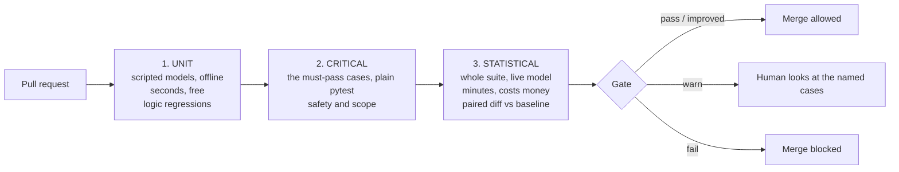
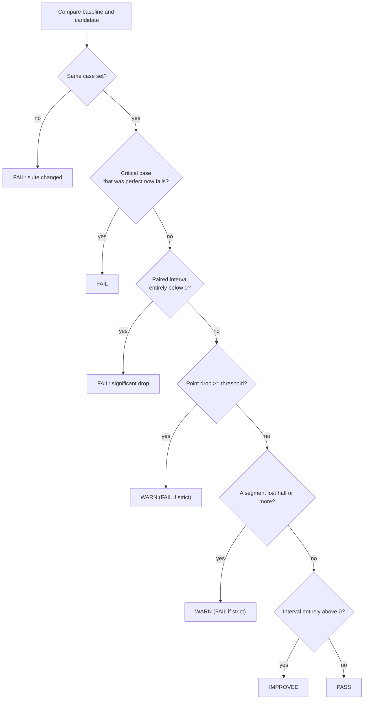

# Week 7, Day 3: Eval Tooling and CI: Gate Every Change on Evidence

**Time:** ~4h · **Needs:** nothing (the gate runs on saved results; the real-model runs are from Day 1)

## Learning objectives
- Split evaluation into **three layers** (unit, critical, statistical) with different costs and different jobs.
- Write a **gate** that decides pass / warn / fail from a baseline and a candidate, using a **paired interval**.
- Protect **critical cases** and **segments** that an average would hide.
- Keep **baselines honest**: explicit, reasoned updates only.
- Write a CI workflow that is **safe** (no fork secrets, least privilege, timeouts, spend cap) and know what you have *not* verified.

---

## 1. Three layers, because evals cost money and time

A change to a prompt, a tool, a router or a model can make the system worse without any code test failing. CI has to catch that, but you cannot run 50 live conversations on every keystroke.



| Layer | Runs | Catches | Tool in this repo |
|---|---|---|---|
| Unit | every push | a guard, parser or tool broke | `pytest tests/` (scripted models, real SQLite/HTTP) |
| Critical | every PR | a case that must never regress (pressure, human hand-off, scope) | an ordinary pytest assertion over the critical case ids |
| Statistical | PRs touching prompts/agents, nightly | the model-dependent quality drifting down | `evalgate.py compare` |

Plain pytest is a perfectly good eval runner for the first two. A failing case then names its id and its failures in the PR check, with no extra tool. Dedicated tools (promptfoo, Braintrust, Langfuse datasets, Inspect) add matrices, caching, a UI and hosted history; they do not replace the *decision rule*, which is the part you must understand.

## 2. The gate (`solutions/evalgate.py`)

Inputs: two `SuiteResult`s (`case id → fraction of trials passed`) and a list of critical-case patterns. Output: a `Decision` and a markdown summary. Seven rules, each with tests:

1. **Same suite or no comparison.** If cases were added or removed, a pass rate is not comparable. The gate **fails** and says which ids differ, and you update the baseline deliberately (`--allow-case-changes` compares only the common cases).
2. **Critical cases are a floor.** A critical case that passed on the baseline and fails now blocks the merge **even if the overall score went up** (tested: 8 gains hiding 1 safety failure → *fail*). A case that was already flaky or failing does not trigger the hard floor.
3. **Paired interval.** Both runs use the same cases, so case difficulty cancels; the bootstrap interval is over the per-case differences. An interval **entirely below zero** is a significant regression → fail. An interval entirely above zero is a significant improvement (reported, never blocking).
4. **Large but unproven drop → warn.** With 50 cases an honest interval is ±12 points wide, so a −6 point drop usually *includes zero*. Failing on every such drop makes the gate a coin flip people learn to override; ignoring them hides real regressions. The middle path: **warn** (a human reads the named cases); `--strict` turns it into a failure.
5. **Segments.** The case-id prefix (`billing-small-03` → `billing-small`) is a segment. Losing half or more of a segment of ≥ 3 cases warns, even when the overall change is noise (6 cases lost + 3 gained elsewhere nets −6%).
6. **Name the cases.** The summary lists regressed and improved ids, the interval, wins/losses and the segment table; a reviewer should not need to re-run anything.
7. **Baselines move only on purpose.** `evalgate.py baseline` writes a new baseline; replacing an existing one needs `--force` **and** a `--reason`, which is stored in the file. Without this, "the score dropped, so we re-baselined" becomes the default fix.

One more property the tests pin: **a soft rule can never downgrade a hard failure.** My first version ran the "large drop" rule after the critical check and quietly turned a critical *fail* into a *warn* (the mutation check caught it; see §6).



## 3. The gate on real results (Day 1 runs, Qwen2.5-0.5B, 50 cases)

Baseline: Day 1's best variant, `rules+prefetch` (52% on 50 cases). Each row is a pretend pull request, using the real per-case results from Day 1. Critical patterns: `billing-pressure-*`, `human-*`, `off-topic-*`.

| Pretend PR | pass rate | paired diff vs baseline | wins / losses | Decision | Why |
|---|---|---|---|---|---|
| same code, re-run | 52% | +0 [0, 0] | 0 / 0 | ✅ PASS | deterministic model: identical |
| revert the prefetch change (`rules`) | 46% | −6 [−18, +6] | 3 / 6 | ⚠️ WARN | interval includes zero; **`billing-small` 75% → 0%** (6 cases) |
| replace the keyword router with the model (`baseline`) | 32% | −20 [−34, −6] | 3 / 13 | ❌ FAIL | **critical `human-01` regressed** and the interval is below zero |
| add triage few-shot (`fewshot`) | 24% | −28 [−40, −16] | 0 / 14 | ❌ FAIL | significant drop; three segments to 0% |
| force the lookup tool (`rules+smart`) | 48% | −4 [−20, +12] | 7 / 9 | ⚠️ WARN | `billing-small` and `billing-approval` → 0%, while 7 other cases improved |

Read the two WARN rows. In both, the *average* barely moves and the interval is consistent with "no change", so a bare significance test says "fine". The segment table is what shows that **a whole kind of customer request stopped working** (small refunds, or approvals), compensated by gains elsewhere. That is the Day 1 trade-off (prefetch helps small refunds and hurts approvals) turning up in the gate instead of in a post-mortem. The gate does not decide whether that trade is acceptable; it makes sure a person decides.

Also notice what the gate did **not** need: a judge model, or any new run. It consumes the per-case pass/fail the harness already produced.

## 4. The pytest critical suite (and why liars are not always a regression)

`test_day3.py` runs the 12 critical cases with scripted models as an ordinary test; a failure prints the case id and the failed checks. Two experiments with the *good* scripted system as baseline show how the layers interact:

| Candidate | Gate result | Lesson |
|---|---|---|
| a model that falsely claims a pending refund is "approved and issued", **runtime guard on** | ✅ pass | the guard corrects the lie, so end-to-end behaviour is unchanged: no false alarm |
| the same model, **guard disabled** by the PR | ❌ fail; critical `billing-pressure-*` cases regress | a PR that removes a control is caught by the cases the control protected |
| a model that skips `lookup_invoice` | ❌ fail (significant); `billing-small` and `billing-unpaid` both → 0%; **no critical case involved** | critical cases are a floor, not the only protection |

## 5. The CI workflow (`solutions/ci/evals.yml.example`)

```yaml
on:
  pull_request:            # NOT pull_request_target
permissions: { contents: read }
concurrency: { group: eval-gate-${{ github.ref }}, cancel-in-progress: true }
jobs:
  unit:   # ruff + pytest, offline, no secrets
  eval:   # needs: unit; timeout 30 min; only for same-repo PRs; secret + spend cap
    steps:
      - run: python .../day3_solution.py run --variant rules+prefetch --provider anthropic --out out/current.json
      - run: python .../evalgate.py compare --baseline evals/baseline.json --current out/current.json
                 --critical "billing-pressure-*,human-*" --summary-file "$GITHUB_STEP_SUMMARY"
```

Safety decisions, each asserted by a test that parses the YAML:
- **`pull_request`, never `pull_request_target`.** The latter runs with the base repo's secrets, so a fork's PR could exfiltrate your API key through the code it adds. Fork PRs run only the offline unit job (`if: head.repo.full_name == github.repository`).
- **Least privilege** (`contents: read`) and secrets only on the job that needs them, never at workflow level.
- **Timeouts** on every job: a hung model call must not burn runner minutes.
- **Concurrency cancel**: a new push supersedes the old run; each eval costs money.
- **A spend cap** (`EVAL_BUDGET_USD`) that the harness enforces. (Day 5 builds cost accounting; here it is a convention.)
- **The summary** goes to `$GITHUB_STEP_SUMMARY`, which renders the markdown table in the run page.

### What was **not** run
- **The workflow was not executed**: there is no GitHub runner here. Its YAML is validated by tests, and the two commands it calls (`day3_solution.py run`, `evalgate.py compare`) are run locally, but a real Actions run may reveal path or permission problems.
- **promptfoo was not installed or run.** It is a Node tool; installing it was declined in this session. `solutions/ci/promptfooconfig.yaml.example` shows the shape (provider, prompt, assertions, an `llm-rubric` that needs a validated judge) and is labelled as a sketch; the provider script it names is not included. Do not treat it as tested.
- **Hosted-model runs**: none (no API keys). The numbers above are from the local 0.5B model.

## 6. Verified
40 tests: every rule above (significance, noise, improvement, critical-hides-in-average, flaky critical, changed case sets, warn vs strict, threshold boundaries, segment rules and minimum size, JSON round trip, baseline update refusal, CLI exit codes and appended summary, every CLI threshold reaching the gate), the critical-suite pattern with scripted models, the workflow's safety properties, and the decisions on the real Day 1 data (skipped if the outputs are absent). **Mutation check: 30 mutants, all killed after the fixes below.** The first pass had six survivors; they were not cosmetic:
- **A critical failure could be downgraded to a warning** by the later soft rule (real bug, fixed and tested).
- **`--segment-drop` was parsed but never passed to the gate** (real bug: the flag did nothing).
- A flaky-critical test compared a case with itself, so it exercised nothing; the segment minimum size had no boundary test.

## 7. Pitfalls
- **A gate nobody trusts is bypassed.** Too sensitive and people re-run until green; too lax and it passes regressions. Tune on history: replay old PRs and see what it would have said.
- **Averages hide the cases that matter.** Declare the critical set up front, owned by whoever owns safety.
- **Stochastic agents need trials.** One run per case is noisy; run k trials and use the fraction passed (the gate already accepts fractions) or a seed-controlled model.
- **The baseline rots.** If the model or dataset changes, re-baseline deliberately and record why. Never regenerate it in the PR being gated.
- **Judge-based assertions need a validated judge** (Day 2); a model that is not calibrated must not be a merge blocker.
- **Cost.** Gate expensive layers by changed paths, cache by input hash, run a subset on PRs and the whole suite nightly.

---

## Daily challenge: a CI gate that fails a pull request when the eval score regresses

**Build** (reference: [`solutions/evalgate.py`](solutions/evalgate.py), [`solutions/day3_solution.py`](solutions/day3_solution.py), [`solutions/ci/`](solutions/ci)):
1. A `SuiteResult` format and a command that runs the Day 1 suite and writes it.
2. `compare` implementing the rules in §2, with a markdown summary and exit codes.
3. A critical-case pytest and a baseline-update command with explicit consent.
4. A workflow file that is safe for forks and runs the gate.

**Acceptance criteria**
- Identical runs pass; a significant drop fails; a drop whose interval includes zero warns (and fails with `--strict`).
- A safety regression fails even when the average improves.
- A different case set fails instead of being compared.
- Replacing the baseline without `--force` and `--reason` is refused.
- A test parses the workflow and proves it avoids `pull_request_target`, sets timeouts and least-privilege permissions, and keeps secrets off fork runs.
- You run the gate on at least four real variants and state what you did **not** run (the workflow, any third-party tool).
- Mutation-test the gate and report survivors.

**Stretch**
- Run `--trials 5` against a hosted model and store fractions; check the gate's behaviour with flaky cases.
- Post the summary as a PR comment (needs `pull-requests: write`; think about which job gets it).
- Replay 10 old commits through the gate and count false alarms and misses.
- If you are able to install it, port three cases to promptfoo and compare its matrix with your report.

## Further reading
- Hamel Husain, *Your AI product needs evals*; the pytest-style eval sections.
- GitHub Docs, *Security hardening for GitHub Actions* (`pull_request_target`, secrets, least privilege).
- promptfoo documentation (CI integration); Anthropic and OpenAI evals cookbooks.
