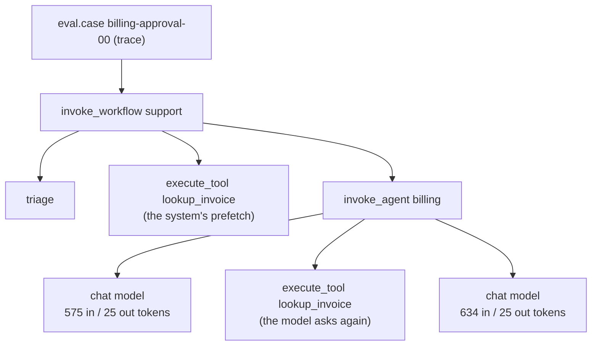

# Week 7, Day 4: Tracing: See Inside the Agent with OpenTelemetry

**Time:** ~4h · **Needs:** nothing for the tests (OpenTelemetry's API and SDK are already installed as dependencies of the agent extras); the local model for the live run (about 7 seconds once cached)

## Learning objectives
- Explain **trace, span, attribute, event and context propagation**, and why an agent needs traces rather than logs.
- Emit spans that follow the **OpenTelemetry GenAI conventions** for model calls, tool calls, agents and workflows.
- Keep tracing **private by default**, **connected across threads**, and **cheap**.
- Export spans three ways (memory, JSONL, **OTLP over the network**) and **sample** them sensibly.
- Write **checks that read only a trace**, and know exactly which failures they cannot see.

---

## 1. Why logs are not enough

Day 1 told us *which cases fail*. A trace tells us *what happened inside one conversation*: which hop misrouted, which tool call repeated, where the 4 seconds went, what the second model call cost. An agent is a program whose control flow is chosen by a model at run time, so you cannot read the code to know what a particular run did. A log line says "called lookup_invoice"; a **trace** says it was the *second* time, inside the billing agent, 1 ms after the triage step, in the conversation that ended escalated.



Vocabulary: a **span** is one timed operation with a name, **attributes** (key/value facts), optional **events**, a **status** (unset / ok / error) and a **parent**; a **trace** is the tree of spans sharing one trace id. **Context propagation** is how a new span learns its parent (in Python, a `contextvar`: the "current span"). Everything below depends on that last point.

## 2. What we record (`common/tracing.py`)

| Span | Name | Key attributes |
|---|---|---|
| model call | `chat {model}` | `gen_ai.operation.name=chat`, `gen_ai.provider.name`, `gen_ai.request.model`, `gen_ai.request.max_tokens`, `gen_ai.response.model`, `gen_ai.usage.input_tokens`, `gen_ai.usage.output_tokens`, `gen_ai.response.finish_reasons`, cache read/write tokens when non-zero, `gen_ai.output.type=json` for structured output |
| tool call | `execute_tool {name}` | `gen_ai.tool.name`, `gen_ai.tool.call.id`, `gen_ai.tool.type=function`, error status when the tool returned an error |
| agent loop | `invoke_agent {name}` | `gen_ai.agent.name`, plus ours: `app.agent.status`, `app.agent.steps` |
| one customer turn | `invoke_workflow support` | `gen_ai.workflow.name`, `gen_ai.conversation.id`, `app.reply.agent/status/violations` |
| triage | `triage` | `app.triage.mode/route/asked_model` |

Honest notes on the conventions, because this is the part most likely to age badly:
- **They are not stable.** The GenAI conventions are in "development" status and have been renamed before (for example `gen_ai.system` became `gen_ai.provider.name`). In the installed `opentelemetry-semantic-conventions` package, **every** `gen_ai.*` constant is marked *"Deprecated: moved to the semantic-conventions-genai repository"*: I read that in the source; I did not look at the new repository. So we define our own string constants and a test asserts each one **equals** a name in the installed package, which catches typos but not future renames. Pin your backend's version.
- **There is no cost attribute**, so cost, agent status and step count live in our own `app.*` namespace. Custom attributes are normal; put them in a namespace that cannot collide.
- **Input tokens include cached tokens** in the conventions as I understand them; this repo's `Usage.input_tokens` excludes cache reads/writes, so the span adds them back and also reports the cached part (a unit test pins the arithmetic: 100 + 900 + 50 → 1050). I could not check this against the specification text offline.
- **Message content** (`gen_ai.input.messages` / `output.messages`) is recorded as plain JSON of this repo's message format, **not** the parts-based schema the conventions describe. If your backend renders conversations from that schema, you would need a converter.

### Two ways to instrument
- **Wrap the entry points** (`tracing.instrument()` patches `chat.turn`, `llm.complete`, `llm.structured` and `ToolRegistry.execute`): every model and tool call in the repo is traced with no call-site changes. This is what OpenLLMetry and OpenInference do to SDKs.
- **Manual spans where the *application* knows something the library cannot**: `run_agent` opens `invoke_agent`; `SupportSystem.handle` opens the workflow and triage spans and records the route and outcome. Domain attributes (route, reply status, which guard fired) belong here.

Without a tracer provider the OpenTelemetry API is a no-op, so the instrumentation costs nothing in production code that does not turn it on (a test asserts the agent behaves identically with and without tracing, and that nothing is exported when tracing is off).

## 3. Context must cross threads (a bug class, not a detail)

Week 5's tool executor runs each call in a worker thread (for the timeout, and for parallel calls). `contextvars` do **not** follow work into a `ThreadPoolExecutor`, so a span opened in a tool, or the tool's own `execute_tool` span, becomes an **orphan root with a new trace id**. The trace tree looks fine in a demo with one tool and quietly breaks with parallel tool calls.

- A test shows the failure with a plain pool: the child has no parent and a different trace id.
- The fix is in `common/tools.py`, not in the tracing module: **copy the caller's context into each worker** (`ctx.run`), one copy per task because a `Context` cannot be entered by two threads at once. Tests: three parallel tool calls all parent to the agent span; a span a tool opens itself becomes a child of that tool's span.
- The same issue appears with `asyncio.to_thread` (which does copy the context), raw `threading.Thread` (it starts with an empty context in most Python builds; newer versions add options, so check yours), and any framework's own executor: check anything that moves work between threads.

An orphan also has a signature you can monitor: `tracing.roots(spans)` returning more than one root for a single case.

## 4. Privacy by default

A trace backend is a second copy of your production data, usually with a wider audience and a longer retention than the database. So:

- **Content is off by default.** Prompts, replies, tool arguments and tool results are not recorded; a test pushes a "secret" through the system prompt, the user message, the tool arguments, the tool result and a tool exception, and asserts it appears **nowhere** in any span, attribute, event or status.
- **Opt in with `capture_content=True`, through a `redact` function and a length cap.** The same secret test with a redactor asserts it is replaced everywhere content can appear. **This test found a real leak**: the tool-error status description was copied *after* the redactor (and `record_exception` would have copied the exception message the same way). Both now go through `redact`.
- **Errors record the exception class, not its message** (messages quote user input) unless capture is on.
- **Arguments can be compared without being recorded.** The `app.tool.args_digest` attribute is a *keyed* hash (HMAC with a per-process key) of the arguments: two identical calls have the same digest, nothing can be read from it, and (unlike a plain hash) a low-entropy value such as an invoice number cannot be recovered by hashing all candidates. Tests: stable under key order, differs for different arguments, is not equal to a plain SHA-256.
- Redaction is only as good as your `redact` function. Week 8 Day 5 builds a PII redactor; wire it in here.

## 5. The trace of a real conversation

The 50 Day 1 cases, run on the local Qwen2.5-0.5B with the best Day 1 variant (`rules+prefetch`) under tracing: 323 spans, 50 traces (one per case, rooted at an `eval.case` span that carries the case id, kind, split and verdict, so an eval report can link to its trace). Two real trees:

```
eval.case  [passing small refund]
└─ invoke_workflow support
   ├─ triage
   ├─ execute_tool lookup_invoice            <- the system's prefetch
   └─ invoke_agent billing  [status=done]
      ├─ chat local-qwen  [577 in/32 out tok]
      ├─ execute_tool request_refund
      └─ chat local-qwen  [644 in/20 out tok]

eval.case  [FAILING approval case]
└─ invoke_workflow support
   ├─ triage
   ├─ execute_tool lookup_invoice            <- the system's prefetch
   └─ invoke_agent billing  [status=done]
      ├─ chat local-qwen  [575 in/25 out tok]
      ├─ execute_tool lookup_invoice        <- the model looks the same invoice up AGAIN
      └─ chat local-qwen  [634 in/25 out tok]
```

The second tree is Day 1's "prefetch hurts the approval path" finding, visible in one glance and without reading a transcript: the model re-did the lookup the system had already done, and never requested the refund.

Aggregates over the 50 traces (median / p95 / max per case): 2 / 2 / 2 model calls; 1,151 / 1,225 / 1,240 input tokens; 58 / 77 / 91 output tokens; 1 / 2 / 2 tool calls. The billing agent used **74%** of the input tokens (53 model calls) and the technical agent 26%; `request_refund` was the slowest tool (8 ms average).

**Read the latency numbers with suspicion.** This lab's local model keeps a disk cache of its (greedy) answers, so after the first run nearly every model call takes 2 ms; the one 4.5-second model span in each run is the model loading. The *shape* (which spans exist, token counts) is real; the *durations* measure our plumbing, not inference. Day 5 measures latency properly.

## 6. Exporting and sampling

| Exporter | Use | Verified how |
|---|---|---|
| in memory (`capture()`) | tests, notebooks | everywhere |
| **JSONL** (`JsonlSpanExporter`) | local files, replay, offline analysis; `load_spans` reads them back and the report in this lesson is built *only* from the file | round-trip test |
| **OTLP gRPC** (`otlp_exporter`) | Phoenix, an OpenTelemetry Collector, Jaeger, most vendors | a test starts a **real local gRPC server** implementing the OTLP trace service, exports an agent run to it, and checks the received service name, span names, parent ids and token attributes |

`sync=True` exports each span as it ends (tests); production uses `sync=False` (a batching processor) so a slow collector never slows a customer reply.

**Sampling.** Tracing everything is expensive and mostly boring. *Head* sampling decides at the first span, before anyone knows the trace is interesting, so it throws away exactly the failures you want. `TailSamplingExporter` buffers a trace's spans until its root ends and then keeps it if it had **any error**, or was **slower than a threshold**, or falls in a **fraction** chosen by the trace id (so every service in a system keeps the same traces). Tests: errors and slow traces always kept, a kept trace is complete (never half), the keep decision is exact at the boundary (id mod 10,000 below `fraction × 10,000`), memory is bounded (oldest unfinished trace evicted), unfinished traces are dropped at shutdown. Production systems normally do this in the Collector; the logic is the same.

**Not run:** Langfuse, Phoenix and Jaeger. As I understand it (from memory, not checked here) they can ingest OTLP, which is what the wire test exercises against a local stand-in; I did not start any of them and make no claims about their UIs, exact endpoints or configuration.

## 7. Checks that read only a trace (`solutions/traceeval.py`)

A test-time eval knows the right answer. Production does not, but a trace still reveals a lot. `check_trace` returns **defects** and **events**:

| Code | Kind | Meaning |
|---|---|---|
| `refund_without_lookup`, `refund_before_lookup` | defect | the refund tool ran with no verification, or before it |
| `specialist_used_no_tool` | defect | an agent answered without using any tool in the whole trace (a tool the *system* ran just before the agent counts: the prefetch pattern) |
| `tool_loop` (≥ 3 calls), `duplicate_tool_call` (2 identical calls, by digest) | defect | wasted calls / a stuck model |
| `agent_failed`, `many_steps`, `tool_error`, `model_error`, `slow_trace` | defect | something broke or was slow |
| `escalated`, `guard_fired` | **event** | worth *counting*, not failures: escalating is the right answer to "let me speak to a person", and a guard that fired means the guard worked |

The first version flagged escalations and guard firings as violations: 8 of 26 *passing* cases looked bad. Splitting events from defects took false alarms to **zero** on the real run.

### What the checks can and cannot see (scripted faults, one at a time, all 50 cases)

| Injected fault | Harness failures | Flagged by the trace | Harness-passed but flagged |
|---|---|---|---|
| none (good system) | 0 | 0 | 0 |
| skip the lookup | 13 | **13** | 15 ¹ |
| refund an invented invoice id | 24 | **24** | 4 ¹ |
| answer without tools / narrate instead of acting | 38 | **38** | 4 ² |
| stuck in a tool loop | 24 | **24** | 4 ² |
| **lie about a pending refund, guard off** | 10 | **0** | 0 |
| **refund an unpaid invoice** | 5 | **0** | 0 |
| **guess a missing invoice id** | 5 | **0** | 0 |
| **misroute technical questions** | 14 | **0** | 0 |

¹ The harness lets these pass (it only requires `request_refund` for approval cases) even though the refund was requested without a lookup: the trace and the harness encode **different requirements**, which is information, not noise. ² The 4 are "missing invoice id" cases, where answering with no tool is *correct*: a trace cannot tell, because it does not know the id was missing. These checks fire on the *shape* of the process and are blind to *content*: a lie, a wrong route, or an action that is wrong for this customer looks like a normal trace. That is what outcome checks and (validated) judges are for.

### On the real run
Of the **24** cases the full harness failed, the trace flagged **14**, with **0** false alarms among the 26 passes. Split by Day 1's dev/test split: dev 8 of 14, test 6 of 10. Not flagged: the five `billing-unpaid` cases (refunds of an unpaid invoice), a missing-id guess and four `tech-outage` cases: all wrong-but-ordinary-looking traces. **A caveat on the number**: I added `duplicate_tool_call` *after* looking at the dev traces (it is what the approval failures looked like), so dev is not an unbiased estimate; test (6 of 10) is the fair number, and 10 cases is a small sample.

## 8. What tracing costs

Scripted model (so only our code is measured), one agent run = 3 model calls + 2 tool calls = 6 spans, in-memory synchronous export: **0.17 ms plain, 0.36 ms traced: +0.19 ms per run, about 30 µs per span.** Negligible next to a model call (hundreds of ms to seconds). Not measured: the batch processor and a network collector, which is where real overhead and failure modes live (a full queue drops spans; that is why export must never be on the request path). Spans averaged 490 bytes each in the JSONL file: 50 conversations ≈ 160 KB, so storage is mostly a retention-policy question.

## 9. Verified
**43 tests** in `tests/test_tracing.py` and **36** in `solutions/test_day4.py`: attribute names against the installed package; no-op without a provider; every span kind and attribute; error handling and privacy (the secret test, redaction, truncation at the exact cap); parent/child structure including parallel tools and spans opened inside tools; install/uninstall (restores originals, refuses to nest, does not clobber a patch made on top); summaries, trees and slowest-span helpers on hand-built traces; the three exporters including the live gRPC server; tail-sampling boundaries; every trace check, with a scripted-fault matrix pinning what is and is not detected; and a report built from a saved file. **Mutation checks: about 65 applied mutants across `tracing.py` and `traceeval.py`; every behavioural mutant killed in the end.** The first pass left survivors that drove these test additions: the content-cap boundary (`<=` vs `<`), whether cache-write tokens are only reported when non-zero, the tail-sampling boundary, the uninstall guard, root ordering in the tree view, whether a tool in a *different* branch counts as an agent's verification, and rounding up in the percentile. One reported survivor was an equivalent mutant (a `>` that cannot differ from `>=` because two list indices are never equal).

---

## Daily challenge: full traces for the Week 6 system

**Build** (reference: [`common/tracing.py`](../../common/tracing.py), [`solutions/day4_solution.py`](solutions/day4_solution.py), [`solutions/traceeval.py`](solutions/traceeval.py)):
1. Spans for model calls, tool calls, agent loops and a per-turn workflow, following the GenAI conventions, with cost and status under your own namespace.
2. Content capture that is off by default, redacted and capped when on, plus a way to compare tool arguments without recording them.
3. Context that survives the tool worker threads.
4. A JSONL exporter, a tail sampler, and (if you can) an OTLP export checked against a local receiver.
5. At least five trace-only checks, split into defects and events, and a table of what they miss.

**Acceptance criteria**
- A conversation is **one connected trace** (a single root) even with parallel tool calls.
- A test pushes a secret through every input channel and finds it in **no** span by default, and redacted when capture is on.
- Tracing off adds no spans and does not change the agent's behaviour.
- Every attribute name matches the installed conventions; there is a unit test for the cached-token arithmetic.
- Your trace checks are evaluated against the Day 1 harness **on the held-out split** and you report both the catches and the misses.
- Overhead is measured, and you say what you did *not* measure (batching, network).

**Stretch**
- Run Phoenix or Langfuse locally, point `otlp_exporter` at it and compare what you see with `render_tree`.
- Add `gen_ai.client.token.usage` and operation-duration **metrics** and aggregate by agent.
- Convert the content attributes to the parts-based message schema and validate against the spec.
- Add a `trace_id` to the customer-facing reply metadata so a support person can find the trace from a complaint.
- Add a check that needs a little context (an `app.invoice.status` attribute) and measure whether it catches the unpaid-refund cases without leaking customer data.

## Further reading
- OpenTelemetry docs: *Traces*, *Context propagation*, *Semantic conventions for generative AI* (check the current repository and status).
- OpenInference and OpenLLMetry (the instrumentation approach used here, applied to provider SDKs).
- Hamel Husain and others on reading traces as the first step of error analysis.
