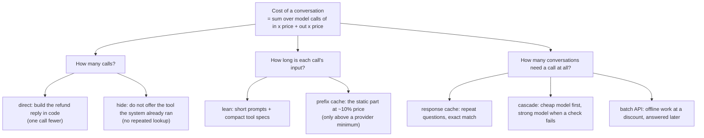

# Week 7, Day 5: Cost and Latency: Cut the Bill by 40% Without Losing the Score

**Time:** ~5h · **Needs:** nothing for the tests; the local model for the live runs (about 20 minutes for all eight variants cold; seconds once cached)

## Learning objectives
- Find where the tokens go from **traces**, then price them with a **price card**.
- Apply four cost levers: **shorter prompts**, **fewer tool offers**, **fewer model calls**, and a **response cache**; know when **prefix caching, cascades and batch APIs** apply.
- Prove a cost cut is **free** by the eval gate, with the choice made on **dev** and test looked at once.
- Build a cache that **cannot serve a wrong answer** (and measure what fuzzy matching really costs).
- Be exact about what is **measured, simulated and assumed**.

---

## 1. Where the money goes

Input tokens are paid on **every** model call, and an agent re-sends its whole prompt each step. For the Day 1 system on the best Day 1 configuration (`rules+prefetch`, the "base" below), the Day 4 traces say per conversation: **1.50 model calls, 862 input tokens, 47 output tokens**. Per call that is about 575 input tokens, of which **478 are the static prefix** (system prompt + tool specs) for the billing agent and 408 for the technical one, measured with the model's own tokenizer. So roughly **four fifths of every call is text that never changes**, and output (priced about 5× per token) is small.

## 2. Measuring honestly (`solutions/costlab.py`)

- **Tokens** come from the spans (Day 4): real counts from the local model's tokenizer.
- **Dollars** come from a `PriceCard` taken from `common/llm.py` (the repo's table, which may be out of date: check your provider). The local model costs nothing, so we price its token counts **as if** a hosted model had produced them: `claude-haiku-4-5` ($1 in / $5 out per million) as the "cheap" card, `claude-sonnet-5` ($2 / $10) as the "strong" one. Different tokenizers count differently, so read dollars as **relative**, not absolute.
- **Latency** comes from a `LatencyModel` with **assumed** parameters (0.25 s base, 6,000 prompt tokens/s, 70 output tokens/s, 50 ms per tool). Nothing here measures a hosted API. The local model's own speed is meaningless for this (and its answers are disk-cached).

## 3. The levers, measured on the real local model

Three real options of the support system (`SupportSystem(...)`), all **off by default**:

| Lever | What it does | Tested how |
|---|---|---|
| `lean` | system prompts about a third of the length; `registry.compact()` keeps each tool's first sentence and drops per-parameter text (specs 1,159 → 830 characters; static prefix 478 → 323 tokens billing, 408 → 280 tech) | the model receives the lean text; same tool names; shrink asserted |
| `hide_prefetched` | when the system already looked the invoice up (Day 1's prefetch), the model is not offered `lookup_invoice` | the spec list loses it only when something was prefetched |
| `reply_from_tool` | a refund tool result becomes the customer reply **in code** (`stop_when` hook in the agent loop + the guard's `safe_reply`); errors still go back to the model | one model call fewer; truthful for issued, pending and ineligible; an *error* result is never templated (mutation check found that gap) |

All 50 Day 1 cases, one change at a time and then combined, `rules+prefetch` as the baseline (50 cases; dev = 30, test = 20; "gate" is the Day 3 gate, critical cases included):

| Variant | model calls | input tok | output tok | cost per 1k conv. (cheap card) | vs base | dev | test | gate (dev / test) |
|---|---|---|---|---|---|---|---|---|
| base | 1.50 | 862 | 47 | $1.097 | | 53% | 50% | |
| lean | 1.64 | 713 | 55 | $0.988 | −10% | **73%** | **70%** | improved / improved |
| hide | 1.50 | 777 | 46 | $1.007 | −8% | 63% | 60% | pass / pass |
| direct | 1.18 | 662 | 38 | $0.853 | −22% | 53% | 50% | pass / pass |
| lean+hide | 1.60 | 615 | 54 | $0.884 | −19% | 70% | 65% | improved / pass |
| lean+direct | 1.12 | 461 | 39 | $0.657 | −40% | 70% | 70% | improved / improved |
| hide+direct | 1.08 | 546 | 36 | $0.724 | −34% | 63% | 60% | pass / pass |
| **lean+hide+direct** | **1.12** | **418** | **40** | **$0.619** | **−44%** | **70%** | **65%** | **improved / pass** |

**No variant regressed a single case that the baseline passed**, and no critical case moved. The same configuration priced on the strong card goes from $2.194 to $1.239 per 1,000 conversations (also −44%: the card changes the dollars, not the percentage, because both prices scale input and output alike).

### What each lever taught
- **`direct` is a pure cost cut:** −22% with the *identical* set of passing cases. It removes the round trip whose only job was to rephrase "Refund issued: RF-0007 ($20.00)". Its p95 latency barely changes (the tail is conversations that never refund).
- **`hide` fixed Day 1's open problem.** The Day 4 trace showed the model re-doing the lookup the system had done and never requesting the refund. Removing the tool it would repeat took `billing-approval` from 3/6 to **6/6** and `billing-small` from 6/8 to 8/8, at no cost increase (it is also slightly cheaper). The trace found the cause; the lever is one line.
- **`lean` is the surprise, and I do not fully understand it.** Shorter prompts raised the pass rate from 52% to 72% (+20 points on dev, interval [+7, +33]) *while* cutting input tokens by 17%, with the gains in `billing-approval` (3/6 → 6/6), `billing-small` (6/8 → 8/8) and `tech-outage` (1/6 → 4/6). My hypothesis is that a 0.5B model does worse with a long rule list than with a short one. **I did not test that**, and it is the opposite of what you should assume for a strong model: re-run the gate before trusting lean prompts on any other model. Note also the cost: lean produced *more* model calls (1.64 vs 1.50) because the tool loop ran longer, so the saving came from shorter inputs, not fewer calls.
- **Levers do not add up.** `lean+hide` gained 8 cases where `lean` alone gained 10, and `lean+hide+direct` costs only 4 points less than `lean+direct`. Measure the combination, not the sum.

### Decision protocol (and a confession)
"Equal score" needs a rule written *before* looking: **pick the cheapest variant whose DEV pass rate is not below the baseline's; look at TEST once.** (`choose_on_dev` in code; a test asserts it never reads a test field, breaks ties by name, and never picks a cheaper-but-worse variant.) It picks `lean+hide+direct`: **−44% cost; dev 70% vs 53% (paired diff +17 points, 95% [+3, +30]); test 65% vs 50% (+15 [0, +30]); no critical regressions.** The test interval touches zero at 20 cases, so the honest claim is *likely better, not proven*, and certainly not worse. Two caveats: (1) I first ran the four single-lever variants as a quick probe and printed their pass rates over all 50 cases, so their test numbers are not clean (the *selection* of the combination used dev only); (2) eight variants compared on dev is a small multiple-comparison problem. Neither changes the cost result, which does not depend on the pass rate at all.

## 4. Prefix caching: why it does not apply here

Providers can discount a repeated prompt prefix (about 10% of the input price for the cached part, in this repo's table; Anthropic also charges 1.25× to write it). The catch is a **minimum cacheable length** (on the order of a thousand tokens for several models: check your provider). Our static prefix is **478 tokens** (323 lean), below that, so there would be no discount at all. A test asserts the prefix stays below 1,024 as a reminder. The arithmetic if it *were* cacheable: 83% of the input at 10% of the price would cut input cost by about 75%, which is why long system prompts and long tool catalogues are where this lever pays. Lesson: **shortening a prompt below the cache minimum and caching a long one are alternatives, not a stack.**

## 5. A response cache that cannot serve a wrong answer (`common/cache.py`)

Repeat questions are free if you can recognise them, and the danger is recognising ones that are not repeats. The cache has, each with tests:

- **Scope** in the key (agent, prompt hash, model): a prompt change cannot serve yesterday's answer. (`lean` changes the scope: a test.)
- **Normalisation** (case, spacing, punctuation, Unicode) for the exact tier, keeping `INV-1001` intact.
- **Entity guard**: ids, numbers and emails must match exactly, even on a fuzzy hit.
- **Negation guard**: "my export works" vs "does not work" share most words.
- **TTL, LRU bound, thread safety.**
- **The system decides what may enter**: only the **first turn** of a conversation (later answers depend on history; a test shows a follow-up cannot overwrite the entry), only answers built from **`search_kb`** (not `service_status`, which changes; not billing tools, which are per-customer), with **at least one tool call** (an ungrounded answer is never cached), and **no guard violation**. These are exactly the conditions the mutation check forced me to test.

### Does fuzzy matching pay? A labelled experiment (`solutions/cachelab.py`)
20 **paraphrase pairs** (the same help-center article answers both, validated: the real BM25 knowledge base retrieves one article for both phrasings of every pair; one pair failed that check and I replaced it) and 20 **near-miss pairs** (lexically close, different answer: another article, error code, platform, number, email, or a negation flip; 6 of 20 corroborated by retrieving different articles, the rest are my judgement). Percent of paraphrases served / percent of near-misses served **wrongly**:

| similarity | guards | t = 0.50 / 0.85 | 0.60 / 0.90 | 0.70 / 0.92 | 0.80 / 0.95 |
|---|---|---|---|---|---|
| word overlap (Jaccard) | none | 20% / **65%** | 15% / 50% | 0% / 10% | 0% / 5% |
| word overlap | entity + negation | 15% / 35% | 15% / 30% | 0% / 5% | 0% / 5% |
| embeddings (bge-small) | none | 55% / **60%** | 35% / 35% | 20% / 15% | 15% / 5% |
| embeddings | entity + negation | 40% / 35% | 25% / 15% | 10% / 5% | 5% / 0% |

(Jaccard thresholds 0.5, 0.6, 0.7, 0.8 and embedding thresholds 0.85, 0.90, 0.92, 0.95, in that order.) **There is no good threshold.** Embedding similarity of the true paraphrases averaged 0.868 and of the near-misses 0.855: the encoder separates them barely at all, so every threshold that serves a useful share of paraphrases also serves a lot of wrong answers, and one that is safe serves almost nothing. The guards remove the entity and negation errors but not "reset my password" vs "reset my two-factor authentication". My near-miss set is **adversarial on purpose**, so these are stress numbers, not production error rates.

### On simulated traffic
400 requests drawn with a popularity skew (a few questions asked often) from the labelled phrasings, half with surface noise (case, spacing, punctuation): **simulated traffic: the mix is invented, the mechanism is real.** A miss costs a measured how-to conversation ($1.023 per 1,000 on the cheap card).

| Cache | hit rate | wrong answers served |
|---|---|---|
| exact (normalised) | 85% | **0** |
| + fuzzy Jaccard 0.8 | 86% | 3 (0.8%) |
| + fuzzy Jaccard 0.6 | 88% | 17 (4.2%) |
| + fuzzy embeddings 0.95 | 86% | 7 (1.8%) |
| + fuzzy embeddings 0.90 | 88% | 21 (5.2%) |
| + fuzzy embeddings 0.85 | 89% | 49 (12.2%) |

The exact tier gets almost all of the benefit; fuzzy adds at most 4 points of hits for 3 to 49 wrong answers per 400. **Ship exact matching; turn fuzzy on only when you have measured it on your own traffic, and expect to need a real paraphrase-vs-near-miss test set** (the 85% itself is a property of my skewed, invented traffic and says nothing about yours; for a how-to bot with a long tail of unique questions it could be 10%).

## 6. Cascades, batch, and latency

**Cascade (projection, not a measurement).** Answer with the cheap model; escalate to a strong one when a *check* fails. We have no strong model here, so I used the **Day 4 trace defects as the check** and *assumed* the strong tier then succeeds: 28% of conversations would escalate (14 of 50, **all 14 were real failures**, zero false escalations); the 10 failures the trace cannot see (unpaid-invoice refunds, a guessed id, outage questions) are *not* escalated. Projected cost per 1,000: cheap only $1.097, cascade $1.765, strong only $2.194; projected pass rate at most 80% versus 52%. Two lessons: a cascade's quality is bounded by its **escalation check's recall** (here 14 of 24), and it costs more than the cheap model alone. It beats "strong for everything" only if the strong tier is much dearer than the cheap one.

**Batch APIs.** For offline work (nightly evals, back-fills) providers sell a discount in exchange for results later; I assumed 50% (check current terms): the 50-case eval would cost $0.549 instead of $1.097 per 1,000 conversations. Not for anything a customer waits on.

**Latency (assumed model).** Estimated sequential latency per conversation: base p50 **1.61 s**, p95 1.90 s; `lean+hide+direct` p50 **0.89 s**, p95 2.02 s. Fewer model calls help more than shorter prompts do (each call carries a fixed round-trip cost), and `lean` alone slightly *raised* the p95 because of its extra tool loops. The levers that cut cost are not automatically the ones that cut latency. Also consider: streaming (perceived latency), parallel tool calls (Week 5), a smaller or faster model, and speculative prefetch (our `prefetch_invoice`, which also removed a model-visible step).

## 7. What this does not show
- **No hosted model was run.** The −44% is a cut in *token volume and call count* of the real local runs, priced with a card. The pass-rate gains come from a 0.5B model and may not transfer; **re-run the Day 3 gate on the model you ship** (lean prompts may hurt a strong model, or help it less).
- **Dollar values are simulated; latencies are assumed.** Cache hit rates come from invented traffic.
- The 40% target is achieved *and* the gate says the score is not worse, but with only 50 cases an undetected small regression is possible (the test interval is [0, +30]).
- Nothing here touched response quality beyond the harness's checks: a templated refund reply is less warm than a model-written one. If tone matters, measure it with a validated judge (Day 2).

## 8. Verified
`tests/test_cache.py` (28), the new tests in `tests/test_tools.py` and `tests/test_agent.py` (compact specs, `without`, `stop_when`), `test_support_system.py` (18 more for the levers and the cache), and `solutions/test_day5.py` (30): price-card and latency arithmetic by hand; the variants differ from the baseline by exactly their named levers; the dev-only choice; the cache replay counted by hand; the label-consistency check against the real knowledge base; the cascade projection by hand with a defect, an event-only trace and a failure the trace cannot see; the scripted end-to-end run showing `direct` removes exactly the refund conversations' last model call and changes no verdict; and, when the real-model outputs exist, the headline numbers. **Mutation checks: about 90 mutants across the cache, the tool registry, the agent hook, the system options and the Day 5 code; every behavioural mutant killed in the end.** The first passes found real gaps: fuzzy candidates from another scope were not excluded by any test; a fuzzy hit did not refresh LRU order; a tool *error* would have been turned into a customer reply; an ungrounded how-to answer would have been cached; a follow-up answer could have overwritten a cached one; and the traffic generator's noise and skew could silently have been switched off. Running the scripted good system through `direct` also exposed that the keyword router misroutes one how-to ("...email invoices are sent to" contains "invoices"), which is true of every rules variant and a Day 1 limitation, not a `direct` problem.

---

## Daily challenge: cut the Week 6 system's cost by at least 40% at an equal eval score

**Build** (reference: [`solutions/costlab.py`](solutions/costlab.py), [`solutions/day5_solution.py`](solutions/day5_solution.py), [`solutions/cachelab.py`](solutions/cachelab.py), [`common/cache.py`](../../common/cache.py)):
1. Per-conversation tokens, model calls and cost from traces, with a documented price card and latency model.
2. At least three cost levers as real options, each off by default and each tested.
3. One variant per lever, then combinations; choose on dev; confirm on test once; run the gate.
4. A response cache with scope, entity and negation guards, and a measurement of what fuzzy matching serves wrongly.

**Acceptance criteria**
- Cost is cut by at least 40% on the cheap card, with **no critical regression**, a dev pass rate not below the baseline's, and the gate not failing on dev or test.
- The choice rule is written down and a test proves it does not read test data.
- The cache never serves a different entity or a negation flip, never caches billing, status or ungrounded answers, and has a test for each.
- Every number is labelled **measured**, **simulated** or **assumed**.
- You state what you did not run (hosted models, a real provider cache, a real batch API, a strong tier).

**Stretch**
- Run the same gate on a hosted model with `--trials 5` and see whether lean prompts still help.
- Find *why* lean prompts helped the 0.5B model: ablate one sentence at a time.
- Add a validated LLM judge for tone and check the templated refund replies against model-written ones.
- Build a real cascade with two models and measure the escalation check's precision and recall.
- Cache the *prefix* with a provider's prompt caching on a long prompt and measure the discount.

## Further reading
- Provider documentation on prompt caching and batch APIs (minimum lengths, TTLs, discounts, current prices).
- GPTCache and the semantic-caching literature, with the failure cases above in mind.
- *FrugalGPT* (Chen et al.) on cascades and routing; Week 1 Day 4 of this course on context windows and the KV cache.
