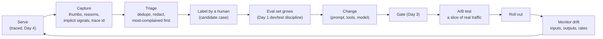

# Week 7, Day 6: Feedback Loops, A/B Tests and Drift

**Time:** ~5h · **Needs:** nothing for the tests; the Day 5 saved runs for the replay and the local embedding model for one drift demo (both optional: the tests skip what they cannot find)

## Learning objectives
- Capture **explicit and implicit feedback** safely, and turn it into **eval cases** rather than anecdotes.
- Run a **prompt A/B test** correctly: sticky assignment, a **sample-ratio check**, an interval for the difference, **guardrail metrics**, a **sample size** worked out in advance.
- Show by simulation why **peeking** breaks a test, and fix it with **group-sequential boundaries**.
- Detect **input, output and label drift**, and judge a detector by its **false-alarm interval and delay**.
- **Validate the harness against a known truth** before trusting it on an unknown one.

---

## 1. The loop

Everything this week so far is *offline*: a dataset you wrote, run before you ship. Production is where new inputs, new failure modes and model updates arrive, so the system needs a way back from traffic into the evals.



## 2. Capturing feedback (`SupportSystem.feedback`)

```python
system.feedback(
    conversation_id, -1, reason="wrong", comment="..."
)  # +1 / -1, a fixed reason vocabulary
```

- **A fixed reason vocabulary** (`wrong`, `unhelpful`, `rude`, `slow`, `unsafe`, `other`) so feedback can be counted, not just read. Bad ratings and reasons are validated.
- **The comment is customer input**: card numbers are redacted before storage and it is capped at 500 characters, like every other piece of customer text in this system (a test pushes a card number through it).
- **The latest trace id is attached** (Day 4): `Reply.trace_id` exists, a `trace` event records one per turn, and a thumbs-down record carries the id of the trace being complained about, so a person can open *that conversation's* spans. `tracing.current_trace_id()` is the helper (None when tracing is off).
- **Implicit signals** cost the user nothing: a repeated question (the answer did not land), a "thanks", the number of turns, an escalation. `implicit_signals(history)` computes the first three from stored history. They are heuristics: validate them against explicit feedback before acting on them.

Honest limits of feedback as data: **only a small, self-selected share of people click**, usually the unhappy ones, so the thumbs-down *rate* is not the failure rate; ratings say *that* something was wrong, not *what good would be*; and free text invites personal data. Use feedback to **find** failures and to **monitor trends**, and use labelled evals to **measure**.

### From thumbs-down to eval cases (`cases_from_feedback`)
Each negative rating becomes a **candidate case**: the opening message, the last reply, the reasons, the redacted comments, the trace ids, and `needs_label: true`. Openings are merged after normalisation (`"I was charged twice for INV-3001"` and `"i was charged twice for inv-3001!"` are one case), and the list is **sorted by how many people complained**, not alphabetically (a mutation check made me write that test: the alphabetical order happened to coincide with the right one). A candidate does **not** go into the dataset until a human has written what a good reply is, and it must go into **dev or test deliberately** (Day 1), never into the data you tune on and report on.

## 3. A/B testing an LLM change (`common/abtest.py`)

- **Assignment** is a hash of `(experiment, user)`: sticky, stateless, and independent between experiments (a test crosses two experiments and checks independence; a shared salt would put everyone on the diagonal). Arms are ordered by *name* so the order of a dict cannot change who gets what.
- **Sample ratio mismatch (SRM)**: if you asked for 50/50 and the arms are not that size, **the experiment is broken** (a bug that drops users from one arm), whatever the results say. `srm_check` is a chi-square goodness of fit with the conventional strict alarm level (0.001). Check it first. Its power is small for small bugs; see §4.
- **Comparing rates**: the difference, a **Newcombe (Wilson-based) interval**, and a pooled z-test. The interval is checked by simulation for coverage at three very different (rate, n) settings (93.5%–97.5% over 4,000 experiments each).
- **Comparing means** (cost, latency): an unpaired bootstrap (independent arms, so each is resampled separately).
- **Guardrails**: the primary metric asks "is it better?"; guardrails (escalation rate, cost, latency) ask "did it get worse somewhere that matters?" `decide` ships only if the primary interval is **entirely above zero** and **no guardrail interval is entirely beyond its tolerance**; a harmed guardrail blocks a winning primary; an interval that merely touches zero is not a win.
- **Sample size**: `sample_size(p_base, mde)` gives users per arm. It is **verified by simulation**: for three different (p, effect) settings the empirical power at the computed n was 0.80 ± 0.015. Half the effect needs about four times the users.

### Peeking
Test every day and stop the first time p < 0.05, and the false-positive rate is not 5%. Simulated A/A tests (no real difference, 100 users per arm per look):

| looks | stop at the first p < 0.05 |
|---|---|
| 1 | 5.0% |
| 2 | 8.9% |
| 5 | 15.0% |
| 10 | 20.0% |
| 20 | 25.0% |

**Group-sequential boundaries** fix this if the looks are **planned in advance**: a stricter threshold at each look so that the overall rate is 5%. `GroupSequential` calibrates them **by simulation** (a standard Brownian motion observed at the planned looks), not from a table I would have to remember: Pocock (a constant boundary: 2.29, 2.42 and 2.56 for 3, 5 and 10 looks, close to the published values as I remember them, about 2.29, 2.41 and 2.56) and O'Brien-Fleming (very strict early, 4.57 at the first of 5 looks, 2.04 at the last, so it keeps almost all the power of the fixed-horizon test). Tests: the overall false-positive rate is 5% ± 0.7 points for 2, 5 and 10 looks and both designs; a Pocock design at the same maximum sample has *less* power than a fixed horizon one, OBF nearly the same. These are **efficacy-only** boundaries (no futility stopping), for equally spaced looks.

## 4. A replayed experiment, validated against a known truth (`solutions/day6_solution.py`)

There are no real users, so I **replay**: simulated users each ask one of the 50 Day 1 questions (drawn at random), are assigned an arm by the hash, and get **the real outcome of that arm on that question** from the Day 5 runs (`base` against Day 5's chosen `lean+hide+direct`). Because every user is one of 50 cases, the **true effect is known exactly**: it is the difference of the two means over the 50 cases. That makes the harness testable:

> True effect in this population: **pass +16.0 points**, cost −$0.478 per 1,000 conversations, estimated latency −0.26 s, escalations +0.0 points. The formula says **146 users per arm** for 80% power.

| users | the 95% interval contained the truth | the test detected the effect |
|---|---|---|
| 200 (100 per arm) | 94.0% of 400 replays | 65.8% |
| 292 (146 per arm, the planned size) | 93.0% | **80.0%** |
| 1,200 (600 per arm) | 96.0% | 100.0% |

Coverage is about 95% and the power at the planned sample size is exactly the 80% promised: the statistics are doing what they claim. One concrete experiment (292 users, arms 131 / 161, SRM p = 0.079): pass rate 56.5% → 69.6%, difference **+13.1 points, 95% interval [+2.0, +23.9]**, p = 0.021; guardrails: escalations +5.7 points [−1.2, +12.3] (inconclusive, inside the 2-point tolerance only because its interval includes it), cost −$0.536 per 1k [−0.658, −0.407], latency −0.34 s [−0.50, −0.17]; **decision: ship**. Note the sample estimate (+13.1) is below the truth (+16.0): an interval of that width contains it, which is the whole reason for reporting one.

### The SRM check in action (and its limit)
I injected a **logging bug**: the treatment arm's escalated conversations never reach the analysis.

| users | arm sizes | SRM p | verdict | pass-rate diff read (true +16.0) |
|---|---|---|---|---|
| 292 | 131 / 142 | 0.51 | **ok: the bug is invisible** | +9.0 points |
| 10,000 | 4,962 / 4,415 | 1.6e-8 | **BROKEN** | +11.7 points |

The bug biases the result (the dropped conversations were passes) and a small experiment cannot see it. **SRM needs enough users to have power against the bug you fear**; a clean SRM on a small test is weak reassurance, and the 292-user experiment above happened to be unbalanced by chance (131 / 161) in the *other* direction, which is exactly how a real bug hides.

### Peeking on the same data
10 looks of 100 users per arm each, 1,000 replayed experiments:

| | fixed horizon | peek (p < 0.05 at any look) | Pocock | O'Brien-Fleming | average users used (max 2,000) |
|---|---|---|---|---|---|
| A/A (the arms are identical) | 5.0% | **18.2%** | 5.0% | 5.1% | 1,944 / 1,983 |
| the real +16 effect | 100% | 100% | 100% | 100% | **375 / 687** |

With no difference, naive peeking declares a winner in 18.2% of experiments, while both sequential designs hold 5%. With the real effect they detect it just as reliably and use **a fifth (Pocock) or a third (OBF) of the maximum users**: that saving is the reason to use them.

## 5. Drift (`common/drift.py`)

Three kinds: **input** (what is asked changes: a launch, a new segment), **output** (what the system does changes: a provider updates the model, a prompt edit) and **label** (what "good" means changes; only humans see it). A detector is judged by its **false-alarm interval when nothing changed** and its **delay when something did**, both measured by simulation.

- **Distribution comparison**: `psi` (population stability index; below 0.1 stable, 0.1 to 0.25 moderate, above 0.25 major: a credit-scoring rule of thumb, not a law) and `chi2_homogeneity` (a p-value; checked against scipy). On the **route mix** of the Day 1 dataset against a **simulated** post-launch mix (more how-to and off-topic): PSI **0.186 (moderate)**. A chi-square test at alpha 0.01 between two windows noticed it **18%** of the time with 50 messages per window, **89%** with 200 and **100%** with 1,000, and falsely alarmed 0.7–1.3% when nothing had changed. Window size decides what you can see.
- **Topic drift (embeddings)**: category counts miss a change in *what* is asked within a category, so `centroid_shift_test` compares the **mean embedding** of two windows with a permutation test (no distribution assumed; the false-alarm rate is checked). With **real bge-small embeddings** of how-to questions and billing messages in windows of 80 (the mix is simulated): same mix, p-values 0.09, 0.48, 0.70, 0.41, 0.88; new window **25% billing** (old 10%): 0.06, 0.03, 0.07, 0.12, 0.43 (a coin flip); **40% billing**: 0.006, 0.002, 0.002, 0.002, 0.014 (clear).
- **Output drift on a rate** (thumbs-down, escalation, guard firings): a **CUSUM** accumulates the log-likelihood ratio of "the rate is now p1" against "still p0" and resets at zero, so a long calm stretch cannot hide a recent change. The threshold is **calibrated by simulation** to a chosen false-alarm interval (a test checks that an independent simulation of the calibrated detector gives the requested interval within 20%). For a thumbs-down rate that really moves from 10%:

| change | false alarm about every 500 observations: delay | false alarm about every 2,000: delay |
|---|---|---|
| 10% → 13% | 166 observations | 369 |
| 10% → 16% | 83 | 156 |
| 10% → 20% | 47 | 76 |

(Measured average false-alarm run lengths 472 to 517 and 2,064 to 2,115 against the targets of 500 and 2,000.) The trade-off is explicit: a lower false-alarm rate costs delay, and a smaller shift takes longer to see. **Pick the pair on purpose** (an alert nobody trusts is muted).

What this does **not** cover: label drift, seasonality (a weekly cycle looks like drift to a naive window), and **what to do on an alert**: roll back the last change, check the provider's model version pin, sample the traces (Day 4), re-run the gate (Day 3).

## 6. Limits of today's evidence
- **No real users, no hosted model.** The replay samples from 50 questions I wrote and from a 0.5B model's deterministic answers; the "users" never change their minds. Real experiments add novelty effects, interference between users, delayed outcomes and metrics (resolution, satisfaction) the harness does not have. The primary metric here is the harness pass rate, an **offline proxy**; online, use a metric a customer would recognise.
- **The drift mixes and the CUSUM streams are simulated**; the embeddings and the PSI/chi-square/CUSUM arithmetic are real.
- Feedback and implicit signals were exercised only with scripted conversations.

## 7. Verified
`tests/test_abtest.py` (**90** tests), `tests/test_drift.py` (**20**), `solutions/test_day6.py` (**22**), plus 4 feedback tests in `test_support_system.py` and 1 for the trace id. Statistical code is verified three ways: **by hand** (a Newcombe interval and a pooled z computed from the formulas, a sample size of 388 for 50% → 60%, PSI 0.040546), **against scipy** (the chi-square tail on a 7 × 7 grid and at the textbook 5% points, Wilson intervals, SRM p-values, the contingency chi-square), and **by simulation** (interval coverage, the false-positive rate of every stopping rule, the power the sample-size formula promises, CUSUM false-alarm intervals and delays, a permutation test's false-alarm rate). **Mutation checks: about 75 mutants over the three modules; every behavioural mutant killed in the end.** Survivors that mattered: whether the replay's assignment salt included the seed, whether the coverage count checked *both* ends of the interval (I changed the function to report the two miss rates separately so a test can see each), whether a "fixed horizon" result read the *last* look (the effect I had used was so large that the *first* look also had power), the CUSUM run length being off by one, whether a permutation test treats ties as extreme, and whether the CUSUM calibration simulates streams long enough not to censor. Two surviving mutants are equivalent: `<=` against `<` where equality has probability zero (the hash boundary, the SRM alarm level).

---

## Daily challenge: an A/B-test harness with a statistical comparison

**Build** (reference: [`common/abtest.py`](../../common/abtest.py), [`common/drift.py`](../../common/drift.py), [`solutions/day6_solution.py`](solutions/day6_solution.py)):
1. Sticky assignment and a sample-ratio check.
2. A comparison of a rate (with an interval and a p-value) and of a mean, a decision rule with guardrails, and a sample-size calculator.
3. A group-sequential monitor with boundaries calibrated by simulation.
4. A replay of two real variants whose true effect you know, with coverage and power measured.
5. Feedback capture that redacts and links to a trace, and a function turning thumbs-down into candidate cases.
6. One detector for a distribution (PSI or chi-square) and one for a rate (CUSUM), with their false-alarm interval and delay measured.

**Acceptance criteria**
- The 95% interval contains the known truth about 95% of the time over at least 300 replays, and the empirical power at the planned sample size is within 4 points of the target.
- A/A tests with ten looks show an inflated false-positive rate with naive peeking, and your sequential design holds it at 5% ± 1.
- An injected assignment bug is caught by the SRM check **at a sample size you state**, and you show a smaller sample where it is missed.
- Every guardrail case is tested: a harmed guardrail blocks, an inconclusive one does not, an interval touching zero is not a win.
- The detectors' false-alarm intervals and delays are **measured**, with the simulation parameters printed.
- Say what is simulated, what is real, and what you did not test (real users, novelty effects, label drift).

**Stretch**
- Add an always-valid sequential test (mSPRT) and compare its sample use with Pocock's.
- Run the same replay on a **hosted** model's per-case results (`--trials 5`) and see how the true effect and the sample size change.
- Add variance reduction (CUPED, using a pre-experiment covariate) and measure the interval shrink.
- Validate `implicit_signals` against 50 hand-labelled conversations.
- Add a seasonality-aware detector (compare each window with the same weekday last month).

## Further reading
- Kohavi, Tang and Xu, *Trustworthy Online Controlled Experiments* (SRM, guardrails, peeking, novelty effects).
- Jennison and Turnbull, *Group Sequential Methods*; Evan Miller's *How not to run an A/B test*.
- Page (1954) on CUSUM; Siegmund's approximations for run lengths (here replaced by simulation on purpose).
- Hamel Husain and others on turning production traces and feedback into eval datasets.
