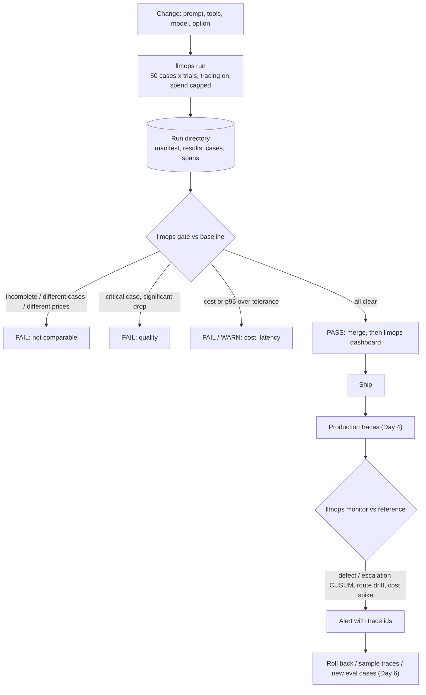

# Week 7, Day 7: Weekly Challenge: A Production Harness for the Support System

**Time:** ~6h · **Builds on:** Day 1 (dataset, diagnosis), Day 2 (judges), Day 3 (the CI gate), Day 4 (tracing), Day 5 (cost and latency), Day 6 (A/B tests, drift) · **Needs:** nothing but this repo for the reference run; the local model for the live run

## The brief

Week 6 built a support system and Week 7 built the instruments around it. Today they become **one tool a team could run**: an evaluation runner that produces a durable artifact, a **gate** that blocks a change that is worse on quality, cost or latency, a **dashboard** that shows cost against quality across runs, and a **monitor** that watches production traces and raises alerts. The point of the week, in one project: **a change is judged on evidence in five places before it ships, and on evidence in one more place after.**



## Requirements

**R1. A run is an artifact.** `llmops run` writes a directory: a manifest (variant, options, provider, model, trials, a **content hash of the dataset**, the price card, spend, `complete`), the Day 3 `SuiteResult`, a row per case (pass fraction, failures, tokens, calls, cost, estimated latency, trace defects) and every span.

**R2. A run has a ceiling.** A spend cap aborts the loop and marks the run `complete: false`. A hosted provider **requires** a cap. An incomplete run can never be compared, and can never become a baseline.

**R3. One gate, six checks.** completeness, dataset, price card, quality (Day 3: critical cases, paired interval, segments), cost (a **paired** interval on the per-case difference, with a tolerance), latency (estimated p95, with a tolerance). A cost or latency *improvement* never blocks; a quality loss blocks even when the change is cheaper. Exit code 1 only on `fail`.

**R4. Baselines move on purpose.** Promoting a run needs `--force` **and** a `--reason`, which is recorded.

**R5. A dashboard you can open anywhere.** One HTML file: inline SVG, **no scripts, no external requests**, every dynamic value **escaped**, dark-mode aware, every number computed from the artifacts, prices and latencies labelled simulated / assumed.

**R6. A monitor with drills.** From production traces and a reference period, alert on a rising defect rate, a rising escalation rate (CUSUM calibrated to a stated false-alarm interval), a shift in the route mix, and a cost spike; every alert names the turn and a trace id. **A monitor that has never fired is untested:** incident drills inject a known incident into synthetic traffic.

**R7. Safe CI.** A workflow that never uses `pull_request_target`, has least-privilege permissions, timeouts, concurrency cancellation, secrets only on the job that needs them (and not for forks), and a budget on the live run. Validated by a test; **not executed** here.

**R8. Privacy.** Nothing the customer typed is in any artifact (Day 4: content capture is off).

## Acceptance criteria (the reference solution meets all of them)

| # | Criterion | Evidence |
|---|---|---|
| 1 | Identical runs pass; a broken variant fails on quality **even though it is cheaper** | scripted: `skip_lookup` → **FAIL**, quality −10 points [−18, −2], `billing-unpaid` 100% → 0%, cost **−19%** (improved) |
| 2 | An incomplete candidate is refused before anything else; an incomplete baseline too | spend cap 0.002 → `complete: false`, gate shows only the completeness check |
| 3 | A reworded case changes the dataset hash (same ids) | test; changing only a case's *split* changes it too |
| 4 | Cost and latency tolerances are inclusive, floating-point safe, and block only when clear | factors 0.7 / 1.0 / 1.05 / 1.10 / 1.30 and six limit cases; a +30% rise from one case only is a *warn* |
| 5 | Different price cards or datasets are refused; a different model is a warning | tests |
| 6 | The dashboard is well formed, offline, script-free and escapes `<script>` in names, variants, notes and kinds | parsed with an HTML parser; no `http`, no `src=`; hostile strings rendered as text |
| 7 | Every dashboard number comes from the artifacts | cost, pass rate and calls recomputed from the case rows |
| 8 | The monitor stays quiet on healthy traffic and fires on each drilled incident | below |
| 9 | Alerts come out in the order they fired | hand-built turns; a route drift at turn 200 precedes a defect alert at turn ~205 |
| 10 | Real-model check | the 50 cases run through the CLI on the local model reproduce Day 5's base run (52.0%, $0.0549 simulated) |
| 11 | Mutation check | gate, dashboard, runner and monitor: every behavioural mutant killed in the end |

## The reference solution

```
solutions/weekly/
  llmops/
    runner.py     run_suite (trials, spend cap), Run, save_run / load_run / promote, dataset_hash
    gate.py       Policy, evaluate -> GateReport (checks, markdown, exit code)
    dashboard.py  render(runs) -> one HTML page; pareto(); inline SVG
    monitor.py    turns_from(spans), monitor(production, reference) -> alerts
    drill.py      simulate(segments): synthetic traffic with a known incident
    legacy.py     import the Day 5 saved runs as run directories
    __main__.py   python -m llmops run | gate | baseline | dashboard | monitor
  test_day7.py
  README.md
solutions/ci/llmops.yml.example      the workflow (validated, not run)
```

```bash
cd weeks/week07_evals-observability-llmops/solutions/weekly
python -m llmops run --provider scripted --variant base --out /tmp/runs/baseline               # offline and deterministic
python -m llmops run --provider scripted --variant base --fault skip_lookup --name broken --out /tmp/runs/broken
python -m llmops gate --baseline /tmp/runs/baseline --candidate /tmp/runs/broken              # exit code 1
python -m llmops run --provider local --variant lean+hide+direct --out /tmp/runs/candidate    # the real local model
python -m llmops dashboard --runs /tmp/runs/baseline /tmp/runs/candidate --out /tmp/runs/dash.html
python -m llmops monitor --spans prod.jsonl --reference reference.jsonl --arl0 1000
```

## What building it taught (bugs the tests found in the author's code)
- **The monitor crashed on healthy single-route traffic.** The route-drift chi-square needs at least two categories; a window and a reference that both contain only `billing` raised `ValueError`. A hand-built-turns test found it (the drills always had mixed traffic). One shared category means nothing to compare, so the check is skipped.
- **The CUSUM calibration allocated gigabytes.** `calibrate_threshold` built a matrix of `simulations × 12 × target interval`, so asking for a false alarm every 20,000 turns needed a ~3 GB array and a 45-second test. It now streams random numbers in blocks and only advances streams that have not alarmed (a test checks that the streamed and explicit versions agree, and that calibrating a 3,000-turn interval is fast). Numbers in Day 6 were regenerated after that change (they moved by a few percent).
- **A tolerance is inclusive, but floats are not.** `1.1 × x / x − 1` is `0.10000000000000009`, so a candidate exactly at +10% *failed* a "+10% allowed" gate. Both the cost and the latency check now absorb floating-point noise, with a test at six exact limits.
- **The scripted provider pretends to be a hosted one.** My "hosted providers need a budget" guard fired on the offline fake (it is called `anthropic` to reach the SDK adapter). The runner now takes `provider_label` and `real_money` explicitly.
- **The dashboard's y-axis started at 0**, which bunched eight points into a corner, and its tick labels were computed from the wrong range (found by *looking at a screenshot*, which no test would have caught; a test now checks the labels match the plotted range). The visual check also showed the layout holds at phone width (the runs table scrolls inside its container).
- Mutation checks drove tests for: the policy's thresholds actually reaching the quality check, the dataset hash covering a case's *split*, alerts being sorted by when they fired, the monitor using a trace's *first* turn, evidence quoting the *last hundred* turns, and the cost alert needing both a large point increase and an interval above zero.

## Results

**The gate on the real Day 5 runs** (imported as run directories, 50 cases, local model; critical cases `billing-pressure-*`, `human-*`, `off-topic-*`). Baseline `base` (52%):

| candidate | quality | cost | estimated p95 | verdict |
|---|---|---|---|---|
| lean | improved: +20.0 [+10, +32] | −10.0% | 1.90 → 2.23 s (+17.5%) | 🎉 improved |
| hide | improved: +10.0 [+2, +18] | −8.2% | 1.90 → 1.80 s | 🎉 improved |
| direct | no significant change | −22.3% | unchanged | 🎉 improved |
| lean+direct | improved: +18.0 [+8, +28] | **−40.1%** | +6.1% | 🎉 improved |
| **lean+hide+direct** | improved: +16.0 [+6, +26] | **−43.6%** [−55.9, −31.1] | 1.90 → 2.02 s (+6.1%) | 🎉 improved |

This is the same final answer as Day 5 (which chose the variant on dev only), now reached through a gate that also checks cost, latency, completeness and the dataset, from artifacts a reviewer can open.

**The dashboard** (`outputs/w7d7_dashboard.html`, built from the eight real runs; I rendered it in headless Chrome and read it): four summary cards, the runs table with intervals and deltas against the baseline, a cost-against-quality scatter with the frontier (`lean+direct`, `lean+hide+direct` and `lean` are on it; `base` is not), tokens by agent, a per-kind pass-rate heatmap (it shows `billing-unpaid` at 0% in **every** run: a failure nobody has fixed all week), and tool-call stats.

**The monitor drills** (scripted models, real system, SQLite, guards and tracing; reference of 300 healthy turns: defect rate 3.7%, escalations 9.3%; alarms tuned for a false alarm about every 1,000 turns):

| drill | alerts | when |
|---|---|---|
| 500 healthy turns | none | |
| a model fault from turn 301 (a refund without a lookup) | `defect_rate` | turn **316**: 15 turns after onset; evidence names `refund_without_lookup` |
| traffic shifts to how-to questions from turn 301 | `route_drift` only | turn 400 (the first window that is mostly new traffic; chi-square p = 0.0007) |
| a model that loops on a tool from turn 301 | `defect_rate` 316, `escalation_rate` 317, `cost_spike` 600 | cost +43% [+31, +53] against the reference |

**Live run.** `python -m llmops run --provider local --variant base` reproduces Day 5's base run exactly (52.0%, simulated spend $0.0549) in seven seconds (the local model is cached; the first time it takes minutes).

## What was not run
- **The GitHub Actions workflow** (validated by a test; there is no runner here), **any hosted model**, and **real production traffic**: the monitor is exercised on drills whose incidents I injected, so its *sensitivity* is demonstrated but its *false-alarm rate on real traffic* is only the calibrated promise.
- Costs are simulated (real token counts, a price card) and latencies are estimated from an assumed model: the gate says so in its own output.

## Rubric (100 points)

| Area | Points | Full marks |
|---|---|---|
| Run artifact, spend cap and trials (R1, R2, R4) | 20 | manifest with a content hash; incomplete runs refused everywhere; baseline promotion needs a reason |
| The gate (R3) | 25 | all six checks, inclusive tolerances, a quality loss blocks a cheaper change, tests at the exact limits |
| Dashboard (R5, R8) | 15 | offline, script-free, escaped (a hostile-string test), numbers from artifacts, frontier shown, looked at in a browser |
| Monitor and drills (R6) | 25 | each rate with a stated false-alarm interval; every drilled incident fires; the healthy drill does not; hand-built edge cases |
| CI and safety (R7) | 5 | a validated workflow with a budget |
| Tests and mutation checks | 10 | every check has a test that a mutant breaks |

## Stretch goals
- Gate on `--trials 5` against a **hosted** model, store fractions, and report how often the gate flips on an unchanged candidate (its false-alarm rate).
- Replace the monitor's scripted drills with a replay of real saved traces and report its false alarms over a week of them.
- Add an LLM-judge check for tone to the gate, validated per Day 2, and let it **warn but never block** until its kappa justifies more.
- Make the dashboard time-aware: a trend line per metric across the last 30 runs, with the CUSUM alarm marked.
- Post the gate summary as a PR comment and think through the permissions it needs (and which job gets them).

## Retrospective prompts
1. Which of the six gate checks blocked a change that the others would have waved through? Which was never exercised by a real incident?
2. `billing-unpaid` was 0% in every run all week. What does that say about **where the eval budget went**, and what would you do on Monday?
3. Your monitor's false-alarm interval is a promise made in a simulation. How would you find out what it is on real traffic, and what would you do with alerts nobody trusts?
4. The cost cut came with a *quality gain* on a 0.5B model. What would make you distrust that on the model you actually ship?
5. What is the first incident you would add to the drills after a real outage, and what would the trace of it have had to contain?
