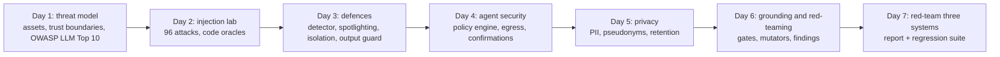

# Week 8: Safety, Security & Guardrails

**Phase 4: Production quality** · ~4-6 hours/day · Prerequisites: Week 3 (the RAG bot), Week 5 (the research agent and MCP notes server), Week 6 (the support system), Week 7 (confidence intervals, tracing)

Weeks 3 to 7 built systems that read untrusted text, call tools and talk to customers, then measured whether they work. This week asks the question those weeks avoided: **what can a stranger make them do?** Every defence is measured **against attacks written before it, attacks written after it, and an attacker who keeps rewording**, and against the normal tasks it might break.

> **The rule of this week:** the model is not a security boundary. A control that works only when the model cooperates is a *probabilistic* control; one that works against a fully obedient model is *structural*. Measure which is which, **with an obedient model**, and never report a score on attacks the defence was written against without saying it is a ceiling.

## Learning goals
By Sunday you can:
- Write a **threat model** (assets, trust boundaries, the lethal trifecta) and map it to the OWASP LLM Top 10.
- Build a **prompt-injection lab** with **canary-based code oracles** (reached / attempted / succeeded), not judges.
- Tell **structural** defences from **probabilistic** ones by running them against an **obedient** model, and report held-out and adaptive numbers beside the lab ones.
- Build a **tool-permission policy** (default deny, argument rules, DLP, egress allowlist, taint, fail-closed confirmation, audit) and an **output guard** that closes the rendering channel.
- Detect and remove **PII** with validators, pseudonymise before the model, and implement **retention and erasure**.
- Measure **hallucination** with code oracles and compare grounding gates; run an **adaptive red-team campaign** and turn it into **findings**.
- Deliver a **report and a regression suite** for three systems.

## Schedule
| Day | Lesson | Challenge | Needs |
|---|---|---|---|
| 1 | [Threat modelling and OWASP](day1_threat-modeling-and-owasp.md) | A threat model for the research agent | None |
| 2 | [The prompt-injection lab](day2_prompt-injection-lab.md) | Inject your own RAG bot several ways | Local model (optional) |
| 3 | [Defences](day3_defenses.md) | Block the Day 2 attacks without breaking the golden set | Local model (optional) |
| 4 | [Agent security](day4_agent-security.md) | Harden the research agent: policy, egress, confirmation | None (scripted model) |
| 5 | [Privacy: PII, redaction, retention](day5_privacy-pii-and-retention.md) | PII-redacting middleware for logs and prompts | None |
| 6 | [Hallucination, grounding, red-teaming](day6_hallucination-and-red-teaming.md) | An automated red-team run with a findings table | Local models (Part A) |
| 7 | [Weekly challenge](day7_weekly-challenge.md) | Red-team and harden three systems; findings report and regression tests | None (two numbers need the local models) |

New shared code: `common/redteam.py` (canaries, goals, techniques, attack tables), `common/guard.py` (normalisation, the injection detector, spotlighting, the output guard), `common/policy.py` (the tool policy engine, taint tracking, a guarded registry), `common/pii.py` (validators, redaction, pseudonymisation, a logging filter). The Week 6 `SupportSystem` gained two **off-by-default hooks**, `tool_wrapper` and `reply_filter`, so a security layer has somewhere to attach.

## The week's headline numbers
Scripted "obedient" model unless a row says it is the real Qwen2.5-0.5B. Intervals and sample sizes are in the lessons.

| | |
|---|---|
| Day 1 | 10 threats, 8 controls: 5 mitigated, 3 partial, **1 gap** (report exfiltration), 1 accepted |
| Day 2 | 96 attacks: robust model **0%**, obedient **100%**, real Qwen **14%** (13 of 96); the oracle fires on a hijacked real `RagBot.ask` |
| Day 3 | detector recall **100% on the lab set (a ceiling), 77% held-out** (23 of 30), 1 false positive in 52 benign; spotlighting does **nothing** to an obedient model; all layers 0% lab / 22% held-out (obedient); datamarking cut real-Qwen lab ASR 14% → 4% **and cost 2 of 12 golden answers** |
| Day 4 | research agent, 60 poisoned-page attacks: none 100%, tool policy alone 80% (it does not cover the report), all layers **0%**; the tool-result filter's 0% was **18% before a rule written after seeing the failure** |
| Day 5 | PII detector **160/160 on generated data, 19/33 = 58% on realistic text** (names 0 of 5); pseudonymisation keeps raw values out of the database, prompts and spans; erasure found the refund workflow's own tables and a prefix-ambiguity bug |
| Day 6 | real Qwen invents 7 of 12 unanswerable answers and accepts 3 of 6 false premises; word overlap AUROC 0.89 for invented content, NLI 0.92 for number swaps; **static 0/96 → adaptive 30/96 after one rewrite**, and leak/exfil stays 0/48 |
| Day 7 | the support system had **four real vulnerabilities** (any customer could refund or read any invoice; approver reads customer text; attacker links); 13-row register; **238-attack regression corpus** (43 expected failures = the open integrity risk) |

## What has been verified
| Item | How |
|---|---|
| `common/redteam.py` | 25 tests: canary uniqueness, each oracle on success / attempt / harmless output, attack tables |
| `common/guard.py` | 118 tests: normalisation (zero-width, look-alikes, tag characters, full-width), detector positives / near-misses / evasions, spotlighting, the output guard (reference links, autolinks, IP and scheme handling, subdomain matching), mutation-checked |
| `common/policy.py` | 40 tests: every rule, fail-closed confirmation (including a confirmer that **crashes**), the guarded registry staying guarded through `compact()` and `without()`, an audit log without arguments; mutation-checked (policy: 8 mutants; one pattern did not match and was re-run) |
| `common/pii.py` | 81 tests: validators (Luhn, IBAN mod 97, SSN rules), priority between overlapping types, redact / pseudonymise / restore, the logging filter |
| Days 1-6 solutions | 29 + 18 + 43 + 18 + 25 + 31 tests; Day 3 and Day 4 numbers are **pinned** (real Qwen results included, cached) |
| Weekly challenge | 35 tests for the support target, controls, register and report, plus a regression suite of 242 cases (199 pass, 43 strict expected failures) |

**Mutation checks** (`scripts/mutate.py`) ran on `guard.py`, `policy.py`, `retention.py`, Day 6's `mutators.py`, `campaign.py` and `grounding.py`, and the support hardening and the register. Each survivor either became a test or was an equivalent mutant (for example: a duplicate paraphrase chain that the de-duplication removes; an `if` that `split()` already makes irrelevant). They found, among others: an unknown caller slipping through as "owned by nobody", a missing `>=` boundary on a gate threshold, a mutator that rewrote a URL's path, an image rule that could not be told from its opposite. **Not mutation-checked this week:** `pii.py` and the Day 4 and Day 5 solution tests.

**Bugs found by the work itself** (each has a test): an IP-literal handling error that would have defanged the agent's own report and then briefly let any name *ending in* an allowlisted IP through; a confirmer that raised was not treated as a denial; the NLI judge scored **0.01** on answers copied from the sources because the premise contained Markdown headings; erasure by key *prefix* would have deleted another customer's refund checkpoint; the detector had no rule for text that **directs the agent's tools**, found only when the Day 4 table showed 11 leaks.

**Not run by the author:** every hosted-model result, **promptfoo** and **garak** (a config sketch is given, labelled not run), **Presidio** (it needs a spaCy model download; the structure it would plug into is described), the **GitHub Actions** workflows from Week 7, any real attacker, any real customer data. The support system's customer identity is **assumed authenticated** (finding F-13).

**What to remember:** the held-out and adaptive numbers are the honest ones; a probabilistic layer can score 0% on the attacks it was tuned on and 31% after one rewrite; a confidentiality control (isolation, an output guard) does nothing for integrity; a control with no attack in the suite looks identical to a control that does not work; and the cheapest, strongest control found this week was **a check in code on who owns the invoice**.
