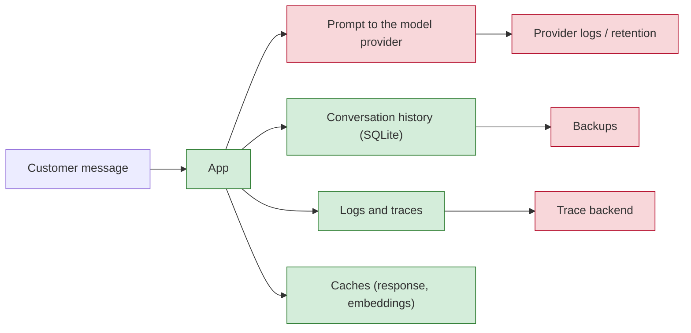
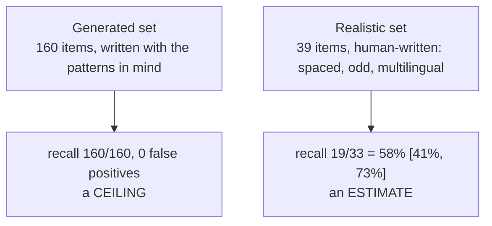

# Week 8, Day 5: Privacy: PII Detection, Redaction, Logging Hygiene, Retention

**Time:** ~4h · **Needs:** nothing (no model, no keys); Presidio is described, not installed

## Learning objectives
- Map where personal data goes in an LLM application: prompt, model provider, history, logs, traces, caches, backups.
- Build a **detector with validators** (Luhn, IBAN mod 97, SSN rules, entropy) and measure it on **two** labelled sets: one you generated, one written by hand. The gap between them is the lesson.
- Choose between **masking**, **tagging**, **hashing** and **pseudonymisation** (reversible, per conversation) for a given data flow.
- Wrap the Week 6 support system so that **no raw personal data reaches its database, the model or the traces**, and prove it with a test that searches for the values.
- Implement **retention** (purge by age) and **erasure** (one person's request) and list what they cannot reach.

---

## 1. Where personal data goes

Everything red is **outside your process**: once a raw email has gone there, you cannot fix it with a code change. So the first rule of privacy engineering for LLM apps is a **data-flow rule**: decide **before** a value leaves the process whether the receiver needs it. A support model that classifies a refund request needs the *intent*, not the cardholder's name. Redaction on the way out is cheap; deletion at a vendor is a legal process.

## 2. Detecting: validators beat patterns

`common/pii.py` detects twelve types: credit cards, IBANs, US SSNs, e-mail, IP addresses, phone numbers, vendor API keys, JWTs and private keys, credentials in URLs and `password=` assignments, high-entropy tokens, plus heuristic names, street addresses and dates of birth.

A pattern alone is not enough. Sixteen digits are not a card, and "123-45-6789" is not an SSN unless the area, group and serial are plausible:

- **Cards**: a brand prefix **and** a Luhn checksum. `4111 1111 1111 1111` passes; a 16-digit order number nearly never does.
- **IBANs**: country length **and** mod-97.
- **SSNs**: no area 000, 666 or 9xx, no group 00, no serial 0000.
- **Secrets**: known vendor prefixes, and for unknown ones **entropy** over a length floor (random-looking strings in a log are usually keys, but a git hash or a UUID is also high-entropy, which is why this is a score and not a rule).
- **Phones**: a shape, a digit count, and *not a date or an IP*.

Overlaps are resolved by priority (a URL with credentials beats the e-mail inside it), and each span has a **score**; the default threshold (0.5) removes the weak ones.

### Four ways to remove a value
| Mode | Result | Use when |
|---|---|---|
| mask | `[EMAIL]` (a card can keep its last digits: `keep_card_last=4` gives `************1111`) | the reader needs the type only; support staff recognise a card by its last digits |
| tag | `<EMAIL>` | the text will be parsed or templated and square brackets would clash |
| hash | `<EMAIL:3fa9c1>` (keyed hash; the key is random per process unless you pass one) | you need to count or join values in analytics without storing them |
| pseudonymise | `<EMAIL_1>`, reversible inside one conversation | the **model** must reason about "that address" and the **user** must read their own address back |

Pseudonymisation is the right default for prompts: the model sees `<EMAIL_1>`, the reply is **restored** on the way out, and the same address always gets the same token within a conversation. The mapping (the *vault*) lives in memory in one process; that is the whole point and the cost (below).

## 3. Measuring it: a ceiling and an honest estimate (`solutions/piidata.py`, `solutions/day5_solution.py`)

| Set | Recall | Precision | False positives |
|---|---|---|---|
| generated (160 spans) | **100%** [98%, 100%] | 100% | 0 |
| realistic (33 spans) | **58%** [41%, 73%] | 90% | 2 |
| realistic, **any span** counts | 64% (21 of 33) | | |

"Any span counts" matters for redaction: a JWT labelled `API_KEY` is still removed. Recall by type on the realistic set: **PERSON 0 of 5**, credit cards 2 of 4, everything else 50 to 100% on one or two examples each (read these as anecdotes: 33 spans gives a 32-point-wide interval).

**What it misses**, in the order I'd fix them: names with no cue word ("Priya Sharma wrote…"), cards written `4111  1111 1111 1111` (two spaces) or `4111.1111.1111.1111`, `alice [at] example [dot] com`, an SSN with spaces, a European address in "street number, city" order, "March 12th, 1985", a lowercase IBAN, a password in prose (`Tr0ub4dor&3`), and `Bearer <jwt>` (found, but typed as `JWT` by the detector; the gold label said API key; that is a labelling disagreement, and it shows up as a false positive plus a miss). **Two false positives:** the digits inside an invalid lowercase IBAN look like a phone number, and the JWT typed differently.

The lesson is not that 58% is bad for a regex file; it is that **the generated set said 100%**. Any detector you tune against data you made yourself will report a ceiling. A real deployment adds a trained NER model (Presidio with spaCy, or a hosted PII service) for names and addresses, **keeps the validators**, and measures recall on a sample of *its own* traffic that someone labelled by hand. I did not run Presidio (it needs a spaCy model download); the structure above is what you would wrap it in.

## 4. The support system, with a privacy layer (`solutions/private_support.py`)

`PrivateSupport` subclasses the Week 6 `SupportSystem`. `handle()` pseudonymises the message **first**; the model, the stored history, the audit log and any span see only tokens; the reply is restored for the customer. Cards are skipped by the pseudonymiser on purpose: they go through the Week 6 card guard, which **removes** them (nothing should ever need a card number read back).

The test that matters is a **search**, not an inspection: send messages with an e-mail, a phone number and an address, then dump every table, capture every model prompt and every exported span, and assert that **none of the raw values appear anywhere** (`test_raw_personal_data_never_reaches_the_database_the_model_or_the_traces`). Other tests pin the behaviour you would otherwise forget:

- tokens are **stable within a conversation** and vaults are **separate between conversations** (`<EMAIL_1>` in two chats is two people);
- after a **restart** the stored history keeps its tokens and they **cannot be restored**: the vault was in memory. Persist it only if you can protect it better than you protect the database (for example encrypted under a key held elsewhere);
- a message with no personal data passes through byte-for-byte;
- `min_score` trades eagerness for over-redaction.

**Logging hygiene** is the same idea at the logger: `redaction_filter()` is a `logging.Filter` that scrubs every record, so a logger nobody remembered to sanitise still cannot write a card number; `scrub()` walks dicts and lists for payloads (values under keys that name a secret, such as `password`, `token` or `cvv`, are replaced whole with `[REDACTED]`).

## 5. Retention and erasure (`solutions/retention.py`)

- `purge(db, max_age, now=...)`: deletes events and escalations older than the limit; a conversation with **any recent event survives** (the table has no timestamp of its own, so staleness is "no events left").
- `erase_conversation(db, cid)`: one person's request, everywhere in this database.

Writing it against the real Week 6 database found things I had not planned for:

1. **The refund workflow has its own tables** (approvals, LangGraph checkpoints and writes, a refund ledger), all keyed by `<conversation>-<invoice>`. Deleting from `events` alone left the reason a human wrote and the conversation id in all of them. Now removed too.
2. **The ledger is a financial record.** Deleting it is probably not allowed; leaving the key leaves a link to the person. So the row is kept (amount, invoice, refund id) and its key is replaced with a one-way tombstone. That is a **policy decision to confirm with whoever owns the legal requirement**, not a default.
3. **Prefix matching is ambiguous.** With conversations `a` and `a-b`, the key `a-b-INV-3002` *starts with* `a-`, so erasing `a` would delete the other person's refund checkpoint. Keys are now matched exactly against `<cid>-<invoice pattern>`. The ambiguity is itself a finding about the key format.
4. **None of this reaches copies outside the database:** backups, the model provider's logs, the trace backend, caches, analytics exports. For each, write down its retention and its deletion path; "we deleted the row" is only true for the row.

## 6. Pitfalls
- **Trusting a score measured on data you generated.**
- **Redacting after sending.** Redaction belongs before the prompt, before the log, before the trace.
- **Reversible tokens that are stable across users**, or a vault persisted next to the database it was meant to protect.
- **A model that can reconstruct what you removed**: with a name and a city left in, a pseudonymised e-mail is still personal data.
- **Forgetting derived data:** embeddings of a document, cached answers, evaluation sets built from real traffic.
- **Retention without erasure** (or the reverse); they are different features with different triggers.
- This lesson is engineering, not legal advice: GDPR, HIPAA and the rest each set their own definitions and deadlines.

---

## Daily challenge: PII-redacting middleware for logs and prompts

**Build** (reference: [`common/pii.py`](../../common/pii.py), [`solutions/private_support.py`](solutions/private_support.py), [`solutions/retention.py`](solutions/retention.py)):
1. A detector for at least six PII types with **validators** for those that have a checksum or a rule.
2. A **generated** labelled set and a **hand-written** one of at least 30 spans, both with hard negatives (order numbers that are not cards, a version string that is not an IP).
3. A scoring function with per-type recall, precision, Wilson intervals and a list of misses and false positives.
4. Middleware that wraps a model call (pseudonymise in, restore out) and a logging filter.
5. A test that dumps the database, the prompts and the logs and asserts that no raw value appears.
6. `purge` and `erase` for a SQLite store, with a test that erasing one conversation leaves another untouched, **including when one id is a prefix of the other**.

**Acceptance criteria**
- Both sets are reported, with the gap between them stated in the first line of the report.
- The generated set cannot be the only evidence for any claim.
- No raw PII in the database dump, the captured prompts, or the exported spans.
- The restart behaviour of the vault is tested and documented.
- The list of places erasure cannot reach is in the README, each with an owner and a deletion path.

**Stretch**
- Put Presidio (or another NER) behind the same interface for names and addresses and report the recall change on the hand-written set.
- Add **k-anonymity**-style checks: before exporting an evaluation set, fail if any quasi-identifier combination (city, birth year, employer) is unique.
- Persist the vault encrypted with a key from the environment; test that a wrong key fails closed.
- Fix some of the misses above and re-measure on a **new** hand-written set (never on the one you tuned against).

## Further reading
- Microsoft Presidio documentation (analyzer, anonymizer, custom recognisers).
- OWASP LLM02 (Sensitive Information Disclosure).
- NIST SP 800-122, *Guide to Protecting the Confidentiality of PII*.
- Your own regulator's guidance on erasure and retention.
